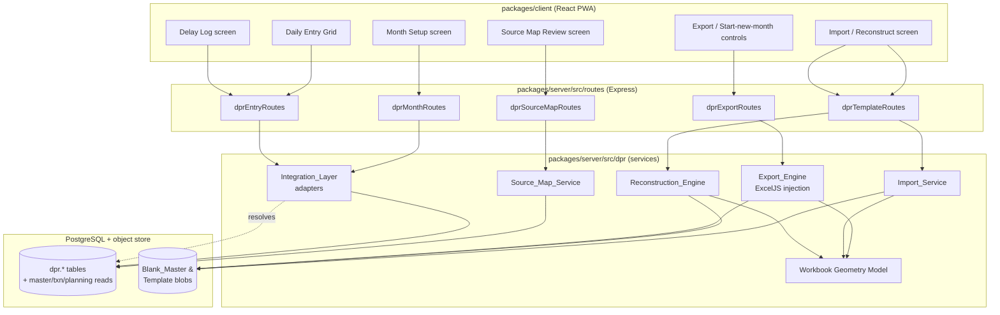
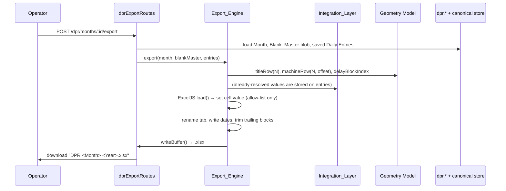
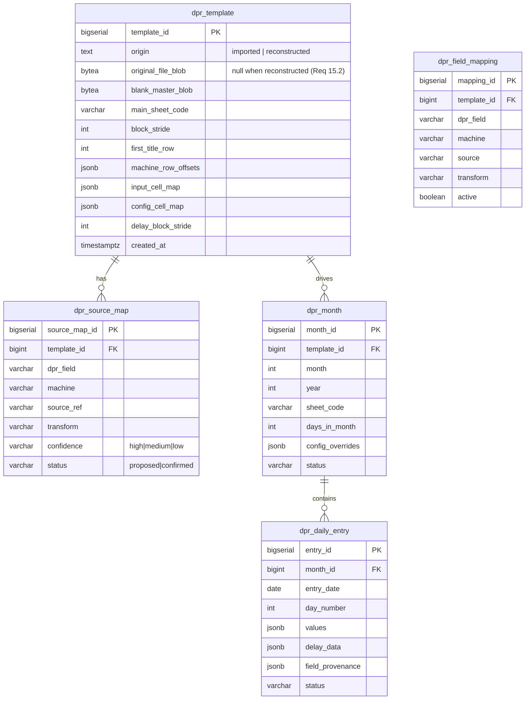

# Design Document

## Overview

DPR Manager digitizes the Hero Steels Cold Rolling plant's monthly Daily Production Report (DPR) Excel workbook. It lives inside the existing ZedralV2 monorepo and is built as a new bounded slice across the established layers: an Express/Kysely backend under `packages/server/src` and a React PWA frontend under `packages/client/src`. It reuses the server's existing `exceljs` dependency, the DPR aggregation/derivation logic under `packages/server/src/export`, the `AutoSourceService` field-resolution pattern, and the canonical M1 Postgres data store (`txn.*`, `planning.*`, `master.*`).

The core architectural idea is the **template-as-mold**: the export is never built from a blank sheet. Instead the system holds a `Blank_Master` workbook (a real DPR with all daily numbers zeroed but all structure, styling, and formulas intact) and produces a month's report by **injecting** only daily values into an allow-list of cells. There are two ways to obtain that mold:

- **Import path** — a Reviewer uploads last month's `.xlsx`; the `Import_Service` normalizes it into a `Blank_Master` by zeroing daily-input cells while preserving everything else (Principle A + B: load → set `cell.value` → `writeBuffer`, never rebuild styles).
- **Reconstruction path** — when no file is available, the `Reconstruction_Engine` builds the master programmatically in ExcelJS, writing styles, merges, dimensions, number formats, and intra-sheet formulas so a zero-data export is visually indistinguishable from the original (Principle C). The result is stored and thereafter treated identically to an imported `Blank_Master`.

The work is staged. **Stage 1** is a discovery capability: the `Source_Map_Service` inventories the existing codebase and database, produces a Source Map (DPR field → machine → source → confidence → query) and a list of open questions for a Reviewer to resolve before any application is built. **Stage 2** is the application itself: Import / Reconstruction, Source-Map review, Month Setup, the Daily Entry grid, the Delay Log, and Save / Export / Start-new-month.

This design document covers the technical architecture for both stages. It deliberately separates three concerns that the requirements keep distinct: (1) the **workbook geometry model** (where values land — pure, testable functions), (2) the **integration layer** (where values come from — adapters resolving auto-sourced fields), and (3) the **write engine** (how the workbook is produced — ExcelJS injection with a strict write allow-list).

### Key research findings informing the design

Reading the existing codebase surfaced several facts that shape this design:

- **ExcelJS is already a first-class server dependency** (`packages/server/package.json` → `exceljs: ^4.4.0`) and `xlsx` (SheetJS) is also present but used only for *parsing* PP&C plan spreadsheets (`rollingPlanXlsxParser.ts`). This matches Principle B/C exactly: ExcelJS for all DPR writes, SheetJS never for writing.
- **An export module already exists** at `packages/server/src/export` with a `ReportDefinition` interface, a `DprAggregator`, a `TemplateBinder`, a JSON layout (`dpr_layout.v1.json`), and an `XlsxRenderer`. However, that module builds the DPR workbook **from scratch** cell-by-cell from an RDM. DPR Manager's mold-injection model is a different (and stricter) strategy. The design reuses the *geometry constants, area list, stoppage-category mapping, and derivation math* from that module, but introduces a dedicated injection engine that writes into a stored `Blank_Master` rather than a fresh `ExcelJS.Workbook`.
- **The canonical store already holds most DPR inputs.** `txn.shift_log` + `txn.prod_*` carry production, `txn.stoppage_entry` carries stoppage minutes, `master.stoppage_code.dpr_category`/`agency_code` map stoppages to the 8 DPR categories, `master.line_area` holds the 26 DPR areas with `operating_minutes_base` (including the HPH 23040 = 16×24×60 base), and `planning.production_target` holds targets. This is the substrate the Source Map inventories.
- **The `AutoSourceService` + `autoSourceFieldMaps` pattern** is the established convention for "resolve a field from the highest-authority source, flag its provenance, allow override." DPR Manager's `Integration_Layer` follows the same shape (one resolver per source, a `PrefilledField`-style provenance tag) but keyed by DPR field + machine + date + shift rather than by coil.
- **Migrations** are plain `node-pg-migrate` SQL files under `packages/server/migrations` using logical schemas (`master`, `coil`, `txn`, `planning`, `security`, `audit`). DPR Manager adds its own tables; this design places them in a new `dpr` schema to keep the slice self-contained while referencing existing masters.
- **Tests** already use `vitest` + `fast-check` (`^4.8.0`), with property tests under `packages/server/tests/properties`. The geometry and formula logic in this design is pure and is the natural home for property-based testing.

## Architecture

DPR Manager spans the client PWA, the API/services layer, and the data layer, reusing the M1 layering described in `M1-01_System_Architecture.md`.



### Layering and dependency rules

The design enforces the Requirement 7 separation (sources change without touching the export engine) through a strict dependency direction:

- **Geometry Model** (`dpr/geometry`) is pure and depends on nothing. It computes `titleRow(N)`, machine absolute rows, column maps, and delay block indices. Both the Import_Service, Reconstruction_Engine, and Export_Engine import it.
- **Integration_Layer** (`dpr/integration`) depends on the data store and the field-mapping records. It resolves auto-sourced values. The Export_Engine consumes *resolved values*, never the adapters directly, so adding/changing an adapter never edits the engine.
- **Export_Engine** (`dpr/export`) depends only on the Geometry Model, a stored `Blank_Master` blob, and a saved day's values (a plain object). It performs ExcelJS injection within the write allow-list.
- **Import_Service / Reconstruction_Engine** (`dpr/import`, `dpr/reconstruct`) both produce a `Blank_Master` blob + a `Template`/origin record. They are interchangeable from the Export_Engine's perspective.

### Request lifecycle (Stage 2 export)



## Components and Interfaces

### Backend module layout

New code lives under `packages/server/src/dpr` to keep the slice cohesive and to avoid entangling it with the existing generic export module:

```
packages/server/src/dpr/
  geometry/
    blockGeometry.ts        # titleRow(N), machineRow, blockStride, delayBlockIndex
    columnMap.ts            # DPR field → column letter/number maps (Req 8, 9)
    monthCalendar.ts        # daysInMonth (leap-year aware), month identity strings
  source-map/
    SourceMapService.ts     # Stage-1 discovery orchestration (Req 1, 2)
    codebaseInventory.ts    # scanners over schema/routes/services
    sourceMapTypes.ts
  import/
    ImportService.ts        # upload, detect structure, classify cells (Req 3)
    structureDetector.ts    # DATE/LINE marker scans, machine-label scan
    blankMasterBuilder.ts   # zero daily-input cells (Req 4)
    cellClassifier.ts       # Formula/DailyInput/Config classification
  reconstruct/
    ReconstructionEngine.ts # programmatic master build (Req 17-24)
    colorLegend.ts          # resolved RGB hex fills (Req 19)
    namedStyles.ts          # title/hdr/inputY/... style definitions (Req 19)
    blockAnatomy.ts         # per-offset region/merge/format spec (Req 18, 20, 21)
    formulaCatalog.ts       # intra-sheet formula templates (Req 22)
    verification.ts         # post-build checklist (Req 23)
  integration/
    IntegrationLayer.ts     # resolveAutoSourcedFields(date, machine, shift)
    adapters/
      ProductionAdapter.ts  # txn.shift_log + prod_* → shift A/B/C production
      StoppageAdapter.ts    # txn.stoppage_entry → category minutes
      DispositionAdapter.ts # scrap/rejection/trim/b.slit
      TargetAdapter.ts      # planning.production_target → config defaults
    fieldMappingStore.ts    # editable mapping records (Req 7.3, 7.4)
  export/
    ExportEngine.ts         # ExcelJS injection into Blank_Master (Req 5, 13)
    writeAllowList.ts       # the only cells the engine may write
    monthIdentity.ts        # tab rename, date strings, filename (Req 10)
    blockTrimmer.ts         # trailing-block deletion (Req 11)
  repositories/
    DprTemplateRepository.ts
    DprMonthRepository.ts
    DprEntryRepository.ts
    DprSourceMapRepository.ts
  dprTypes.ts               # shared TS types
```

Routes mount under the existing convention in `packages/server/src/index.ts` (e.g. `app.use('/dpr', dprRoutes)`), consistent with `app.use('/exports', exportRoutes)`.

### Geometry Model interface

Pure functions, the foundation of correctness. Encodes the verified geometry from Requirement 8 and the Block_Anatomy.

```typescript
// dpr/geometry/blockGeometry.ts
export const BLOCK_STRIDE = 46;

/** Title_Row for day N: day 1 = 2; day N>1 = 49 + (N-2)*46  (Req 8.1, 18.3). */
export function titleRow(dayNumber: number): number {
  if (dayNumber < 1) throw new RangeError('dayNumber must be >= 1');
  return dayNumber === 1 ? 2 : 49 + (dayNumber - 2) * BLOCK_STRIDE;
}

/** Absolute row for a machine within day N (Req 8.2, 18.3). */
export function machineRow(dayNumber: number, machineRowOffset: number): number {
  return titleRow(dayNumber) + machineRowOffset;
}

/** DELAY sheet block index for a shift (Req 9.2). */
export function delayBlockIndex(dayNumber: number, shiftIndex: number): number {
  return (dayNumber - 1) * 3 + shiftIndex;
}
```

```typescript
// dpr/geometry/monthCalendar.ts
/** Days in month, leap-year aware (Req 11.1). */
export function daysInMonth(year: number, monthIndex1to12: number): number {
  return new Date(year, monthIndex1to12, 0).getDate();
}

export function monthSheetName(year: number, monthIndex1to12: number): string; // "JUNE26" (Req 10.2)
export function dprFilename(year: number, monthIndex1to12: number): string;    // "DPR June 2026.xlsx" (Req 10.4)
export function dateString(d: Date): string;                                   // "dd.mm.yyyy" (Req 10.3)
```

```typescript
// dpr/geometry/columnMap.ts — verified column placements (Req 8.3-8.8, 9.3)
export const PRODUCTION_COLS = { A: 'C', B: 'D', C: 'E' } as const;
export const STOPPAGE_COLS = {
  electrical:   { A: 'Z',  B: 'AA', C: 'AB' },
  mechanical:   { A: 'AD', B: 'AE', C: 'AF' },
  operational:  { A: 'AH', B: 'AI', C: 'AJ' },
} as const;
export const AVAILABILITY_COLS = { A: 'AL', B: 'AM', C: 'AN' } as const;
export const PREV_MAINT_COL = 'AP';
export const POWER_FAILURE_COLS = { A: 'AR', B: 'AS', C: 'AT' } as const;
export const RM_SHORTAGE_COLS = { A: 'BB', B: 'BC', C: 'BD' } as const;
export const SCRAP_BLOCK_COLS = { A: ['BI','BJ','BK','BL'], B: ['BM','BN','BO','BP'], C: ['BQ','BR','BS','BT'] } as const;
export const DAY_NUMBER_COL = 'BH';   // written on Title_Row (Req 8.8)
export const DATE_COL = 'M';          // date string (Req 10.3)
/** Columns the system must NEVER write (Req 8.7). */
export const NEVER_WRITE_COLS = ['F', 'G', 'H', 'X' /* + summary/target/scrap/yield formula cols */] as const;
```

### Source_Map_Service interface (Stage 1)

```typescript
// dpr/source-map/sourceMapTypes.ts
export type Confidence = 'high' | 'medium' | 'low';
export type FieldClass = 'auto-sourced' | 'needs-confirmation' | 'manual';
export type EntryStatus = 'proposed' | 'confirmed';

export interface SourceMapEntry {
  dprField: string;            // e.g. "production.shiftA"
  machine: string;             // e.g. "4HI_R"
  sourceRef: string | null;    // "txn.shift_log.prod_* | endpoint | function" or null
  confidence: Confidence;
  queryDescription: string;    // how to fetch the value
  classification: FieldClass;
  status: EntryStatus;
  transform: string | null;    // unit/grain conversion notes
}

export interface OpenQuestion {
  id: string;
  dprField: string;
  machine: string;
  candidateSource: string | null;
  prompt: string;
  options?: string[];          // finite answer set when known (Req 2.2)
}

export interface SourceMapResult {
  entries: SourceMapEntry[];
  openQuestions: OpenQuestion[];
}
```

```typescript
// dpr/source-map/SourceMapService.ts
export class SourceMapService {
  /** Req 1.1-1.6: scan schema, routes, services; classify; emit open questions. */
  static async discover(extraLocations?: string[]): Promise<SourceMapResult>;
  /** Req 2.3, 2.5: apply a Reviewer answer; set entry status to 'confirmed'. */
  static async answerQuestion(questionId: string, answer: string): Promise<SourceMapEntry>;
  /** Req 1.7: re-run discovery with additional code locations. */
  static async rediscover(extraLocations: string[]): Promise<SourceMapResult>;
}
```

The scanners are deterministic inventories rather than live code execution: `codebaseInventory.ts` reads the DB information schema (tables/columns under `txn`/`planning`/`master`), enumerates registered Express routes, and inspects known service exports (e.g. `AutoSourceService`, `DprAggregator`) against a fixed catalog of DPR fields drawn from the Geometry Model column map. Each DPR field is matched to a candidate; ambiguity (unit/grain mismatch) yields `needs-confirmation` + an open question; no match yields `manual`.

### Import_Service interface

```typescript
// dpr/import/ImportService.ts
export interface DetectedStructure {
  mainSheetName: string;
  blockStride: number;            // detected via DATE marker in column K (Req 3.2)
  firstTitleRow: number;
  machineRowOffsets: Record<string, number>;  // label → offset (Req 3.3)
  delayBlockStride: number;       // detected via LINE marker in column A (Req 3.4)
  inputCellMap: CellRef[];        // Daily_Input_Cells (Req 3.5)
  configCellMap: CellRef[];       // Config_Cells (Req 3.5)
}

export class ImportService {
  /** Req 3.1, 3.6, 3.7: store blob, validate workbook, detect structure. */
  static async importTemplate(fileBuffer: Buffer, fileName: string, userId: number): Promise<{ templateId: string; structure: DetectedStructure }>;
  /** Req 4: produce Blank_Master by zeroing daily-input cells, preserving all else. */
  static async buildBlankMaster(templateId: string): Promise<{ blankMasterBlob: Buffer }>;
}
```

Structure detection and blank-master generation both load the workbook with ExcelJS, never SheetJS. `buildBlankMaster` iterates the `inputCellMap` and sets each cell `value = 0` (numeric, never empty — Req 4.3), touching nothing else.

### Reconstruction_Engine interface

```typescript
// dpr/reconstruct/ReconstructionEngine.ts
export interface ReconstructionResult {
  blankMasterBlob: Buffer;
  verification: VerificationReport;
}

export class ReconstructionEngine {
  /** Req 17-22: build workbook in ExcelJS with styles, merges, dims, formats, formulas. */
  static async reconstruct(year: number, monthIndex1to12: number): Promise<ReconstructionResult>;
}

// dpr/reconstruct/verification.ts (Req 23)
export interface VerificationCheck { name: string; passed: boolean; detail?: string; }
export interface VerificationReport { verified: boolean; checks: VerificationCheck[]; }
```

### Integration_Layer interface

Follows the `AutoSourceService`/`PrefilledField` convention already in the codebase.

```typescript
// dpr/integration/IntegrationLayer.ts
export type DprFieldSource = 'PRODUCTION' | 'STOPPAGE' | 'DISPOSITION' | 'TARGET' | 'MANUAL';

export interface ResolvedDprField {
  value: number | string | null;
  source: DprFieldSource;     // provenance flag (Req 6.2, 6.6)
  editable: boolean;
}

export interface DprSourceAdapter {
  readonly source: DprFieldSource;
  /** Resolve the fields this adapter owns for a given scope. */
  resolve(date: string, machine: string, shift?: 'A' | 'B' | 'C'): Promise<Record<string, ResolvedDprField>>;
}

export class IntegrationLayer {
  /** Req 6.1, 7.1: fan out to all adapters; merge per active field mapping. */
  static async resolveForDay(date: string, machine: string): Promise<Record<string, ResolvedDprField>>;
  /** Req 7.4: subsequent resolutions honor edited mappings. */
  static async applyMappingEdit(edit: FieldMappingEdit): Promise<void>;
}
```

Adapters are registered in an array; adding one is a new file + one registration line and never edits `ExportEngine` (Req 7.2). The field-mapping store (`dpr.field_mapping`) is the editable indirection that adapters consult, so a Reviewer's UI edit changes resolution without code changes (Req 7.3, 7.4).

### Export_Engine interface

```typescript
// dpr/export/ExportEngine.ts
export interface DayValues {
  dayNumber: number;
  date: string;                                   // ISO; rendered to dd.mm.yyyy on write
  machineValues: Record<string, Record<string, number>>;  // machine → field → value
  delayRows: DelayRow[];
}

export interface DelayRow {
  machine: string; shift: 'A'|'B'|'C';
  timeInMin: number | string;                     // raw string allowed (Req 9.4)
  agency: string; reason: string;
}

export class ExportEngine {
  /** Req 5, 10, 11, 13: load Blank_Master, inject day values, rename, trim, writeBuffer. */
  static async export(params: {
    blankMasterBlob: Buffer;
    year: number; monthIndex1to12: number;
    days: DayValues[];                            // saved days; missing days stay 0 (Req 13.2)
    configOverrides?: Record<string, number>;     // Req 16.3
  }): Promise<{ buffer: Buffer; filename: string }>;
}
```

`writeAllowList.ts` exposes a single `assertWritable(sheet, cellRef)` guard the engine calls before every write; it permits only Daily_Input_Cells, date cells, the tab rename operation, and the trailing-block deletion. Any attempt to write a Formula_Cell throws (Req 5.3), making the constraint executable rather than aspirational.

### Frontend components

Reuse the existing client component conventions (`packages/client/src/components/export/ExportJobPanel.tsx`, primitives, hooks). New components under `packages/client/src/components/dpr/`:

- `SourceMapReview.tsx` — table of `SourceMapEntry` rows with confidence badges; open-question cards with selectable options (Req 2.2).
- `TemplateImport.tsx` — upload control + structure-detection summary; "Reconstruct instead" action.
- `MonthSetup.tsx` — editable Config_Cell defaults (target B, prod-rate V, target-% rows, day-count seed X) (Req 16).
- `DailyEntryGrid.tsx` — per-machine/shift grid; auto-sourced cells pre-filled and flagged, manual cells blank/optional; day-status indicator; sequential-entry guard (Req 6, 12).
- `DelayLog.tsx` — three shift blocks per day; free-text time/agency/reason (Req 9).
- `DprExportControls.tsx` — export current month, start-new-month.

A client API module `packages/client/src/lib/dprClient.ts` mirrors `apiClient.ts` conventions.

## Data Models

DPR Manager adds a `dpr` schema via a new `node-pg-migrate` migration (`packages/server/migrations/<ts>_dpr_manager.js`), following the existing SQL-in-migration style. Large workbook blobs are stored using the existing object-store abstraction (`packages/server/src/export/jobs/objectStorage.ts`) with a fallback to a `BYTEA` column for local/dev, mirroring how the export module persists artifacts. The schema references existing masters (`master.line_area`, `master.process`) rather than duplicating them.



### Table definitions (Req 15)

- **`dpr.template`** (Req 15.1, 15.2): persists both blobs (`original_file_blob` nullable, omitted/`NULL` when `origin = 'reconstructed'`), the detected geometry (`main_sheet_code`, `block_stride`, `first_title_row`, `machine_row_offsets` JSONB, `input_cell_map` JSONB, `config_cell_map` JSONB, `delay_block_stride`).
- **`dpr.source_map`** (Req 15.3): `template_id`, `dpr_field`, `machine`, `source_ref`, `transform`, `confidence`, `status`.
- **`dpr.month`** (Req 15.4): `template_id`, `month`, `year`, `sheet_code`, `days_in_month`, `config_overrides` JSONB, `status`.
- **`dpr.daily_entry`** (Req 15.5): `month_id`, `entry_date`, `day_number`, `values` JSONB (machine → field → value), `delay_data` JSONB, `field_provenance` JSONB (per field: `auto-sourced | manual`), `status`. Unique on `(month_id, day_number)`.
- **`dpr.field_mapping`** (Req 7.3): editable mapping records the `Integration_Layer` consults at resolution time.

### Value representation rules

- Every Daily_Input_Cell stores numeric `0` rather than blank so cumulative formulas resolve (Req 4.3, 12.2). Manual fields left empty persist as `0` (Req 6.5).
- Delay `timeInMin` is stored as raw JSON (number *or* string) to preserve values like `"210--160"` and `"NIL"` (Req 9.4).
- `field_provenance` records `auto-sourced` vs `manual` per saved value (Req 6.6) and is independent of the value itself, so an overridden auto field flips to `manual`.
- Config_Cells are never zeroed (Req 16.2); `config_overrides` holds per-month edits applied at export (Req 16.3).

## Correctness Properties

*A property is a characteristic or behavior that should hold true across all valid executions of a system — essentially, a formal statement about what the system should do. Properties serve as the bridge between human-readable specifications and machine-verifiable correctness guarantees.*

The DPR Manager has a large pure, logic-heavy core — workbook geometry, month-calendar math, cell classification, blank-master zeroing, write allow-list enforcement, block trimming, and intra-sheet formula generation with cumulative chaining. These are ideal for property-based testing: behavior varies meaningfully with inputs (day number, month length, machine offsets, cell sets), the input space is large, and 100+ iterations expose off-by-one and boundary bugs that a couple of examples would miss. The properties below are derived from the prework analysis and target this pure core. Visual-fidelity criteria (fills, fonts, exact merges) and infrastructure criteria (blob persistence, UI flagging) are covered by the Testing Strategy via reconstruction verification, snapshot, and example tests rather than properties.

### Property 1: Title row formula is correct for every day

*For any* day number N ≥ 1, `titleRow(N)` equals `2` when N = 1 and `49 + (N-2)*46` when N > 1, and consecutive day blocks are always exactly `BLOCK_STRIDE` (46) rows apart for N > 1.

**Validates: Requirements 8.1, 18.2, 18.3**

### Property 2: Machine absolute row composition

*For any* day number N ≥ 1 and any machine row offset, the absolute machine row equals `titleRow(N) + offset`.

**Validates: Requirements 8.2, 18.3**

### Property 3: Delay block index mapping

*For any* day number N ≥ 1 and shift index s, the DELAY sheet block index equals `(N-1)*3 + s`, and distinct (day, shift) pairs always map to distinct block indices.

**Validates: Requirements 9.2**

### Property 4: Days-in-month is calendar-correct including leap years

*For any* year and month, `daysInMonth` returns 28–31 matching the Gregorian calendar, returning 29 for February in leap years and 28 otherwise.

**Validates: Requirements 11.1**

### Property 5: Blank master zeroes exactly the daily-input cells

*For any* detected structure, building the Blank_Master sets every Daily_Input_Cell to numeric `0` and leaves every Formula_Cell, Config_Cell, label, merge, font, color, width, and height byte-identical to the source.

**Validates: Requirements 4.1, 4.2, 4.3**

### Property 6: Cell classification is total and disjoint

*For any* workbook cell encountered during import, the classifier assigns exactly one of Formula_Cell, Daily_Input_Cell, or Config_Cell — never zero classes and never more than one.

**Validates: Requirements 3.5**

### Property 7: Export never writes outside the allow-list

*For any* set of day values injected by the Export_Engine, every cell written is a Daily_Input_Cell, a date cell, the renamed tab, or a deleted trailing block — and no Formula_Cell is ever written.

**Validates: Requirements 5.2, 5.3, 8.7**

### Property 8: Export preserves all template formulas and styles

*For any* Blank_Master and any saved day values, the exported workbook retains every formula, style, font, color, and merged-cell range present in the Blank_Master.

**Validates: Requirements 4.4, 5.5, 13.3**

### Property 9: Unentered days export as zero

*For any* month with an arbitrary subset of entered days, every Daily_Input_Cell belonging to a non-entered day is `0` in the export, while entered days carry their combined auto-sourced and manual values.

**Validates: Requirements 13.1, 13.2**

### Property 10: Trailing-block trim yields exactly D blocks from the bottom

*For any* month of D days (28–31), trimming deletes only surplus trailing blocks from the bottom upward on both sheets, never a middle block, leaving exactly D Day_Blocks on the main sheet.

**Validates: Requirements 11.2, 11.3, 11.4, 11.5**

### Property 11: Sequential entry is enforced

*For any* attempt to enter day N, the system permits it only when all days 1..N-1 already exist, and blocks it otherwise.

**Validates: Requirements 12.1**

### Property 12: Manual fields default to zero with manual provenance

*For any* day save where a Manual_Field is left empty, the stored value is numeric `0` and its Field_Provenance is `manual`; any edited auto-sourced field is stored with `manual` provenance and the operator-entered value.

**Validates: Requirements 6.3, 6.5, 6.6**

### Property 13: Month identity rewrite is consistent

*For any* month and year derived from entered dates, the exported tab name equals `<MONTHNAME><YY>`, the filename equals `DPR <Month> <Year>.xlsx`, and date cells carry the `dd.mm.yyyy` text string.

**Validates: Requirements 10.1, 10.2, 10.3, 10.4**

### Property 14: Start-new-month preserves the mold and resets cumulatives

*For any* existing Template, starting a new month creates a new month dataset whose Daily_Input_Cells are all `0`, leaves the stored Blank_Master byte-unchanged, and carries no cumulative value from a prior month into day 1.

**Validates: Requirements 12.3, 14.1, 14.2, 14.3**

### Property 15: Reconstruction writes only intra-sheet formulas with correct chaining

*For any* reconstructed master, every formula is intra-sheet (no sheet-qualified reference), day-1 cumulative cells carry no previous-day back-reference, and each day-N (N>1) cumulative references the same Machine_Row_Offset in the immediately previous Day_Block — so renaming the tab never breaks a reference.

**Validates: Requirements 22.1, 22.2, 22.4, 22.5, 22.8**

### Property 16: Production and cumulative formula shapes are correct

*For any* machine data row, the production total is `F = C + D + E`, the day-1 cumulative `G` equals that row's `F`, the day-N cumulative equals `F + (previous block G at same offset)`, and the average is `H = G / BH`.

**Validates: Requirements 22.3, 22.4, 22.6**

### Property 17: Reconstruction verification fails closed

*For any* reconstructed master in which at least one checklist item (tab name, block count/geometry, dimensions, fills/fonts, 73 merges/block, intra-sheet formula chaining, number formats) does not match its specification, the verification report marks the master as not verified and names the failing check.

**Validates: Requirements 23.1, 23.2, 23.3, 23.4, 23.5, 23.6, 23.7, 23.8, 24.3**

## Error Handling

- **Invalid upload (Req 3.6):** `ImportService.importTemplate` wraps the ExcelJS `load` in a try/catch; a non-`.xlsx`/unreadable buffer rejects with a descriptive `400` error and does not persist a Template.
- **Structure validation failure (Req 3.7):** the `structureDetector` returns a list of named checks (main sheet present, `DATE` marker in column K, `LINE` marker in column A). The first failed check produces a `422` error naming the failed check; no Blank_Master is built.
- **Write allow-list violation (Req 5.3):** `assertWritable` throws an internal error if any code path attempts to write a Formula_Cell, surfacing as a `500` with the offending cell reference. This is a guard against regressions, not a user-facing condition.
- **Sequential entry violation (Req 12.1):** `dprEntryRoutes` returns `409 Conflict` with the missing day numbers when an out-of-order save is attempted.
- **Division-by-zero in formulas:** reconstruction writes Excel formulas (recomputed by Excel), so the engine does not evaluate them, but cumulative/divisor formulas follow the existing export module's guard convention (`derivation.ts`) where the system computes any preview value, emitting `0`/blank rather than `#DIV/0!`.
- **Reconstruction verification failure (Req 23.8):** `reconstruct` always returns a `VerificationReport`; when `verified` is false the route returns the report (not the blob) and does not mark the Template verified.
- **Source-map ambiguity (Req 2.4):** rather than defaulting a correctness-affecting mapping, the service emits an open question and leaves the entry `needs-confirmation`/`proposed`.
- **Missing auto-source data:** the `Integration_Layer` resolves a missing value to `null`/`0` with `MANUAL` provenance rather than failing the whole day load, so the grid still opens (Req 6.1, 6.4).
- **Authorization:** DPR routes reuse the existing `authMiddleware` + role checks; export/import/reconstruction are Reviewer/Supervisor-scoped consistent with `M1-05` and the export module's `exportAuthz`.

## Testing Strategy

Testing follows the existing `vitest` + `fast-check` setup (`packages/server/vitest.unit.config.ts`, `tests/properties/`). The strategy is dual: property-based tests for the pure logic core, and example/integration/snapshot tests for I/O, visual fidelity, and UI.

### Property-based tests

- A property-based testing library is already in the repo: **`fast-check` `^4.8.0`**. The design reuses it; no PBT framework is built from scratch.
- Each correctness property (1–17) is implemented as a **single** property-based test, located under `packages/server/tests/properties/dpr*.property.test.ts`.
- Each test runs a **minimum of 100 iterations** (`fc.assert(fc.property(...), { numRuns: 100 })`).
- Each test is tagged with a comment referencing its design property, in the format:
  `// Feature: dpr-manager, Property <number>: <property text>`
- Generators: day numbers (1..31), month/year pairs (incl. leap Februarys), machine-offset maps, randomized cell sets partitioned into formula/input/config, and randomized "entered-day" subsets for zero-fill and trim properties. Geometry, calendar, classification, allow-list, trimming, provenance, and formula-shape logic are pure and run in-memory (no DB, no AWS) so 100+ iterations are cheap.
- Blank-master and export preservation properties (5, 8) operate on small synthetic ExcelJS workbooks built in-memory and round-tripped via `writeBuffer`/`load`, asserting structural invariants rather than byte equality of unrelated regions.

### Unit and example tests

- **Geometry spot-checks:** `titleRow(1)=2`, `titleRow(2)=49`, `titleRow(3)=95`; `delayBlockIndex(1,0)=0`.
- **Structure detection:** example workbooks with/without `DATE` and `LINE` markers assert the specific rejection messages (Req 3.6, 3.7).
- **Month identity:** `JUNE26`, `DPR June 2026.xlsx`, `01.06.2026` (Req 10).
- **Delay raw values:** `"210--160"` and `"NIL"` round-trip through save→export (Req 9.4).

### Reconstruction verification and snapshot tests

Visual-fidelity requirements (18–21, 24) are validated by the built-in `Verification_Checklist` (Req 23) plus snapshot assertions, not property tests:

- A reconstruction test builds the master and asserts the `VerificationReport` is `verified: true` with all checks present (block count 31, per-offset row heights, column widths A–DB, Color_Legend fills, named styles, 73 merges/block, number formats, Delay_Sheet header rows at 1/21/41/62/83…).
- Targeted assertions confirm specific high-risk values: HPH utilisation divisor `16*24*60`, CRS-5 divisor `7*24*60`, Book Antiqua on Title_Row only, Delay header Yellow `FFFF00` + Calibri 12 bold + medium box borders (each checked individually per Req 24.3).

### Integration tests

- End-to-end: import a sample workbook → build Blank_Master → setup month → save a few days (auto + manual) → export → reopen with ExcelJS and assert formulas intact, tab renamed, exactly D blocks, unentered days zero.
- Start-new-month: assert the stored Blank_Master blob is byte-unchanged after creating a second month (Req 14.2).
- Adapter swap: register an alternate `ProductionAdapter` and assert the Export_Engine is unchanged and produces correctly sourced values (Req 7.2).

### Frontend tests

- Component tests for `DailyEntryGrid` (auto-sourced flagging, override acceptance, sequential-entry block, day-status indicator) and `SourceMapReview` (open-question options rendering) using the client's existing test conventions.

Temporary fixtures and generated `.xlsx` files are written under `packages/server/tmp/` / test fixtures and cleaned up after runs, consistent with the existing export tests.
