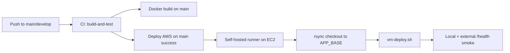

# GitHub Actions Audit — Production CI/CD

**Date:** 2026-07-09 (post #26 timezone-safe shift/stoppage tests)  
**Workflows:** `.github/workflows/ci.yml`, `.github/workflows/deploy-aws.yml`

---

## Current Pipeline Overview



---

## CI Workflow (`ci.yml`)

### Verified Steps

| Step | Status | Notes |
|------|--------|-------|
| Checkout | ✅ | actions/checkout@v4 |
| Node 20 + npm cache | ✅ | |
| `npm ci` | ✅ | Lockfile install |
| `npm run build` | ✅ | All workspaces (required before server tests) |
| Client tests | ✅ | |
| Operator APK bundle check | ✅ | `check:operator-bundle` |
| DB migrations | ✅ | Postgres 15 service container |
| Server unit tests | ✅ | 271+ tests (shift/stoppage timezone-safe since #26) |
| Server integration tests | ✅ | |
| Docker build (main only) | ✅ | backend + nginx targets, no push |

### Post-#26 Timezone Fixes

| Commit | Area | Fix |
|--------|------|-----|
| `7db5d16` (#26) | Shift detection + stoppage unit tests | Plant-time helpers; no ambiguous local `Date` strings |
| `317ba5e` | PPC import tests | Timezone-safe import tests + `queue_seq` sequencing |
| `179d3c6` | PPC `plan_date` | Calendar strings for UTC Postgres |

### Gaps (Pilot Acceptable)

| Gap | Severity | Notes |
|-----|----------|-------|
| No image push to registry | Low | Build-on-VM for pilot |
| 8 architecture unit suites need platform build | Low | CI builds all workspaces first; `test:arch` for local runs |
| No production env validation in CI | Low | Validated on VM at deploy time |

---

## Deploy Workflow (`deploy-aws.yml`)

### Architecture

Deploy runs on a **self-hosted GitHub Actions runner** installed on the EC2 instance (`runs-on: [self-hosted, linux, zedral]`). GitHub cloud runners never SSH in — Security Group port 22 can stay restricted to ops IP only.

One-time setup: `deploy/setup-github-runner.sh` (see `deploy/README.md`).

### Verified Steps

| Step | Status | Notes |
|------|--------|-------|
| Trigger on CI success (main) | ✅ | `workflow_run` |
| Manual dispatch | ✅ | Optional `skip_migrate` |
| Concurrency lock | ✅ | No parallel deploys |
| Production environment | ✅ | Secrets scoped |
| Checkout CI SHA | ✅ | Exact commit that passed CI |
| rsync to `APP_BASE` | ✅ | Preserves `deploy/.env` |
| `vm-deploy.sh` | ✅ | `SKIP_GIT_SYNC=true` (no git fetch on VM) |
| Local health check | ✅ | 12 retries on `127.0.0.1/health` |
| Backend build verify | ✅ | Sentinel file + container dist check |
| External smoke test | ✅ | 5 retries on `AWS_PUBLIC_URL/health` |

### Secrets Required

| Secret | Purpose |
|--------|---------|
| `AWS_APP_DIR` | App directory on VM (default `/opt/zedralv2`) |
| `AWS_GIT_DEPLOY_TOKEN` | PAT for private repo bootstrap (first deploy) |
| `AWS_PUBLIC_URL` | HTTPS smoke test URL |

**Legacy SSH secrets** (`AWS_EC2_HOST`, `AWS_EC2_USER`, `AWS_EC2_SSH_KEY`, `AWS_EC2_SSH_PORT`) are **no longer used** by the workflow.

---

## Deploy Script Chain (`deploy/vm-deploy.sh`)

1. `bootstrap_repo_if_missing` — clone if first deploy
2. `validate_env_file` — **includes TENANT_ID, JWT length, AUTH_STRICT**
3. `git_sync_to_ref` — skipped when `SKIP_GIT_SYNC=true` (self-hosted deploy)
4. `save_deploy_checkpoint` — writes `.previous-good-sha` for rollback
5. `run_stack_deploy` — `docker compose up -d --build`
6. `verify_deployment_health` — container health + `/health` curl

---

## Rollback Process

### Automated Checkpoint

Each successful deploy saves git SHA to `deploy/.last-good-sha` (previous in `.previous-good-sha`).

### Manual Rollback

```bash
cd /opt/zedralv2
bash deploy/rollback.sh              # previous good SHA
bash deploy/rollback.sh <git-sha>    # specific SHA
```

### Limitations

| Aspect | Behavior |
|--------|----------|
| Code rollback | ✅ Git reset + rebuild |
| Database rollback | ❌ Forward-only migrations — manual `migrate:down` if needed |
| Zero downtime | ❌ Container restart causes brief outage (~30s) |

### Rollback Documentation

See [deploy/README.md](./deploy/README.md) and [AWS_DEPLOYMENT_GUIDE.md](./AWS_DEPLOYMENT_GUIDE.md).

---

## Recommended Improvements (Post-Pilot)

1. Push pre-built images to Amazon ECR from CI
2. Add auth smoke test step to deploy workflow (badge-pin with test user)
3. Slack/email notification on deploy failure
4. Staging environment workflow before production

---

## Failure Detection

| Failure Point | Detection |
|---------------|-----------|
| Build failure | CI job fails — deploy not triggered |
| Test failure | CI job fails — deploy not triggered |
| Runner offline | Deploy job stuck "Waiting for a runner" |
| rsync / compose failure | deploy-aws job fails |
| Container crash | Docker healthcheck + deploy wait loop |
| DB unavailable | `/health` returns 503 |
| External unreachable | Smoke test retries fail |

---

## Pre-Deploy Checklist for Ops

- [ ] Self-hosted runner registered and **Idle** (Settings → Actions → Runners)
- [ ] `GITHUB_REPO` matches actual repository name
- [ ] `AWS_PUBLIC_URL` uses HTTPS after TLS setup
- [ ] `deploy/.env` on VM passes `validate_env_file`
- [ ] Backup cron scheduled per [BACKUP_STRATEGY.md](./BACKUP_STRATEGY.md)

---

*CI/CD is adequate for Hero Steels pilot deployment. Deploy uses self-hosted runner (not SSH-from-cloud). Shift/stoppage tests are timezone-safe on UTC CI since #26.*
