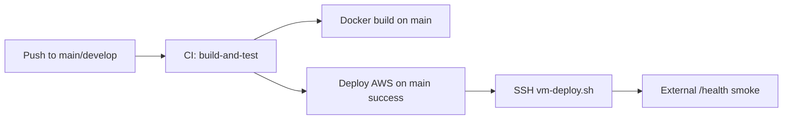

# GitHub Actions Audit — Production CI/CD

**Date:** 2026-06-11  
**Workflows:** `.github/workflows/ci.yml`, `.github/workflows/deploy-aws.yml`

---

## Current Pipeline Overview



---

## CI Workflow (`ci.yml`)

### Verified Steps

| Step | Status | Notes |
|------|--------|-------|
| Checkout | ✅ | actions/checkout@v4 |
| Node 20 + npm cache | ✅ | |
| `npm ci` | ✅ | Lockfile install |
| `npm run build` | ✅ | All workspaces |
| Client tests | ✅ | |
| DB migrations | ✅ | Postgres 15 service container |
| Server unit tests | ✅ | 245+ tests |
| Server integration tests | ✅ | |
| Docker build (main only) | ✅ | backend + nginx targets, no push |

### Gaps (Pilot Acceptable)

| Gap | Severity | Notes |
|-----|----------|-------|
| No image push to registry | Low | Build-on-VM for pilot |
| 5 pre-existing unit test failures | Medium | Unrelated to deploy blockers; tracked separately |
| No production env validation in CI | Low | Validated on VM at deploy time |

---

## Deploy Workflow (`deploy-aws.yml`)

### Verified Steps

| Step | Status | Notes |
|------|--------|-------|
| Trigger on CI success (main) | ✅ | workflow_run |
| Manual dispatch | ✅ | Optional skip_migrate |
| Concurrency lock | ✅ | No parallel deploys |
| Production environment | ✅ | Secrets scoped |
| SSH deploy | ✅ | appleboy/ssh-action@v1.2.0 |
| Fetch vm-deploy.sh from repo | ✅ | Uses DEPLOY_REF SHA |
| External smoke test | ✅ | 5 retries on AWS_PUBLIC_URL/health |

### Secrets Required

| Secret | Purpose |
|--------|---------|
| `AWS_EC2_HOST` | EC2 Elastic IP or hostname |
| `AWS_EC2_USER` | SSH user |
| `AWS_EC2_SSH_KEY` | Private key |
| `AWS_EC2_SSH_PORT` | SSH port |
| `AWS_APP_DIR` | App directory |
| `AWS_GIT_DEPLOY_TOKEN` | Private repo access |
| `AWS_PUBLIC_URL` | HTTPS smoke test URL |

---

## Deploy Script Chain (`deploy/vm-deploy.sh`)

1. `bootstrap_repo_if_missing` — clone if first deploy
2. `validate_env_file` — **includes TENANT_ID, JWT length, AUTH_STRICT**
3. `git_sync_to_ref` — reset to CI SHA or branch
4. `save_deploy_checkpoint` — writes `.previous-good-sha` for rollback
5. `run_stack_deploy` — `docker compose up -d --build`
6. `verify_deployment_health` — container health + `/health` curl

---

## Rollback Process

### Automated Checkpoint

Each successful deploy saves git SHA to `deploy/.previous-good-sha`.

### Manual Rollback

```bash
cd /opt/zedralv2
bash deploy/rollback.sh              # previous good SHA
bash deploy/rollback.sh <git-sha>    # specific SHA
```

### Limitations

| Aspect | Behavior |
|--------|----------|
| Code rollback | ✅ Git reset + rebuild |
| Database rollback | ❌ Forward-only migrations — manual `migrate:down` if needed |
| Zero downtime | ❌ Container restart causes brief outage (~30s) |

### Rollback Documentation

See [deploy/README.md](./deploy/README.md) and [AWS_DEPLOYMENT_GUIDE.md](./AWS_DEPLOYMENT_GUIDE.md).

---

## Recommended Improvements (Post-Pilot)

1. Push pre-built images to Amazon ECR from CI
2. Add auth smoke test step to deploy workflow (badge-pin with test user)
3. Slack/email notification on deploy failure
4. Staging environment workflow before production

---

## Failure Detection

| Failure Point | Detection |
|---------------|-----------|
| Build failure | CI job fails — deploy not triggered |
| Test failure | CI job fails — deploy not triggered |
| SSH failure | deploy-aws job fails |
| Container crash | Docker healthcheck + deploy wait loop |
| DB unavailable | `/health` returns 503 |
| External unreachable | Smoke test retries fail |

---

## Pre-Deploy Checklist for Ops

- [ ] `GITHUB_REPO` matches actual repository name
- [ ] `AWS_PUBLIC_URL` uses HTTPS after TLS setup
- [ ] `deploy/.env` on VM passes `validate_env_file`
- [ ] Backup cron scheduled per [BACKUP_STRATEGY.md](./BACKUP_STRATEGY.md)

---

*CI/CD is adequate for Hero Steels pilot deployment with documented rollback and env validation.*
