# GitHub Actions Audit — Production CI/CD

**Date:** 2026-07-13 (self-hosted local deploy; no SSH)  
**Workflows:** `.github/workflows/ci.yml`, `deploy-aws.yml`, `deploy-production.yml`

---

## Current Pipeline Overview

```mermaid
flowchart LR
  push[Push to main] --> ci[CI on ubuntu-latest]
  ci --> quality[Lint · build · test · audit]
  quality --> docker[Docker build · Trivy · push GHCR]
  docker --> qa[Deploy AWS QA]
  qa --> runnerQa[Self-hosted zedral on QA box]
  runnerQa --> localQa[Local rsync · compose pull · health]
  localQa --> smokeQa[Playwright on ubuntu-latest]
  smokeQa --> manual[Manual: Deploy Production]
  manual --> factory[Self-hosted hsl on Factory box]
  factory --> localProd[Local backup · compose · health]
```



---

## CI Workflow (`ci.yml`)

Runs on **GitHub-hosted** `ubuntu-latest`:

1. Lint → build → client tests → operator bundle → migrate → server unit + integration → arch check → npm audit
2. `docker-build-push` (on push to `main` only): builds `backend` + `nginx`, Trivy-scans, pushes to **GHCR** tagged with the commit SHA and `latest-main`

Deploy workflows only **pull** those tags — they never build source.

---

## Deploy — self-hosted runners on each server

Deploy is **pull-only** and runs on **self-hosted runners that live on each server**:

| Workflow | Runner labels | Environment | Trigger |
|----------|---------------|-------------|---------|
| `deploy-aws.yml` | `[self-hosted, linux, zedral]` (`zedral-ec2`) | `staging` | Auto after CI success on `main` (+ manual) |
| `deploy-production.yml` | `[self-hosted, linux, hsl]` (`hslsmed`) | `production` | Manual `workflow_dispatch` only |

### What runs locally on the box (no SSH)

1. GHCR login via `docker/login-action` against the runner’s docker daemon
2. Local `rsync` of `deploy/` into `APP_DIR` (preserves `.env`, `.last-good-*`, `.previous-good-*`)
3. `remote-ghcr-deploy.sh` — compose up + migrate (DB backup on production)
4. Local `curl http://127.0.0.1/health`
5. On failure → `rollback-images.sh`

### Smoke + rollback split

- Playwright smoke stays on **GitHub-hosted** `ubuntu-latest` (hits the public URL).
- `rollback-on-smoke-failure` is a **separate self-hosted job** so rollback runs locally without SSH.

`resolve` / `resolve-images` stay on `ubuntu-latest` (GHCR API only).

---

## Secrets Required

SSH secrets are **not** needed.

### Environment `staging`

| Secret | Purpose |
|--------|---------|
| `AWS_APP_DIR` | Optional; default `/opt/zedralv2` |
| `AWS_PUBLIC_URL` | Playwright smoke base URL |
| `SMOKE_BADGE_ID` | Smoke test badge |
| `SMOKE_PIN` | Smoke test PIN |
| `DEPLOY_WEBHOOK_URL` | Optional notify webhook |

### Environment `production`

| Secret | Purpose |
|--------|---------|
| `FACTORY_APP_DIR` | Optional; default `/opt/zedralv2` |
| `FACTORY_PUBLIC_URL` | Required when `skip_smoke=false` |
| `SMOKE_BADGE_ID` | Smoke test badge |
| `SMOKE_PIN` | Smoke test PIN |
| `DEPLOY_WEBHOOK_URL` | Optional notify webhook |

### Repo-level (shared)

| Secret | Purpose |
|--------|---------|
| `GHCR_TOKEN` | Optional; falls back to `GITHUB_TOKEN` + `packages: read`/`write` |

Do **not** enable Required Reviewers on environments (GitHub Free).

---

## Runner setup

Register one runner per box with `deploy/setup-github-runner.sh`:

```bash
# AWS QA (zedral-ec2)
export RUNNER_TOKEN='…'
export RUNNER_ENV=zedral
export RUNNER_NAME=zedral-ec2
bash /opt/zedralv2/deploy/setup-github-runner.sh

# Factory (hslsmed)
export RUNNER_TOKEN='…'
export RUNNER_ENV=hsl
export RUNNER_NAME=hslsmed
bash /opt/zedralv2/deploy/setup-github-runner.sh
```

Runner user must own `APP_DIR`, be in the `docker` group, and have `rsync`, `curl`, `jq` plus a valid `deploy/.env`.

---

## Rollback

| Method | How |
|--------|-----|
| Auto (deploy fail) | `rollback-images.sh` on the self-hosted job |
| Auto (smoke fail) | Separate self-hosted `rollback-on-smoke-failure` job |
| Manual | Re-run Production with a previous `image_tag`, or run `rollback-images.sh` on the box |

First-ever failed deploy: there is no `.previous-good-images` checkpoint — rollback is a no-op with a clear message.

---

## Pre-Deploy Checklist

- [ ] Environments `staging` and `production` exist with secrets above
- [ ] Runners Idle with labels `zedral` (`zedral-ec2`) and `hsl` (`hslsmed`)
- [ ] `deploy/.env` present on each server (never overwritten by rsync)
- [ ] CI has pushed images to GHCR before first Production deploy
- [ ] Backup cron scheduled per [BACKUP_STRATEGY.md](./BACKUP_STRATEGY.md)

---

*Build once in GHCR → deploy many locally on self-hosted runners. No SSH-from-cloud.*
