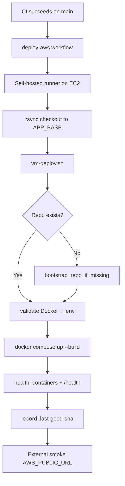

# ZedralV2 — AWS EC2 Deployment

Production deployment for a **single AWS EC2 instance** using Docker Compose.

**Host SSL (Let's Encrypt / HTTPS) is configured outside this stack** — deploy scripts only restart the Docker services and never modify `/etc/letsencrypt`, host nginx TLS vhosts, or certificate paths.

## Architecture

```
Internet → :443 host TLS (optional) → :80 docker nginx → backend:3005 → postgres:5432
```

| Service | Container | Role |
|---------|-----------|------|
| `nginx` | `zedral-nginx` | Serves React SPA, proxies `/api/*` → backend |
| `backend` | `zedral-backend` | Express API, migrations on start |
| `db` | `zedral-db` | PostgreSQL 15 |

## Deployment flow



## Repository layout on VM

| Case | Path | When |
|------|------|------|
| **A** | `/opt/zedralv2/.git` | `git clone <repo> /opt/zedralv2` |
| **B** | `/opt/zedralv2/<repo>/.git` | `git clone` into a non-empty `/opt/zedralv2` |

Set `AWS_APP_DIR=/opt/zedralv2` (default).

## Scripts

| Script | Purpose |
|--------|---------|
| `deploy/vm-deploy.sh` | **CI entrypoint** — bootstrap, sync, compose, health |
| `deploy/deploy.sh` | Manual deploy from the VM (`origin/main` or `DEPLOY_REF`) |
| `deploy/rollback.sh` | Roll back to `.previous-good-sha` or explicit SHA |
| `deploy/bootstrap-aws-vm.sh` | One-time Docker + git install on EC2 |
| `deploy/setup-github-runner.sh` | One-time GitHub Actions runner on EC2 |
| `deploy/lib/common.sh` | Shared helpers (sourced, not run directly) |

## One-time VM setup

```bash
export REPO_URL=https://github.com/kshitijsince2004/hsl_zedral.git
bash -c "$(curl -fsSL https://raw.githubusercontent.com/kshitijsince2004/hsl_zedral/main/deploy/bootstrap-aws-vm.sh)"
```

Configure secrets (required before first successful deploy):

```bash
cd /opt/zedralv2
cp deploy/.env.production.example deploy/.env
nano deploy/.env   # JWT_SECRET, DB_PASSWORD, DATABASE_URL
```

## Manual deploy

```bash
cd /opt/zedralv2
bash deploy/deploy.sh
```

Deploy a specific ref:

```bash
DEPLOY_REF=abc123def bash deploy/deploy.sh
```

## Rollback

```bash
bash deploy/rollback.sh
bash deploy/rollback.sh abc123def
```

Checkpoints are stored in `deploy/.last-good-sha` and `deploy/.previous-good-sha` (gitignored).

## GitHub Actions — `deploy-aws.yml`

Deploy runs on a **self-hosted runner installed on the EC2 instance**. GitHub cloud runners never SSH in, so your Security Group can keep port 22 restricted to your IP only.

### One-time: register self-hosted runner

1. **GitHub → `hsl_zedral` → Settings → Actions → Runners → New self-hosted runner**
2. Choose **Linux x64**, copy the registration token (expires in ~1 hour)
3. **SSH to EC2** and run:

```bash
export RUNNER_TOKEN='paste-token-here'
bash /opt/zedralv2/deploy/setup-github-runner.sh
```

4. Confirm runner shows **Idle** under Settings → Actions → Runners

After this, CI success on `main` triggers deploy automatically on EC2.

**Triggers**

1. CI succeeds on `main` → deploys exact CI SHA
2. Manual `workflow_dispatch` → deploys `origin/main` (optional `skip_migrate`)

### Required secrets (production environment)

| Secret | Description |
|--------|-------------|
| `AWS_GIT_DEPLOY_TOKEN` | PAT for private repo clone + raw script fetch |
| `AWS_APP_DIR` | App directory (default `/opt/zedralv2`) |
| `AWS_PUBLIC_URL` | Optional public URL for external smoke test |

SSH secrets (`AWS_EC2_HOST`, `AWS_EC2_SSH_KEY`, etc.) are **no longer required** for deploy.

### Private repo authentication

**Option A — `AWS_GIT_DEPLOY_TOKEN` (recommended for Actions)**

Fine-grained PAT with read access to repository contents. Used for:

- `raw.githubusercontent.com` script download
- `git clone` on first deploy

**Option B — Deploy key on VM**

```bash
ssh-keygen -t ed25519 -C "zedralv2-deploy" -f ~/.ssh/zedralv2_deploy -N ""
# Add public key in GitHub → Deploy keys
```

## Environment validation

Deploy fails fast if `deploy/.env` is missing or contains placeholders:

- `JWT_SECRET` (not `CHANGE_ME_*`)
- `DB_PASSWORD` (not `CHANGE_ME_*`)
- `DB_USER`, `DB_NAME`
- `DATABASE_URL` or `DB_HOST`

SSL/TLS variables on the host are **not** read or modified.

## Troubleshooting

### `fatal: not a git repository`

Repo is nested under `/opt/zedralv2/<repo>` but workflow used `/opt/zedralv2` directly. Fixed in `deploy/lib/common.sh` — re-run deploy workflow.

### `cd: /opt/zedralv2: No such file or directory`

Run bootstrap or set `AWS_GIT_DEPLOY_TOKEN` so first deploy can clone automatically.

### Health check fails

```bash
docker compose -f deploy/docker-compose.prod.yml --env-file deploy/.env ps
docker compose -f deploy/docker-compose.prod.yml logs backend nginx --tail 100
curl -v http://127.0.0.1/health
```

### GitHub Actions SSH timeout (legacy SSH deploy)

If you use SSH-based deploy from GitHub cloud runners, the Security Group must allow inbound TCP 22 from GitHub's IP ranges. **Current workflow uses a self-hosted runner instead** — see `deploy/setup-github-runner.sh`.

### Deploy job stuck on "Waiting for a runner"

Register the self-hosted runner on EC2:

```bash
export RUNNER_TOKEN='from GitHub → Settings → Actions → Runners → New runner'
bash /opt/zedralv2/deploy/setup-github-runner.sh
```

## Operations

```bash
docker compose -f deploy/docker-compose.prod.yml logs -f backend
docker compose -f deploy/docker-compose.prod.yml exec db \
  pg_dump -U m1_user m1_db > backup-$(date +%F).sql
```

See also: [AWS_DEPLOYMENT_GUIDE.md](../AWS_DEPLOYMENT_GUIDE.md), [BACKUP_STRATEGY.md](../BACKUP_STRATEGY.md), [TLS_DEPLOYMENT_GUIDE.md](../TLS_DEPLOYMENT_GUIDE.md).

## Security checklist

- [ ] Strong `JWT_SECRET` and `DB_PASSWORD` in `deploy/.env`
- [ ] `deploy/.env` never committed
- [ ] `AUTH_STRICT=true`
- [ ] EC2 Security Group: TCP 22 restricted, 80/443 open as needed
- [ ] Host TLS / Certbot config preserved separately from Docker deploy
- [ ] Change default pilot PINs after `seed:admin`
