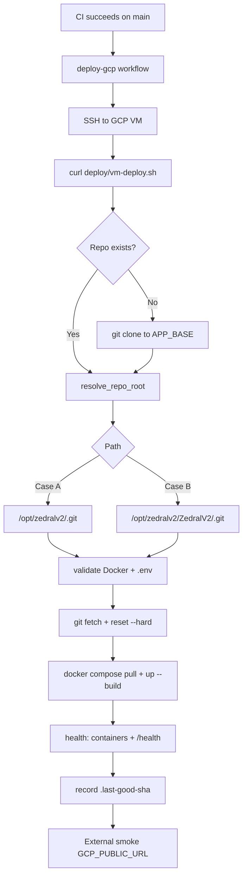

# ZedralV2 — GCP VM Deployment

Production deployment for a **single GCP Compute Engine VM** using Docker Compose.

**Host SSL (Let's Encrypt / HTTPS) is configured outside this stack** — deploy scripts only restart the Docker services and never modify `/etc/letsencrypt`, host nginx TLS vhosts, or certificate paths.

## Architecture

```
Internet → :443 host TLS (existing) → :80 docker nginx → backend:3005 → postgres:5432
```

| Service | Container | Role |
|---------|-----------|------|
| `nginx` | `zedral-nginx` | Serves React SPA, proxies `/api/*` → backend |
| `backend` | `zedral-backend` | Express API, migrations on start |
| `db` | `zedral-db` | PostgreSQL 15 |

## Deployment flow



## Repository layout on VM

The deploy resolver supports both common clone layouts:

| Case | Path | When |
|------|------|------|
| **A** | `/opt/zedralv2/.git` | `git clone <repo> /opt/zedralv2` |
| **B** | `/opt/zedralv2/ZedralV2/.git` | `git clone` into a non-empty `/opt/zedralv2` |

Set `GCP_APP_DIR=/opt/zedralv2` (default) — not the nested `ZedralV2` folder.

## Scripts

| Script | Purpose |
|--------|---------|
| `deploy/vm-deploy.sh` | **CI entrypoint** — bootstrap, sync, compose, health |
| `deploy/deploy.sh` | Manual deploy from the VM (`origin/main` or `DEPLOY_REF`) |
| `deploy/rollback.sh` | Roll back to `.previous-good-sha` or explicit SHA |
| `deploy/bootstrap-gcp-vm.sh` | One-time Docker + git install |
| `deploy/lib/common.sh` | Shared helpers (sourced, not run directly) |

## One-time VM setup

```bash
export REPO_URL=https://github.com/kshitijsince2004/ZedralV2.git
bash -c "$(curl -fsSL https://raw.githubusercontent.com/kshitijsince2004/ZedralV2/main/deploy/bootstrap-gcp-vm.sh)"
```

Configure secrets (required before first successful deploy):

```bash
# Resolve repo root (Case A or B)
cd /opt/zedralv2 2>/dev/null || cd /opt/zedralv2/ZedralV2
cp deploy/.env.production.example deploy/.env
nano deploy/.env   # JWT_SECRET, DB_PASSWORD, DATABASE_URL
```

## Manual deploy

```bash
cd /opt/zedralv2          # or /opt/zedralv2/ZedralV2
bash deploy/deploy.sh
```

Deploy a specific ref:

```bash
DEPLOY_REF=abc123def bash deploy/deploy.sh
```

## Rollback

```bash
# Roll back to previous successful deploy
bash deploy/rollback.sh

# Roll back to explicit SHA
bash deploy/rollback.sh abc123def
```

Checkpoints are stored in `deploy/.last-good-sha` and `deploy/.previous-good-sha` (gitignored).

## GitHub Actions — `deploy-gcp.yml`

**Triggers**

1. CI succeeds on `main` → deploys exact CI SHA
2. Manual `workflow_dispatch` → deploys `origin/main` (optional `skip_migrate`)

**Remote steps (via SSH)**

1. Download `deploy/vm-deploy.sh` for the target ref
2. Run idempotent bootstrap + `git reset --hard`
3. `docker compose pull` (ignore failures for local builds) + `up -d --build`
4. Verify `zedral-db`, `zedral-backend`, `zedral-nginx` + `curl /health`
5. External smoke test on `GCP_PUBLIC_URL` (if set)

### Required secrets

| Secret | Example | Description |
|--------|---------|-------------|
| `GCP_VM_HOST` | `34.x.x.x` | VM IP or DNS |
| `GCP_VM_USER` | `deploy` | SSH user |
| `GCP_VM_SSH_KEY` | `-----BEGIN OPENSSH...` | Private key |
| `GCP_VM_SSH_PORT` | `22` | Optional |
| `GCP_APP_DIR` | `/opt/zedralv2` | App base (not nested `ZedralV2`) |
| `GCP_GIT_DEPLOY_TOKEN` | PAT | **Recommended** for private repo clone + raw script fetch |
| `GCP_PUBLIC_URL` | `https://your.domain` | Post-deploy HTTPS smoke test |

### Private repo authentication

**Option A — `GCP_GIT_DEPLOY_TOKEN` (recommended for Actions)**

Fine-grained PAT with read access to repository contents. Used for:

- `raw.githubusercontent.com` script download
- `git clone` on first deploy

**Option B — Deploy key on VM**

```bash
ssh-keygen -t ed25519 -C "zedralv2-deploy" -f ~/.ssh/zedralv2_deploy -N ""
# Add public key in GitHub → Deploy keys
```

## Environment validation

Deploy fails fast if `deploy/.env` is missing or contains placeholders:

- `JWT_SECRET` (not `CHANGE_ME_*`)
- `DB_PASSWORD` (not `CHANGE_ME_*`)
- `DB_USER`, `DB_NAME`
- `DATABASE_URL` or `DB_HOST`

SSL/TLS variables on the host are **not** read or modified.

## Troubleshooting

### `fatal: not a git repository`

Repo is nested at `/opt/zedralv2/ZedralV2` but workflow used `/opt/zedralv2` directly. Fixed in `deploy/lib/common.sh` — re-run deploy workflow.

### `cd: /opt/zedralv2: No such file or directory`

Run bootstrap or set `GCP_GIT_DEPLOY_TOKEN` so first deploy can clone automatically.

### Health check fails

```bash
docker compose -f deploy/docker-compose.prod.yml --env-file deploy/.env ps
docker compose -f deploy/docker-compose.prod.yml logs backend nginx --tail 100
curl -v http://127.0.0.1/health
```

## Operations

```bash
docker compose -f deploy/docker-compose.prod.yml logs -f backend
docker compose -f deploy/docker-compose.prod.yml exec db \
  pg_dump -U m1_user m1_db > backup-$(date +%F).sql
```

## Security checklist

- [ ] Strong `JWT_SECRET` and `DB_PASSWORD` in `deploy/.env`
- [ ] `deploy/.env` never committed
- [ ] `AUTH_STRICT=true`
- [ ] Host TLS / Certbot config preserved separately from Docker deploy
- [ ] Change default pilot PINs after `seed:admin`
