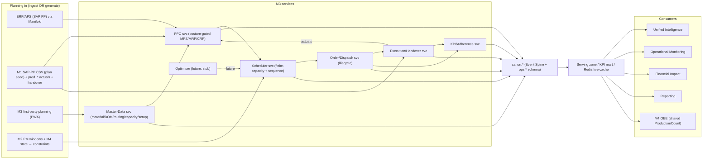
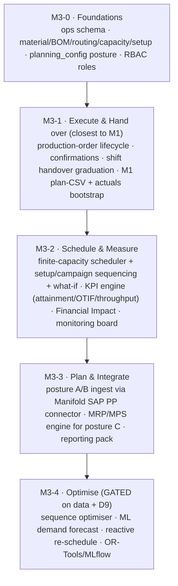

# Zedral · M3 Shopfloor Planning & Management — Developer Handover
### 00 · Master Index, Architecture, Stack & Conventions
**Audience:** engineering team · **Status:** v1 for build (plan→schedule→execute; optimisation interfaces only) · **Date:** 2026-06-03

> This is the build-ready specification set for **M3 · Shopfloor Planning & Management**, the platform's planning-and-control module (the foundation layers — Data Lake, Canonical Model, Manifold, Unified Intelligence, Monitoring, Reporting, Financial Impact, Platform/Security — are specified in `../../Dev_Handover/`; the first module, M2 Maintenance, is in `../../M2_Maintenance_Intelligence/`). Read this index first: it gives module scope, the architecture, which **platform decisions (D1–D11)** bind M3, the **stack** M3 inherits, M3-specific conventions, and the **build roadmap**. The *why* behind every spec is the planning deep-plan one level up: `../M3_Shopfloor_Planning_Management_DeepPlan.md`.

---

## 1. Document set & reading order

| # | Spec | Build priority |
|---|------|----------------|
| 00 | **This index** — architecture, stack, conventions, roadmap | Read first |
| 01 | **Data Model & Schema** — new canonical entities, DDL dictionary (`M3_schema.sql`), posture switch | Phase M3-0 |
| 02 | **PPC, Planning Hierarchy & Postures** — demand→MPS→MRP→CRP; the 3 postures | Phase M3-2→3 |
| 03 | **Detailed Scheduling & Sequencing** — finite capacity, setup matrix, campaign rules, what-if | Phase M3-2 |
| 04 | **Shift Handover & Execution** — handover lifecycle, carryover, confirmations (M1 graduation) | Phase M3-1 |
| 05 | **Production-Order Lifecycle & Events** — state machine, domain events, M1 bootstrap | Phase M3-1 |
| 06 | **KPIs, Analytics & Financial Impact** — formulas + SQL, registry, M3↔M4 reconciliation | Phase M3-2 |
| 07 | **APIs, Events & Integration** — REST/OpenAPI, domain events, SAP PP connector mapping | Phase M3-1→3 |
| 08 | **Optimisation / AI — Future-Scope Interfaces** — optimiser hooks, readiness gate (no v1 build) | Phase M3-4 (gated) |
| 09 | **Security, RBAC, NFRs & Acceptance** — roles, multi-tenancy, test plan, acceptance | Cross-cutting |
| 10 | **Glossary** — planning & control terms | Reference |
| — | **`M3_schema.sql`** | Runnable PostgreSQL DDL (paired with 01) |

**Companion material:** the planning deep-plan (`../M3_Shopfloor_Planning_Management_DeepPlan.md`) + 10 flowcharts (`../M3_diagram_*.mermaid`). Platform specs referenced throughout live in `../../Dev_Handover/`.

---

## 2. Module scope & non-goals

**In scope (v1):** planning master data (material, BOM, routing, work-centre capacity, setup matrix); the **posture-configurable** PPC engine (ingest *or* generate demand→MPS→MRP→orders); detailed **finite-capacity scheduling & sequencing** with sequence-dependent setup; dispatch & the **production-order lifecycle**; **execution, confirmation & shift handover** (graduating M1's first-class handover); the planning KPI family priced by Financial Impact; the live dispatch / plan-vs-actual board; ingestion from ERP/APS via Manifold **or** first-party planning **or** bootstrap from M1's SAP-PP CSV + actuals.

**Future scope (interfaces only, build gated — D9):** mathematical **schedule optimisation** (minimise setup+tardiness+WIP), **ML demand forecasting**, automated reactive re-scheduling, prescriptive recommendations. v1 ships the data hooks and interface stubs (spec 08) so this is a later switch-on, not a re-model.

**Non-goals (neighbouring modules/systems):** the financial ledger (M3 *feeds* Financial Impact, doesn't own cost accounting); warehouse execution/WMS (putaway, bin management — M3 reads stock for MRP netting only); quality disposition (M6 owns it; M3 reads quality holds for handover); maintenance scheduling (M2 owns it; M3 consumes PM windows as capacity constraints).

---

## 3. System context

**Golden rule (inherited):** M3 reads canonical data through the Serving zone and writes its facts back through the canonical write-back API + `ops.*` schema. It never reads another module's database and never writes `canon` core tables it does not own. A produced quantity is **one** `canon.event` ProductionCount row — M3 contextualises it (attainment), M4 aggregates it (OEE).

---

## 4. Binding decisions that constrain M3 (subset of D1–D11)

| # | Decision | M3 build constraint |
|---|----------|---------------------|
| **D1** | Hybrid-ready, per-client | Scheduler + dispatch + handover capture **must** run on-prem edge (plants are often disconnected); containerized, no cloud-only calls. |
| **D2** | Near-real-time (minutes), tunable | Plan-vs-actual & dispatch board refresh in minutes (per-tenant); confirmation capture never blocks. |
| **D4** | Excel/CSV + generic DB connector first | The **M1 SAP-PP plan CSV** is the first ingest path; SAP PP API connector is a fast-follow (spec 07). |
| **D7** | Cost-rates client-owned, effective-dated, "rate as of" | Late-order / idle / changeover costing resolves the `canon.cost_rate` **effective at the event date**, never "today's" rate. |
| **D8** | Logical tenant isolation default | `tenant_id` on every `ops.*` row; all queries tenant-scoped at the data-access layer. |
| **D9** | Rule-based now, ML later | Sequencing is deterministic/rule-based in v1 (setup matrix + campaign rules); optimisation ML is reserved (spec 08), not built. |
| **D11** | Sector-neutral, exercise extension namespace | Order/routing/capacity/setup model is generic; Hero Steels is a *seed template*, not the schema. Client specifics live in `ext` JSONB. |

Full D1–D11 text: `../../Dev_Handover/00_INDEX_and_Architecture.md` §3.

---

## 5. Technology stack (inherited + M3-relevant)

M3 adds **no new platform technology**; it uses the stack ratified in the platform handover.

| Concern | Tech | M3 use |
|---|---|---|
| Canonical OLTP | **PostgreSQL 15+** (`ops` schema) | all M3 master + transactional tables (`M3_schema.sql`) |
| KPI mart | **ClickHouse** / Postgres columnar | `kpi_plan_daily` rollups for UIL/Reporting |
| Event bus | **Kafka / Redpanda** | publish/consume planning domain events (spec 07) |
| Scheduler / batch | **Apache Airflow** | MRP run, capacity rollup, KPI rollup, plan-vs-actual jobs |
| Live cache | **Redis** | dispatch board, plan-vs-actual, late-order counts (Monitoring) |
| API | **REST + OpenAPI**, gateway, OIDC | spec 07 endpoints |
| Auth/RBAC | **Keycloak (OIDC)** | M3 roles extend M1 (spec 09) |
| Backend | **Python 3.11 + FastAPI** | M3 services; scheduler may use OR-Tools later (spec 08) |
| Frontend | **React + TS (PWA)** | planner board, dispatch, handover; reuse M1 capture patterns |
| Optimiser (later) | **OR-Tools / metaheuristics + MLflow** | reserved for §8, not built in v1 |

---

## 6. M3 build roadmap (epics)

Maps onto the platform roadmap: M3-0→2 ride Phase 2–3 (serve/synthesize); M3-3 rides Phase 4 (SAP/connectors); M3-4 rides Phase 5 (ML/optimisation, data-gated). Note the **on-ramp order** (execute-first) deliberately front-loads the cheapest value (M1 already supplies the plan CSV, actuals, and a handover).

---

## 7. Non-functional baseline (delta over platform §7)

M3 inherits the platform NFR baseline (multi-tenant, hybrid, minutes-latency, 99.5% serving, OIDC, audit, OTel). Module-specific targets (detailed in spec 09): the scheduler produces a committed sequence for ≥10k open operations/tenant within interactive time; first-party confirmation/handover capture is **offline-tolerant** (queue locally, sync on reconnect) like M1; KPI rollups reconcile with M4 to the produced-unit; handover sign-off is an immutable, audit-logged record.

---

## 8. Open items (carry into build)

- **Default posture** per segment (lead with Posture B "own-the-schedule"?) — spec 02.
- **Scheduling granularity**: work-centre/shift bucket vs machine/minute — spec 03 (`planning_config.schedule_grain`).
- **Setup-matrix source**: planner-entered vs learned from M1 actual changeover times — specs 03/08.
- **MRP scope (Posture C)**: single- vs multi-level explosion; net-change vs regenerative; purchase reqs or make-orders only — spec 02.
- **Material/stock ownership**: M3 holds balances for netting vs always reads ERP/WMS — specs 02/01.
- **Handover sign-off**: single vs dual (outgoing+incoming) acknowledgement gate — spec 04.
- **Optimisation data gate**: history threshold that flips a work centre to "optimisation-ready" — spec 08.
- **D11**: whether M3 (a discrete/assembly client) is used to validate the canonical model beyond steel.

*Next: specs 01–10. The compiled Word/PDF package combines all of these into one M3 Developer Handover document.*
