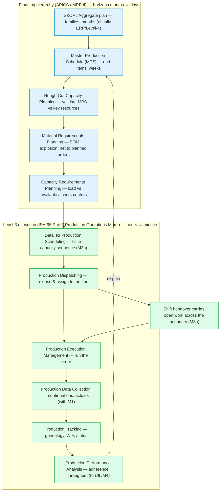
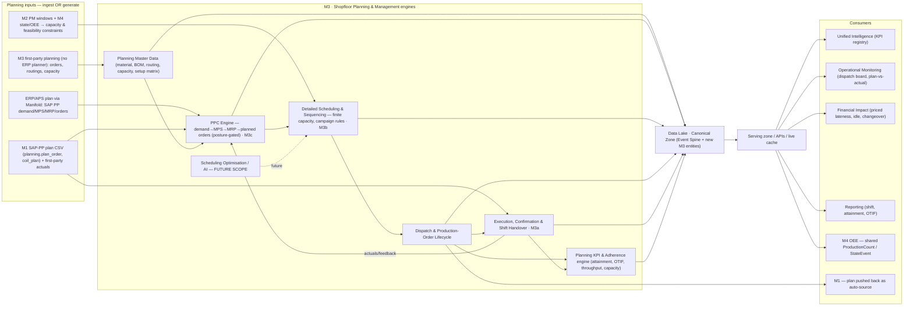
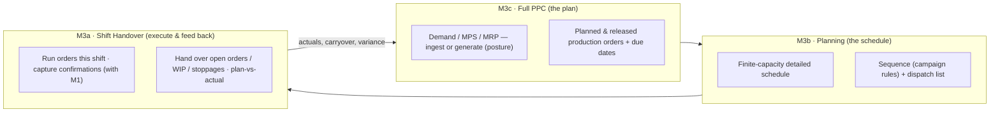
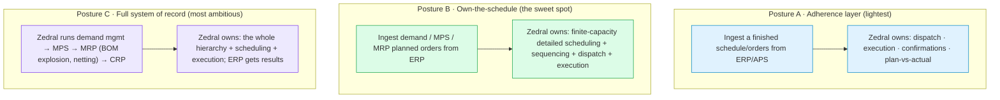
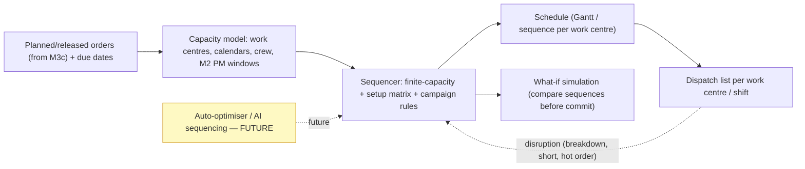
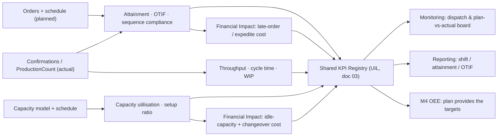
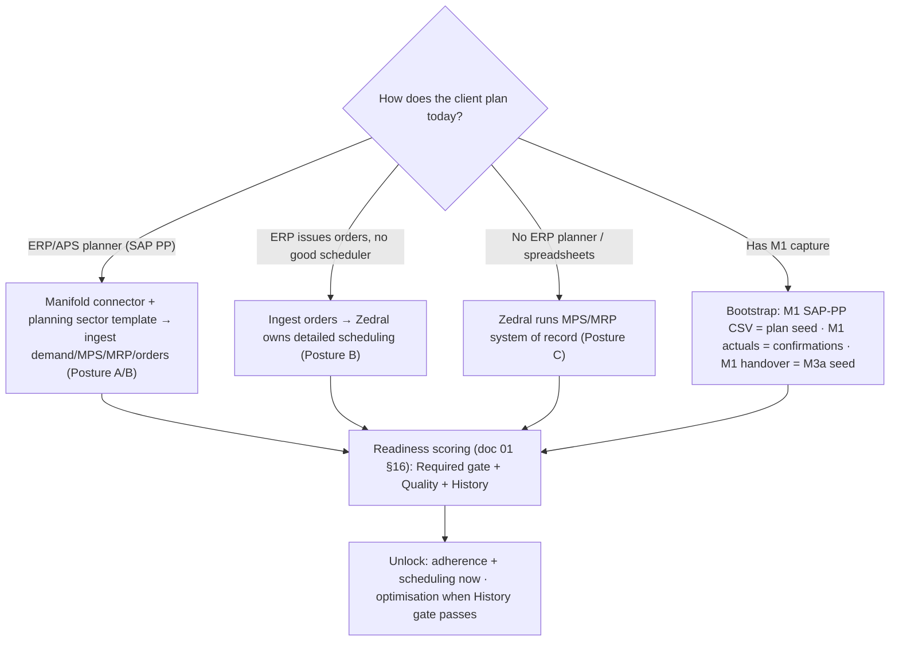

# Zedral — M3 · Shopfloor Planning & Management

### Deep Plan · v1 · Module Layer (Plan → Schedule → Execute → Feed back)

> **What M3 is.** M3 is Zedral's **Shopfloor Planning & Management** module — the platform's planning-and-control brain. It turns the orders, materials, routings, capacity, and shift data standing in the **Canonical Data Model** (`01_DataLake_and_Canonical_Model_DeepPlan.md`) into a working **closed-loop production planning & control (PPC) system**: it decides *what to make and when*, sequences it onto *finite* capacity, dispatches it to the floor, executes it shift-by-shift, and feeds the actuals back to keep the plan honest. It is delivered as three composable faces of one loop — **M3a Shift Handover** (execute & hand over), **M3b Planning** (detailed finite-capacity scheduling), **M3c Full PPC** (demand → MPS → MRP → order release). Every metric it produces — schedule adherence, plan attainment, OTIF, throughput, capacity utilisation — is priced by the **Financial Impact Layer**.
>
> **Why it's high-value.** Planning is the layer that *converts intent into throughput*. A plant can have perfect machines and still bleed money to late orders, idle capacity, bad sequencing, expensive changeovers, and shift-to-shift discontinuity. M3 is where Zedral attaches a number to "we ran the wrong thing in the wrong order," closes the loop between the ERP's plan and what the floor actually did, and makes the next shift continue seamlessly instead of starting cold. It is also the module that *consumes the most canonical entities* (orders, operations, materials, BOM, routings, shift, crew) — so it is the strongest pull-through for connected data, which is the platform's core wedge.
>
> **What M3 is NOT.** It is **not a forced rip-and-replace of the client's ERP/APS.** Production planning maturity varies enormously plant to plant, so M3 is **posture-configurable** (§5): for one client it ingests a finished schedule and only manages execution & adherence; for another it owns detailed finite-capacity scheduling on top of an ERP's MRP; for another it runs the full MPS/MRP system of record. Same data model, three deployment postures, chosen per client — mirroring the platform's "capture-or-ingest" philosophy. It is also **not** a finance/costing suite (it *feeds* Financial Impact, it doesn't own the ledger) and **not** a WMS (warehouse execution is a neighbouring ISA-95 activity, noted in §12).
>
> **Standards anchors.** Manufacturing planning-and-control hierarchy & MRP II from **APICS/ASCM** (S&OP → MPS → MRP → CRP → PAC); Level-3 execution structure from **ISA-95 / IEC 62264 Part 3** Production Operations Management activity model (detailed scheduling, dispatching, execution, data collection, tracking, performance analysis); finite-capacity logic from **APS** theory; production-levelling from **Lean / heijunka / takt**; shift-handover human factors from **HSE HSG48**; KPIs reconciled to the platform's existing **ISO 22400**. SAP PP's object flow (PIR → MPS/MRP → production order → confirmation) is the ingestion reference. Links in §15.

---

## 0. How M3 relates to the rest of the platform

M3 is an **intelligence contributor and an orchestrator** — it reads canonical data through the Serving zone, runs the planning/scheduling/execution engines, and writes its derived facts (orders, schedules, confirmations, adherence) back so every other layer can reuse them.

| Platform piece (doc) | What M3 consumes from it | What M3 gives back |
|---|---|---|
| **Data Lake · Canonical Model** (01) | Asset hierarchy, Shift/Calendar (Planned Production Time), Personnel/Crew, Material/BOM, Production Order/Operation slots, ProductionCount, StateEvent | New canonical entities (Routing, CapacityProfile, SetupMatrix, DemandForecast, MPSLine, PlannedOrder, ScheduleEntry, ShiftHandover, ProductionConfirmation); **populates** ProductionOrder/Operation on the Event Spine |
| **Manifold** (02) | ERP/APS connector (SAP PP, oracle/custom), field-mapping, dedup, sector templates, readiness/unlock | The M3 data contract; a seeded **production-planning sector template** (steel cold-rolling) |
| **M1 · Shopfloor Digitization** (M1 blueprint) | The **SAP PP/PPC plan CSV** M1 already pulls (`planning.plan_order`, `coil_plan`); first-party **actuals** (coil production, stoppages, `shift_log`); M1's first-class **shift handover** | Orders/schedules pushed back as the auto-source plan M1 pre-fills from; M3a **graduates** M1's handover into the platform module |
| **M2 · Maintenance Intelligence** | Planned maintenance windows (PM schedules) as **capacity constraints**; asset availability | The production calendar / asset booking so PM is slotted into genuine idle time |
| **M4 · OEE & Downtime** | Shares `ProductionCount` + `StateEvent` + the Planned-Production-Time denominator | The **plan** (planned qty, scheduled time, ideal cycle) that OEE's Performance & schedule-attainment measure against (boundary in §12) |
| **Unified Intelligence Layer** (03) | KPI registry, cross-module synthesis | Schedule adherence, plan attainment, OTIF, throughput, capacity utilisation into the shared KPI registry |
| **Operational Monitoring** (03) | Live state/cache off the streaming path | Live **dispatch board**, order progress, schedule-vs-actual, late-order alerts |
| **Financial Impact Layer** (07 spec) | CostRate reference (downtime, labour, late-order/expedite, holding) | Priced lateness, idle-capacity cost, changeover cost, expedite cost |
| **Reporting Layer** (05) | Same canonical KPI numbers | Shift production report, plan-attainment report, capacity & OTIF reports |

**The golden rule (inherited):** consumers never write M3's tables and M3 never writes another module's — everything moves through the canonical model and versioned Serving APIs. A produced quantity is recorded **once** as a canonical `ProductionCount`; **M3 plans/contextualises it** (against the order & schedule), **M4 aggregates it** (into OEE). No parallel truth.

---

## 1. Responsibilities & principles

M3 owns eight responsibilities: **(1)** maintain the **planning master data** (materials, BOM, routings, work-centre capacity, setup rules, calendars); **(2)** **ingest or generate** the plan (demand → MPS → MRP → orders) at a client-chosen **posture**; **(3)** run **detailed finite-capacity scheduling & sequencing**; **(4)** **dispatch** work to the floor and manage the **production-order lifecycle**; **(5)** capture **execution & confirmations** and run **first-class shift handover**; **(6)** compute the **planning KPI family** and price it; **(7)** surface a **live dispatch / plan-vs-actual board & alerts**; **(8)** stand **optimisation-ready** (auto-sequencing / AI scheduling) without a data re-model.

Principles:

1. **One closed loop, three faces.** Plan (M3c) → schedule (M3b) → execute & hand over (M3a) → actuals → re-plan. The three sub-modules are *not* independent products; they are the schedule→dispatch→execute→collect→track→analyse cycle of ISA-95 Part 3, packaged so a client can adopt them in stages.
2. **Posture-configurable, never forced.** Planning maturity varies. The same canonical model supports three postures — **adherence-only**, **own-the-schedule**, **full system-of-record** — selected per tenant (§5). We never demand a plant rip out a working ERP planner to get value.
3. **Finite capacity is the point.** MRP assumes infinite capacity and emits *planned orders*, not *executable schedules*. M3b's job is the thing MRP and spreadsheets can't do: produce a sequence that is actually runnable given machines, crew, tooling, material, and changeover rules.
4. **Plan and actual share one truth.** A produced quantity, a downtime, a state — each is recorded once on the canonical Event Spine. M3 contextualises facts against the plan; M4 rolls them into OEE; the numbers can never contradict (§12).
5. **Every plan miss has a cost.** No late order, idle hour, or extra changeover is recorded without the hooks to price it. Financial impact is a column, not an afterthought.
6. **Sector-neutral core, sector-specific skin.** The order/routing/capacity/sequencing model is generic; a **sector template** instantiates it concretely (Hero Steels cold-rolling campaign rules in §10) and reuses across clients via Manifold.
7. **Shift continuity is first-class.** The plant runs 24×7 across crews; the plan must survive the shift boundary. M3a guarantees no open order, running stoppage, or WIP coil is orphaned at handover — and feeds plan-vs-actual back into planning.
8. **Optimisation by design, not by rebuild.** v1 is planner-driven with deterministic rules (e.g. steel wide→narrow sequencing); the data model (orders, capacity, setup matrix, actuals) *is* the substrate for later finite-capacity optimisation and AI scheduling. We future-proof now and gate the optimiser build on accumulated data (§8), exactly as M2 does for predictive.

---

## 2. The planning & control conceptual frame (the scope map)

Everything M3 does sits at one of two well-standardised levels: the **planning hierarchy** (APICS/ASCM, top-down, longer horizons) and the **Level-3 execution activity model** (ISA-95 Part 3, the MES layer). Together they *are* M3's scope map — what's ingested vs generated, what's v1 vs future.



| Layer | Standard | M3 sub-module | Posture behaviour |
|---|---|---|---|
| S&OP / aggregate | APICS MPC | — (out of v1; usually Level-4) | always ingested if present |
| MPS | APICS MPC / SAP PP | **M3c PPC** | ingest *or* generate (posture) |
| MRP (BOM explosion → planned orders) | MRP II / SAP PP | **M3c PPC** | ingest *or* generate (posture) |
| RCCP / CRP (capacity) | APICS MPC | **M3c PPC** | validate; always computed by M3 |
| **Detailed finite-capacity scheduling** | APS / ISA-95 §detailed scheduling | **M3b Planning** | **M3 always owns** (unless adherence-only) |
| Dispatching | ISA-95 §production dispatching | **M3b/M3c** | M3 owns |
| Execution, data collection, tracking | ISA-95 §execution/collection/tracking | **M3a + M1** | M3 owns; capture via M1 or first-party |
| Performance analysis | ISA-95 §performance analysis / ISO 22400 | **M3 → UIL/M4** | M3 computes, UIL synthesises |

v1 delivers the green branch end-to-end and ingests/derives the blue branch according to posture. The **yellow** capability (true finite-capacity *optimisation* / AI auto-sequencing) is architected now and built later (§8).

---

## 3. M3 reference architecture



**Reading it:** the plan arrives by ingestion (ERP/APS or the M1 SAP-PP CSV) or is generated first-party; seven engines turn it into canonical planning facts; the loop closes when execution actuals feed back to re-plan; everything is written to the canonical Event Spine and served to the intelligence/monitoring/financial/reporting layers, to M4, and back to M1 as the auto-source plan. Engine **E7 (optimisation/AI)** is wired in but dark until the data and the optimiser build land.

---

## 4. The three sub-modules as one closed loop

The user-facing breakdown is **M3a Shift Handover · M3b Planning · M3c Full PPC**. Architecturally these are three faces of a single control loop, presented below in *execution-loop order* (plan → schedule → execute). Note the **build/on-ramp order is the reverse**: M3a is closest to M1 and the cheapest first value, so it is typically built first (§14).



| Sub-module | ISA-95 activity it embodies | Owns | Key question it answers |
|---|---|---|---|
| **M3c · Full PPC** | Product-definition mgmt, resource mgmt, (detailed) scheduling at plan level, dispatching | demand→MPS→MRP→order release; the posture; capacity validation | *What should we make, in what quantity, by when — and do we have the materials & capacity?* |
| **M3b · Planning** | Detailed production scheduling, dispatching | finite-capacity sequence, changeover/campaign optimisation, dispatch list | *In exactly what order do we run it so it's feasible and cheap to change over?* |
| **M3a · Shift Handover** | Production execution mgmt, data collection, tracking | order execution this shift, confirmations, structured handover, carryover, plan-vs-actual feedback | *Did this shift run to plan, and does the next shift have everything to continue without a cold start?* |

The loop is the value: a plan nobody executes is a spreadsheet; execution with no feedback drifts; feedback with no plan is noise. M3 binds all three.

---

## 5. M3c — Full PPC engine & the configurable planning posture

M3c is the planning brain. Its defining design choice (your scope decision) is that **Zedral must handle all three planning postures** — the depth at which Zedral owns planning is a *per-client configuration*, not a product fork. The canonical model and engines are identical across postures; what changes is **which stages Zedral generates vs ingests**.



| Stage (APICS/MRP II) | Posture A — Adherence | Posture B — Own-the-schedule | Posture C — System of record |
|---|---|---|---|
| Demand management / forecast | ingest | ingest | **Zedral generates** |
| MPS (master schedule) | ingest | ingest | **Zedral generates** |
| MRP (BOM explosion → planned orders, netting) | ingest | ingest | **Zedral generates** |
| RCCP / CRP (capacity validation) | ingest/none | **Zedral computes** | **Zedral computes** |
| **Detailed finite-capacity scheduling (M3b)** | ingest (finished) | **Zedral owns** | **Zedral owns** |
| Dispatch & order lifecycle | **Zedral owns** | **Zedral owns** | **Zedral owns** |
| Execution, confirmation, handover (M3a) | **Zedral owns** | **Zedral owns** | **Zedral owns** |
| Plan-vs-actual, adherence KPIs | **Zedral owns** | **Zedral owns** | **Zedral owns** |

**How the posture is implemented.** A single per-tenant `planning_posture` configuration (`ADHERENCE | SCHEDULING | SYSTEM_OF_RECORD`) drives which engine stages run and which are satisfied by a Manifold ingest mapping. Because the canonical entities (DemandForecast, MPSLine, PlannedOrder, ProductionOrder) exist in all postures — sometimes *populated by Zedral's engine*, sometimes *populated by an ingest* — downstream scheduling, execution, and KPI code is posture-agnostic. This is the exact analogue of M2's "capture-or-ingest" on-ramps and Manifold's module-unlocking: one model, multiple doors.

**The MRP/MPS engine (Posture C).** When Zedral is system of record it runs the classic computation: MPS sets quantity & due dates for independent-demand end items; MRP explodes the BOM level by level, nets against on-hand and scheduled receipts, offsets by lead time, and emits **planned orders** (make) and **purchase requisitions** (buy). RCCP/CRP load the resulting orders against work-centre capacity. v1's MRP is the standard deterministic, regenerative/net-change run; advanced multi-echelon and optimisation are future scope (§8). Even in Postures A/B Zedral *computes capacity load* so it can flag an ingested plan as infeasible — that diagnostic is valuable regardless of who owns the plan.

---

## 6. M3b — Detailed scheduling, sequencing & finite capacity (APS)

M3b is the engine that does what MRP and spreadsheets cannot: turn *planned orders* into an *executable sequence* that respects finite capacity and changeover economics. This is the APS layer of ISA-95 "detailed production scheduling."

**Finite vs infinite.** MRP plans materials assuming infinite capacity; M3b schedules against the **finite** availability of machines, crew, tooling, and material *simultaneously*, so the schedule it emits is one the floor can actually run. It supports forward scheduling (from a start date) and backward scheduling (from a due date), and re-schedules on disruption (breakdown, material short, hot order).

**Sequence-dependent setup — the changeover economics.** The order in which jobs run changes the total setup time/cost. M3b carries a **setup matrix** (transition cost from product/state *i* to *j*) and sequences to minimise the sum of **setup + tardiness + WIP holding** — the standard scheduling objective. This is where steel becomes a perfect, concrete anchor.



**Steel cold-rolling campaign rules (Hero Steels anchor).** Rolling forms *campaigns* of coils sequenced by a **coffin / wedge profile**: width generally **wide → narrow** within a campaign because a wider coil leaves marks on the work rolls that scratch any subsequent narrower coil; gauge and hardness progress smoothly; a width increase forces a **roll change** (a costly setup). M3b encodes these as sequencing constraints and setup-matrix penalties, so the schedule it proposes extends roll life and cuts surface defects — exactly the published cold-rolling scheduling objective (minimise setup + tardiness + WIP). This rule set ships in the **steel sector template**; other sectors plug in their own setup matrix and sequence rules without touching the engine.

**v1 vs future.** v1 ships a **planner-driven** board with **deterministic rule-based sequencing** (campaign/setup rules, drag-to-resequence, what-if compare). True mathematical **optimisation** (minimise a cost objective automatically) and **AI/ML sequencing** are future scope (§8) — architected now via the same setup matrix + capacity model so it is a switch-on, not a rebuild.

---

## 7. M3a — Shift Handover & execution continuity (in service of PPC)

M3a is the execution face of the loop. Its job is **production continuity across the shift boundary** and **feeding actuals back to planning** — *not* a standalone safety-handover product. (Safety/permit content is included because best practice demands it, but the module's purpose is to keep the *plan* running 24×7 and to close the plan→actual loop.)

**Why it matters.** Industry data is stark: roughly **40% of plant incidents occur during shift handover** despite handovers being <5% of operating time; investigations of major incidents (Piper Alpha, Sellafield) cite handover communication failure. HSE guidance (HSG48 human factors) is that handover must be **structured, two-way, and both written and verbal**. A structured digital handover also cuts handover time materially (reported 20 min → <3 min) by pre-filling production data from the system rather than re-keying it.

```mermaid
stateDiagram-v2
  [*] --> Accumulating: shift runs; events/confirmations logged (M1 + M3)
  Accumulating --> Drafted: outgoing supervisor compiles handover (auto-pulled actuals + notes)
  Drafted --> Reviewed: mandatory sections enforced (safety, open orders, exceptions cannot be skipped)
  Reviewed --> Handover: outgoing + incoming meet (written + verbal), incoming acknowledges
  Handover --> SignedOff: both sign; carryover items transferred; audit-logged
  SignedOff --> [*]
  Drafted --> Drafted: open order / WIP / stoppage auto-carried (nothing orphaned)
```

**What a handover carries (canonical, mandatory-enforced):**

| Section | Content | Source |
|---|---|---|
| Header | shift, date/time, outgoing & incoming supervisor + crew | Shift / Personnel |
| Production vs plan | planned vs produced qty per order/line; OEE for the shift; variance reason | M3 schedule + M1/M4 actuals |
| **Open orders / WIP carryover** | every order still in progress + its state (the no-orphan guarantee) | M3 order lifecycle |
| Running stoppages / issues | active downtime, degraded assets, awaiting-parts | M1 stoppages / M2 |
| Safety & controls | permits, isolations/lockouts, temporary controls, incidents | first-party capture |
| Quality holds | held coils/lots, rework pending | M1 defects / M6 |
| Instructions / actions | priorities for next shift, hot orders, callbacks | supervisor |

**Relationship to M1.** M1 already makes shift handover *first-class* at Hero Steels (carries open coils + running stoppages to the next shift log). M3a **graduates** that into the platform module: it generalises the carryover to *any* canonical order/WIP (not just coils), adds the structured production-vs-plan + safety + instruction sections, enforces mandatory fields, and writes a canonical `ShiftHandover` record — so it works for clients **with or without** M1 capture, and so the handover's plan-vs-actual flows straight back into M3c/M3b as planning feedback. Where M1 exists, M3a reuses its capture UX, offline-tolerance, and RBAC.

---

## 8. Optimisation & AI scheduling — FUTURE SCOPE (architected now)

True schedule **optimisation** and **AI-driven planning** are the operating-model's post-6-month → prescriptive horizons, **gated on accumulated data**. v1 is deterministic and planner-driven; we design so the optimiser is a switch-on.

| Capability | v1 | Future scope |
|---|---|---|
| Sequencing | deterministic rules (campaign/setup matrix), manual drag-to-resequence, what-if compare | **mathematical optimisation**: minimise setup + tardiness + WIP objective automatically (MILP / metaheuristics) |
| Demand | ingest forecast; simple consumption | **ML demand forecasting** (seasonality, trend) feeding MPS |
| Re-scheduling | planner re-runs on disruption | **automated reactive re-scheduling** within guardrails |
| Decision support | KPIs + alerts (descriptive/diagnostic) | **prescriptive**: "run this sequence; expedite order X" recommendations (2–3 yr horizon) |

**What v1 must get right so this is a switch-on, not a rebuild:** (a) a clean **setup matrix** + **capacity model** + **routing** captured from day one (the optimiser's constraints); (b) **confirmations/actuals labelled** against orders and sequences (the training & calibration data — actual setup times, actual run rates); (c) **due dates, priorities, and cost rates** joinable (the objective function's coefficients); (d) an **optimisation-readiness gate** in the readiness model (§11) that reports when a work centre has enough history to trust an auto-schedule. No optimisation *promises* in v1 — only optimisation *readiness*. This mirrors M2's predictive future-scope exactly.

---

## 9. Planning KPIs & analytics

M3's contribution to the **shared KPI registry** (doc 03). The OEE-adjacent ones reuse the platform's **ISO 22400** definitions so M3 and M4 never disagree.

| KPI | Formula | Meaning / target |
|---|---|---|
| **Schedule Attainment / Adherence** | orders completed on schedule ÷ scheduled orders × 100 | did we run the plan? (planning discipline) |
| **Plan (Quantity) Attainment** | actual good qty ÷ planned qty × 100 | did we make the planned amount? |
| **On-Time-In-Full (OTIF)** | orders delivered on time *and* complete ÷ total orders × 100 | customer-facing reliability |
| **On-Time Delivery (OTD)** | orders on/before due ÷ total | delivery performance |
| **Throughput / production rate** | good output ÷ time | flow |
| **Capacity Utilisation** | scheduled (or actual) load ÷ available capacity × 100 | are resources well used? (watch overload) |
| **Setup / Changeover ratio** | setup time ÷ total available time; count of changeovers | sequencing efficiency (steel: roll changes) |
| **Schedule Compliance (sequence)** | jobs run in planned sequence ÷ total | campaign discipline (steel) |
| **WIP / Order cycle time (flow time)** | release → completion elapsed | lean flow; lower is better |
| **Schedule stability / nervousness** | plan changes per horizon | planning quality (lower = more stable) |
| **Forecast accuracy** (if demand mgmt) | 1 − |forecast − actual| ÷ actual | MPS input quality |



**Financial impact (per Principle 5).** Every KPI is priced where a `CostRate` exists: cost of a late/expedited order, cost of idle capacity, cost of avoidable changeovers, holding cost of excess WIP. This turns "attainment rose 8%" into "£X/year of avoided expedite + idle" on the executive report.

---

## 10. Sector-neutral model + Hero Steels instantiation

The model is **generic** and an instantiation makes it **concrete** — the same entities (material, BOM, routing, work-centre capacity, setup matrix, order, schedule, handover) describe any plant; a sector template fills them in.

**Generic planning archetypes** (any sector): make-to-stock vs make-to-order; discrete vs process/batch vs repetitive flow; single- vs multi-stage routings; constraint/bottleneck resource; sequence-dependent vs sequence-independent setup.

**Hero Steels cold-rolling instantiation** (anchors the model to the real M1 plant; reuses the M1 COIL_NO spine and the SAP-PP plan it already ingests):

| Planning concept | Generic | Hero Steels cold-rolling |
|---|---|---|
| End item / order | production order for a material | coil order / dispatch lot for a grade × spec, keyed to **COIL_NO** |
| Routing | sequence of operations on work centres | HR Slitting → Pickling → Cold Rolling (2-Hi/4-Hi/6-Hi) → Annealing → Skin Pass → Rewinding → CRS → CTL |
| Work-centre capacity | available time per resource | mill run-hours, anneal furnace charges/day, pickling line throughput |
| **Setup matrix / sequence rule** | transition cost *i→j* | **width wide→narrow** within a rolling campaign; width-up forces a **roll change**; gauge/hardness progression |
| Constraint resource | bottleneck | typically the tandem mill or the annealing furnaces (batch) |
| Confirmation / actual | good/scrap qty + time | coil produced per process (M1 `prod_*`), scrap %, stoppages |
| Shift handover | open orders + WIP carryover | open coils mid-route + running stoppages (already first-class in M1) |

**Reusing M1.** M1's `planning.plan_order` / `coil_plan` (the SAP-PP CSV pull) is M3c's **ingest seed**; M1's `prod_*` confirmations are M3's **actuals**; M1's shift handover is M3a's **starting point**. The **steel cold-rolling sector template** (seeded in Manifold, doc 02 §12) carries the routing, the campaign/setup rules, and the plan-CSV mapping — so the next steel client's planning module lights up with no re-modelling. **D11 note:** because the core is sector-neutral, validating M3 on a **non-steel** client (different routing/setup rules, e.g. discrete assembly) is a clean way to exercise the extension namespace and retire the "only-tested-on-Hero-Steels" risk (R1/W1 in doc 04).

---

## 11. Data contract & readiness (the M3 row)

M3's machine-readable data contract (the basis for Manifold's module-unlocking, doc 01 §15). ● Required · ○ Additional.

| Canonical entity / group | M3 need | Notes |
|---|:--:|---|
| Asset hierarchy (Site→WorkCenter→WorkUnit) | ● | the resources scheduling loads onto |
| Shift / Calendar | ● | Planned Production Time = capacity & the handover boundary |
| Personnel / Crew | ● | dispatch assignment, handover, labour load |
| Production Order / Operation | ● | the core transactional spine (ingested or generated) |
| Material / BOM | ● | routings, MRP netting, what an order produces/consumes |
| Routing / Work-centre capacity / Setup matrix | ● | *new M3 entities* — the finite-capacity + sequencing model |
| ProductionCount (good/scrap/rework) | ○→● for attainment | actuals; required for plan-vs-actual & throughput |
| StateEvent (machine state) | ○ | feasibility (is the resource up?) + dispatch |
| DowntimeEvent + ReasonCode | ○ | re-schedule triggers; carryover at handover |
| Maintenance WO / PM windows (M2) | ○ | capacity constraint (don't schedule on an asset in PM) |
| CostRate | ○ | unlocks financial impact (late/idle/changeover) — recommended |

**New canonical entities M3 introduces** (additive, per doc 01 §14 versioning rule): `Routing` + `RoutingOperation`, `WorkCenterCapacity` / `CapacityProfile`, `SetupMatrix`, `DemandForecast` / `PlannedIndependentRequirement`, `MPSLine`, `PlannedOrder`, `ScheduleEntry` / `DispatchList`, `ShiftHandover` (+ `HandoverCarryover`/`HandoverNote`), `ProductionConfirmation`. `ProductionOrder`, `ProductionOperation`, `Material`, `BOM` already exist in the canonical catalog (doc 01 §10–11) — M3 is the module that **brings them to life** (no other module needed them yet). `ProductionOrder` is the entity `canon.event.order_ref` softly points to.

**On-ramps to readiness** (posture-aware, §5):



The readiness model is the platform's existing one (doc 01 §16): Required-coverage is a hard gate; an extra **optimisation-readiness (History) sub-gate** reports per-work-centre whether there is enough confirmed run/setup history to trust an auto-schedule — so the UI honestly shows "optimisation available for these work centres" rather than promising it everywhere.

---

## 12. Integration & boundaries

| Boundary | M3 owns | The other side owns | Shared artifact |
|---|---|---|---|
| **M3 ↔ M4 (OEE)** | the **plan** (planned qty, scheduled time, ideal-cycle target), schedule attainment, sequence compliance | OEE rollup (Availability/Performance/Quality), Six Big Losses | the single `ProductionCount` + `StateEvent` stream + Planned Production Time |
| **M3 ↔ M1** | order lifecycle, scheduling, handover graduation, plan-vs-actual | first-party capture of actuals & stoppages at source; capture UX & RBAC | `ProductionCount`, `ShiftHandover`, the SAP-PP plan CSV |
| **M3 ↔ M2 (Maintenance)** | the production calendar / asset booking | PM schedules & windows | asset availability windows (M3 treats PM as a capacity constraint) |
| **M3 ↔ Manifold** | the M3 data contract + planning sector template | ERP/APS connectors (SAP PP), field-mapping, dedup, readiness | sector template library |
| **M3 ↔ UIL** | planning KPIs + adherence analytics | cross-module synthesis (plan↔OEE↔quality↔cost), exec rollups | shared KPI registry |
| **M3 ↔ Monitoring** | dispatch-board & plan-vs-actual logic, late-order alerts | live cache, alert delivery | streaming path |
| **M3 ↔ Financial Impact** | what to price (lateness, idle, changeover, WIP holding) | the cost-rate engine & "rate-as-of" provenance (D7) | `CostRate` |
| **M3 ↔ Inventory/WMS** (neighbour) | material *requirement* & consumption against orders (MRP) | warehouse execution, putaway, bin management | Material / stock levels |

The **M3↔M4 line is the one to get right**: a produced quantity is both a planning fact (attainment vs the order) *and* an OEE input (Performance/Quality). Rule: **the count is recorded once as a canonical `ProductionCount`; M3 contextualises it against the plan (attainment, OTIF, sequence), M4 aggregates it into OEE.** Two different metrics — *schedule attainment* (M3) vs *OEE performance* (M4) — one production truth, never double-counted. The same rule governs `StateEvent` (M3 uses it for dispatch feasibility; M4 uses it for Availability) and the Planned-Production-Time denominator (defined once by Shift/Calendar).

---

## 13. RBAC & operations (brief)

Roles extend M1's model (Operator / Supervisor / Plant-Head / Admin) with planning-specific personas: **Production Planner** (MPS/MRP, posture config, what-if), **Scheduler** (detailed sequence, dispatch list, re-schedule), **Shift Supervisor** (dispatch execution, confirmations, owns the shift handover), **Materials/Inventory Controller** (MRP netting, stock — Posture C), **Plant Manager** (KPIs, attainment, cost; read-only analytics), **Admin** (masters, integration, posture & workflow config). First-party planning/handover capture is **offline-tolerant** like M1 (queue on the floor, sync on reconnect) and fully **audit-logged** (who released/re-sequenced/confirmed/signed-off — handover sign-off is a legal-grade record). Row-level scoping by site/area as in M1. The **posture** itself is an admin-set, audit-logged tenant configuration.

---

## 14. Build sequence & open decisions

**Suggested build order (on-ramp first — closest to M1 & cheapest value, then up the hierarchy):**

1. **Planning master data + canonical order spine** — material, BOM, routing, work-centre capacity, setup matrix; bring `ProductionOrder`/`ProductionOperation` to life; posture config scaffold.
2. **M3a Shift Handover + execution/confirmation** — graduate M1's handover; capture confirmations; plan-vs-actual at shift level (fastest first value, leans on M1).
3. **Ingest path (Posture A) via Manifold** — SAP PP / order connector + planning sector template; dispatch & order lifecycle; adherence KPIs.
4. **M3b Detailed scheduling (Posture B)** — finite-capacity board, campaign/setup sequencing, what-if, dispatch list; the M3↔M4 reconciliation.
5. **Planning KPI engine → Financial Impact** — attainment/OTIF/throughput/capacity/setup into the shared registry, priced.
6. **M3c MRP/MPS engine (Posture C)** — demand→MPS→MRP (BOM explosion, netting)→CRP for clients with no ERP planner.
7. **Optimisation / AI (E7) — FUTURE, gated:** mathematical sequencing optimiser + ML demand forecasting when the History gate passes; prescriptive later.

**Open decisions (need your call):**

- **Default posture per segment** — lead with Posture B (own-the-schedule) as the standard pitch, or pick posture purely client-by-client? (Affects first-build emphasis & sales motion.)
- **ERP connector priority** — SAP PP first (matches Hero Steels' SAP), or a generic order-import first?
- **MRP scope in v1 (Posture C)** — single-level vs full multi-level BOM explosion; net-change vs regenerative; include purchase requisitions or make-orders only?
- **Scheduling granularity** — schedule to the work-centre/shift bucket, or to the machine/minute? (Drives UI & compute.)
- **Setup matrix source** — captured manually (planner) vs learned from M1 actuals (changeover durations)? (Ties to the optimiser-readiness gate.)
- **Shift handover sign-off** — single supervisor sign-off vs dual (outgoing + incoming) acknowledgement as a hard gate?
- **Material/inventory ownership** — does M3 hold stock balances for MRP netting (Posture C), or always read them from the ERP/WMS?
- **Optimisation build gate** — what history threshold (weeks of confirmed run/setup data per work centre) flips a resource to "optimisation-ready"?
- **Second-sector validation (ties to D11)** — use M3 (a discrete/assembly client with different routing & setup rules) to validate the canonical model beyond steel?

---

### Sources (standards & product grounding)

- Manufacturing planning & control hierarchy, **MRP II / MPS / MRP / CRP** — APICS/ASCM body of knowledge: [PPC overview](https://tractian.com/en/glossary/production-planning-and-control), [MRP II guide](https://www.projectmanager.com/blog/manufacturing-resource-planning), [planning hierarchy / MPS→MRP→CRP](https://www.brainkart.com/article/Production-Planning-and-Control-Systems_6440/), [MRP (IfM Cambridge)](https://www.ifm.eng.cam.ac.uk/research/dstools/mrp/)
- **ISA-95 / IEC 62264 Part 3** — Level-3 Production Operations Management activity model (detailed scheduling, dispatching, execution, data collection, tracking, performance analysis): [ISA-95 standard](https://www.isa.org/standards-and-publications/isa-standards/isa-95-standard), [ISA-95 Part 3 activity models](https://www.isa.org/products/ansi-isa-95-00-03-2013-enterprise-control-system-i), [ANSI/ISA-95 overview](https://en.wikipedia.org/wiki/ANSI/ISA-95), [MES Level-3 functions](https://www.symestic.com/en-us/blog/mes)
- **APS / finite-capacity scheduling** vs MRP (infinite capacity), what-if, re-scheduling: [APS vs MRP](https://connectedmanufacturing.com/knowledge-topics/aps-vs-mrp), [finite capacity scheduling](https://www.planettogether.com/aps/finite-capacity-planning-scheduling), [finite scheduling vs APS](https://www.symestic.com/en-us/what-is/finite-scheduling-vs.-aps)
- **SAP PP** object flow (PIR/demand → MPS/MRP → production order → confirmation) as ingestion reference: [SAP PP intro](https://www.erpqna.com/introduction-sap-pp-production-planning/), [SAP PP explained](https://www.sotatek.com/blogs/sap-development/sap-production-planning/), [SAP PP definition](https://www.techtarget.com/searchsap/definition/SAP-Production-Planning)
- **Steel rolling-mill scheduling** — campaign planning, coil width wide→narrow sequencing, sequence-dependent setup, roll changes (Hero Steels anchor): [cold-rolling mill scheduling problem](https://www.sciencedirect.com/science/article/abs/pii/S0360835219304279), [steel production scheduling best practices](https://oxmaint.com/industries/steel-plant/production-scheduling-best-practices-steel-manufacturing), [hot/cold mill scheduling](https://blog.3ds.com/brands/delmia/achieve-planning-accuracy-production-efficiency-for-hot-cold-mill-scheduling/)
- **Shift handover** human factors & digital logbooks — HSE HSG48, structured written+verbal, ~40% of incidents at handover, mandatory fields: [HSE shift handover](https://www.hse.gov.uk/humanfactors/topics/shift-handover.htm), [shift-handover breakdowns](https://www.teamsense.com/blog/shift-handover-breakdowns-hurt-manufacturing-output), [digital shift logbook fields](https://ifactoryapp.com/shift-logbook/digital-shift-logbook-shift-handover), [handover template & best practice](https://oxmaint.com/industries/manufacturing-plant/digital-shift-handover-manufacturing-process-template)
- **Lean levelling** — heijunka / takt for production levelling (sequencing input): [Lean planning concepts](https://www.brainkart.com/article/Production-Planning-and-Control-Systems_6440/)
- Platform-internal — `01_DataLake_and_Canonical_Model_DeepPlan.md` (canonical model, Event Spine, §15 contract, §16 readiness), `02_Manifold_DeepPlan.md` (connectors, sector templates), `03_UnifiedIntelligence_and_OperationalMonitoring_DeepPlan.md` (KPI registry, monitoring), `04_Consolidated_Review_and_Traceability.md` (D7, D11, R1/W1), `05_Reporting_Layer_DeepPlan.md`, M1 Technical Blueprint (COIL_NO spine, planning CSV, shift handover, capture patterns), `M2_Maintenance_Intelligence_DeepPlan.md` (PM windows as capacity constraints; the posture/on-ramp pattern)
