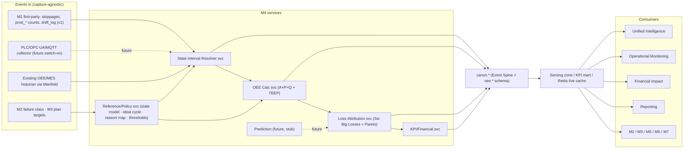
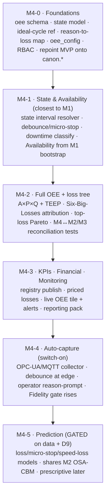

# Zedral · M4 OEE & Downtime Intelligence — Developer Handover
### 00 · Master Index, Architecture, Stack & Conventions
**Audience:** engineering team · **Status:** v1 for build (capture-agnostic OEE + Six-Big-Losses tree; PLC auto-capture & prediction = interfaces only) · **Date:** 2026-06-19

> This is the build-ready specification set for **M4 · OEE & Downtime Intelligence**, the platform's loss-accounting module (the foundation layers — Data Lake, Canonical Model, Manifold, Unified Intelligence, Monitoring, Reporting, Financial Impact, Platform/Security — are specified in `../../Dev_Handover/`; sibling modules M2 Maintenance and M3 Planning are in `../../M2_Maintenance_Intelligence/` and `../../M3_Shopfloor_Planning_Management/`). Read this index first: module scope, the architecture, which **platform decisions (D1–D11)** bind M4, the **stack** M4 inherits, M4-specific conventions, and the **build roadmap**. The *why* behind every spec is the OEE deep-plan one level up: `../M4_OEE_Downtime_DeepPlan.md`.

---

## 1. Document set & reading order

| # | Spec | Build priority |
|---|------|----------------|
| 00 | **This index** — architecture, stack, conventions, roadmap | Read first |
| 01 | **Data Model & Schema** — new derived entities, DDL dictionary (`M4_schema.sql`), the no-double-count anchor | Phase M4-0 |
| 02 | **OEE Calculation & Time Model** — A×P×Q + TEEP, ISO 22400 time model, roll-up rule, ideal-cycle | Phase M4-1→2 |
| 03 | **State & Downtime Capture** — state model, interval resolver, micro-stop/debounce, M1 bootstrap, PLC future | Phase M4-1 |
| 04 | **Loss Taxonomy & Reason Codes** — Six Big Losses, 3-layer reason tree, Pareto/"All Other" governance | Phase M4-2 |
| 05 | **Aggregation, Events & Pipeline** — streaming + batch rollups, replay/recompute, domain events | Phase M4-1→2 |
| 06 | **KPIs, Analytics & Financial Impact** — formulas + SQL, registry, M4↔M2 / M4↔M3 reconciliation | Phase M4-2 |
| 07 | **APIs, Events & Integration** — REST/OpenAPI, OPC-UA/MQTT collector contract, MVP migration | Phase M4-1→4 |
| 08 | **Prediction / ML — Future-Scope Interfaces** — loss/micro-stop/speed-loss hooks, readiness gate (no v1 build) | Phase M4-5 (gated) |
| 09 | **Security, RBAC, NFRs & Acceptance** — roles, multi-tenancy, NFRs, test plan, acceptance | Cross-cutting |
| 10 | **Glossary** — OEE & loss terms | Reference |
| — | **`M4_schema.sql`** | Runnable PostgreSQL DDL (paired with 01) |

**Companion material:** the OEE deep-plan (`../M4_OEE_Downtime_DeepPlan.md`) + 10 flowcharts (`../M4_diagram_*.mermaid`). Platform specs referenced throughout live in `../../Dev_Handover/`.

---

## 2. Module scope & non-goals

**In scope (v1):** OEE reference & policy (state model, micro-stop thresholds, ideal-cycle/rated-speed reference, reason→loss→component mapping, targets); the **State Interval Resolver** (debounce, close, classify); **OEE = A×P×Q + TEEP/OPE** to ISO 22400; the **Six-Big-Losses** loss tree + top-loss Pareto (by minutes and cost); financial pricing of every loss; live OEE/state board + micro-stop/speed alerts; **v1 capture by bootstrapping M1** (manual stoppages, counts, shift_log) with ingestion from a historian via Manifold as an alternative on-ramp.

**Future scope (interfaces only, build gated — D9):** **automatic PLC/OPC-UA/MQTT state detection** (spec 03/07 — collector contract specified, switch-on when a client connects PLCs); **loss / micro-stop / speed-loss prediction** (spec 08), prescriptive recommendations. v1 ships the data hooks so both are a later switch-on, not a re-model.

**Non-goals (neighbouring modules/systems):** data capture itself (M1 owns first-party capture; M4 consumes the canonical events); maintenance/reliability (M2 owns failure mode, MTBF, MTTR on the *shared* DowntimeEvent); plan attainment (M3 owns "did we run the plan?" on the *shared* ProductionCount); defect disposition & quality holds (M6); yield economics (M5); the financial ledger (M4 *feeds* Financial Impact, doesn't own cost accounting).

---

## 3. System context

**Golden rule (inherited):** M4 reads canonical data through the Serving zone and writes its derived facts back through the canonical write-back API + `oee.*` schema. It never reads another module's database and never re-records a canonical event. A downtime is **one** `canon.event` DowntimeEvent — M2 classifies it (failure), M4 aggregates it (Availability). A produced quantity is **one** `canon.event` ProductionCount — M3 contextualises it (attainment), M4 aggregates it (Performance/Quality).

---

## 4. Binding decisions that constrain M4 (subset of D1–D11)

| # | Decision | M4 build constraint |
|---|----------|---------------------|
| **D1** | Hybrid-ready, per-client | The state resolver + live OEE tile + edge collector **must** run on-prem edge (plants are often disconnected); containerized, no cloud-only calls. |
| **D2** | Near-real-time (minutes), tunable | Live OEE tile & micro-stop/speed alerts refresh in minutes (per-tenant); the rollup mart is batch. |
| **D4** | Excel/CSV + generic DB connector first | **M1 bootstrap** is the first ingest path; OPC-UA/MQTT collector + historian connectors are fast-follows (spec 07). |
| **D6** | "Standard" v1 KPI tier | OEE/A/P/Q/TEEP + Six Big Losses + Pareto is the Standard tier; advanced loss analytics deepen later. |
| **D7** | Cost-rates client-owned, effective-dated, "rate as of" | Downtime/speed/quality loss pricing resolves the `canon.cost_rate` **effective at the event date**, never "today's" rate. |
| **D8** | Logical tenant isolation default | `tenant_id` on every `oee.*` row; all queries tenant-scoped at the data-access layer. |
| **D9** | Rule-based now, ML later | OEE/loss is deterministic in v1; prediction (spec 08) and auto-capture detection logic are reserved, gated by readiness. |
| **D11** | Sector-neutral, exercise extension namespace | State/loss/OEE model is generic; Hero Steels is a *seed template*, not the schema. Client specifics live in `ext` JSONB. M4 is the cleanest cross-sector validator. |

Full D1–D11 text: `../../Dev_Handover/00_INDEX_and_Architecture.md` §3.

---

## 5. Technology stack (inherited + M4-relevant)

M4 adds **no new platform technology** (except the future edge collector); it uses the stack ratified in the platform handover.

| Concern | Tech | M4 use |
|---|---|---|
| Canonical OLTP | **PostgreSQL 15+** (`oee` schema) | all M4 reference + derived tables (`M4_schema.sql`) |
| KPI mart | **ClickHouse** / Postgres columnar | `oee_interval` rollups for UIL/Reporting |
| Stream processing | **Kafka/Redpanda + Flink** | state-interval resolution + live OEE off the streaming path |
| Scheduler / batch | **Apache Airflow** | shift/day OEE rollup, loss attribution, Pareto, readiness jobs |
| Live cache | **Redis** | live OEE tile, current state, micro-stop/speed counters (Monitoring) |
| API | **REST + OpenAPI**, gateway, OIDC | spec 07 endpoints |
| Auth/RBAC | **Keycloak (OIDC)** | M4 roles extend M1 (spec 09) |
| Backend | **Python 3.11 + FastAPI** | M4 services |
| Frontend | **React + TS (PWA)** | OEE board, loss Pareto, config; reuse M1 capture patterns |
| Edge collector (future) | **OPC-UA / MQTT client on edge gateway** | reserved for spec 03/07; not built in v1 |
| Prediction (later) | **MLflow + shared M2 OSA-CBM substrate** | reserved for spec 08, not built in v1 |

---

## 6. M4 build roadmap (epics)

Maps onto the platform roadmap: M4-0→3 ride Phase 2–3 (serve/synthesize); M4-4 rides Phase 4 (connectors/edge); M4-5 rides Phase 5 (ML, data-gated). The **on-ramp order** (M1-bootstrap first) front-loads the cheapest value — M4 produces a real OEE on day one with no new hardware.

---

## 7. Non-functional baseline (delta over platform §7)

M4 inherits the platform NFR baseline (multi-tenant, hybrid, minutes-latency, 99.5% serving, OIDC, audit, OTel). Module-specific targets (spec 09): the live OEE tile reflects a new state within the D2 latency budget; the state resolver is **idempotent and replayable** (re-deriving an interval from corrected events yields identical OEE — no manual patching); rollups **reconcile with M2 (downtime minutes) and M3 (counts) to the unit/minute**; all definition changes (ideal cycle, threshold, planned-time convention) are effective-dated and audit-logged so trends never silently break; OEE numbers carry a **fidelity/confidence flag** (Principle 7).

---

## 8. Open items (carry into build)

- **Planned-time convention** default (exclude from PPT vs inside Availability) — specs 02/03 (`oee_config.planned_time_convention`).
- **Micro-stop threshold** default (60 vs 120 s) — spec 03 (`oee_config.micro_stop_threshold_sec`).
- **Ideal-cycle source of truth** when nameplate/demonstrated/plan all exist — spec 02 (`ideal_cycle.source`).
- **TEEP exposure** default on/off — spec 06.
- **First connector** after M1 bootstrap (OPC-UA generic vs named OEE/MES) — spec 07.
- **MVP reconciliation tolerance** (e.g. ≤0.5 OEE pts / 30-day back-test) — spec 07/09 acceptance.
- **Prediction data gate** (labelled-loss-history threshold; share with M2 PdM gate) — spec 08.
- **D11**: use M4 on a discrete client as the cleanest cross-sector canonical validation.

*Next: specs 01–10. The compiled Word/PDF package combines all of these into one M4 Developer Handover document.*
