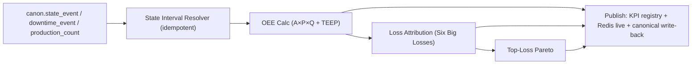

# M4 · 05 · Aggregation, Events & Pipeline
**Deep-plan:** §3, §9 · **Build phase:** M4-1→2

## 1. Two paths, one truth
- **Streaming (live):** Flink job consumes `canon.state_event` / `production_count` topics → maintains the open `state_interval`, a rolling Redis OEE for the current shift, and micro-stop/speed counters for Monitoring. Latency within D2 (minutes).
- **Batch (mart):** Airflow DAG closes intervals, computes `oee_interval` per shift/day, runs `loss_attribution`, builds `top_loss`, refreshes `readiness_snapshot`. The mart is the system of record for reporting; the stream is for the live tile.

Both compute from the **same canonical events and the same definitions** — the live tile and the shift report cannot disagree beyond in-flight events.

## 2. Pipeline stages

## 3. Recompute & replay (NFR)
Any correction upstream (a re-coded reason, a fixed timestamp, a recalibrated ideal cycle) triggers a **bounded recompute** of only the affected `(work_unit, time-bucket)` partitions via idempotent upsert (unique key on `oee_interval`). No manual patching; OEE history is always a deterministic function of canonical events + effective-dated policy. A nightly **reconciliation job** asserts M4 totals vs M2 downtime-minutes and M3 counts (spec 06).

## 4. Domain events M4 publishes
| Event | When | Consumers |
|---|---|---|
| `oee.interval.computed` | shift/day rollup done | UIL, Reporting |
| `oee.state.changed` | live state transition resolved | Monitoring (live tile) |
| `oee.microstop.detected` | sub-threshold stop (auto path) | Monitoring, M2 (bad-actor) |
| `oee.speedloss.flagged` | sustained sub-rate running | Monitoring, M3 (re-plan), Financial |
| `oee.toploss.updated` | Pareto recomputed | UIL, Reporting |
| `oee.other_bucket.exceeded` | "All Other" entered top loss | CI engineer / config |

## 5. Acceptance (MUST)
- P-01 Live (stream) and mart (batch) OEE for a closed shift agree to the unit.
- P-02 A late/corrected event recomputes only affected buckets and changes the result deterministically.
- P-03 Nightly reconciliation passes: Σ M4 unplanned-downtime-min = Σ M2 breakdown-min for the shared events; Σ M4 total_count = Σ M3 ProductionCount.
- P-04 Every published event is idempotent (replay-safe) and tenant-scoped.
