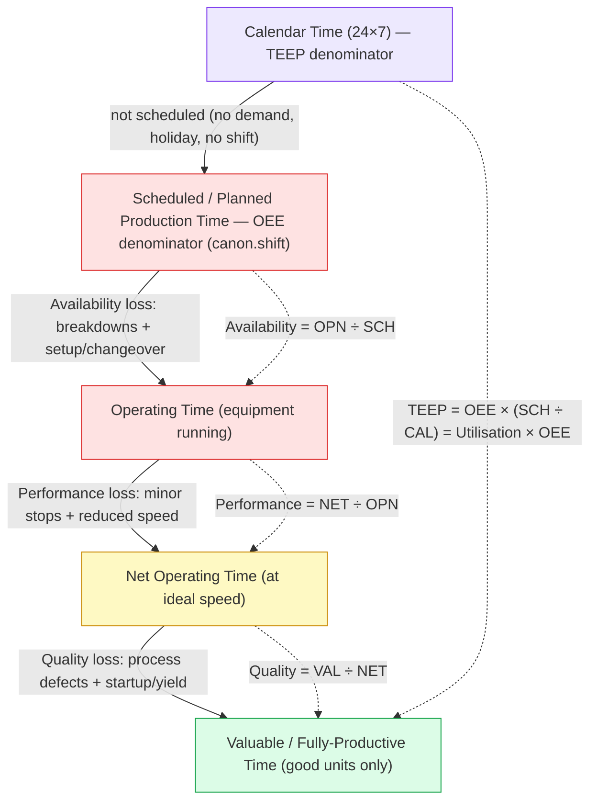
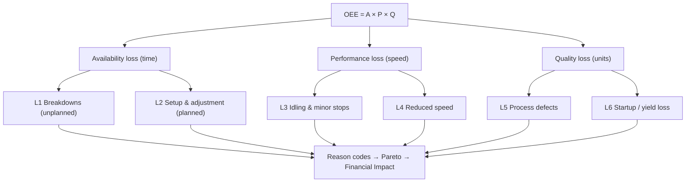
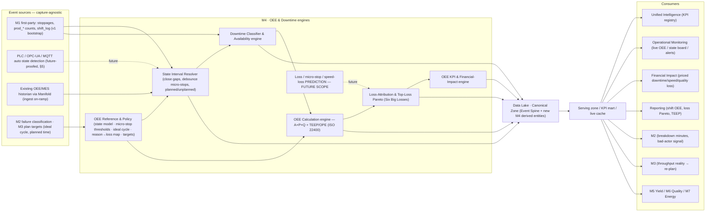
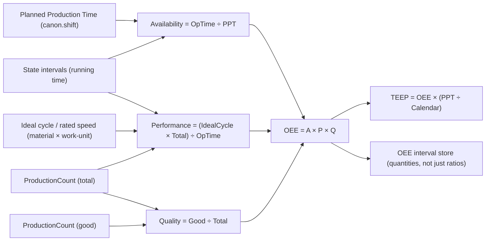
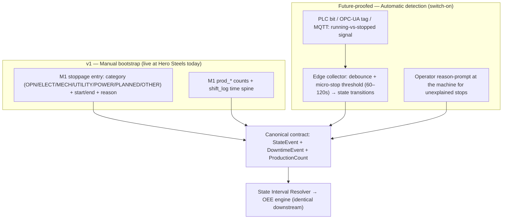
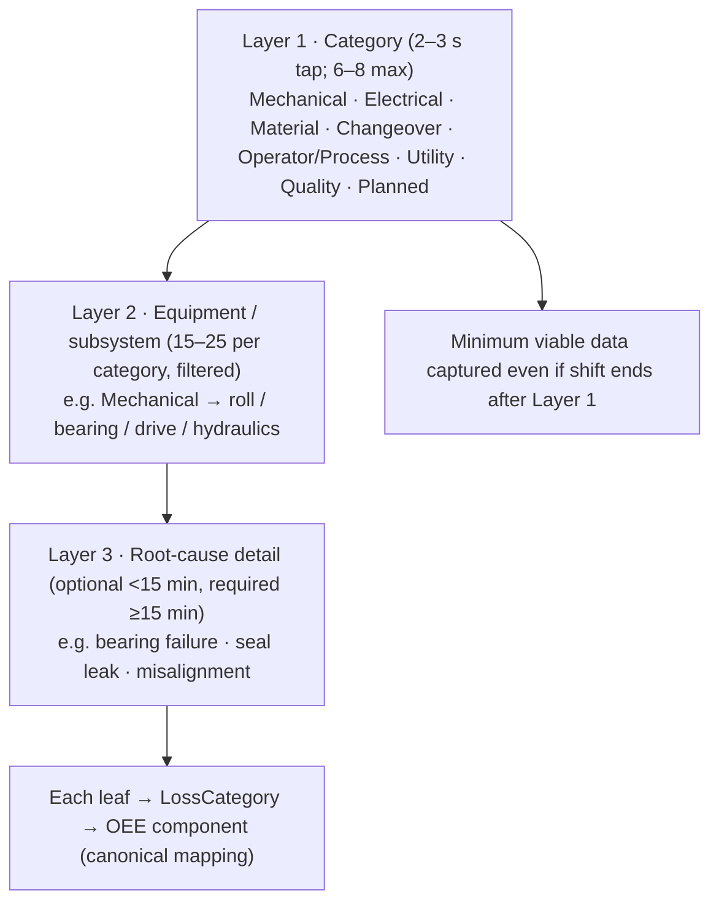
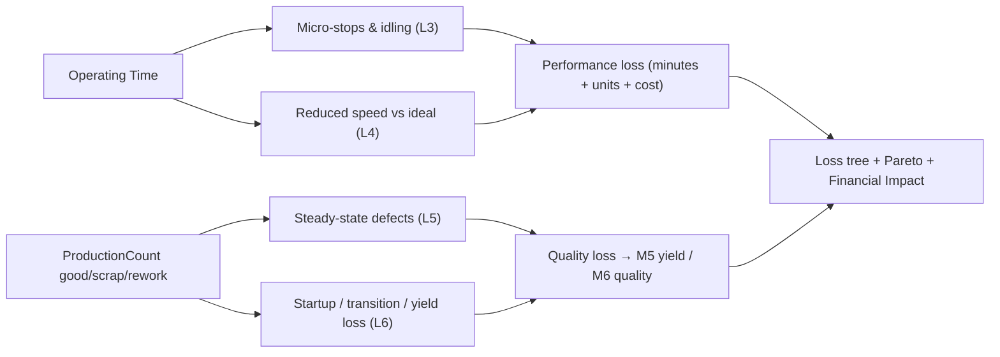
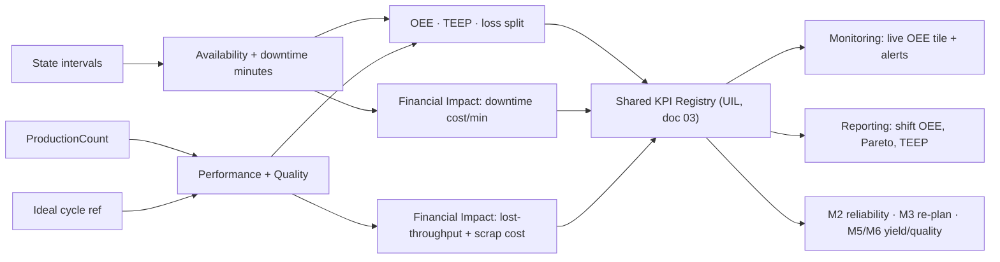
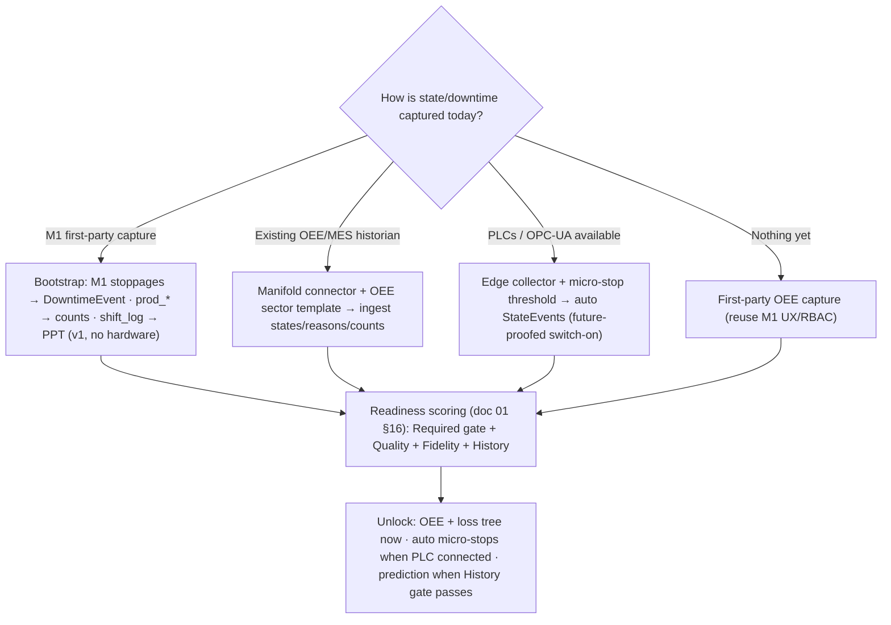

# Zedral — M4 · OEE & Downtime Intelligence

### Deep Plan · v1 · Module Layer (Capture state & loss → compute OEE → attribute → price → act)

> **What M4 is.** M4 is Zedral's **OEE & Downtime Intelligence** module — the platform's *loss-accounting brain*. It turns the raw state, downtime, and production-count events standing on the **Canonical Event Spine** (`01_DataLake_and_Canonical_Model_DeepPlan.md`) into the single, trusted **Overall Equipment Effectiveness** number for every asset, shift and plant — and, more importantly, into the **loss tree** that explains *why* the number is what it is. It computes OEE = **Availability × Performance × Quality** exactly as the platform's **ISO 22400** registry defines it, decomposes every lost minute and every lost unit into the **Six Big Losses**, attaches a **currency value** to each loss via the Financial Impact Layer, and serves a live "what is costing us throughput right now" view. M4 is the module that finally answers, with one authoritative source, the question every plant argues about: *how effective is this equipment, and where is the capacity going?*
>
> **Why it's high-value.** OEE is the most universally recognised manufacturing performance metric, and it is also the most universally *mis-measured* one. Industry reporting is blunt: in the same plant, maintenance reports 75%, production claims 82%, and quality reports 91% — because each team measures from a different source, at a different time, with a different definition of "downtime" and "good product." Small stops under five minutes go unlogged and silently erase whole hours; an asset running at 92% of rated speed reads "available" in every report while bleeding throughput. M4's value is that it sits on the **one** canonical event stream the whole platform shares, so the OEE it produces cannot disagree with itself, and every fraction of a lost point is traceable to a reason, a loss category, an asset, a shift — and a cost. It is also one of the **densest pull-through modules for connected data** (state, downtime, counts, shift, cost), which is the platform's core wedge: the more sources are connected, the truer the OEE.
>
> **What M4 is NOT.** It is **not a data-capture product** competing with M1 — it *consumes* the canonical StateEvent / DowntimeEvent / ProductionCount stream that M1 (and, in future, PLCs) produce, and adds the calculation, attribution, and intelligence on top. It is **not a maintenance system** — it shares the *one* DowntimeEvent with **M2**, but M2 owns the reliability view (failure mode, MTBF, MTTR) while M4 owns the time-utilisation view (OEE Availability). It is **not a planning system** — it shares the *one* ProductionCount with **M3**, but M3 owns *plan attainment* ("did we run the plan?") while M4 owns *OEE Performance/Quality* ("how effectively did the equipment run?"). And it is **not the quality system of record** — M6 owns defect disposition; M4 only consumes good/scrap counts to compute the Quality factor. M4 is a **calculation-and-intelligence layer over a shared truth**, never a parallel truth.
>
> **Standards anchors.** OEE definition, the equipment **time model**, and the KPI formulas from **ISO 22400-2** (Availability = Operating Time ÷ Planned Production Time; Performance = Ideal Cycle Time × Total Count ÷ Operating Time; Quality = Good Count ÷ Total Count); the **Six Big Losses** loss framework from **Nakajima / TPM**; the **equipment state & time model** alignment with **ANSI/ISA-95 / IEC 62264**; **TEEP** (Total Effective Equipment Performance, calendar-time denominator) and **OPE/OAE** variants for utilisation framing; micro-stop / debounce thresholds and automatic state detection from current OEE-monitoring practice. KPIs reconciled to the platform's existing ISO 22400 registry so M4 and every other module speak one definition. Links in §15.

---

## 0. How M4 relates to the rest of the platform

M4 is an **intelligence contributor and a synthesiser** — it reads the canonical event stream through the Serving zone, runs the OEE calculation and loss-attribution engines, and writes its derived facts (OEE intervals, loss attribution, top-loss Pareto) back so every other layer can reuse them. It introduces very little *transactional* data of its own; its job is to make the shared events *mean something*.

| Platform piece (doc) | What M4 consumes from it | What M4 gives back |
|---|---|---|
| **Data Lake · Canonical Model** (01) | `StateEvent` (running/idle/down/setup/off + `is_planned`), `DowntimeEvent` (+ `reason_ref`/`loss_category_ref`), `ProductionCount` (good/scrap/rework/total), `Shift/Calendar` (Planned Production Time), `ReasonCode`/`LossCategory`/`StateModel` reference data, Asset hierarchy | New derived entities (IdealCycleTime/RatedSpeed reference, OEEInterval, LossAttribution, TopLoss); **brings to life** the StateModel/ReasonCode/LossCategory scaffolding the canonical model catalogued for M4 |
| **Manifold** (02) | Connector to an existing OEE/MES historian; field-mapping of states/reasons/counts; the reason→loss→component mapping; sector templates; readiness/unlock | The M4 data contract; a seeded **OEE sector template** (steel cold-rolling state model, reason tree, ideal-cycle table) |
| **M1 · Shopfloor Digitization** (M1 blueprint) | First-party **stoppage** entries (`OPN/ELECT/MECH/UTILITY/POWER/PLANNED/OTHER`), `prod_*` counts, `shift_log` as the time spine — the **v1 bootstrap source** | OEE per process/shift/coil back into M1's reporting; the loss Pareto that prioritises the floor's attention |
| **M2 · Maintenance Intelligence** | Failure classification on the shared `DowntimeEvent`; planned-maintenance windows (planned-stop time) | Time-based **Availability** + breakdown-loss minutes (M2 reads these as bad-actor / reliability signal); the shared no-double-count rule |
| **M3 · Shopfloor Planning & Management** | The **plan**: planned qty, scheduled time, **ideal-cycle / rated-speed target**, the Planned-Production-Time boundary | OEE Performance & Quality against the plan's targets; the throughput reality that re-plans against (boundary in §12) |
| **M5 · Yield Intelligence** | — | The **Quality-loss** split (scrap/rework units, startup/yield loss) that M5 deepens into yield economics |
| **M6 · Quality Intelligence** | `DefectCode` / `DefectRecord` to refine the Quality factor and quality-loss reasons | Quality-loss minutes/units as the OEE Quality component; defect-driven loss attribution |
| **M7 · Energy Intelligence** | — | Machine state (running/idle/down) as the denominator for energy-per-unit and idle-energy waste |
| **Unified Intelligence Layer** (03) | KPI registry, cross-module synthesis | OEE / A / P / Q / TEEP, Six-Big-Losses breakdown, top-loss Pareto into the shared KPI registry |
| **Operational Monitoring** (03) | Live state/cache off the streaming path | Live **OEE tile**, current-state board, micro-stop & speed-loss alerts, "losing throughput now" signal |
| **Financial Impact Layer** (07 spec) | `CostRate` (downtime/min, lost-throughput/unit, scrap/unit) "rate-as-of" (D7) | Priced downtime, priced speed loss, priced quality loss — the **cost of every loss** |
| **Reporting Layer** (05) | Same canonical KPI numbers | Shift OEE report, loss Pareto, OEE-trend & TEEP reports, asset league table |

**The golden rule (inherited):** consumers never write M4's tables and M4 never writes another module's — everything moves through the canonical model and versioned Serving APIs. A downtime is recorded **once** as a canonical `DowntimeEvent`; **M2 classifies it** (failure mode, MTTR), **M4 aggregates it** (Availability). A produced quantity is recorded **once** as a canonical `ProductionCount`; **M3 contextualises it** (attainment), **M4 aggregates it** (Performance/Quality). One state stream, one downtime truth, one count truth — never double-counted (§12).

---

## 1. Responsibilities & principles

M4 owns eight responsibilities: **(1)** maintain the **OEE reference & policy data** (the state model, micro-stop/debounce thresholds, ideal-cycle-time / rated-speed per material×work-unit, the reason→loss→OEE-component mapping, OEE targets); **(2)** **resolve and close** raw state transitions into clean, gap-free **state intervals** (the time model); **(3)** **classify and aggregate downtime** into Availability loss with reason/loss attribution; **(4)** **compute OEE = A×P×Q** and its variants (TEEP/OPE) per asset × time bucket exactly to ISO 22400; **(5)** **build the loss tree** — decompose every lost minute and unit into the Six Big Losses and a top-loss Pareto; **(6)** **price every loss** through Financial Impact; **(7)** surface a **live OEE / current-state / loss board & alerts**; **(8)** stand **prediction-ready** (loss / micro-stop / speed-loss forecasting) without a data re-model.

Principles:

1. **One number, one source.** OEE's chronic disease is divergent measurement. M4 computes OEE from the *single* canonical Event Spine the whole platform shares, with *one* set of ISO 22400 definitions, so maintenance, production, and quality can never again quote three different numbers. M4 is the cure for "everyone measures OEE differently."
2. **The loss tree is the product, not the score.** A single OEE percentage changes no behaviour. The value is the **decomposition** — which of the Six Big Losses, on which asset, on which shift, costing how much. M4 is built top-down as a loss tree; the headline number is just its root.
3. **Capture-agnostic, aggregation-faithful.** M4 does not care *how* a state or count arrived — operator tap (M1), PLC bit, OPC-UA tag, or an ingested historian. It treats every source through the same canonical contract and computes identically. v1 **bootstraps from M1's manual stoppage/count data** (cheapest, already live at Hero Steels) and is **architected for automatic PLC/OPC-UA state detection** as the high-fidelity path (§5) — future-proof now, switch-on later, exactly as M2 future-proofs predictive.
4. **Definitions are configuration, not code.** Planned vs unplanned, what counts as a micro-stop, which state affects which OEE component, the ideal cycle time — all are **per-tenant configuration** governed by M4, never hard-coded. This is what lets one engine serve a steel mill and a discrete plant without a fork.
5. **Every loss has a cost.** No lost minute, slow cycle, or scrap unit is recorded without the hooks to price it. "OEE rose 4 points" becomes "₹X/year of recovered throughput" on the executive report. Financial impact is a column, not an afterthought.
6. **Sector-neutral core, sector-specific skin.** The state/loss/OEE model is generic; a **sector template** instantiates it concretely (Hero Steels cold-rolling state model, reason tree, ideal-cycle table in §10) and reuses across clients via Manifold.
7. **Honest fidelity.** OEE precision depends entirely on capture fidelity. M4's readiness model (§11) reports *how trustworthy* each asset's OEE is (manual vs automatic, micro-stops captured y/n, ideal cycle calibrated y/n) so the UI never shows a confident number built on thin data. We surface the confidence, not just the percentage.
8. **Prediction by design, not by rebuild.** v1 is descriptive/diagnostic (what happened, why, what it cost). The state-interval + loss-attribution + cost substrate *is* the training data for later loss/micro-stop/speed-loss prediction; we future-proof now and gate the ML build on accumulated history (§8), exactly as M2 does for predictive and M3 for optimisation.

---

## 2. The OEE & loss conceptual frame (the scope map)

Everything M4 does sits on two interlocking standards: the **equipment time model** (ISO 22400 / ISA-95 — how the clock is divided) and the **Six Big Losses** (TPM / Nakajima — why time and units are lost). Together they *are* M4's scope map.

**The time model (the spine of Availability).** Calendar time is carved down, layer by layer, to the time that actually made good product. Each cut is a loss bucket.

**The Six Big Losses (the why).** Each loss maps to exactly one OEE component, so a breakdown and a changeover and a slow cycle are never conflated.

| OEE component | Big Loss | What it is | Canonical carrier |
|---|---|---|---|
| **Availability** | 1 · Breakdown / equipment failure | unplanned stop ≥ threshold (failure, fault, trip) | `DowntimeEvent`, `is_planned=false` |
| **Availability** | 2 · Setup & adjustment | planned stop to change over / adjust (roll change, grade change) | `DowntimeEvent`, `is_planned=true` (setup) |
| **Performance** | 3 · Idling & minor stops | short stops below the downtime threshold (jams, sensor trips, starvation) | `StateEvent` micro-stops / speed gap |
| **Performance** | 4 · Reduced speed | running slower than ideal cycle time | `ProductionCount` vs ideal-cycle reference |
| **Quality** | 5 · Process defects | rejects/rework in steady state | `ProductionCount.scrap/rework`, `DefectRecord` |
| **Quality** | 6 · Reduced yield / startup | rejects during warm-up, transition, run-up | `ProductionCount` startup window, M5 |

**What's in v1 vs future.** v1 computes the full A×P×Q + Six-Big-Losses tree + TEEP, priced, descriptive/diagnostic. The **yellow** capability — *predicting* losses, micro-stops, and speed degradation, and prescriptive "do this to recover OEE" — is architected now and built later (§8), gated on accumulated loss history.

---

## 3. M4 reference architecture

**Reading it:** events arrive from M1 (v1), from PLC/OPC-UA auto-capture (future-proofed), or from an ingested historian; the **State Interval Resolver** turns raw transitions into clean, debounced intervals; the **Downtime Classifier** turns stops into Availability loss with reasons; the **OEE engine** computes A×P×Q + TEEP to ISO 22400; the **Loss-Attribution engine** builds the Six-Big-Losses tree and Pareto; the **KPI/Financial engine** prices it; everything is written to the canonical zone and served to the intelligence/monitoring/financial/reporting layers and back to the sibling modules. Engine **E7 (prediction)** is wired in but dark until the loss history and the model build land.

---

## 4. The OEE calculation engine

M4's calculation core is deliberately small, exact, and **ISO 22400-literal**, so the number is defensible to any auditor or any sceptical plant team.

**The three factors (ISO 22400-2, the platform's ratified definitions in doc 01 §9):**

| Factor | Formula | Plain meaning |
|---|---|---|
| **Availability** | Operating Time ÷ Planned Production Time | of the time we *planned* to run, how much were we actually running? (loses breakdowns + setup) |
| **Performance** | (Ideal Cycle Time × Total Count) ÷ Operating Time | while running, did we run at rated speed? (loses minor stops + reduced speed) |
| **Quality** | Good Count ÷ Total Count | of what we made, how much was sellable first time? (loses defects + rework) |
| **OEE** | Availability × Performance × Quality | one number: % of planned time spent making good product at full speed |

**Equipment time model (the denominators must be unambiguous).** M4 adopts the ISO 22400 / ISA-95 time hierarchy verbatim:

| Time bucket | Definition | M4 source |
|---|---|---|
| Calendar Time | 24×7 wall clock | derived |
| **Planned Production Time (PPT)** | scheduled time minus *planned* non-production (no shift, planned breaks) | **`canon.shift`** — defined once, platform-wide |
| Operating Time (Actual Production Time) | PPT minus all downtime (planned stops + breakdowns) | state intervals where state = running |
| Net Operating Time | Operating Time at ideal speed = Ideal Cycle Time × Total Count | counts × ideal-cycle reference |
| Valuable Operating Time | Net minus quality loss = Ideal Cycle Time × Good Count | good counts × ideal-cycle reference |

**Variants M4 also computes (utilisation framing).**

| Metric | Formula | Why M4 carries it |
|---|---|---|
| **TEEP** | OEE × Utilisation, where Utilisation = PPT ÷ Calendar Time | exposes *unscheduled* capacity (the 24×7 picture management cares about) |
| **OPE / OAE** | plant/line variants where "ideal" is a demonstrated best rate, not theoretical | pragmatic targets when a true theoretical cycle is unknown |
| **Loading / Utilisation** | PPT ÷ Calendar Time | the gap between "could run" and "scheduled to run" |

**Roll-up rule (no Simpson's-paradox averaging).** OEE never averages percentages. M4 rolls up by **summing the underlying time and count quantities** to the target grain (work-unit → work-centre → line → plant; shift → day → week → month) and *then* dividing — so a plant OEE is computed from total PPT, total operating time, total/good counts, never from a mean of sub-OEEs. This is the single most common OEE error and M4 forbids it structurally (the mart stores quantities, not just ratios).

**The ideal-cycle-time problem (the make-or-break input).** Performance is only as honest as the **ideal cycle time / rated speed** it divides by. M4 makes this a first-class, versioned reference keyed by **material × work-unit** (a thin coil and a thick coil have different rated mill speeds), with three population paths: (a) engineering nameplate, (b) a **demonstrated best** (95th-percentile sustained observed rate — the OPE pragmatic default), (c) imported from M3's plan target. The readiness model flags any asset whose Performance rests on an *uncalibrated* cycle time, so OEE is never silently inflated or deflated by a bad denominator.

---

## 5. State & downtime capture (the on-ramp decision)

OEE is only as good as the state and downtime data underneath it. This section is where M4's defining scope decision lives: **v1 bootstraps from M1's manual capture; PLC/OPC-UA automatic detection is fully architected as the high-fidelity future path.** Same canonical contract, two fidelities.

**The machine state model.** M4 governs a controlled vocabulary of states (the canonical `StateModel`, doc 01 §10.1), each carrying two flags that make one StateEvent stream drive OEE consistently: `is_planned` (was this stop scheduled?) and `counts_as` (which OEE component this state affects).

| State | Running? | `is_planned` | `counts_as` | Big Loss |
|---|---|---|---|---|
| RUNNING | yes | — | — (productive) | — |
| IDLE / MINOR_STOP | no (short) | false | Performance | L3 idling & minor stops |
| DOWN / BREAKDOWN | no | false | Availability | L1 breakdown |
| SETUP / CHANGEOVER | no | true | Availability | L2 setup & adjustment |
| PLANNED_STOP (break, no-demand, PM) | no | true | excluded from PPT *or* Availability per policy | — / planned |
| OFF / NOT_SCHEDULED | no | true | excluded from PPT | — (TEEP only) |

The **planned/unplanned boundary is policy, not code**: whether a planned break is *removed from the denominator* (PPT) or *counted as planned downtime inside Availability* is an ISO 22400 modelling choice M4 exposes as per-tenant configuration, so two clients can both be "correct" by their own convention and still be computed by one engine.

**Two capture fidelities, one contract.**

**v1 — bootstrap from M1 (cheapest first value).** M1 already captures, at Hero Steels, structured stoppages (start, end, category, reason), per-process production counts, and a `shift_log` time spine — exactly the three things OEE needs. M4 maps M1's stoppage categories onto the canonical reason→loss→component model, treats `shift_log` as Planned Production Time, and computes OEE per process/shift/coil immediately, with **no new hardware**. This is the on-ramp that makes M4 deliver value on day one for any M1 client.

**Future-proofed — automatic PLC/OPC-UA detection (the fidelity upgrade).** Manual capture has a known, quantified blind spot: **minor stops under five minutes go unlogged** and are the single largest source of OEE under-reporting; automatic detection typically *finds 30–50% more downtime than operators thought existed*. M4 is architected so an edge collector can tap a PLC cycle/run bit, an OPC-UA tag, an MQTT feed, or a clamp-on current sensor, apply a **configurable debounce / micro-stop threshold** (60–120 s is the industry standard) to separate real micro-stops from normal process steps, and emit the *same* canonical StateEvents — at which point operators are prompted to reason-code only the *unexplained* stops. None of M4's downstream engines change; only the fidelity (and the readiness score) rises. The threshold, signal mapping, and collector interfaces are specified now (Dev_Handover spec 03/07) and built when a client connects PLCs — exactly the M2 "future-proof, switch-on" pattern.

**Why one threshold matters.** The micro-stop threshold is the seam between Availability (stops *above* it → L1/L2) and Performance (stops *below* it → L3). M4 makes it explicit, per-work-unit configuration and logs both sides separately, so the A/P split is reproducible rather than an artefact of who logged what.

---

## 6. Loss taxonomy & reason codes

The loss tree is M4's product (Principle 2). Its leaves are **reason codes**, and getting the reason taxonomy right is the difference between an actionable Pareto and a "miscellaneous" black hole. M4 adopts the on-the-ground best practices the research is unanimous on.

**Three-layer reason hierarchy (operator-first).**

Design rules M4 enforces, drawn directly from practice:

- **6–8 top categories, never more.** Operators select a primary category in 2–3 seconds; that alone is minimum-viable data even if the shift ends before detail is entered.
- **No more than 15–20 options at any one level**, filtered by the parent selection so an operator only sees relevant subsystems.
- **Capture the symptom, not the diagnosis.** Reasons describe *what the operator observed* ("strip break", "roll change"), not a root cause they'd have to infer — this raises the probability the right code is picked. (Root-cause diagnosis is M2's job on the same DowntimeEvent.)
- **Govern the "All Other" bucket.** Exactly one "Other / unclassified" reason exists; when it rises into the **top-loss Pareto or above ~10%**, that is the signal to split it into specific, actionable codes with the crew. M4 surfaces this automatically as a "your Other bucket is now a top loss — refine it" prompt.
- **6–12 active reasons per asset is the sweet spot.** A short, well-chosen list beats an exhaustive one; too many codes burden the operator and scatter the Pareto.

**The canonical mapping (the bit that makes losses add up).** Every reason code carries, in the canonical reference data, a `loss_category_ref` (one of the Six Big Losses) and an `oee_component` (A/P/Q). This is what lets a breakdown and a changeover be told apart inside Availability, and what lets the loss tree close: Σ(loss minutes by reason) = Availability loss; Σ(speed + minor-stop) = Performance loss; Σ(scrap/rework) = Quality loss. The mapping is seeded by the sector template and tunable per tenant.

**Pareto & top-loss.** M4 continuously ranks losses (by minutes *and* by cost — they rank differently) into a top-loss Pareto per asset/line/plant/shift, because "the biggest time loss" and "the most expensive loss" are often not the same event, and the executive wants the second one.

---

## 7. Performance & quality-loss intelligence

The two losses plants under-measure most are **speed loss** and **micro-stops** (both Performance) — they hide because the asset still reads "available." M4 makes them first-class.

**Micro-stops & idling (L3).** Stops below the downtime threshold are aggregated as a Performance loss, with frequency and duration distribution per asset. Industry experience is that surfacing these *for the first time* (only automatic capture sees them well) commonly reveals **30–50% more lost time** than manual logs admit — which is precisely why M4 future-proofs the automatic path and, in the manual v1, reports micro-stop capture as a readiness gap rather than pretending it's zero.

**Reduced speed (L4).** Computed continuously as the gap between actual rate and the ideal-cycle reference. M4 flags **sustained sub-rate running** ("a caster at 92% of rated speed for two weeks") that no downtime report would ever show, and prices the lost throughput. This is the loss that most often dwarfs visible downtime in continuous processes.

**Quality loss (L5/L6) and the M6 boundary.** M4 computes the Quality factor from canonical good/total counts and splits Quality loss into **steady-state defects (L5)** and **startup/yield loss (L6)** using the production window (run-up vs steady). It does **not** own defect disposition — **M6** owns the defect taxonomy and quality holds; **M5** owns yield economics. M4 consumes `DefectRecord`/`ProductionCount` to attribute quality-loss minutes/units and hands the deeper analysis to M5/M6 (§12). In steel terms (§10) this is where transition coils, head/tail crop, and cobbles land as canonical, priced yield loss instead of vanishing into "scrap %."

---

## 8. Predictive / ML — FUTURE SCOPE (architected now)

Predicting losses before they happen is the operating-model's post-6-month → prescriptive horizon, **gated on accumulated loss history**. v1 is descriptive/diagnostic; we design so prediction is a switch-on.

| Capability | v1 | Future scope |
|---|---|---|
| Downtime | classify, attribute, Pareto, price (descriptive) | **breakdown-risk / micro-stop prediction** from state-pattern history (feeds M2 PdM) |
| Speed loss | detect sustained sub-rate, price | **degradation forecasting** — predict the slow creep before it costs a shift |
| Quality | split defect vs startup loss | **predicted quality-loss windows** (grade-transition, run-up) |
| Decision support | top-loss Pareto + alerts (diagnostic) | **prescriptive**: "this asset will likely lose Availability — act now" (2–3 yr) |

**What v1 must get right so this is a switch-on, not a rebuild:** (a) **clean state intervals + labelled reason codes** from day one (the training labels); (b) **calibrated ideal-cycle references** (so speed-loss series are real, not noise); (c) **loss attribution joined to cost** (the objective); (d) a **prediction-readiness (History) gate** in the readiness model (§11) reporting per-asset when there is enough labelled loss history to train. No prediction *promises* in v1 — only prediction *readiness*. M4's loss-prediction shares the OSA-CBM substrate M2 builds for predictive maintenance: the two converge on the same DowntimeEvent stream, so the breakdown-risk model is a shared asset, not a duplicate.

---

## 9. OEE KPIs, analytics & financial impact

M4's contribution to the **shared KPI registry** (doc 03), all reconciled to the platform's **ISO 22400** definitions so no module disagrees.

| KPI | Formula | Meaning / target |
|---|---|---|
| **OEE** | A × P × Q | headline effectiveness; ~85% is "world-class" discrete, far lower typical |
| **Availability** | Operating Time ÷ Planned Production Time | time utilisation (loses breakdown + setup) |
| **Performance** | (Ideal Cycle × Total Count) ÷ Operating Time | speed efficiency (loses minor stops + slow running) |
| **Quality** | Good Count ÷ Total Count | first-pass yield (loses defects + rework) |
| **TEEP** | OEE × (PPT ÷ Calendar Time) | effectiveness against the 24×7 maximum (exposes idle capacity) |
| **Utilisation / Loading** | PPT ÷ Calendar Time | scheduled vs total available |
| **Six-Big-Losses split** | minutes/units per loss ÷ total loss | where the OEE gap actually is |
| **Top-loss Pareto** | ranked loss by minutes *and* by cost | the actionable shortlist |
| **Downtime (planned/unplanned)** | Σ stop minutes by `is_planned` | the Availability story |

**The MTBF/MTTR boundary (reliability is M2, not M4).** The research repeatedly couples downtime to MTBF/MTTR — but in Zedral those are **M2's reliability/maintainability** KPIs (mean time between failures, mean time to repair), computed from the *same* canonical DowntimeEvent stream M4 reads for Availability. M4 does **not** republish them; it exposes time-based OEE Availability, M2 exposes reliability, and both cite one downtime truth. Two views, one event — the same discipline as the M4↔M2 boundary (§12).

**Financial impact (per Principle 5).** Every loss is priced where a `CostRate` exists (D7, rate-as-of-event): downtime cost per minute (lost-margin or recovery basis), lost-throughput per unit for speed loss, scrap/rework cost per unit for quality loss. This turns "OEE rose 4 points" into "₹X/year recovered" and lets the top-loss Pareto rank by money, not just minutes — usually the version that changes the budget conversation.

---

## 10. Sector-neutral model + Hero Steels instantiation

The model is **generic** and an instantiation makes it **concrete** — the same primitives (state model, reason tree, ideal-cycle reference, loss tree) describe any plant; a sector template fills them in.

**Generic OEE archetypes** (any sector): discrete cyclic (count parts, clear ideal cycle) vs continuous/process (rate-based, speed loss dominates) vs batch (charge-based, setup loss dominates); the appropriate "ideal" (theoretical nameplate vs demonstrated-best/OPE); whether planned breaks leave the denominator or sit inside Availability.

**Hero Steels cold-rolling instantiation** (anchors the model to the real M1 plant; reuses the M1 COIL_NO spine, stoppage taxonomy, and counts it already captures):

| OEE concept | Generic | Hero Steels cold-rolling |
|---|---|---|
| Asset (OEE unit) | work-unit / machine | each line: HR Slitting, Pickling, Cold Mill (2-Hi/4-Hi/6-Hi), Annealing furnaces, Skin Pass, Rewinding, CRS, CTL |
| Planned Production Time | scheduled run time | `shift_log` time per process (3-shift, 24×7) |
| **State model** | running/idle/down/setup/off | mill running; **roll change = SETUP**; strip break = DOWN; coil-load gap = IDLE; furnace soak = process-running (batch) |
| **Reason tree (L1)** | 6–8 categories | maps M1's `MECH / ELECT / UTILITY / POWER / OPN / PLANNED / OTHER` → canonical categories + steel detail (roll change, strip break, weld failure, coil shortage) |
| **Setup loss (L2)** | changeover | **roll change** (width-up forces it — ties to M3's wide→narrow campaign sequencing) |
| **Ideal cycle / rated speed** | per material×work-unit | mill m/min by gauge & width; furnace charge cycle hours; CTL pieces/min |
| **Reduced speed (L4)** | sub-rate running | mill held below rated m/min (roll wear, strip quality) — the hidden steel loss |
| **Quality loss (L5/L6)** | defects + startup | transition coils on grade change, head/tail crop, **cobbles**, test slabs, run-up scrap (→ M5 yield) |
| Confirmation / counts | good/scrap/total | M1 `prod_*` per process, scrap %, MT basis |

**Reusing M1.** M1's stoppage entries become canonical DowntimeEvents (M4 attributes them); M1's `prod_*` are the counts; M1's `shift_log` is the Planned-Production-Time spine. The **steel cold-rolling OEE sector template** (seeded in Manifold, doc 02) carries the state model, the reason→loss mapping, and the ideal-cycle table — so the next steel client's OEE lights up with no re-modelling. **D11 note:** because the core is sector-neutral, validating M4 on a **non-steel / discrete** client (clear part counts and theoretical cycle times — the textbook OEE case) is a clean way to exercise the model beyond steel and retire the "only-tested-on-Hero-Steels" risk (R1/W1, doc 04). M4 is in fact the *easiest* module to validate cross-sector, because OEE is the most universal metric.

---

## 11. Data contract & readiness (the M4 row)

M4's machine-readable data contract (the basis for Manifold's module-unlocking, doc 01 §15). ● Required · ○ Additional.

| Canonical entity / group | M4 need | Notes |
|---|:--:|---|
| **StateEvent** (running/idle/down/setup/off + `is_planned`) | ● | the Availability + micro-stop spine |
| **DowntimeEvent + ReasonCode** | ● | Availability loss attribution (shared with M2) |
| **ProductionCount** (good/scrap/rework/total) | ● | Performance + Quality (shared with M3/M5/M6) |
| **Shift / Calendar** (Planned Production Time) | ● | the Availability denominator (defined once) |
| **StateModel / ReasonCode / LossCategory** reference | ● | the controlled vocabularies M4 brings to life |
| **Ideal cycle time / rated speed** (material × work-unit) | ● | *new M4 entity* — the Performance denominator |
| Asset hierarchy (Site→WorkCenter→WorkUnit) | ● | the OEE roll-up tree |
| DefectCode / DefectRecord | ○ | refines Quality loss (M6) |
| Maintenance windows (M2) | ○ | planned-stop time classification |
| CostRate | ○ | unlocks financial impact — recommended |

**New canonical/derived entities M4 introduces** (additive, per doc 01 §14 versioning rule): `IdealCycleTime` / `RatedSpeed` reference, `OeeConfig` (per-tenant policy: micro-stop threshold, planned-time convention, performance basis), `OeeInterval` (computed A/P/Q + quantities per asset × time bucket), `LossAttribution` (minutes/units/cost per loss leaf), `TopLoss` (Pareto snapshot). The canonical `StateModel`, `ReasonCode`, `LossCategory`, and the `StateEvent`/`DowntimeEvent`/`ProductionCount` Event-Spine rows **already exist** in the canonical catalog (doc 01 §10) — they were scaffolded *for M4*; M4 is the module that finally **brings them to life** and adds only the *derived* OEE layer on top. M4 owns almost no new transactional data — it is, by design, a thin-write / heavy-read module.

**On-ramps to readiness** (capture-fidelity-aware, §5):

The readiness model is the platform's existing one (doc 01 §16) with **two M4-specific sub-gates**: a **Fidelity gate** (is capture manual or automatic? are micro-stops observed? is the ideal cycle calibrated?) that drives the *confidence* shown beside every OEE number (Principle 7), and a **prediction-readiness (History) gate** that reports when an asset has enough labelled loss history to train the §8 models. So the UI honestly shows "OEE here is indicative (manual capture, micro-stops not measured)" rather than a falsely precise figure.

---

## 12. Integration & boundaries

| Boundary | M4 owns | The other side owns | Shared artifact |
|---|---|---|---|
| **M4 ↔ M2 (Maintenance)** | time-based **Availability**, breakdown-loss minutes, the OEE view of a stop | failure mode, MTTR, MTBF, inherent availability, the *reliability* view | the single `DowntimeEvent` (M2 classifies, M4 aggregates) |
| **M4 ↔ M3 (Planning)** | **OEE Performance & Quality**, the loss tree | schedule/qty **attainment**, OTIF, sequence compliance; the **plan targets** (ideal cycle, planned time) | the single `ProductionCount` + `StateEvent` + Planned-Production-Time |
| **M4 ↔ M1** | OEE calculation & loss intelligence | first-party capture of states/stoppages/counts at source; capture UX & RBAC | `StateEvent`, `DowntimeEvent`, `ProductionCount`, `shift_log` |
| **M4 ↔ M5 (Yield)** | the **Quality-loss** split (scrap/rework/startup units) | yield economics, material-loss deep analysis | `ProductionCount` scrap/rework, L6 startup loss |
| **M4 ↔ M6 (Quality)** | the OEE **Quality factor** + quality-loss minutes | defect taxonomy, disposition, quality holds | `DefectCode` / `DefectRecord` |
| **M4 ↔ M7 (Energy)** | machine **state** (running/idle/down) | energy-per-unit, idle-energy waste | `StateEvent` |
| **M4 ↔ Manifold** | the M4 data contract + OEE sector template | historian/PLC connectors, field-mapping, readiness | sector template library |
| **M4 ↔ UIL** | OEE/A/P/Q/TEEP + loss split | cross-module synthesis (OEE↔maintenance↔plan↔quality↔cost), exec rollups | shared KPI registry |
| **M4 ↔ Monitoring** | live OEE tile, current-state board, micro-stop/speed alerts | live cache, alert delivery | streaming path |
| **M4 ↔ Financial Impact** | what to price (downtime, speed loss, quality loss) | the cost-rate engine & "rate-as-of" provenance (D7) | `CostRate` |

The **two lines to get right** are with M2 and M3, and both follow one discipline: **the event is recorded once; M4 aggregates the OEE view, the sibling owns its own view.** A breakdown is one `DowntimeEvent` — M2 reads it as a failure (MTTR, bad-actor), M4 reads it as Availability loss; neither double-counts. A produced coil is one `ProductionCount` — M3 reads it as attainment, M4 reads it as Performance/Quality; neither double-counts. The `StateEvent` stream serves M3 (dispatch feasibility) and M4 (Availability) from one source, and **Planned Production Time is defined exactly once** by `canon.shift` so Availability denominators can never drift between modules. This single-truth discipline is the whole reason the platform can finally end the "maintenance says 75, production says 82" OEE argument.

---

## 13. RBAC & operations (brief)

Roles extend M1's model (Operator / Supervisor / Plant-Head / Admin) with OEE-specific personas: **Operator** (sees the live OEE tile for their line, reason-codes stops), **Shift Supervisor** (shift OEE, loss Pareto, validates reason coding), **OEE / CI Engineer** (configures state model, micro-stop thresholds, ideal-cycle references, reason tree; runs loss analysis), **Maintenance/Reliability** (reads breakdown losses — shared with M2), **Plant Manager** (OEE/TEEP trends, cost of loss; read-only analytics), **Admin** (masters, integration, capture-fidelity config, OEE policy). Because OEE configuration (ideal cycle, planned-time convention, thresholds) directly moves the number, **every policy change is audit-logged** with effective dating, so an OEE trend is never silently broken by a re-definition. First-party/edge capture is **offline-tolerant** like M1 (queue locally, sync on reconnect). The OEE engine runs on the streaming path for the live tile and as scheduled rollups for the mart; recomputation is **deterministic and replayable** from the canonical events (a corrected reason code re-derives the affected intervals without manual patching). Row-level scoping by site/area as in M1.

---

## 14. MVP migration bridge, build sequence & open decisions

**MVP migration bridge (target design + migration).** The operating model notes an **OEE/Downtime MVP is already built**. This plan describes the **target** M4 against the canonical model; the MVP is the head-start, not the constraint. The bridge:

| MVP today (typical of an OEE MVP) | Target M4 | Migration path |
|---|---|---|
| OEE computed from its own tables / a direct machine or M1 feed | OEE computed from the **canonical Event Spine** (one shared truth) | repoint the calc engine at `canon.*` StateEvent/DowntimeEvent/ProductionCount via the Serving API; keep the MVP UI |
| Reason list flat / ad-hoc | 3-layer reason tree mapped to LossCategory + OEE component | migrate existing reasons as Layer-1/2 leaves; backfill `loss_category_ref`/`oee_component`; keep historical codes as aliases |
| Ideal cycle hard-coded or single value | versioned `IdealCycleTime` per material × work-unit | seed the reference from the MVP's constant; flag uncalibrated assets in the Fidelity gate |
| A/P/Q in app code | A/P/Q in the shared **ISO 22400 KPI registry** | move definitions into the registry so M3/M2/UIL read the same numbers; reconcile MVP output to registry (acceptance test) |
| Standalone OEE screen | OEE as a synthesised layer (UIL/Monitoring/Reporting/Financial) | publish OEE intervals to the canonical zone; the MVP screen becomes one consumer among many |

The migration is **non-destructive and incremental**: the MVP keeps running while the calc engine is repointed to the canonical events and the definitions move into the shared registry; the first acceptance gate is *"MVP OEE and canonical OEE agree to the unit on a back-test window."* No data is thrown away; the MVP's reasons and history are mapped forward.

**Suggested build order (bootstrap-first — closest to M1 & cheapest value, then up the fidelity/intelligence ladder):**

1. **OEE reference & policy + canonical wiring** — state model, micro-stop thresholds, ideal-cycle reference, reason→loss→component mapping, OEE config; bring the canonical StateModel/ReasonCode/LossCategory to life; repoint MVP onto `canon.*`.
2. **State Interval Resolver + Availability** — close/debounce state intervals, classify downtime, compute Availability from M1 bootstrap data (fastest first value).
3. **Full OEE engine (A×P×Q + TEEP) + loss tree** — Performance/Quality, Six-Big-Losses attribution, top-loss Pareto; the M4↔M2 / M4↔M3 reconciliation tests.
4. **OEE KPI → Financial Impact + Monitoring board** — registry publish, priced losses, live OEE tile + micro-stop/speed alerts; reporting pack.
5. **Automatic capture (PLC/OPC-UA) — switch-on** — edge collector, debounce/threshold, auto StateEvents, operator reason-prompt; Fidelity gate rises (no re-model).
6. **Prediction / ML (E7) — FUTURE, gated:** loss / micro-stop / speed-loss forecasting when the History gate passes; prescriptive later (shares M2's OSA-CBM substrate).

**Open decisions (need your call):**

- **Planned-time convention** — do planned breaks/PM *leave* the denominator (PPT) or sit *inside* Availability as planned downtime? (Both are ISO-valid; pick the house default; tenant-overridable.)
- **Micro-stop threshold** — adopt 60 s or 120 s as the platform default seam between Availability and Performance? (Per-work-unit overridable.)
- **Ideal-cycle source of truth** — nameplate, demonstrated-best (OPE/95th-percentile), or M3 plan target as the default when all three exist?
- **TEEP exposure** — surface TEEP/utilisation by default for every client, or only where unscheduled capacity is a live commercial question?
- **First connector** — after M1 bootstrap, which historian/PLC path first (OPC-UA generic vs a named OEE/MES product)? (Ties to D4.)
- **MVP reconciliation tolerance** — what back-test agreement (e.g. ≤0.5 OEE points over a 30-day window) is the acceptance gate for repointing the MVP onto canonical events?
- **Prediction build gate** — what labelled-loss-history threshold per asset flips it to "prediction-ready" (ties to M2's PdM gate — share one)?
- **Second-sector validation (ties to D11)** — use M4 on a **discrete** client (clean counts + theoretical cycle) as the cleanest cross-sector OEE validation of the canonical model?

---

### Sources (standards & product grounding)

- **OEE definition, factors & the equipment time model** — ISO 22400-2 / TPM: OEE = Availability × Performance × Quality; Availability = Operating ÷ Planned Production Time; Performance = Ideal Cycle × Total ÷ Operating; Quality = Good ÷ Total: [OEE factors (A/P/Q)](https://www.oee.com/oee-factors/), [ISO 22400-2:2014](https://www.iso.org/standard/54497.html), [ISO 22400 KPI overview](https://connect981.com/blog-posts/iso-22400-overview-manufacturing-kpis-basics), [how to calculate OEE (ISO 22400-2, Nakajima)](https://teeptrak.com/en/how-to-calculate-oee-industrial-production-2026/), [OEE definition & guide](https://www.globalreader.eu/blog/what-is-oee-overall-equipment-effectiveness-a-guide)
- **Six Big Losses / loss tree** — Nakajima/TPM, Availability/Performance/Quality loss split, planned vs unplanned: [Six Big Losses (OEE.com)](https://www.oee.com/oee-six-big-losses/), [6 Big Losses guide (TeepTrak)](https://teeptrak.com/en/six-big-losses-oee-manufacturing-guide/), [Six Big Losses explained](https://ifactoryapp.com/blog/six-big-losses-manufacturing), [OEE loss tree](https://infoveave.com/blogs/the-oee-loss-tree-addressing-the-six-big-losses), [OEE & loss-tree fundamentals](https://connectedmanufacturing.com/knowledge-topics/oee-and-loss-tree-fundamentals)
- **TEEP / utilisation framing** — calendar-time denominator, OEE vs TEEP vs OPE: [OEE vs TEEP vs OPE (steel)](https://oxmaint.com/industries/steel-plant/oee-vs-teep-vs-ope-steel-plant-metrics), [Measuring Manufacturing OEE vs TEEP](https://www.slideshare.net/slideshow/oee-vs-teeppdf/255498916)
- **Downtime / reason-code capture (auto vs manual), micro-stop thresholds, MTBF/MTTR** — PLC/OPC-UA/MQTT detection, 60–120 s debounce, 98% accuracy, 30–50% more downtime found, ≥50% misreport reduction: [OEE downtime data capture (OAL)](https://www.oalgroup.com/oee-downtime-data-capture), [Sepasoft OEE/downtime](https://www.sepasoft.com/products/oee-downtime-tracking/), [OEE data collection checklist](https://oxmaint.com/industries/manufacturing-plant/oee-data-collection-downtime-tracking-checklist), [automatic downtime detection](https://www.machinetracking.com/post/how-detect-downtime-auto), [micro-stop detection: sensors & thresholds](https://teeptrak.com/en/micro-stop-detection-sensors-thresholds/), [micro-stops & speed-loss detection](https://teeptrak.com/en/oee-performance-microstops-detection-2026-2/), [failure rate: MTBF/MTTR/OEE](https://www.symestic.com/en-us/what-is/failure-rate), [downtime categories & MTBF/MTTR](https://www.symestic.com/en-us/what-is/downtime), [equipment downtime tracking](https://teeptrak.com/en/equipment-downtime-tracking/), [OEE data accuracy best practices](https://ifactoryapp.com/blog/oee-data-accuracy-best-practices)
- **Reason-code tree design** — 3 layers, 6–8 top categories, 15–25/level, symptom-not-root-cause, "All Other" Pareto governance, 6–12 sweet spot: [optimising downtime reasons (Vorne)](https://www.vorne.com/solutions/use-cases/reduce-down-time/optimizing-downtime-reasons/), [downtime reasons operators will use (Guidewheel)](https://www.guidewheel.com/blog/automated-downtime-tracking), [set up downtime reason codes (MachineCDN)](https://www.machinecdn.com/blog/how-to-set-up-downtime-reason-codes/), [downtime reason-code mapping for OEE (steel)](https://oxmaint.com/industries/steel-plant/downtime-reason-code-mapping-for-oee), [HMI design best practices](https://amdmachines.com/blog/hmi-design-best-practices-for-operators/)
- **ANSI/ISA-95 alignment** — equipment/time model & performance KPIs (ISO 22400 with ISA-95): [ISA-95 single ontology (Rhize)](https://rhize.com/blog/what-is-isa95/)
- **Steel / continuous-process OEE** — divergent measurement problem, unlogged <5-min stops, masked speed loss, yield losses (transition coils, crop, cobbles), CMMS↔OEE linkage: [real-time OEE in steel plants](https://oxmaint.com/industries/steel-plant/real-time-oee-monitoring-steel-plants), [calculate OEE for steel rolling mills](https://oxmaint.com/industries/steel-plant/calculate-oee-steel-rolling-mills-formula-guide), [OEE KPI in steel plants](https://oxmaint.com/industries/steel-plant/oee-kpi-overall-equipment-effectiveness-steel-plant)
- **Platform-internal** — `01_DataLake_and_Canonical_Model_DeepPlan.md` (canonical model, Event Spine §10, ISO 22400 OEE §9, §15 contract, §16 readiness), `02_Manifold_DeepPlan.md` (connectors, sector templates), `03_UnifiedIntelligence_and_OperationalMonitoring_DeepPlan.md` (KPI registry, monitoring), `04_Consolidated_Review_and_Traceability.md` (D7, D11, R1/W1), `05_Reporting_Layer_DeepPlan.md`, `M2_Maintenance_Intelligence_DeepPlan.md` (the shared DowntimeEvent; reliability vs availability), `M3_Shopfloor_Planning_Management_DeepPlan.md` (the shared ProductionCount; attainment vs OEE), M1 Technical Blueprint (stoppage taxonomy, counts, shift_log, capture patterns)

