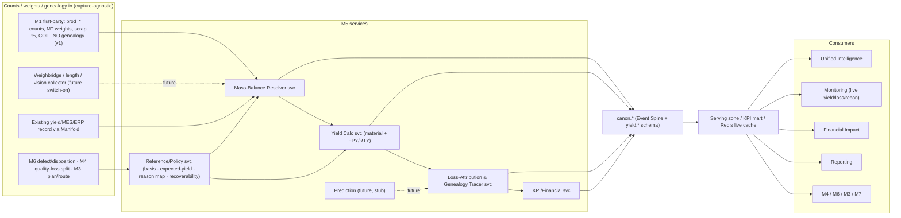

# Zedral · M5 Yield Intelligence — Developer Handover
### 00 · Master Index, Architecture, Stack & Conventions
**Audience:** engineering team · **Status:** v1 for build (dual-basis yield: material/mass + FPY/RTY; mass-balance reconciliation; priced loss bridge; genealogy attribution; auto-capture & prediction = interfaces only) · **Date:** 2026-06-19

> This is the build-ready specification set for **M5 · Yield Intelligence**, the platform's material-accounting module (the foundation layers — Data Lake, Canonical Model, Manifold, Unified Intelligence, Monitoring, Reporting, Financial Impact, Platform/Security — are specified in `../../Dev_Handover/`; sibling modules are in `../../M2_Maintenance_Intelligence/`, `../../M3_Shopfloor_Planning_Management/`, `../../M4_OEE_Downtime/`). Read this index first: module scope, the architecture, which **platform decisions (D1–D11)** bind M5, the **stack** M5 inherits, M5-specific conventions, and the **build roadmap**. The *why* behind every spec is the Yield deep-plan one level up: `../M5_Yield_Intelligence_DeepPlan.md`.

---

## 1. Document set & reading order

| # | Spec | Build priority |
|---|------|----------------|
| 00 | **This index** — architecture, stack, conventions, roadmap | Read first |
| 01 | **Data Model & Schema** — new derived entities, DDL dictionary (`M5_schema.sql`), the no-double-count anchor | Phase M5-0 |
| 02 | **Yield Calculation & Mass Balance** — dual-basis yield, ISO 22400 quantities, reconciliation, roll-up rule, expected-yield | Phase M5-1→2 |
| 03 | **Capture, Genealogy & On-Ramp** — quantity basis, COIL_NO genealogy, M1 bootstrap, auto weighing/length/vision future | Phase M5-1 |
| 04 | **Loss Taxonomy & Reason Codes** — yield-loss tree, recoverability, ISO 22400 quantity classes, "All Other" governance | Phase M5-2 |
| 05 | **Aggregation, Events & Pipeline** — streaming + batch rollups, replay/recompute, domain events | Phase M5-1→2 |
| 06 | **KPIs, Analytics & Financial Impact** — formulas + SQL, registry, M5↔M4 / M5↔M6 reconciliation, hits-twice pricing | Phase M5-2 |
| 07 | **APIs, Events & Integration** — REST/OpenAPI, auto-capture collector contract, MVP migration | Phase M5-1→4 |
| 08 | **Prediction / ML — Future-Scope Interfaces** — yield/transition/design-to-yield hooks, readiness gate (no v1 build) | Phase M5-5 (gated) |
| 09 | **Security, RBAC, NFRs & Acceptance** — roles, multi-tenancy, NFRs, test plan, acceptance | Cross-cutting |
| 10 | **Glossary** — yield & loss terms | Reference |
| — | **`M5_schema.sql`** | Runnable PostgreSQL DDL (paired with 01) |

**Companion material:** the Yield deep-plan (`../M5_Yield_Intelligence_DeepPlan.md`) + 10 flowcharts (`../M5_diagram_*.mermaid`). Platform specs referenced throughout live in `../../Dev_Handover/`.

---

## 2. Module scope & non-goals

**In scope (v1):** yield reference & policy (quantity basis, expected-yield/PSQ factors, scrap-reason→loss→quantity→recoverability mapping, targets); the **Mass-Balance Resolver** (close Input=Good+Scrap+Rework+By-product+ΔWIP+Gap, reconcile to ±1–2%, flag deviations); **dual-basis yield** — material/mass yield **and** FPY→RTY (ISO 22400 quantities + Lean multi-step yield); the **yield-loss bridge** (waterfall + Sankey + Pareto by mass, units and cost) with **genealogy attribution** (step/grade/lot/shift/supplier-lot); financial pricing of every loss (hits-twice, net of salvage/recovery); live yield/loss/reconciliation board + alerts; **v1 capture by bootstrapping M1** (per-process weights, counts, scrap %, COIL_NO genealogy) with ingestion from a yield/MES/ERP source via Manifold as an alternative on-ramp.

**Future scope (interfaces only, build gated — D9):** **automatic weighing/length/vision capture** (spec 03/07 — collector contract specified, switch-on when a client instruments the line); **yield / transition-loss prediction, design-to-yield / optimal-input-sizing** (spec 08), prescriptive recommendations. v1 ships the data hooks so both are a later switch-on, not a re-model.

**Non-goals (neighbouring modules/systems):** data capture itself (M1 owns first-party capture; M5 consumes canonical counts/weights/genealogy); the **OEE Quality factor** (M4 owns it on the *shared* ProductionCount; M5 supplies the reconciled material yield behind it); **defect taxonomy, disposition, quality holds, SPC, root cause** (M6 — the quality SoR; M5 accounts the material/economics of M6's dispositions); the plan/route/sequence (M3 — M5 *feeds* yield factors); the financial ledger (M5 *feeds* Financial Impact, doesn't own cost accounting).

---

## 3. System context

---

## 4. Binding platform decisions (D1–D11)

M5 inherits all platform decisions; the ones that shape build:

- **D4 (first connectors)** — after M1 bootstrap, the first yield ingest connector is a generic DB/ERP/MES yield-record path (confirm exact source — see deep-plan §14 open decisions).
- **D6 ("Standard" v1 KPI tier)** — v1 ships material yield, FPY, RTY, scrap/rework/quality ratio, avoidable loss, reconciliation gap, cost-of-loss.
- **D7 (cost-rates client-owned, rate-as-of)** — Financial Impact pricing uses effective-dated `canon.cost_rate`; M5 never hard-codes cost.
- **D8 (logical isolation default)** — `tenant_id` on every row; row-level security.
- **D9 (rules now / ML later)** — prediction is interfaces only (spec 08), gated on the shared ML-readiness (History) gate.
- **D11 (non-steel validation)** — M5's dual-basis design makes a **discrete** client (count-native FPY/RTY) the recommended cross-sector validation.

---

## 5. Stack (inherited) & M5 conventions

**Stack:** PostgreSQL 15+ (+ TimescaleDB for interval/balance tables), ClickHouse for heavy yield analytics, Kafka for domain events, Flink for streaming rollups, Redis live cache, S3/MinIO for snapshots, Keycloak (RBAC), Airflow (batch rollups), FastAPI services, React UI, K8s. Same as M4.

**M5 conventions (additive to canonical DDL spec):**
- Schema name is `"yield"` — **always double-quoted** in DDL/queries (it collides with the SQL `YIELD` token in some tools; quoting is mandatory and already applied in `M5_schema.sql`).
- **Store quantities, not just ratios** — every interval keeps input/good/scrap/rework in **both** mass (MT) and count (units); ratios are derived and re-derivable.
- **Two roll-up algebras, never confused:** material yield rolls up **SUM-then-divide** (view `v_yield_rollup`); **RTY multiplies** per-step FPY (computed in the KPI registry/rollup job, not by averaging).
- **No-double-count anchor:** every `loss_attribution` row carries the canonical `production_count_id` / `lot_ref` of the shared count — M5 aggregates, never re-records.
- **Mass-balance gate:** no yield interval is marked trusted unless its `material_balance` is `CLOSED` (gap ≤ tolerance); otherwise `PROVISIONAL`/`DEVIATION`.
- Soft BIGINT `*_ref` for other module schemas (ops.route in M3, qual.defect_record in M6); hard FK only to `canon.*`.

---

## 6. Build roadmap

| Phase | Deliverable | Specs |
|---|---|---|
| **M5-0** | Schema + reference/policy + canonical wiring; repoint existing dashboards onto `canon.*` | 01, 03 |
| **M5-1** | Mass-Balance Resolver + material yield from M1 bootstrap; reconciliation gap | 02, 03, 05 |
| **M5-2** | Full dual-basis yield + loss bridge + genealogy attribution; M5↔M4 / M5↔M6 reconciliation | 02, 04, 06 |
| **M5-3** | KPI registry publish + Financial Impact (hits-twice) + Monitoring board + Reporting; yield-factor feedback to M3 | 06, 07 |
| **M5-4** | Auto-capture collector switch-on (weighing/length/vision) | 03, 07 |
| **M5-5 (gated)** | Prediction / design-to-yield (History gate) | 08 |

**First acceptance gate (MVP bridge):** existing yield % and canonical material yield agree to tolerance on a back-test window, **and** the mass balance closes to ≤1–2% (spec 09).
