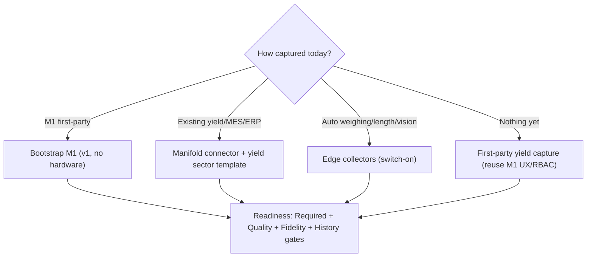

# M5 · 03 · Capture, Genealogy & On-Ramp Spec
**Deep-plan:** §5, §10, §11 · **Decision:** v1 bootstrap M1 manual; auto weighing/length/vision future-proofed

## 1. The genealogy is the spine
Material yield is meaningless without knowing **what became what**. M5 requires a genealogy: parent lot → child lot(s) with a weight at each transformation. Hero Steels' M1 already provides it via the **COIL_NO** spine — slitting creates parent→child coils, annealing groups coils into charge/base, and every process records a weight in MT. M5 walks this to attribute each lost kg to the step it vanished and to compute RTY = ∏FPYᵢ across the chain.

`canon.material_lot(lot_id, parent_lot_id)` is the genealogy table; `work_unit_config.genealogy_required = TRUE` gates whether a work-unit can produce trusted material yield (a missing parent link = incomplete genealogy = Fidelity-gate downgrade).

## 2. v1 — bootstrap from M1 (no new hardware)
Map M1 → canonical:

| M1 capture | Canonical target | M5 use |
|---|---|---|
| per-process weight (MT) in/out | `production_count` weight + `material_balance` input/good | mass balance & material yield |
| `prod_*` counts | `production_count` good/scrap/rework/total | FPY/RTY (count basis) |
| scrap % + slit-scrap auto-% | `production_count.scrap` + `reason_code` | loss attribution |
| stoppage→scrap (cobble) | `downtime_event` ↔ `production_count` link | event-linked yield loss (L1/L5) |
| COIL_NO parent→child, charge/base | `material_lot` genealogy | genealogy attribution + RTY |
| `shift_log` | `shift` | yield window/bucket |

Result: full dual-basis yield per process/coil/grade on day one for any M1 client.

## 3. Future-proofed — automatic capture (switch-on)
Manual blind spots: weights rounded, crop/trim lengths estimated, scale loss inferred → wider reconciliation gap. Architected collectors (build when a client instruments the line):

| Collector | Signal | Canonical emission |
|---|---|---|
| Weighbridge / coil scale | true in/out mass per process | `production_count` weight (AUTOMATIC fidelity) |
| Length / width encoder | crop & trim length → mass | scrap by reason (crop/trim) |
| Vision / surface scan | defect area → off-gauge/reject mass | scrap/rework + defect link (→ M6) |

Collector contract in spec 07. Downstream engines unchanged; only `capture_fidelity` rises (MANUAL→AUTOMATIC) and the reconciliation gap shrinks toward true ±1%.

## 4. On-ramps & readiness

**Two M5-specific readiness sub-gates** (on the platform model, canonical §16):
- **Fidelity gate** — manual vs automatic weighing? genealogy complete? expected-yield calibrated? reconciliation gap within tolerance? → drives the *confidence* shown beside every yield number.
- **History gate** — does this route×grade have enough labelled yield history to train §8 models? → reports prediction-readiness only.

The UI must show honest confidence, e.g. *"yield indicative — weights estimated, gap 3%, expected-yield uncalibrated."*

## 5. Offline tolerance
First-party/edge capture is offline-tolerant like M1 (queue locally, sync on reconnect). Late-arriving weights trigger deterministic recompute of the affected balance/interval (spec 05).
