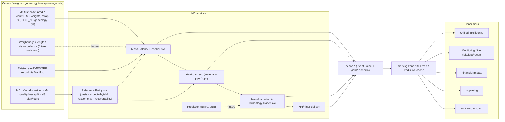
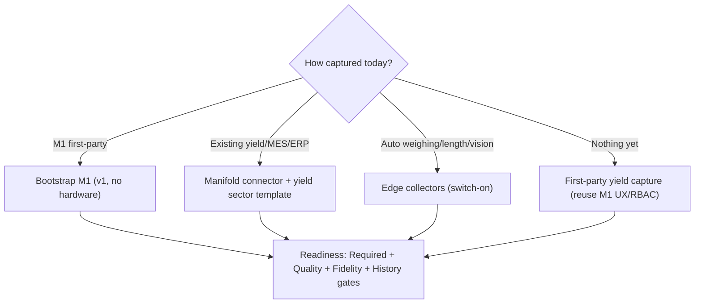

\newpage

# Zedral · M5 Yield Intelligence — Developer Handover
### 00 · Master Index, Architecture, Stack & Conventions
**Audience:** engineering team · **Status:** v1 for build (dual-basis yield: material/mass + FPY/RTY; mass-balance reconciliation; priced loss bridge; genealogy attribution; auto-capture & prediction = interfaces only) · **Date:** 2026-06-19

> This is the build-ready specification set for **M5 · Yield Intelligence**, the platform's material-accounting module (the foundation layers — Data Lake, Canonical Model, Manifold, Unified Intelligence, Monitoring, Reporting, Financial Impact, Platform/Security — are specified in `../../Dev_Handover/`; sibling modules are in `../../M2_Maintenance_Intelligence/`, `../../M3_Shopfloor_Planning_Management/`, `../../M4_OEE_Downtime/`). Read this index first: module scope, the architecture, which **platform decisions (D1–D11)** bind M5, the **stack** M5 inherits, M5-specific conventions, and the **build roadmap**. The *why* behind every spec is the Yield deep-plan one level up: `../M5_Yield_Intelligence_DeepPlan.md`.

---

## 1. Document set & reading order

| # | Spec | Build priority |
|---|------|----------------|
| 00 | **This index** — architecture, stack, conventions, roadmap | Read first |
| 01 | **Data Model & Schema** — new derived entities, DDL dictionary (`M5_schema.sql`), the no-double-count anchor | Phase M5-0 |
| 02 | **Yield Calculation & Mass Balance** — dual-basis yield, ISO 22400 quantities, reconciliation, roll-up rule, expected-yield | Phase M5-1→2 |
| 03 | **Capture, Genealogy & On-Ramp** — quantity basis, COIL_NO genealogy, M1 bootstrap, auto weighing/length/vision future | Phase M5-1 |
| 04 | **Loss Taxonomy & Reason Codes** — yield-loss tree, recoverability, ISO 22400 quantity classes, "All Other" governance | Phase M5-2 |
| 05 | **Aggregation, Events & Pipeline** — streaming + batch rollups, replay/recompute, domain events | Phase M5-1→2 |
| 06 | **KPIs, Analytics & Financial Impact** — formulas + SQL, registry, M5↔M4 / M5↔M6 reconciliation, hits-twice pricing | Phase M5-2 |
| 07 | **APIs, Events & Integration** — REST/OpenAPI, auto-capture collector contract, MVP migration | Phase M5-1→4 |
| 08 | **Prediction / ML — Future-Scope Interfaces** — yield/transition/design-to-yield hooks, readiness gate (no v1 build) | Phase M5-5 (gated) |
| 09 | **Security, RBAC, NFRs & Acceptance** — roles, multi-tenancy, NFRs, test plan, acceptance | Cross-cutting |
| 10 | **Glossary** — yield & loss terms | Reference |
| — | **`M5_schema.sql`** | Runnable PostgreSQL DDL (paired with 01) |

**Companion material:** the Yield deep-plan (`../M5_Yield_Intelligence_DeepPlan.md`) + 10 flowcharts (`../M5_diagram_*.mermaid`). Platform specs referenced throughout live in `../../Dev_Handover/`.

---

## 2. Module scope & non-goals

**In scope (v1):** yield reference & policy (quantity basis, expected-yield/PSQ factors, scrap-reason→loss→quantity→recoverability mapping, targets); the **Mass-Balance Resolver** (close Input=Good+Scrap+Rework+By-product+ΔWIP+Gap, reconcile to ±1–2%, flag deviations); **dual-basis yield** — material/mass yield **and** FPY→RTY (ISO 22400 quantities + Lean multi-step yield); the **yield-loss bridge** (waterfall + Sankey + Pareto by mass, units and cost) with **genealogy attribution** (step/grade/lot/shift/supplier-lot); financial pricing of every loss (hits-twice, net of salvage/recovery); live yield/loss/reconciliation board + alerts; **v1 capture by bootstrapping M1** (per-process weights, counts, scrap %, COIL_NO genealogy) with ingestion from a yield/MES/ERP source via Manifold as an alternative on-ramp.

**Future scope (interfaces only, build gated — D9):** **automatic weighing/length/vision capture** (spec 03/07 — collector contract specified, switch-on when a client instruments the line); **yield / transition-loss prediction, design-to-yield / optimal-input-sizing** (spec 08), prescriptive recommendations. v1 ships the data hooks so both are a later switch-on, not a re-model.

**Non-goals (neighbouring modules/systems):** data capture itself (M1 owns first-party capture; M5 consumes canonical counts/weights/genealogy); the **OEE Quality factor** (M4 owns it on the *shared* ProductionCount; M5 supplies the reconciled material yield behind it); **defect taxonomy, disposition, quality holds, SPC, root cause** (M6 — the quality SoR; M5 accounts the material/economics of M6's dispositions); the plan/route/sequence (M3 — M5 *feeds* yield factors); the financial ledger (M5 *feeds* Financial Impact, doesn't own cost accounting).

---

## 3. System context



---

## 4. Binding platform decisions (D1–D11)

M5 inherits all platform decisions; the ones that shape build:

- **D4 (first connectors)** — after M1 bootstrap, the first yield ingest connector is a generic DB/ERP/MES yield-record path (confirm exact source — see deep-plan §14 open decisions).
- **D6 ("Standard" v1 KPI tier)** — v1 ships material yield, FPY, RTY, scrap/rework/quality ratio, avoidable loss, reconciliation gap, cost-of-loss.
- **D7 (cost-rates client-owned, rate-as-of)** — Financial Impact pricing uses effective-dated `canon.cost_rate`; M5 never hard-codes cost.
- **D8 (logical isolation default)** — `tenant_id` on every row; row-level security.
- **D9 (rules now / ML later)** — prediction is interfaces only (spec 08), gated on the shared ML-readiness (History) gate.
- **D11 (non-steel validation)** — M5's dual-basis design makes a **discrete** client (count-native FPY/RTY) the recommended cross-sector validation.

---

## 5. Stack (inherited) & M5 conventions

**Stack:** PostgreSQL 15+ (+ TimescaleDB for interval/balance tables), ClickHouse for heavy yield analytics, Kafka for domain events, Flink for streaming rollups, Redis live cache, S3/MinIO for snapshots, Keycloak (RBAC), Airflow (batch rollups), FastAPI services, React UI, K8s. Same as M4.

**M5 conventions (additive to canonical DDL spec):**
- Schema name is `"yield"` — **always double-quoted** in DDL/queries (it collides with the SQL `YIELD` token in some tools; quoting is mandatory and already applied in `M5_schema.sql`).
- **Store quantities, not just ratios** — every interval keeps input/good/scrap/rework in **both** mass (MT) and count (units); ratios are derived and re-derivable.
- **Two roll-up algebras, never confused:** material yield rolls up **SUM-then-divide** (view `v_yield_rollup`); **RTY multiplies** per-step FPY (computed in the KPI registry/rollup job, not by averaging).
- **No-double-count anchor:** every `loss_attribution` row carries the canonical `production_count_id` / `lot_ref` of the shared count — M5 aggregates, never re-records.
- **Mass-balance gate:** no yield interval is marked trusted unless its `material_balance` is `CLOSED` (gap ≤ tolerance); otherwise `PROVISIONAL`/`DEVIATION`.
- Soft BIGINT `*_ref` for other module schemas (ops.route in M3, qual.defect_record in M6); hard FK only to `canon.*`.

---

## 6. Build roadmap

| Phase | Deliverable | Specs |
|---|---|---|
| **M5-0** | Schema + reference/policy + canonical wiring; repoint existing dashboards onto `canon.*` | 01, 03 |
| **M5-1** | Mass-Balance Resolver + material yield from M1 bootstrap; reconciliation gap | 02, 03, 05 |
| **M5-2** | Full dual-basis yield + loss bridge + genealogy attribution; M5↔M4 / M5↔M6 reconciliation | 02, 04, 06 |
| **M5-3** | KPI registry publish + Financial Impact (hits-twice) + Monitoring board + Reporting; yield-factor feedback to M3 | 06, 07 |
| **M5-4** | Auto-capture collector switch-on (weighing/length/vision) | 03, 07 |
| **M5-5 (gated)** | Prediction / design-to-yield (History gate) | 08 |

**First acceptance gate (MVP bridge):** existing yield % and canonical material yield agree to tolerance on a back-test window, **and** the mass balance closes to ≤1–2% (spec 09).


\newpage

# M5 · 01 · Data Model & Schema Spec
**Pairs with:** `M5_schema.sql` (runnable) · **Deep-plan:** §4, §6, §11

## 1. Design stance
M5 is **thin-write / heavy-read**. It introduces **no new transactional capture** — it consumes the canonical `ProductionCount` (good/scrap/rework/total + weight) and the material-lot genealogy, and adds only a **derived** yield layer. The canonical `ProductionCount`, `LossCategory`, `ReasonCode`, `material_lot` genealogy and `DefectRecord` already exist (canonical model §10); M5 is the module that **brings the material/quantity side to life**.

## 2. Entities (see `M5_schema.sql` for full DDL)

| Entity | Role | Key columns |
|---|---|---|
| `yield_config` | per-tenant policy (definitions-as-config) | default_quantity_basis, recon_tolerance_pct, default_expected_source, net_salvage, report_avoidable_only |
| `work_unit_config` | per-work-unit basis & capture fidelity | quantity_basis, capture_fidelity, genealogy_required |
| `expected_yield_factor` | PSQ baseline / avoidable-loss reference (versioned) | expected_yield_pct, planned_scrap_pct, source, is_calibrated, version, effective_* |
| `yield_target` | yield targets per scope×material | target_material_yield_pct, target_rty_pct |
| `material_balance` | **the conservation-of-mass close** | input_mt, good_mt, scrap_mt, rework_mt, byproduct_mt, dwip_mt, gap_mt, gap_pct, status |
| `yield_interval` | computed dual-basis yield per asset×material×bucket | *_mt + *_units quantities, material_yield_pct, fpy_pct, rty_pct, scrap/rework/quality ratios, avoidable_loss_mt |
| `loss_attribution` | every lost kg/unit, priced, genealogy-traced | reason_ref, loss_category_ref, quantity_class, recoverability, big_loss, loss_mt/units, net_loss_cost, **production_count_id** |
| `loss_bridge` | waterfall snapshot (serving) | steps (JSONB ordered), total_loss_cost |
| `top_loss` | Pareto snapshot by mass/units/cost | rank_basis, rank, value_* |
| `yield_factor_feedback` | actual-vs-expected → M3 | actual_yield_pct, expected_yield_pct, delta_pct |
| `policy_change_log` | audit of effective-dated config | entity, old/new_value, changed_by, effective_from |
| `readiness_snapshot` | Required/Quality/Fidelity/History gates | genealogy_complete, expected_calibrated, recon_within_tol, fidelity |
| `yield_prediction` | FUTURE-SCOPE stub | predicted_yield_pct, model_version (unwritten v1) |
| `v_yield_rollup` (view) | **SUM-then-divide** material-yield rollup | never averages sub-yields |

## 3. The no-double-count anchor
`loss_attribution.production_count_id` and `lot_ref` point at the **same** canonical rows M4 (Quality factor), M3 (attainment) and M6 (defect) read. M5 **aggregates**; it never re-records a count. The mass balance therefore reconciles against the *one* count truth, and M5's Quality-loss must equal M4's Quality-factor loss by construction (spec 06 §4).

## 4. Keys, types, tenancy
Surrogate `BIGINT GENERATED ALWAYS AS IDENTITY` PKs; `UUID tenant_id` on every table (D8 isolation, RLS in spec 09); `TIMESTAMPTZ` UTC; `NUMERIC` for all masses/units/costs (never float); `JSONB ext` for non-core extension; units embedded in column names (`_mt`, `_units`, `_pct`, `_cost`). Hard FK only to `canon.*`; soft BIGINT `*_ref` to `ops.*`/`qual.*`.

## 5. Versioning & effective dating
`expected_yield_factor` and `yield_config` are **effective-dated and versioned**; changes are written to `policy_change_log`. Because yield trends move when an expected-yield factor or basis changes, **every policy change is audited with `effective_from`** so a trend is never silently re-baselined (deep-plan §13). Recomputation is deterministic/replayable from canonical events.

## 6. Indexing & partitioning
`material_balance` and `yield_interval` are time-series — partition by `bucket_start`/`window_start` (monthly) and consider TimescaleDB hypertables. Indexes shipped: work-unit×bucket, material, lot, reason, non-closed balances. Heavy multi-dimensional yield analytics (yield by grade×shift×supplier-lot heatmaps) belong in ClickHouse off the serving path.


\newpage

# M5 · 02 · Yield Calculation & Mass Balance Spec
**Deep-plan:** §2, §4, §7 · **Standards:** ISO 22400-2 (quantities & ratios), Lean (FPY→RTY), conservation of mass

## 1. Quantities (ISO 22400-2, the platform's ratified definitions)
Every quantity is tagged with **basis** (MASS in MT / COUNT in units) and **disposition**:

| Symbol | Quantity | Source |
|---|---|---|
| IQ | Input Quantity (raw issued − returns ± ΔRaw) | M1 charge/coil weight, ERP issues |
| PQ | Produced Quantity (good + scrap + rework) | `canon.production_count.total` / weight |
| GQ | Good Quantity (meets spec first time) | `production_count.good` |
| SQ | Scrap Quantity | `production_count.scrap` |
| PSQ | Planned Scrap Quantity (expected) | `expected_yield_factor.planned_scrap_pct` |
| RQ | Rework Quantity (recoverable) | `production_count.rework` |
| BP | By-product / co-product (salvage value) | weight + cost-rate |

## 2. Dual-basis yield formulas (both computed; user scoping = equal weight)

```
material_yield_pct = 100 * good_mt / input_mt
fpy_pct            = 100 * good_units_first_time / started_units      -- per step
rty_pct            = PRODUCT( fpy_step_i )  over genealogy steps      -- multi-step
quality_ratio_pct  = 100 * GQ / PQ          -- reconciles to M4 Quality factor
scrap_ratio_pct    = 100 * SQ / PQ
rework_ratio_pct   = 100 * RQ / PQ
avoidable_loss     = actual_loss - planned_scrap(PSQ)
```

**Critical: two roll-up algebras, never confused.**
- **Material yield / ratios roll up by SUM-then-divide** — sum input/good/scrap quantities to the target grain, then divide (view `v_yield_rollup`). Never average sub-yields (Simpson's paradox).
- **RTY rolls up by PRODUCT of per-step FPY** — that is its definition. Computed by the rollup job over the genealogy chain, written to `yield_interval.rty_pct`.

**Why both bases (deep-plan Principle 3):** a coil can pass as one good unit (FPY≈100%) while losing 4% of mass to crop/scale (material yield 96%); a batch can hold mass while a third of pieces are reworked. Compute and store both; never let one stand in for the other.

## 3. Mass balance — the close (Mass-Balance Resolver)
For every lot and window:

```
input_mt = good_mt + scrap_mt + rework_mt + byproduct_mt + dwip_mt + gap_mt
gap_pct  = 100 * abs(gap_mt) / input_mt
status   = CLOSED      if gap_pct <= recon_tolerance_pct      (default 2%)
           PROVISIONAL if gap_pct  > tolerance (await more data)
           DEVIATION   if gap_pct  > 2x tolerance OR drifting  (data-quality)
```

**Gate (Principle 4):** only a `CLOSED` balance produces a *trusted* yield interval. A `DEVIATION` window is published as provisional and its gap is routed to data-quality (scale drift / unrecorded movement / wet-dry basis mismatch) — **it is never poured into the loss bridge as if it were yield loss.** This is what lets finance trust yield against material purchased.

## 4. Expected yield (avoidable-loss reference)
`expected_yield_factor` keyed by route×grade×work-unit, versioned, `is_calibrated` flag. Three population paths: (a) METALLURGICAL_STD, (b) DEMONSTRATED_BEST (e.g. 90th-percentile sustained), (c) M3_PLAN_FACTOR. `avoidable_loss = actual_loss − planned_scrap`. Any work-unit whose avoidable loss rests on an **uncalibrated** factor is flagged in the Fidelity gate (spec 03/09) so yield is never judged against a guess.

## 5. Worked example (Hero Steels cold mill, one shift, grade X)
```
input_mt = 500.00 (incoming HR coil)
good_mt  = 480.00 ; scrap_mt = 14.00 ; rework_mt = 4.00 ; byproduct_mt = 1.50 ; dwip_mt = 0.00
gap_mt   = 500.00 - (480 + 14 + 4 + 1.5 + 0) = 0.50  → gap_pct = 0.10%  → CLOSED
material_yield = 100*480/500 = 96.000%
planned_scrap (PSQ standard crop+trim) = 2.5% of 500 = 12.50 mt
actual_loss = 500-480 = 20.00 mt ; avoidable_loss = 20.00 - 12.50 = 7.50 mt
```
The 7.50 mt avoidable is the Pareto/Financial target — the 12.50 mt PSQ is reported but not flagged as an opportunity.

## 6. Recompute & determinism
All intervals/balances are **replayable** from canonical events: a corrected scrap reason or weight re-derives affected balances, intervals, attributions and bridges with no manual patching (spec 05).


\newpage

# M5 · 03 · Capture, Genealogy & On-Ramp Spec
**Deep-plan:** §5, §10, §11 · **Decision:** v1 bootstrap M1 manual; auto weighing/length/vision future-proofed

## 1. The genealogy is the spine
Material yield is meaningless without knowing **what became what**. M5 requires a genealogy: parent lot → child lot(s) with a weight at each transformation. Hero Steels' M1 already provides it via the **COIL_NO** spine — slitting creates parent→child coils, annealing groups coils into charge/base, and every process records a weight in MT. M5 walks this to attribute each lost kg to the step it vanished and to compute RTY = ∏FPYᵢ across the chain.

`canon.material_lot(lot_id, parent_lot_id)` is the genealogy table; `work_unit_config.genealogy_required = TRUE` gates whether a work-unit can produce trusted material yield (a missing parent link = incomplete genealogy = Fidelity-gate downgrade).

## 2. v1 — bootstrap from M1 (no new hardware)
Map M1 → canonical:

| M1 capture | Canonical target | M5 use |
|---|---|---|
| per-process weight (MT) in/out | `production_count` weight + `material_balance` input/good | mass balance & material yield |
| `prod_*` counts | `production_count` good/scrap/rework/total | FPY/RTY (count basis) |
| scrap % + slit-scrap auto-% | `production_count.scrap` + `reason_code` | loss attribution |
| stoppage→scrap (cobble) | `downtime_event` ↔ `production_count` link | event-linked yield loss (L1/L5) |
| COIL_NO parent→child, charge/base | `material_lot` genealogy | genealogy attribution + RTY |
| `shift_log` | `shift` | yield window/bucket |

Result: full dual-basis yield per process/coil/grade on day one for any M1 client.

## 3. Future-proofed — automatic capture (switch-on)
Manual blind spots: weights rounded, crop/trim lengths estimated, scale loss inferred → wider reconciliation gap. Architected collectors (build when a client instruments the line):

| Collector | Signal | Canonical emission |
|---|---|---|
| Weighbridge / coil scale | true in/out mass per process | `production_count` weight (AUTOMATIC fidelity) |
| Length / width encoder | crop & trim length → mass | scrap by reason (crop/trim) |
| Vision / surface scan | defect area → off-gauge/reject mass | scrap/rework + defect link (→ M6) |

Collector contract in spec 07. Downstream engines unchanged; only `capture_fidelity` rises (MANUAL→AUTOMATIC) and the reconciliation gap shrinks toward true ±1%.

## 4. On-ramps & readiness


**Two M5-specific readiness sub-gates** (on the platform model, canonical §16):
- **Fidelity gate** — manual vs automatic weighing? genealogy complete? expected-yield calibrated? reconciliation gap within tolerance? → drives the *confidence* shown beside every yield number.
- **History gate** — does this route×grade have enough labelled yield history to train §8 models? → reports prediction-readiness only.

The UI must show honest confidence, e.g. *"yield indicative — weights estimated, gap 3%, expected-yield uncalibrated."*

## 5. Offline tolerance
First-party/edge capture is offline-tolerant like M1 (queue locally, sync on reconnect). Late-arriving weights trigger deterministic recompute of the affected balance/interval (spec 05).


\newpage

# M5 · 04 · Loss Taxonomy & Reason Codes Spec
**Deep-plan:** §2, §6 · **Standards:** ISO 22400 quantity classes, TPM Six Big Losses (L5/L6), steel yield-loss anatomy

## 1. Three-layer reason hierarchy (operator-first, mirrors M4)
```
Layer 1 · Loss category (fast tap; 6–8 max):
  Crop · Scale · Trim · Transition · Cobble · Dimensional · Rework · Sampling/Other
Layer 2 · Sub-cause (filtered by parent; 15–25):
  e.g. Dimensional → off-gauge / off-profile / surface / edge-crack
Layer 3 · Root-cause detail (optional small loss, required large loss):
  e.g. surface → roll-mark / scale-pit / scratch
```
- 6–8 top categories; ≤15–20 options per level, parent-filtered; **6–12 active reasons per work-unit** is the sweet spot.
- **Capture the symptom, not the diagnosis** (defect root-cause is M6's job on the same record).
- Layer-1 alone = minimum-viable data even if detail is never entered.

## 2. Canonical mapping (the bit that makes losses add up)
Every leaf reason carries four canonical attributes:

| Attribute | Values | Purpose |
|---|---|---|
| `loss_category_ref` | yield-loss category | the bridge bucket |
| `quantity_class` | GOOD / SCRAP / PLANNED_SCRAP / REWORK / BYPRODUCT | ISO 22400 quantity it feeds |
| `recoverability` | PURE_LOSS / SALVAGE / RECOVERABLE | the economics (spec 06) |
| `big_loss` | L5_DEFECT / L6_STARTUP_YIELD / L1_BREAKDOWN_LINKED | TPM split + M4 handoff |

This closes the books: Σ(scrap by reason) + Σ(rework) + by-product + ΔWIP + gap = Input − Good, **and** lets M5's Quality-loss reconcile to M4's Quality factor (same units, one mapping).

## 3. Steel yield-loss anatomy (seed for the sector template)
Indicative share of total yield loss (bar/long-product; cold-rolling adds trim/transition):

| Category | Typical share | Quantity class | Big loss | Recoverability |
|---|---|---|---|---|
| Crop (head/tail) | 40–50% | PLANNED_SCRAP (std) / SCRAP (excess) | L6 | SALVAGE |
| Cobbles & stoppages | 15–25% | SCRAP | L1/L5 | SALVAGE |
| Dimensional/quality | 10–20% | SCRAP / REWORK | L5 | SALVAGE/RECOVERABLE |
| Scale & oxidation | 8–12% | SCRAP | L6 | PURE_LOSS |
| Scarfing/conditioning | 5–10% | PLANNED_SCRAP | L6 | SALVAGE |
| Sampling/test | 2–4% | PLANNED_SCRAP | L6 | PURE_LOSS |
| Side trim / edge (cold) | varies | PLANNED_SCRAP | L6 | SALVAGE |
| Transition / grade-change (cold) | varies | SCRAP | L6 startup | SALVAGE/downgrade |

## 4. "Other / unclassified" governance
Exactly **one** Other reason exists. When it climbs into the loss-bridge top-3 or above ~10% of loss, M5 emits an `m5.other_bucket_now_top_loss` event → UI prompt *"split your Other bucket."* This is the primary defence against an unactionable Pareto.

## 5. Pareto / loss bridge ranking
Rank losses **by mass, by units, and by cost** (`top_loss.rank_basis`) — they rank differently (a high-tonnage crop may cost less than a small transition of premium grade). The executive view defaults to **cost**, with **avoidable** loss only (PSQ excluded) when `yield_config.report_avoidable_only = TRUE`.


\newpage

# M5 · 05 · Aggregation, Events & Pipeline Spec
**Deep-plan:** §3, §13 · **Stack:** Kafka + Flink (stream) · Airflow (batch) · Redis (live)

## 1. Two paths, one truth
- **Streaming (Flink off the canonical event stream):** updates the **live yield tile**, running scrap/transition board, and the reconciliation-gap signal in the Redis cache. Provisional — labelled "live, unreconciled."
- **Batch (Airflow scheduled rollups):** closes the mass balance per lot/window, computes trusted `yield_interval`, `loss_attribution`, `loss_bridge`, `top_loss`, and `yield_factor_feedback`, and publishes to the KPI mart.

A yield number is **trusted only after its `material_balance` closes** (spec 02 §3); the live tile shows the provisional figure with a "reconciling" badge until then.

## 2. Pipeline order (per window)
```
ingest canonical ProductionCount + weights + genealogy
  → resolve genealogy (parent→child, charge/base)
  → close mass balance (Input = Good+Scrap+Rework+Byproduct+ΔWIP+Gap)  → status
  → compute material yield + FPY (per step) + RTY (∏ over chain)
  → attribute losses (reason → category → quantity_class → recoverability → big_loss → price)
  → build loss_bridge + top_loss (mass/units/cost)
  → publish KPI registry + yield_factor_feedback (→ M3)
```

## 3. Recompute / replay (deterministic)
All derived rows are a pure function of canonical events + effective-dated policy. A corrected weight, scrap reason, or expected-yield factor triggers recompute of exactly the affected `(work_unit, material, window)` partitions — balance → interval → attribution → bridge — with no manual patching. Late-arriving offline captures (spec 03 §5) use the same path. Recompute is idempotent (UNIQUE keys on intervals/bridges/top_loss).

## 4. Domain events (Kafka topics)
| Event | Emitted when | Consumers |
|---|---|---|
| `m5.balance_closed` | mass balance reaches CLOSED | UIL, Reporting |
| `m5.balance_deviation` | gap > 2× tolerance / drifting | Monitoring (data-quality alert) |
| `m5.yield_interval_computed` | trusted interval written | UIL, KPI registry |
| `m5.loss_bridge_updated` | bridge/Pareto recomputed | Monitoring, Reporting |
| `m5.yield_drop_detected` | yield below target/threshold | Monitoring (alert) |
| `m5.other_bucket_now_top_loss` | Other reason in top-3 / >10% | UI prompt (spec 04 §4) |
| `m5.yield_factor_feedback` | actual-vs-expected published | M3 (planning) |

All events carry `tenant_id`, scope refs, `schema_version`. Idempotent keys; at-least-once delivery; consumers dedupe.

## 5. Performance
Partition `material_balance`/`yield_interval` by window month (TimescaleDB). Heavy yield-by-grade×shift×supplier-lot analytics run in ClickHouse off the serving path so reconciliation never blocks the live tile (same read-replica discipline M1/M4 use).


\newpage

# M5 · 06 · KPIs, Analytics & Financial Impact Spec
**Deep-plan:** §9, §12 · **Standards:** ISO 22400-2 · **Decision:** D6 (Standard tier), D7 (rate-as-of)

## 1. KPI registry contributions (reconciled to platform ISO 22400)
| KPI | Formula | Notes |
|---|---|---|
| Material / mass yield | 100·good_mt/input_mt | headline (steel ~92–98% by product) |
| First-Pass Yield (FPY) | 100·good_first_time/started | per step |
| Rolled-Throughput Yield (RTY) | ∏ FPYᵢ | multi-step; exposes compounding |
| Quality Ratio | 100·GQ/PQ | **reconciles to M4 Quality factor** |
| Scrap Ratio | 100·SQ/PQ | bad-product rate |
| Rework Ratio | 100·RQ/PQ | recoverable-loss rate |
| Avoidable yield loss | actual_loss − PSQ | the honest opportunity |
| Reconciliation gap | 100·\|Input−accounted\|/Input | data-trust meter (≤1–2%) |
| Cost of yield loss | Σ(loss_mt·(std_cost−salvage)+rework_cost) | the € the bridge is worth |

## 2. Rollup SQL (SUM-then-divide; never average sub-yields)
```sql
SELECT work_unit_ref, material_ref,
       100.0 * SUM(good_mt) / NULLIF(SUM(input_mt),0) AS material_yield_pct,
       100.0 * SUM(scrap_mt) / NULLIF(SUM(good_mt+scrap_mt+rework_mt),0) AS scrap_ratio_pct,
       SUM(avoidable_loss_mt) AS avoidable_loss_mt
FROM "yield".yield_interval
WHERE bucket_start >= :from AND bucket_start < :to
GROUP BY work_unit_ref, material_ref;
```
RTY is **not** computed this way — it multiplies per-step FPY across the genealogy (rollup job), written to `yield_interval.rty_pct`.

## 3. Financial Impact — the "hits-twice" model (Principle 5)
A lost tonne loses the **sale** *and* the **sunk conversion cost** (material, energy, labour, overhead already spent); the marginal cost of a *recovered* tonne is ~zero, so recovered yield flows almost directly to profit.

```
net_loss_cost = standard_cost            -- lost margin + sunk conversion (hits twice)
              - salvage_value            -- scrap recovery (if net_salvage=TRUE)
              + rework_cost              -- added cost where recoverable
```
- `standard_cost`, `salvage_value`, rework rate come from `canon.cost_rate` (D7, **rate-as-of-event** provenance) — never hard-coded.
- Recoverability drives the formula: PURE_LOSS (no salvage), SALVAGE (net scrap value), RECOVERABLE (rework cost added, material recovered).
- **Scale check (industry):** a 2-pt yield gain on a 500 kt/yr line ≈ €4–7M/yr profit — much of it low/zero-capex (batch sizing, sequencing, crop optimisation). Rank the bridge by **money**, avoidable only.

## 4. Cross-module reconciliation tests (must pass)
| Test | Assertion |
|---|---|
| **M5 ↔ M4** | M5 Quality Ratio (GQ/PQ at a work-unit) == M4 OEE Quality factor on the same ProductionCount, same window (±rounding) |
| **M5 ↔ M6** | Σ M5 loss attributed to defect-driven reasons == Σ material of M6 dispositions (scrap+rework+downgrade) for the same DefectRecords |
| **Mass balance** | input_mt == good+scrap+rework+byproduct+ΔWIP+gap, gap ≤ tolerance for CLOSED |
| **No double-count** | every loss_attribution row maps to exactly one production_count_id |

## 5. Analytics surfaces (D6 Standard tier)
Loss bridge/waterfall; Sankey (input→outputs+losses); yield heatmaps (grade×shift, work-unit×shift); **supplier-lot yield spread**; transition/startup-loss deep-dive (ties to M3 sequencing); avoidable-loss Pareto by €. Yield-by-everything sliced from `loss_attribution` (step/grade/lot/shift/crew/supplier-lot).


\newpage

# M5 · 07 · APIs, Events & Integration Spec
**Deep-plan:** §0, §12, §14 · **Style:** REST/OpenAPI, versioned `/v1`, read-mostly

## 1. Read APIs (Serving)
| Method · Path | Returns |
|---|---|
| `GET /v1/yield/intervals?work_unit&material&grain&from&to` | dual-basis yield intervals (material yield, FPY, RTY, ratios, avoidable) |
| `GET /v1/yield/material-balance?work_unit&lot&from&to` | mass-balance closes + gap + status |
| `GET /v1/yield/loss-bridge?scope&material&grain&bucket` | ordered waterfall steps + total cost |
| `GET /v1/yield/top-loss?scope&grain&bucket&basis=COST` | Pareto (mass/units/cost) |
| `GET /v1/yield/by-dimension?dim=grade|shift|supplier_lot|step` | yield/loss sliced by dimension |
| `GET /v1/yield/readiness?work_unit` | Required/Quality/Fidelity/History gate state + confidence |
| `GET /v1/yield/factors?route&material` | expected-yield factors (for M3) |

## 2. Write / config APIs (admin/engineer, audited)
| Method · Path | Purpose |
|---|---|
| `PUT /v1/yield/config` | tenant policy (basis, tolerance, expected source, salvage netting) — writes `policy_change_log` |
| `PUT /v1/yield/expected-yield-factor` | new versioned factor (effective-dated) |
| `PUT /v1/yield/reason-map` | reason → category/quantity_class/recoverability/big_loss |
| `POST /v1/yield/recompute` | trigger deterministic replay for (work_unit, material, window) |

## 3. Domain events
Publishes the topics in spec 05 §4. Subscribes to canonical `production_count.*`, `material_lot.*` (genealogy), `defect_record.*` (M6), `downtime_event.*` (cobble link, M4/M2), `cost_rate.*` (D7).

## 4. Auto-capture collector contract (future switch-on)
Edge collectors POST canonical ProductionCount rows; M5 does **not** parse raw signals — the edge does debounce/conversion, M5 ingests canonical:
```json
POST /v1/ingest/production-count
{ "tenant_id":"…","work_unit_ref":123,"lot_ref":456,
  "good_mt":4.80,"scrap_mt":0.14,"rework_mt":0.04,"total_mt":4.98,
  "good_units":1,"scrap_units":0,
  "reason_ref":71,"capture_fidelity":"AUTOMATIC","ts":"…" }
```
| Collector | Edge does | Emits |
|---|---|---|
| Weighbridge/coil scale | true in/out mass | weight per process |
| Length/width encoder | crop/trim length → mass | scrap by reason |
| Vision/surface | defect area → reject mass | scrap/rework + defect link |

## 5. MVP migration (existing dashboards + insights → canonical)
Non-destructive, incremental:
1. Repoint the existing yield calc/dashboards onto `canon.*` ProductionCount/weights/genealogy via the Serving API (keep the screens).
2. Introduce the Mass-Balance Resolver; publish the reconciliation gap; the old flat "scrap %" becomes one slice.
3. Migrate existing scrap reasons as Layer-1/2 leaves; backfill quantity_class + recoverability; keep historical codes as aliases.
4. Seed `expected_yield_factor` from the current constant; flag uncalibrated routes.
5. Move yield ratios into the shared ISO 22400 registry (M4/M6/UIL read the same numbers).
6. **Acceptance gate:** existing yield % == canonical material yield to tolerance on a back-test window **and** mass balance closes ≤1–2% (spec 09).

## 6. Boundaries enforced in code
- M5 **reads** canonical counts; never writes another module's tables.
- M5 Quality Ratio and M4 Quality factor computed from the *same* good/total — reconciliation test in CI (spec 06 §4).
- Yield-factor feedback to M3 is a **published event**, not a write into `ops.*`.


\newpage

# M5 · 08 · Prediction / ML — Future-Scope Interfaces Spec
**Deep-plan:** §8 · **Decision:** D9 (rules now / ML later) · **Status:** interfaces only — NO v1 build

## 1. Principle
v1 is descriptive/diagnostic. The mass-balance + loss-attribution + cost substrate **is** the training data for later prediction. We ship the **hooks and the readiness gate** now; the model build is gated on accumulated, labelled yield history. No prediction *promises* in v1 — only prediction *readiness*.

## 2. Future capabilities (gated)
| Capability | v1 (now) | Future (gated) |
|---|---|---|
| Yield level | compute/attribute/bridge/price | **yield forecast** per route×grade from history + process params |
| Input sizing | static expected-yield factors | **optimal-input-sizing / design-to-yield** — recommend charge/coil size & crop to hit target output |
| Transition loss | measure & price | **predicted transition windows** → optimal grade sequencing (feeds M3) |
| Supplier/material | yield-by-lot spread (diagnostic) | **incoming-yield prediction** from lot certificates (thickness/composition) → sort/contain pre-process |
| Decision support | bridge + alerts | **prescriptive** "change sizing/sequence/spec now" (2–3 yr) |

## 3. What v1 must get right (so it's a switch-on, not a rebuild)
1. **Closed, reconciled mass balances + labelled loss reasons** from day one (the labels).
2. **Calibrated expected-yield factors** (so avoidable-loss series are signal, not noise).
3. **Loss attribution joined to genealogy, grade, supplier-lot and cost** (features + objective).
4. **History gate** in `readiness_snapshot` reporting per route×grade when enough labelled history exists.

## 4. Stub interface
`yield.yield_prediction` table exists (unwritten in v1): `predicted_yield_pct`, `predicted_loss_cost`, `model_version`, `confidence_pct`, horizon. Read API `GET /v1/yield/prediction?...` returns `501 Not Implemented` until the History gate passes and a model is registered.

## 5. Shared ML-readiness substrate
M5's yield/transition prediction shares the platform ML-readiness gate with **M4** (loss), **M2** (PdM) and **M6** (defect): a grade-transition that predicts a yield-loss window (M5) and a quality-defect risk (M6) is **one shared model surface**, not three duplicates. Build M5 prediction only when the shared History gate is green for the target route×grade.


\newpage

# M5 · 09 · Security, RBAC, NFRs & Acceptance Spec
**Deep-plan:** §13 · **Decisions:** D8 (isolation), D7 (rate-as-of)

## 1. RBAC (extends M1 roles)
| Role | Can |
|---|---|
| **Operator** | live yield tile for own line; confirm scrap reasons & weights |
| **Shift Supervisor** | shift yield, loss bridge; validate reason coding & reconciliation gap |
| **Yield / Process / Metallurgy Engineer** | configure expected-yield factors, reason tree, recoverability, quantity basis; loss & supplier-lot analysis |
| **Cost / Finance analyst** | read priced loss bridge; reconcile yield vs material purchased (read-only) |
| **Plant Manager** | yield trends, € avoidable loss (read-only analytics) |
| **Admin** | masters, integration, capture-fidelity config, yield policy |

Row-level scoping by site/area (RLS on `tenant_id` + scope). Keycloak-issued JWT; scope claims enforced at the API.

## 2. Multi-tenancy & audit
`tenant_id` on every row (D8 logical isolation; physical on request). **Every yield-policy change is audit-logged** with `effective_from` in `policy_change_log` — because expected-yield/basis/tolerance changes move the avoidable-loss number, a yield trend must never be silently re-baselined. Cost rates carry "rate-as-of-event" provenance (D7).

## 3. NFRs
| NFR | Target |
|---|---|
| Live yield tile latency | ≤ 5 s from canonical event (streaming path) |
| Trusted interval availability | ≤ 5 min after window close (batch) |
| Mass-balance close (manual capture) | gap ≤ 2% default; (automatic) ≤ 1% |
| Recompute correctness | deterministic, idempotent, replayable |
| Yield-by-dimension query (ClickHouse) | ≤ 2 s p95 |
| Availability | 99.5% serving; capture offline-tolerant |

## 4. Acceptance criteria (MUST / SHOULD)
**MUST**
- M-01 Mass balance closes: `input == good+scrap+rework+byproduct+ΔWIP+gap`; `gap ≤ tolerance` ⇒ CLOSED.
- M-02 Dual basis: both material yield and FPY/RTY computed and stored where basis allows.
- M-03 **M5 Quality Ratio == M4 OEE Quality factor** on the same ProductionCount/window (±rounding).
- M-04 No double-count: each `loss_attribution` maps to exactly one `production_count_id`.
- M-05 Roll-ups SUM-then-divide for yield/ratios; RTY = ∏FPY (never averaged).
- M-06 Deviation gate: gap > 2× tolerance ⇒ window PROVISIONAL/DEVIATION, gap routed to data-quality, **excluded** from loss bridge.
- M-07 Avoidable loss = actual − PSQ; Pareto defaults to avoidable, by cost.
- M-08 Every loss priced net of salvage/recovery via `cost_rate` (rate-as-of).
- M-09 **MVP bridge gate:** existing yield % == canonical material yield to tolerance on a back-test window AND mass balance ≤1–2%.
- M-10 RLS: a tenant/role cannot read another tenant's / out-of-scope rows.

**SHOULD**
- S-01 Supplier-lot yield spread surfaced.
- S-02 Transition-loss measured and fed back to M3 sequencing.
- S-03 "Other bucket now top loss" prompt fires at top-3 / >10%.
- S-04 Confidence label shown beside every yield number (Fidelity gate).

## 5. Test plan
Unit (formula/edge: zero input, all-scrap, missing genealogy); reconciliation (M5↔M4, M5↔M6, mass-balance — spec 06 §4) in CI; replay/idempotency (recompute twice ⇒ identical); back-test (MVP gate); RLS/security; load (ClickHouse heatmaps). Golden dataset = a Hero Steels shift with known input/good/scrap by COIL_NO.


\newpage

# M5 · 10 · Glossary
**Yield & loss terms used across the M5 specs.**

| Term | Meaning |
|---|---|
| **Material / mass yield** | Good output mass ÷ input mass (kg/MT). The metals-native yield. |
| **Metallic / prime / mill yield** | Industry names for material yield of sellable ("prime") product. |
| **First-Pass Yield (FPY)** | Good units right first time ÷ units started (no rework), at a step. |
| **Throughput Yield (TPY)** | Good ÷ processed at a single step. |
| **Rolled-Throughput Yield (RTY)** | ∏ FPYᵢ across all steps — probability a unit clears the whole chain clean. |
| **Quality Ratio** | ISO 22400 GQ ÷ PQ — reconciles to M4's OEE Quality factor. |
| **Scrap Ratio / Rework Ratio** | ISO 22400 SQ ÷ PQ / RQ ÷ PQ. |
| **Mass balance** | Input = Good + Scrap + Rework + By-product + ΔWIP + Gap (conservation of mass). |
| **Reconciliation gap** | \|Input − accounted Output\| ÷ Input. Data-trust meter; >tolerance ⇒ data deviation, not yield loss. |
| **GQ / SQ / PSQ / RQ / PQ / IQ / BP** | ISO 22400 quantities: Good / Scrap / Planned-Scrap / Rework / Produced / Input / By-product. |
| **Planned scrap (PSQ)** | Yield loss designed into the process (standard crop, trim, sampling) — reported but not an "opportunity." |
| **Avoidable loss** | Actual loss − PSQ — the recoverable target. |
| **Recoverability** | PURE_LOSS (gone, e.g. scale) / SALVAGE (sold as scrap) / RECOVERABLE (reworked at added cost). |
| **Hits-twice** | A lost tonne loses the sale *and* the sunk conversion cost; recovered tonne's marginal cost ≈ 0. |
| **Loss bridge / waterfall** | Input → −crop → −scale → −trim → −transition → −cobble → −off-gauge → −rework → Good. |
| **Genealogy (COIL_NO)** | Parent→child lineage with weight at each step; the spine for attribution + RTY. |
| **Crop loss** | Head/tail material removed (often largest steel yield loss; batch-size sensitive). |
| **Scale / oxidation loss** | Metal lost to oxide in reheat/anneal (pure loss; furnace-atmosphere sensitive). |
| **Trim loss** | Edge/side material trimmed to width; slit scrap. |
| **Transition loss** | Off-spec produced during a grade/temper change on continuous lines (ties to M3 sequencing). |
| **Cobble** | Bar/strip tangles/jams; scraps the piece plus up/downstream (event-linked to M4 downtime). |
| **Six Big Losses L5 / L6** | TPM Quality losses: L5 process defects, L6 startup/yield — the M4↔M5 handoff. |
| **Dual basis** | Yield computed in mass *and* count at parity; each catches what the other hides. |
| **Capture fidelity** | MANUAL (M1) / INGESTED / AUTOMATIC (weighing/length/vision) — drives confidence. |
| **No-double-count anchor** | Every loss row carries the canonical `production_count_id` of the shared count. |
| **Fidelity / History gate** | Readiness sub-gates: confidence of the yield number / prediction-readiness. |


\newpage

# Appendix · M5_schema.sql (runnable PostgreSQL DDL)

```sql
-- =====================================================================
-- Zedral · M5 Yield Intelligence — Reference Schema (PostgreSQL 15+)
-- Status: v1 for build (dual-basis yield: material/mass + FPY/RTY count;
--         mass-balance reconciliation; priced loss bridge; genealogy
--         attribution). v1 bootstraps from M1 manual weights/counts/
--         COIL_NO genealogy; auto weighing/length/vision future-proofed
--         (deep-plan §5). Prediction hooks present, build deferred (§8).
-- Conventions: follows canonical DDL spec (02_CanonicalDataModel_Spec §5):
--   lower_snake_case · surrogate BIGINT ids · UUID tenant_id · TIMESTAMPTZ (UTC)
--   JSONB `ext` extension namespace · FK to canon.* · units embedded in column name.
-- Assumes the canonical core already exists:
--   canon.equipment_node(node_id)      -- ISA-95 hierarchy incl. WORK_CENTER & WORK_UNIT
--   canon.event(event_id)              -- Event Spine; production_count is a specialization
--   canon.production_count(count_id)   -- good/scrap/rework/total (+ weight) — the shared count
--   canon.material_lot(lot_id, parent_lot_id) -- genealogy spine (M1 COIL_NO)
--   canon.material(material_id)        -- material/grade reference
--   canon.shift(shift_id)              -- shift/calendar
--   canon.reason_code(reason_id, loss_category_ref) -- canonical scrap/loss reason taxonomy
--   canon.loss_category(category_id, oee_component) -- Six Big Losses (ISO 22400/TPM)
--   canon.cost_rate(rate_id ...)       -- effective-dated rates (D7)
-- SOFT-REFERENCE RULE: references to OTHER module schemas (e.g. ops.route in M3,
--   qual.defect_record in M6) are plain BIGINT *_ref values with NO cross-schema
--   hard FK, so canon/M5 stay independent. Hard FKs are used ONLY to canon.* —
--   the same discipline M2/M3/M4 use.
-- THE no-double-count anchor: yield.* rows carry the canonical production_count_id /
--   material_lot_id of the SAME ProductionCount that M4 (Quality factor), M3
--   (attainment) and M6 (defect) read — M5 aggregates the material/yield view,
--   it never re-records the count.
-- =====================================================================

CREATE SCHEMA IF NOT EXISTS "yield";
SET search_path = "yield", canon, public;

-- ---------------------------------------------------------------------
-- 0. Enumerated types
-- ---------------------------------------------------------------------
CREATE TYPE "yield".quantity_basis        AS ENUM ('MASS','COUNT','BOTH');
CREATE TYPE "yield".quantity_class        AS ENUM ('GOOD','SCRAP','PLANNED_SCRAP','REWORK','BYPRODUCT');
CREATE TYPE "yield".recoverability        AS ENUM ('PURE_LOSS','SALVAGE','RECOVERABLE');
CREATE TYPE "yield".big_loss              AS ENUM ('L5_DEFECT','L6_STARTUP_YIELD','L1_BREAKDOWN_LINKED');
CREATE TYPE "yield".expected_yield_source AS ENUM ('METALLURGICAL_STD','DEMONSTRATED_BEST','M3_PLAN_FACTOR','MANUAL');
CREATE TYPE "yield".capture_fidelity      AS ENUM ('MANUAL','INGESTED','AUTOMATIC');
CREATE TYPE "yield".time_grain            AS ENUM ('SHIFT','DAY','WEEK','MONTH');
CREATE TYPE "yield".rank_basis            AS ENUM ('MASS','UNITS','COST');
CREATE TYPE "yield".readiness_gate        AS ENUM ('REQUIRED','QUALITY','FIDELITY','HISTORY');
CREATE TYPE "yield".balance_status        AS ENUM ('CLOSED','PROVISIONAL','DEVIATION');

-- ---------------------------------------------------------------------
-- 1. Yield reference & policy
-- ---------------------------------------------------------------------

-- 1.1 Per-tenant yield policy (definitions-as-configuration)
CREATE TABLE "yield".yield_config (
    config_id              BIGINT GENERATED ALWAYS AS IDENTITY PRIMARY KEY,
    tenant_id              UUID        NOT NULL,
    default_quantity_basis "yield".quantity_basis NOT NULL DEFAULT 'BOTH',
    recon_tolerance_pct    NUMERIC(5,2) NOT NULL DEFAULT 2.00,  -- mass-balance close tolerance (+/- %)
    default_expected_source "yield".expected_yield_source NOT NULL DEFAULT 'METALLURGICAL_STD',
    net_salvage            BOOLEAN     NOT NULL DEFAULT TRUE,    -- net loss cost against scrap salvage value
    report_avoidable_only  BOOLEAN     NOT NULL DEFAULT TRUE,    -- Pareto on (actual - planned scrap)
    effective_from         TIMESTAMPTZ NOT NULL DEFAULT now(),
    effective_to           TIMESTAMPTZ,
    ext                    JSONB       NOT NULL DEFAULT '{}'::jsonb,
    created_at             TIMESTAMPTZ NOT NULL DEFAULT now(),
    UNIQUE (tenant_id, effective_from)
);

-- 1.2 Per work-unit capture/basis configuration
CREATE TABLE "yield".work_unit_config (
    work_unit_config_id  BIGINT GENERATED ALWAYS AS IDENTITY PRIMARY KEY,
    tenant_id            UUID        NOT NULL,
    work_unit_ref        BIGINT      NOT NULL REFERENCES canon.equipment_node(node_id),
    quantity_basis       "yield".quantity_basis  NOT NULL DEFAULT 'BOTH',
    capture_fidelity     "yield".capture_fidelity NOT NULL DEFAULT 'MANUAL',
    genealogy_required   BOOLEAN     NOT NULL DEFAULT TRUE,
    ext                  JSONB       NOT NULL DEFAULT '{}'::jsonb,
    created_at           TIMESTAMPTZ NOT NULL DEFAULT now(),
    UNIQUE (tenant_id, work_unit_ref)
);

-- 1.3 Expected-yield factor (route x grade x work-unit, versioned, calibrated-flag)
--     = the Planned-Scrap (PSQ) baseline and the avoidable-loss reference.
CREATE TABLE "yield".expected_yield_factor (
    factor_id            BIGINT GENERATED ALWAYS AS IDENTITY PRIMARY KEY,
    tenant_id            UUID        NOT NULL,
    work_unit_ref        BIGINT      NOT NULL REFERENCES canon.equipment_node(node_id),
    material_ref         BIGINT      NOT NULL REFERENCES canon.material(material_id),
    route_ref            BIGINT,                                 -- soft ref to ops.route (M3)
    expected_yield_pct   NUMERIC(6,3) NOT NULL,                  -- standard material yield
    planned_scrap_pct    NUMERIC(6,3) NOT NULL DEFAULT 0,        -- PSQ baseline
    source               "yield".expected_yield_source NOT NULL,
    is_calibrated        BOOLEAN     NOT NULL DEFAULT FALSE,     -- drives Fidelity gate
    version              INTEGER     NOT NULL DEFAULT 1,
    effective_from       TIMESTAMPTZ NOT NULL DEFAULT now(),
    effective_to         TIMESTAMPTZ,
    ext                  JSONB       NOT NULL DEFAULT '{}'::jsonb,
    created_at           TIMESTAMPTZ NOT NULL DEFAULT now(),
    CHECK (expected_yield_pct > 0 AND expected_yield_pct <= 100),
    CHECK (planned_scrap_pct >= 0 AND planned_scrap_pct < 100),
    UNIQUE (tenant_id, work_unit_ref, material_ref, version)
);

-- 1.4 Yield targets
CREATE TABLE "yield".yield_target (
    target_id            BIGINT GENERATED ALWAYS AS IDENTITY PRIMARY KEY,
    tenant_id            UUID        NOT NULL,
    scope_node_ref       BIGINT      NOT NULL REFERENCES canon.equipment_node(node_id),
    material_ref         BIGINT      REFERENCES canon.material(material_id),
    target_material_yield_pct NUMERIC(6,3),
    target_rty_pct       NUMERIC(6,3),
    effective_from       TIMESTAMPTZ NOT NULL DEFAULT now(),
    effective_to         TIMESTAMPTZ,
    ext                  JSONB       NOT NULL DEFAULT '{}'::jsonb,
    created_at           TIMESTAMPTZ NOT NULL DEFAULT now()
);

-- ---------------------------------------------------------------------
-- 2. Mass balance (the conservation-of-mass close)
-- ---------------------------------------------------------------------
CREATE TABLE "yield".material_balance (
    balance_id           BIGINT GENERATED ALWAYS AS IDENTITY PRIMARY KEY,
    tenant_id            UUID        NOT NULL,
    lot_ref              BIGINT      REFERENCES canon.material_lot(lot_id),  -- per-lot close (nullable for window close)
    work_unit_ref        BIGINT      NOT NULL REFERENCES canon.equipment_node(node_id),
    shift_ref            BIGINT      REFERENCES canon.shift(shift_id),
    window_start         TIMESTAMPTZ NOT NULL,
    window_end           TIMESTAMPTZ NOT NULL,
    input_mt             NUMERIC(14,4) NOT NULL,
    good_mt              NUMERIC(14,4) NOT NULL DEFAULT 0,
    scrap_mt             NUMERIC(14,4) NOT NULL DEFAULT 0,
    rework_mt            NUMERIC(14,4) NOT NULL DEFAULT 0,
    byproduct_mt         NUMERIC(14,4) NOT NULL DEFAULT 0,
    dwip_mt              NUMERIC(14,4) NOT NULL DEFAULT 0,       -- delta WIP across the window boundary
    gap_mt               NUMERIC(14,4) NOT NULL DEFAULT 0,       -- Input - accounted Output (signed)
    gap_pct              NUMERIC(7,4)  NOT NULL DEFAULT 0,
    status               "yield".balance_status NOT NULL DEFAULT 'PROVISIONAL',
    fidelity             "yield".capture_fidelity NOT NULL DEFAULT 'MANUAL',
    computed_at          TIMESTAMPTZ NOT NULL DEFAULT now(),
    ext                  JSONB       NOT NULL DEFAULT '{}'::jsonb,
    CHECK (window_end > window_start),
    CHECK (input_mt >= 0)
);
CREATE INDEX ix_balance_wu_window ON "yield".material_balance (work_unit_ref, window_start);
CREATE INDEX ix_balance_lot       ON "yield".material_balance (lot_ref);
CREATE INDEX ix_balance_status    ON "yield".material_balance (status) WHERE status <> 'CLOSED';

-- ---------------------------------------------------------------------
-- 3. Yield intervals (computed dual-basis yield per asset x material x bucket)
-- ---------------------------------------------------------------------
CREATE TABLE "yield".yield_interval (
    interval_id          BIGINT GENERATED ALWAYS AS IDENTITY PRIMARY KEY,
    tenant_id            UUID        NOT NULL,
    work_unit_ref        BIGINT      NOT NULL REFERENCES canon.equipment_node(node_id),
    material_ref         BIGINT      REFERENCES canon.material(material_id),
    grain                "yield".time_grain NOT NULL,
    bucket_start         TIMESTAMPTZ NOT NULL,
    bucket_end           TIMESTAMPTZ NOT NULL,
    -- quantities (store quantities, not just ratios) — both bases
    input_mt             NUMERIC(14,4) NOT NULL DEFAULT 0,
    good_mt              NUMERIC(14,4) NOT NULL DEFAULT 0,
    scrap_mt             NUMERIC(14,4) NOT NULL DEFAULT 0,
    rework_mt            NUMERIC(14,4) NOT NULL DEFAULT 0,
    input_units          NUMERIC(14,2) NOT NULL DEFAULT 0,
    good_units           NUMERIC(14,2) NOT NULL DEFAULT 0,
    scrap_units          NUMERIC(14,2) NOT NULL DEFAULT 0,
    rework_units         NUMERIC(14,2) NOT NULL DEFAULT 0,
    -- derived ratios (kept for serving; always re-derivable from quantities)
    material_yield_pct   NUMERIC(7,4),
    fpy_pct              NUMERIC(7,4),
    rty_pct              NUMERIC(7,4),                            -- product of FPY across child steps (set by rollup job)
    quality_ratio_pct    NUMERIC(7,4),
    scrap_ratio_pct      NUMERIC(7,4),
    rework_ratio_pct     NUMERIC(7,4),
    planned_scrap_mt     NUMERIC(14,4) NOT NULL DEFAULT 0,        -- PSQ
    avoidable_loss_mt    NUMERIC(14,4) NOT NULL DEFAULT 0,        -- actual loss - planned scrap
    fidelity             "yield".capture_fidelity NOT NULL DEFAULT 'MANUAL',
    balance_ref          BIGINT      REFERENCES "yield".material_balance(balance_id),
    computed_at          TIMESTAMPTZ NOT NULL DEFAULT now(),
    ext                  JSONB       NOT NULL DEFAULT '{}'::jsonb,
    CHECK (bucket_end > bucket_start),
    UNIQUE (tenant_id, work_unit_ref, material_ref, grain, bucket_start)
);
CREATE INDEX ix_yint_wu_bucket ON "yield".yield_interval (work_unit_ref, grain, bucket_start);
CREATE INDEX ix_yint_material  ON "yield".yield_interval (material_ref);

-- ---------------------------------------------------------------------
-- 4. Loss attribution (every lost kg/unit, priced, genealogy-traced)
-- ---------------------------------------------------------------------
CREATE TABLE "yield".loss_attribution (
    attr_id              BIGINT GENERATED ALWAYS AS IDENTITY PRIMARY KEY,
    tenant_id            UUID        NOT NULL,
    interval_ref         BIGINT      NOT NULL REFERENCES "yield".yield_interval(interval_id),
    production_count_id  BIGINT      REFERENCES canon.production_count(count_id),  -- no-double-count anchor
    lot_ref              BIGINT      REFERENCES canon.material_lot(lot_id),         -- genealogy step
    reason_ref           BIGINT      NOT NULL REFERENCES canon.reason_code(reason_id),
    loss_category_ref    BIGINT      NOT NULL REFERENCES canon.loss_category(category_id),
    quantity_class       "yield".quantity_class NOT NULL,
    recoverability       "yield".recoverability NOT NULL,
    big_loss             "yield".big_loss NOT NULL,
    defect_ref           BIGINT,                                  -- soft ref to qual.defect_record (M6)
    loss_mt              NUMERIC(14,4) NOT NULL DEFAULT 0,
    loss_units           NUMERIC(14,2) NOT NULL DEFAULT 0,
    standard_cost        NUMERIC(16,2) NOT NULL DEFAULT 0,        -- sunk conversion + material (hits twice)
    salvage_value        NUMERIC(16,2) NOT NULL DEFAULT 0,        -- scrap recovery
    rework_cost          NUMERIC(16,2) NOT NULL DEFAULT 0,        -- added cost where recoverable
    net_loss_cost        NUMERIC(16,2) NOT NULL DEFAULT 0,        -- standard_cost - salvage + rework_cost
    cost_rate_ref        BIGINT      REFERENCES canon.cost_rate(rate_id),
    computed_at          TIMESTAMPTZ NOT NULL DEFAULT now(),
    ext                  JSONB       NOT NULL DEFAULT '{}'::jsonb
);
CREATE INDEX ix_loss_interval ON "yield".loss_attribution (interval_ref);
CREATE INDEX ix_loss_reason   ON "yield".loss_attribution (reason_ref);
CREATE INDEX ix_loss_lot      ON "yield".loss_attribution (lot_ref);

-- ---------------------------------------------------------------------
-- 5. Loss bridge & top-loss Pareto (snapshots for serving)
-- ---------------------------------------------------------------------
CREATE TABLE "yield".loss_bridge (
    bridge_id            BIGINT GENERATED ALWAYS AS IDENTITY PRIMARY KEY,
    tenant_id            UUID        NOT NULL,
    scope_node_ref       BIGINT      NOT NULL REFERENCES canon.equipment_node(node_id),
    material_ref         BIGINT      REFERENCES canon.material(material_id),
    grain                "yield".time_grain NOT NULL,
    bucket_start         TIMESTAMPTZ NOT NULL,
    input_mt             NUMERIC(14,4) NOT NULL,
    good_mt              NUMERIC(14,4) NOT NULL,
    steps                JSONB       NOT NULL DEFAULT '[]'::jsonb,  -- ordered waterfall [{category, loss_mt, loss_cost}]
    total_loss_cost      NUMERIC(16,2) NOT NULL DEFAULT 0,
    computed_at          TIMESTAMPTZ NOT NULL DEFAULT now(),
    UNIQUE (tenant_id, scope_node_ref, material_ref, grain, bucket_start)
);

CREATE TABLE "yield".top_loss (
    top_loss_id          BIGINT GENERATED ALWAYS AS IDENTITY PRIMARY KEY,
    tenant_id            UUID        NOT NULL,
    scope_node_ref       BIGINT      NOT NULL REFERENCES canon.equipment_node(node_id),
    grain                "yield".time_grain NOT NULL,
    bucket_start         TIMESTAMPTZ NOT NULL,
    rank_basis           "yield".rank_basis NOT NULL,
    rank                 INTEGER     NOT NULL,
    reason_ref           BIGINT      REFERENCES canon.reason_code(reason_id),
    loss_category_ref    BIGINT      REFERENCES canon.loss_category(category_id),
    value_mt             NUMERIC(14,4),
    value_units          NUMERIC(14,2),
    value_cost           NUMERIC(16,2),
    computed_at          TIMESTAMPTZ NOT NULL DEFAULT now(),
    UNIQUE (tenant_id, scope_node_ref, grain, bucket_start, rank_basis, rank)
);

-- ---------------------------------------------------------------------
-- 6. Yield-factor feedback to planning (M3)
-- ---------------------------------------------------------------------
CREATE TABLE "yield".yield_factor_feedback (
    feedback_id          BIGINT GENERATED ALWAYS AS IDENTITY PRIMARY KEY,
    tenant_id            UUID        NOT NULL,
    route_ref            BIGINT,                                  -- soft ref to ops.route (M3)
    material_ref         BIGINT      REFERENCES canon.material(material_id),
    work_unit_ref        BIGINT      REFERENCES canon.equipment_node(node_id),
    window_start         TIMESTAMPTZ NOT NULL,
    window_end           TIMESTAMPTZ NOT NULL,
    actual_yield_pct     NUMERIC(7,4) NOT NULL,
    expected_yield_pct   NUMERIC(7,4) NOT NULL,
    delta_pct            NUMERIC(7,4) NOT NULL,
    published_at         TIMESTAMPTZ NOT NULL DEFAULT now(),
    ext                  JSONB       NOT NULL DEFAULT '{}'::jsonb,
    CHECK (window_end > window_start)
);

-- ---------------------------------------------------------------------
-- 7. Policy change log (audit; effective-dated, replay-safe)
-- ---------------------------------------------------------------------
CREATE TABLE "yield".policy_change_log (
    change_id            BIGINT GENERATED ALWAYS AS IDENTITY PRIMARY KEY,
    tenant_id            UUID        NOT NULL,
    entity              TEXT        NOT NULL,                     -- 'yield_config' | 'expected_yield_factor' | ...
    entity_pk            BIGINT      NOT NULL,
    change_kind          TEXT        NOT NULL,                    -- 'CREATE' | 'UPDATE' | 'RETIRE'
    old_value            JSONB,
    new_value            JSONB,
    changed_by           UUID        NOT NULL,
    effective_from       TIMESTAMPTZ NOT NULL DEFAULT now(),
    changed_at           TIMESTAMPTZ NOT NULL DEFAULT now()
);
CREATE INDEX ix_policy_change_entity ON "yield".policy_change_log (entity, entity_pk);

-- ---------------------------------------------------------------------
-- 8. Readiness snapshot (Required / Quality / Fidelity / History gates)
-- ---------------------------------------------------------------------
CREATE TABLE "yield".readiness_snapshot (
    snapshot_id          BIGINT GENERATED ALWAYS AS IDENTITY PRIMARY KEY,
    tenant_id            UUID        NOT NULL,
    work_unit_ref        BIGINT      NOT NULL REFERENCES canon.equipment_node(node_id),
    gate                 "yield".readiness_gate NOT NULL,
    score_pct            NUMERIC(6,2) NOT NULL DEFAULT 0,
    genealogy_complete   BOOLEAN     NOT NULL DEFAULT FALSE,
    expected_calibrated  BOOLEAN     NOT NULL DEFAULT FALSE,
    recon_within_tol     BOOLEAN     NOT NULL DEFAULT FALSE,
    fidelity             "yield".capture_fidelity NOT NULL DEFAULT 'MANUAL',
    detail               JSONB       NOT NULL DEFAULT '{}'::jsonb,
    computed_at          TIMESTAMPTZ NOT NULL DEFAULT now(),
    UNIQUE (tenant_id, work_unit_ref, gate)
);

-- ---------------------------------------------------------------------
-- 9. Yield prediction (FUTURE SCOPE — stub, build gated §8)
-- ---------------------------------------------------------------------
CREATE TABLE "yield".yield_prediction (
    prediction_id        BIGINT GENERATED ALWAYS AS IDENTITY PRIMARY KEY,
    tenant_id            UUID        NOT NULL,
    work_unit_ref        BIGINT      NOT NULL REFERENCES canon.equipment_node(node_id),
    material_ref         BIGINT      REFERENCES canon.material(material_id),
    route_ref            BIGINT,
    horizon              TEXT        NOT NULL,                    -- e.g. 'NEXT_RUN' | 'NEXT_SHIFT'
    predicted_yield_pct  NUMERIC(7,4),
    predicted_loss_cost  NUMERIC(16,2),
    model_version        TEXT,
    confidence_pct       NUMERIC(6,2),
    created_at           TIMESTAMPTZ NOT NULL DEFAULT now(),
    ext                  JSONB       NOT NULL DEFAULT '{}'::jsonb
);

-- ---------------------------------------------------------------------
-- 10. Rollup view — SUM-then-divide material yield (NEVER average sub-yields)
--     RTY (product of FPY) is computed in the KPI registry, not here.
-- ---------------------------------------------------------------------
CREATE VIEW "yield".v_yield_rollup AS
SELECT
    yi.tenant_id,
    yi.work_unit_ref,
    yi.material_ref,
    yi.grain,
    date_trunc('day', yi.bucket_start) AS day_bucket,
    SUM(yi.input_mt)                   AS input_mt,
    SUM(yi.good_mt)                    AS good_mt,
    SUM(yi.scrap_mt)                   AS scrap_mt,
    SUM(yi.rework_mt)                  AS rework_mt,
    SUM(yi.avoidable_loss_mt)          AS avoidable_loss_mt,
    CASE WHEN SUM(yi.input_mt) > 0
         THEN ROUND(100.0 * SUM(yi.good_mt) / SUM(yi.input_mt), 4)
         ELSE NULL END                 AS material_yield_pct
FROM "yield".yield_interval yi
GROUP BY yi.tenant_id, yi.work_unit_ref, yi.material_ref, yi.grain, date_trunc('day', yi.bucket_start);

-- =====================================================================
-- End of M5 reference schema.
-- =====================================================================
```
