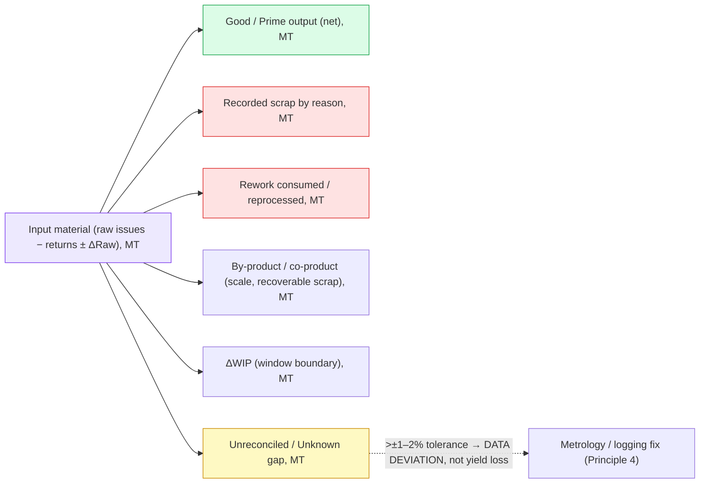
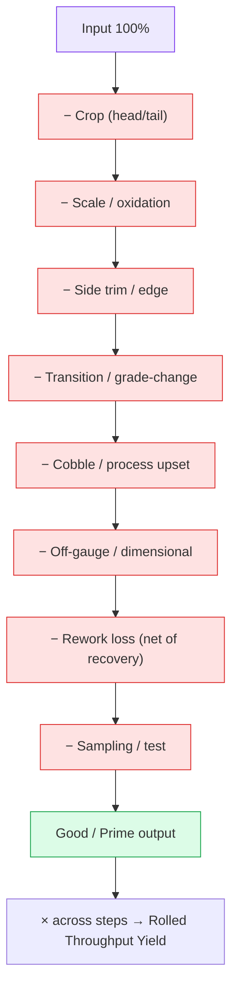
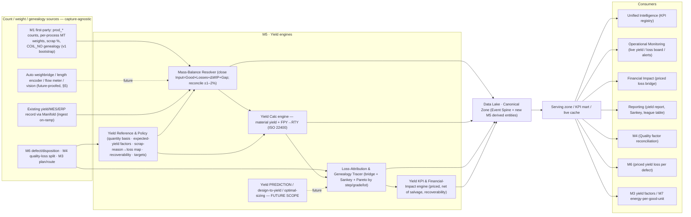
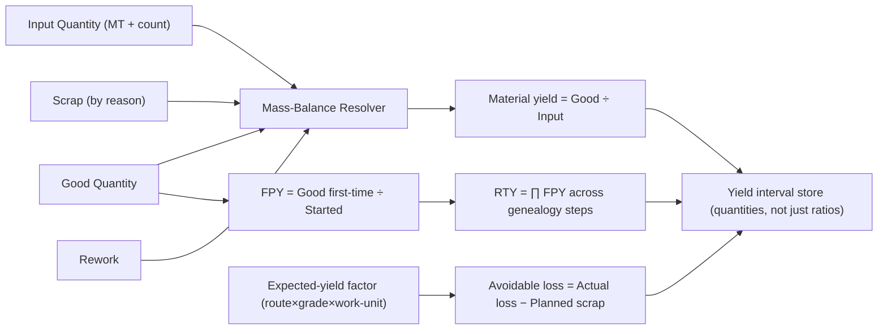
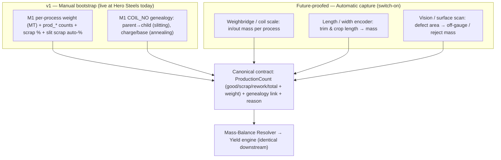
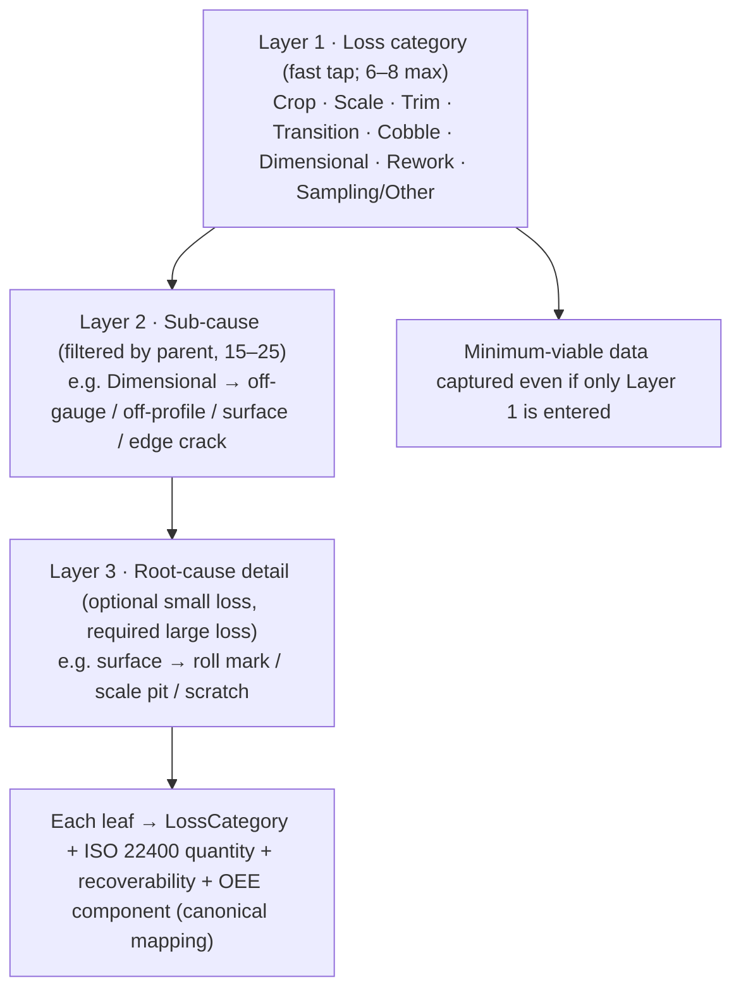
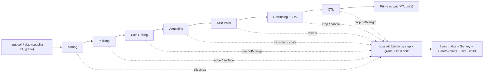
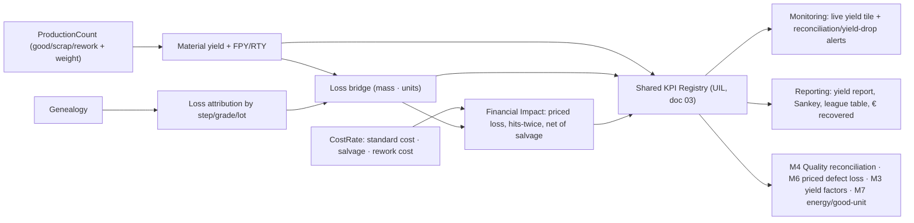
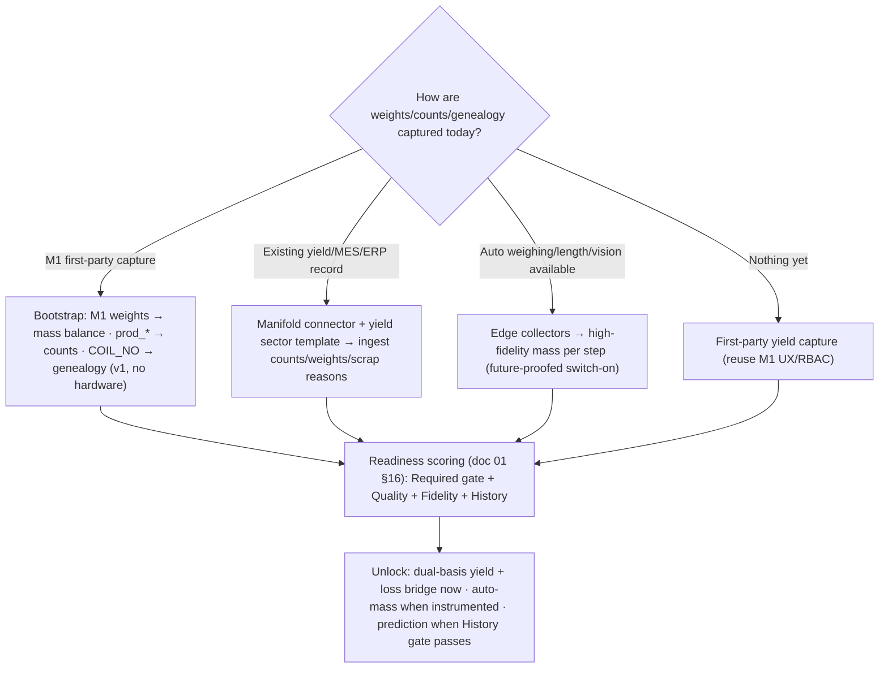

# Zedral — M5 · Yield Intelligence

### Deep Plan · v1 · Module Layer (Close the mass balance → compute yield → attribute every lost unit → price it → act)

> **What M5 is.** M5 is Zedral's **Yield Intelligence** module — the platform's *material-accounting brain*. Where M4 answers "how *effectively* did the equipment run?", M5 answers the question that hits the P&L hardest: "of every tonne and every piece we put in, how much became sellable product — and where did the rest go?" M5 takes the production counts and weights standing on the **Canonical Event Spine** (`01_DataLake_and_Canonical_Model_DeepPlan.md`), closes a **mass balance** across the whole genealogy chain (Input = Good Output + Losses + Unreconciled), computes **yield in two bases at once** — material/metallic yield (kg/MT) *and* count-based **First-Pass Yield → Rolled-Throughput Yield** (units) — decomposes every lost unit into a governed **yield-loss taxonomy** (crop, scale, trim, transition, cobble, off-gauge, rework, test), attaches a **currency value** to each loss through the Financial Impact Layer, and serves a live "what material are we bleeding right now, and what is it costing" view. M5 is the module that turns "scrap %" — a single number everyone accepts as normal — into a **mass-balanced, genealogy-traced, priced loss bridge** an executive can act on.
>
> **Why it's high-value.** Yield is, after safety, the single most leveraged operational metric in a metals plant. The economics are brutal in M5's favour: a lost tonne hits the business **twice** — the revenue is gone *and* the raw material, energy, labour and overhead already spent on it are sunk and unrecoverable. The marginal cost of a *recovered* tonne is near zero, so it flows almost directly to profit: industry reporting puts a **2-point yield improvement on a 500,000 t/yr mill at €4–7 million of pure annual profit** — more than most capital projects, some of it with zero capex. Yet yield losses are *invisible*: they trigger no alarm, they hide in crop bins and scrap buckets, and they are accepted as "normal losses." M5's value is to make them **identifiable, measurable, traceable and priced** — and to do it on the *one* canonical count/weight stream the whole platform shares, so the yield number cannot disagree with itself. It is also one of the **densest pull-through modules for connected data** (weights, counts, genealogy, grade, cost), which is the platform's core commercial wedge: the more sources are connected, the truer the yield.
>
> **What M5 is NOT.** It is **not a data-capture product** competing with M1 — it *consumes* the canonical `ProductionCount` (good/scrap/rework/total) and material weights that M1 (and future auto-weighing/length/vision) produce, and adds the mass balance, yield calculation, attribution and economics on top. It is **not the quality system of record** — M5 shares the *one* `ProductionCount`/`DefectRecord` with **M6**, but M6 owns the defect taxonomy, disposition and quality holds (the *why it's bad*) while M5 owns the material accounting and economics (the *how much was lost and what it cost*). It is **not the OEE engine** — M4 computes the OEE **Quality factor** (Good ÷ Total at a work-unit, the time-effectiveness lens) and hands the quality-loss split to M5; M5 deepens it into full material yield, multi-step RTY, the loss bridge, and yield economics. And it is **not the planning system** — M3 owns the plan; M5 *feeds* it the yield factors (expected yield per route/grade, planned scrap) that size the input. M5 is a **calculation-and-intelligence layer over a shared truth**, never a parallel truth.
>
> **Standards anchors.** Yield quantity definitions, scrap/rework/quality ratios, planned-scrap and first-pass yield from **ISO 22400-2** (Good Quantity GQ, Scrap Quantity SQ, Planned Scrap Quantity PSQ, Rework Quantity RQ, Produced Quantity PQ; Scrap Ratio = SQ ÷ PQ, Rework Ratio = RQ ÷ PQ, Quality Ratio = GQ ÷ PQ, First-Pass Yield, Production-Loss Ratio); **conservation of mass / material balance & production-accounting / data-reconciliation** practice (Input = Outputs + Loss, reconcile to ±1–2%, the loss bridge); **Lean Six Sigma** multi-step yield (**FPY → FTY → TPY → RTY = ∏FPYᵢ**, DPMO/sigma framing); the **Six Big Losses** L5 (process defects) + L6 (startup/yield) loss split from **TPM/Nakajima** (the M4↔M5 handoff); metallurgical **metallic / prime / mill-yield** benchmarks; and **lot-genealogy / traceability** practice for attributing loss to a step, tool, grade and supplier lot (the YMS-over-MES analytics pattern). KPIs reconciled to the platform's existing ISO 22400 registry so M5 and every other module speak one definition. Links in §15.

---

## 0. How M5 relates to the rest of the platform

M5 is an **intelligence contributor and a synthesiser** — it reads the canonical count/weight/genealogy stream through the Serving zone, runs the mass-balance, yield and loss-attribution engines, and writes its derived facts (yield intervals, loss attribution, the loss bridge) back so every other layer can reuse them. Like M4 it introduces very little *transactional* data of its own; its job is to make the shared production events *account for themselves*.

| Platform piece (doc) | What M5 consumes from it | What M5 gives back |
|---|---|---|
| **Data Lake · Canonical Model** (01) | `ProductionCount` (good/scrap/rework/total + weight), material genealogy (parent→child lots), `Material`/`Grade`, `DefectRecord`/`DefectCode`, `Shift/Calendar`, Asset hierarchy, `LossCategory` reference | New derived entities (MaterialBalance, YieldInterval, LossAttribution, LossBridge, YieldFactor); **brings to life** the LossCategory/quantity scaffolding the canonical model catalogued for yield |
| **Manifold** (02) | Connector to an existing yield/MES/ERP source; field-mapping of weights/counts/scrap reasons; the scrap-reason→loss→quantity mapping; sector templates; readiness/unlock | The M5 data contract; a seeded **yield sector template** (steel cold-rolling genealogy, scrap-reason tree, expected-yield factors) |
| **M1 · Shopfloor Digitization** (M1 blueprint) | First-party per-process **weights (MT)**, `prod_*` counts, scrap % + slit scrap, the **COIL_NO genealogy** (slitting parent→child, anneal charge/base), `shift_log` time spine — the **v1 bootstrap source** | Yield per process/coil/grade/shift back into M1's reporting; the loss bridge that prioritises the floor's attention |
| **M4 · OEE & Downtime** | The OEE **Quality-loss split** (scrap/rework units, L6 startup/yield), the operating-time context for a yield window | The reconciled **material yield** behind M4's Quality factor (Q factor and FPY agree by construction); recoverability of quality loss |
| **M6 · Quality Intelligence** | `DefectCode` / `DefectRecord` / disposition (scrap vs rework vs downgrade) — *why* a unit is bad | The **priced material/yield loss** per defect (M6 ranks quality projects by € of yield loss, not just defect counts) |
| **M3 · Shopfloor Planning & Management** | The plan/route, planned quantities, grade/route mix | **Yield factors** (expected yield per route×grade, planned-scrap PSQ) so M3 sizes the input correctly; actual-vs-expected yield feedback |
| **M7 · Energy Intelligence** | — | The **good-output basis** (good MT/units) so M7 computes energy-per-good-unit and the embedded-energy waste in scrap |
| **Unified Intelligence Layer** (03) | KPI registry, cross-module synthesis | Material yield, FPY/RTY, scrap/rework ratios, the loss bridge, € of yield loss into the shared KPI registry |
| **Operational Monitoring** (03) | Live count/weight cache off the streaming path | Live **yield tile**, running scrap/transition-loss board, reconciliation-gap & yield-drop alerts |
| **Financial Impact Layer** (07 spec) | `CostRate` (material standard cost, salvage/scrap value, rework cost) "rate-as-of" (D7) | Priced loss bridge — the **cost of every lost kg/unit**, net of salvage, the "hits-twice" view |
| **Reporting Layer** (05) | Same canonical KPI numbers | Yield report, loss-bridge/Sankey, yield-by-grade league table, supplier-lot yield, € recovered |

**The golden rule (inherited):** consumers never write M5's tables and M5 never writes another module's — everything moves through the canonical model and versioned Serving APIs. A produced quantity is recorded **once** as a canonical `ProductionCount`; **M4 reads it** as the OEE Quality factor, **M3 reads it** as plan attainment, **M6 reads it** as a defect/disposition event, **M5 reads it** as material yield and decomposes the loss. One count truth, one weight truth, one genealogy — never double-counted (§12).

---

## 1. Responsibilities & principles

M5 owns eight responsibilities: **(1)** maintain the **yield reference & policy data** (the quantity basis per work-unit×material, expected/standard yield factors, planned-scrap, the scrap-reason→loss→quantity mapping, loss recoverability classes, yield targets); **(2)** **close the mass balance** per lot/process/window (Input = Good + Scrap + Rework + By-product + ΔWIP + Unreconciled) and flag the reconciliation gap; **(3)** **compute yield in two bases** — material yield (mass) and FPY→RTY (count) — per asset × material × time bucket, reconciled to ISO 22400; **(4)** **build the loss bridge** — decompose every lost unit/kg by step, category, grade, and cost into a Pareto and a Sankey; **(5)** **trace loss through the genealogy** so a yield gap points at a process, a grade, a tool, a supplier lot; **(6)** **price every loss** through Financial Impact, net of salvage and recoverability; **(7)** surface a **live yield / loss-bridge / reconciliation board & alerts**; **(8)** stand **prediction-ready** (yield forecasting, design-to-yield, optimal-input-sizing) without a data re-model.

Principles:

1. **One yield truth, mass-balanced.** Yield's chronic disease is that "scrap %" is computed differently by every department and never closes against the material actually purchased. M5 computes yield from the *single* canonical count/weight stream and **forces the books to balance** — Input = Good + Losses + Unreconciled — so production, quality and finance can never again quote three different yields. Conservation of mass is the cure for "where did the metal go?"
2. **The loss bridge is the product, not the percentage.** A single yield number changes no behaviour. The value is the **decomposition** — which loss category, on which process, on which grade, costing how much. M5 is built top-down as a loss bridge (waterfall) and a Sankey; the headline yield is just its root.
3. **Dual-basis by design — mass *and* count, at parity.** A coil can pass as one "good unit" (count FPY ≈ 100%) while quietly losing 4% of its mass to crop, trim and scale (material yield 96%); conversely a batch can hold its mass while a third of the pieces are reworked. **Mass yield catches what unit-FPY hides, and FPY/RTY catches what mass-of-a-passing-lot hides.** M5 stores quantities in *both* bases and computes *both* — neither is a second-class citizen.
4. **Separate real loss from measurement error.** The reconciliation gap is sacred. When Input − Output exceeds the tolerance (±1–2%), that is a **metrology/logging deviation**, not a process discovery — scale drift, an unrecorded spill, a moisture/basis mismatch. M5 surfaces it as a data-quality deviation and refuses to let it masquerade as yield loss, so the floor never chases a process change that is really a broken weighbridge.
5. **Every lost unit has a cost *and* a recoverability class.** No lost kg/unit is recorded without the hooks to price it and to classify it as **pure loss** (scale/burning → gone), **salvage** (crop/cobble/off-gauge → sold as scrap at a fraction of value), or **recoverable** (rework/re-roll → made good at added cost) — and to flag **planned scrap (PSQ)** that is designed-in versus avoidable. Pricing is the "hits-twice" model: lost margin *plus* sunk conversion cost, net of salvage.
6. **Capture-agnostic, aggregation-faithful.** M5 does not care *how* a count or weight arrived — operator entry (M1), a weighbridge tag, a length encoder, a flow meter, or an ingested ERP/MES yield record. It treats every source through the same canonical contract and computes identically. v1 **bootstraps from M1's per-process weights, counts, scrap % and COIL_NO genealogy** (already live at Hero Steels) and is **architected for automatic weighing/length/vision capture** as the high-fidelity path (§5). Roll-ups **sum masses and counts along the genealogy and then divide** — never average sub-yields (the Simpson's-paradox trap, forbidden structurally as in M4).
7. **Sector-neutral core, sector-specific skin.** The mass-balance / yield / loss-bridge model is generic; a **sector template** instantiates it concretely (Hero Steels cold-rolling genealogy, scrap-reason tree, expected-yield factors in §10) and reuses across clients via Manifold. The same engine serves a continuous steel line (mass-dominant) and a discrete plant (count-dominant) by switching the quantity basis, not the code.
8. **Prediction by design, not by rebuild.** v1 is descriptive/diagnostic (what yield, where the loss, what it cost). The mass-balance + loss-attribution + cost substrate *is* the training data for later yield prediction, design-to-yield, and optimal-input-sizing; we future-proof now and gate the ML build on accumulated yield history (§8), exactly as M4 does for loss prediction and M2 for predictive maintenance.

---

## 2. The yield & loss conceptual frame (the scope map)

Everything M5 does sits on two interlocking ideas: the **mass balance** (conservation of mass — how the input is accounted for) and the **yield-loss taxonomy** (why material and units are lost). Together they *are* M5's scope map. Yield is expressed in **two bases at once** (Principle 3).

**The two yield bases (equal-weight, per user scoping).**

| Basis | Definition | Native to | Catches | Misses alone |
|---|---|---|---|---|
| **Material / mass yield** | Good Output mass ÷ Input mass (kg/MT) | continuous / process / steel | crop, scale, trim, the *material* bled by a "good" lot | a passing lot that was reworked twice; piece-level reject counts |
| **Count yield — FPY → RTY** | Good Units first time ÷ Units started; RTY = ∏ FPYᵢ across steps | discrete / Six-Sigma | reject/rework *events*, multi-step compounding | the mass quietly lost inside a unit that still "passes" |

M5 carries both because each is blind where the other sees. The **quantity basis** (`MASS` / `COUNT` / `BOTH`) is per-work-unit×material configuration; where both exist, M5 computes and reconciles both.

**The mass balance (the spine of material yield).** Every analysis window and every lot must close:

**The loss bridge (the why — a priced waterfall).** Once the balance closes, the loss between Input and Good Output is decomposed step-by-step. This waterfall *is* the M5 product:

**Mapping loss to OEE Quality and the Six Big Losses (the M4↔M5 seam).** M5's loss categories roll up into exactly the two Quality losses M4 splits, so the two modules close to the same number:

| Yield-loss category | ISO 22400 quantity | Six Big Loss | Recoverability | Canonical carrier |
|---|---|---|---|---|
| Crop (head/tail) | Scrap (often Planned PSQ) | L6 startup / yield | salvage | `ProductionCount.scrap` + reason |
| Scale / oxidation | Scrap (pure) | L6 yield | pure loss | weight delta + reason |
| Side trim / edge | Scrap (often PSQ) | L6 yield | salvage | `ProductionCount.scrap` + reason |
| Transition / grade-change | Scrap | L6 startup | salvage / downgrade | startup window + reason |
| Cobble / process upset | Scrap | L1/L5 (event-linked) | salvage | `DowntimeEvent`↔`ProductionCount` |
| Off-gauge / dimensional | Scrap or Rework | L5 defect | salvage / recoverable | `ProductionCount.scrap/rework` + `DefectRecord` |
| Rework / re-roll | Rework (RQ) | L5 defect | recoverable | `ProductionCount.rework` |
| Sampling / test | Scrap (PSQ) | L6 yield | pure loss | `ProductionCount.scrap` + reason |

**What's in v1 vs future.** v1 computes the full dual-basis yield + mass balance + priced loss bridge + genealogy attribution, descriptive/diagnostic. The **yellow** capability — *predicting* yield, optimal input sizing / design-to-yield, transition-loss forecasting, and prescriptive "do this to recover yield" — is architected now and built later (§8), gated on accumulated yield history.

---

## 3. M5 reference architecture

**Reading it:** counts/weights/genealogy arrive from M1 (v1), from automatic weighing/length/vision (future-proofed), or from an ingested yield/ERP record; the **Mass-Balance Resolver** closes the books and flags the reconciliation gap; the **Yield Calc engine** computes material yield *and* FPY→RTY to ISO 22400; the **Loss-Attribution & Genealogy Tracer** builds the loss bridge, the Sankey and the Pareto and points each loss at a step/grade/lot; the **KPI/Financial engine** prices it net of salvage and recoverability; everything is written to the canonical zone and served to the intelligence/monitoring/financial/reporting layers and back to the sibling modules. Engine **E6 (prediction)** is wired in but dark until the yield history and the model build land.

---

## 4. The yield calculation engine

M5's calculation core is deliberately exact and **ISO 22400-literal**, so the number is defensible to any auditor, any sceptical plant team, and — critically — to finance, who will reconcile it against material purchased.

**The dual-basis yield definitions (ISO 22400-2 quantities + Lean multi-step yield):**

| Metric | Formula | Plain meaning |
|---|---|---|
| **Material / mass yield** | Good Output mass ÷ Input mass | of the metal we put in, how much left as sellable product? |
| **First-Pass Yield (FPY)** | Good Units (first time, no rework) ÷ Units started | of the pieces we started, how many were right first time? |
| **Throughput Yield (TPY)** | Good Units ÷ Units processed at a step | per-step first-time success |
| **Rolled-Throughput Yield (RTY)** | ∏ FPYᵢ over all steps | probability a unit clears *every* step clean — the hidden multi-step truth |
| **Quality Ratio** | Good Quantity ÷ Produced Quantity | ISO 22400 first-pass quality (reconciles to M4's Quality factor) |
| **Scrap Ratio** | Scrap Quantity ÷ Produced Quantity | the bad-product rate |
| **Rework Ratio** | Rework Quantity ÷ Produced Quantity | the recoverable-loss rate |

**The quantity model (the denominators must be unambiguous).** M5 adopts the ISO 22400 quantity hierarchy verbatim and tags every quantity with its **basis** (mass/count) and **disposition**:

| Quantity | Definition | M5 source |
|---|---|---|
| **Input Quantity (IQ)** | raw material issued to the lot/window, net of returns, ± ΔRaw | M1 charge/coil weight, ERP issues |
| **Produced Quantity (PQ)** | total output of an operation (good + scrap + rework) | `ProductionCount.total` / weight |
| **Good Quantity (GQ)** | meets spec first time | `ProductionCount.good` |
| **Scrap Quantity (SQ)** | does not meet spec, scrapped/recycled | `ProductionCount.scrap` |
| **Planned Scrap Quantity (PSQ)** | scrap *expected* by the process (standard crop, trim, sampling) | yield-factor reference |
| **Rework Quantity (RQ)** | fails spec but recoverable by reprocessing | `ProductionCount.rework` |
| **By-product / co-product** | non-prime output with salvage value (scale, recoverable scrap) | weight + cost-rate |

**Planned vs avoidable scrap (the honesty line).** Not all yield loss is an "opportunity." A standard head/tail crop or a quality-test sample is **planned scrap (PSQ)** — designed into the process. M5 separates **PSQ (expected)** from **avoidable loss (actual − planned)**, so the improvement Pareto ranks only what can actually be recovered, and a plant is never shamed for the metallurgically unavoidable. The expected-yield factor per route×grade *is* the PSQ baseline.

**Roll-up rule (no Simpson's-paradox averaging).** Yield never averages percentages. M5 rolls up by **summing the underlying masses and counts** along the genealogy and across time (lot → process → line → plant; shift → day → week → month) and *then* dividing — so a plant yield is computed from total input and total good output, never from a mean of sub-yields. RTY, by contrast, **multiplies** per-step FPYs (that is its definition) — M5 keeps the two roll-up algebras distinct and never confuses them. The mart stores **quantities, not just ratios**, so both algebras stay exact.

**The expected-yield problem (the make-or-break reference).** Avoidable loss is only as honest as the **expected/standard yield** it is measured against. M5 makes this a first-class, versioned reference keyed by **route × grade × work-unit** (a thin hard grade and a thick soft grade crop and scale differently), with three population paths: (a) engineering/metallurgical standard, (b) a **demonstrated best** (e.g. 90th-percentile sustained observed yield), (c) imported from M3's plan/BOM yield factor. The readiness model flags any route whose avoidable-loss number rests on an *uncalibrated* expected yield, so yield is never silently judged against a guess.

---

## 5. Yield data capture & the on-ramp decision

Yield is only as good as the counts and weights underneath it. This is where M5's defining scope decision lives: **v1 bootstraps from M1's manual per-process capture; automatic weighing / length / flow / vision is fully architected as the high-fidelity future path.** Same canonical contract, two fidelities.

**The genealogy is the spine.** Material yield is meaningless without knowing *what became what*. M5 requires a **genealogy** — parent lot → child lot(s) with weights at each transformation — and Hero Steels' M1 already provides exactly this: the **COIL_NO** spine, with slitting creating parent→child coils, annealing grouping coils into charge/base, and a per-process weight in MT at every step. That genealogy lets M5 trace an input slab/HR-coil weight all the way through **HR Slitting → Pickling → Cold Rolling → Annealing → Skin Pass → Rewinding → CRS → CTL** to the prime output, attributing every lost kg to the step where it vanished — and to compute RTY across the chain as the product of per-step yields.

**Two capture fidelities, one contract.**

**v1 — bootstrap from M1 (cheapest first value).** M1 already captures, at Hero Steels, per-process weights in MT, production counts, scrap %, the slitting scrap auto-calculation, and the COIL_NO genealogy — exactly the four things yield needs. M5 maps M1's scrap categories onto the canonical scrap-reason→loss→quantity model, treats the per-process weights as the mass-balance inputs/outputs, walks the COIL_NO genealogy to compute per-step and rolled yield, and computes the full dual-basis yield per process/coil/grade immediately, with **no new hardware**. This is the on-ramp that makes M5 deliver value on day one for any M1 client.

**Future-proofed — automatic weighing/length/vision (the fidelity upgrade).** Manual capture has known blind spots: **weights are often rounded, crop and trim lengths are estimated, and scale loss is inferred rather than measured** — so the reconciliation gap (§4) is wider and some loss hides inside it. M5 is architected so an automatic in/out **weighbridge or coil scale** can measure true mass at each process, a **length/width encoder** can convert crop and trim directly to mass, and a **surface-vision system** can turn defect area into off-gauge/reject mass — emitting the *same* canonical `ProductionCount` rows at higher fidelity. None of M5's downstream engines change; only the fidelity (and the readiness score) rises, and the reconciliation gap shrinks toward the true ±1% of production-accounting practice. The sensor mappings and collector interfaces are specified now (Dev_Handover spec 03/07) and built when a client instruments the line — exactly the M4 "future-proof, switch-on" pattern.

**Why the reconciliation gap matters (the data-honesty seam).** The gap between Input and accounted Output is M5's truth-meter. A small gap (≤1–2%) is normal measurement noise; a large or *drifting* gap means a broken scale, an unrecorded movement, or a wet/dry basis mismatch — a **data deviation**, not a yield discovery (Principle 4). M5 makes the gap explicit per lot/process/window, trends it, and routes it to data-quality rather than letting it inflate or deflate the yield number. This is what lets finance trust the yield against material purchased.

---

## 6. Yield-loss taxonomy & reason codes

The loss bridge is M5's product (Principle 2). Its leaves are **scrap/loss reason codes**, and getting the taxonomy right is the difference between an actionable bridge and a "miscellaneous scrap" black hole. M5 adopts the on-the-ground best practices the research is unanimous on, and the steel-specific loss anatomy directly.

**The steel yield-loss anatomy (grounded in mill practice).** Bar/long-product reporting puts the categories at roughly: **crop 40–50%**, **cobbles & mill stoppages 15–25%**, **dimensional/quality rejects 10–20%**, **scale & oxidation 8–12%**, **scarfing/conditioning 5–10%**, **sampling 2–4%** of total yield loss — with cold-rolling adding **side trim, transition coils (grade/temper change), unrolled strip on reels, and off-gauge head/tail**. M5 seeds these as the steel sector template's Layer-1/2 reasons.

**Three-layer reason hierarchy (operator-first, mirrors M4's downtime tree).**

Design rules M5 enforces, drawn directly from practice and shared with M4's reason-tree discipline:

- **6–8 top categories, never more.** Operators select a primary loss category in seconds; that alone is minimum-viable data even if detail is never entered.
- **No more than 15–20 options at any one level**, filtered by the parent so an operator only sees relevant sub-causes.
- **Capture the symptom, not the diagnosis.** Reasons describe *what was observed* ("strip break", "edge crack", "grade transition"), not an inferred root cause — that raises the probability the right code is picked. (Root-cause diagnosis of *defects* is M6's job on the same record.)
- **Govern the "Other / unclassified" bucket.** Exactly one "Other" reason exists; when it climbs into the loss-bridge top-3 or above ~10%, M5 auto-prompts "your Other bucket is now a top loss — split it." This is the single biggest defence against an unactionable Pareto.
- **6–12 active reasons per work-unit is the sweet spot** — a short, well-chosen list beats an exhaustive one.

**The canonical mapping (the bit that makes losses add up).** Every loss-reason code carries, in canonical reference data: a `loss_category_ref` (the yield-loss category), an **ISO 22400 quantity class** (SQ / PSQ / RQ), a **recoverability class** (pure / salvage / recoverable), and an `oee_component` (always Quality for yield losses — L5/L6). This is what lets the loss bridge close: Σ(scrap by reason) + Σ(rework) + by-product + ΔWIP + gap = Input − Good, *and* it lets M5's Quality-loss reconcile to M4's Quality factor (same units, one mapping). The mapping is seeded by the sector template and tunable per tenant.

**Pareto & loss bridge.** M5 continuously ranks losses **by mass, by units, and by cost** (they rank differently — a high-tonnage crop loss may cost less than a low-tonnage transition of premium grade) into a loss bridge per work-unit/line/plant/grade/shift. "The biggest tonnage loss" and "the most expensive loss" are often not the same event, and the executive wants the second one.

---

## 7. Mass balance, genealogy attribution & yield intelligence

The two things plants under-measure most in yield are **where in the chain the loss actually happened** (genealogy attribution) and **whether the books even close** (reconciliation). M5 makes both first-class — this section is M5's deepest differentiation over a flat "scrap %".

**Mass-balance reconciliation (close the books first).** Before any yield number is published, M5 closes Input = Good + Scrap + Rework + By-product + ΔWIP + Unknown for the window and the lot, reconciles to the ±1–2% tolerance, and gates: if the gap exceeds tolerance, the window is flagged **provisional / data-deviation** and the gap is routed to data-quality, not into the loss bridge (Principle 4). Only a closed balance yields a trusted number. This is the discipline production-accounting software (e.g. reconciled material balance) brings to refineries and chemical plants, applied to the metals genealogy.

**Genealogy attribution (where did the metal go).** Walking the COIL_NO genealogy, M5 attributes each lost kg/unit to the **process step** that consumed it, then by **grade**, **route**, **tool/work-unit**, **shift**, and **input supplier lot** — so a yield gap is never just "the plant lost 4%" but "Cold Mill lost 1.8 pts on grade X, two-thirds of it side-trim on the 1250 mm width, concentrated on supplier-lot 42." This is the YMS-over-MES pattern (analytics over capture) applied to steel: M1 records the genealogy, M5 reconstructs the lineage and finds the loss.

**Yield by every dimension.** From the attributed facts M5 serves yield and loss sliced by **process step, grade, route, work-unit, shift, crew, and input supplier lot** — the heatmaps and league tables that turn a flat number into a target list. Supplier-lot yield spread (some input coils simply yield worse) is a recurring high-value finding: it surfaces incoming-material problems that look like process problems.

**Transition & startup loss (L6) — the cold-rolling special.** Grade/temper changes on continuous lines (especially continuous annealing) force a transition where off-spec material is produced during the change — a major, often-unmeasured yield loss that ties directly to **M3's sequencing** (group like grades to cut transitions, the yield analogue of M4's wide→narrow campaign). M5 measures transition loss explicitly using the production window (transition vs steady), prices it, and feeds the cost back to M3 so sequencing decisions can trade setup time against transition yield.

**Rework economics (recoverable ≠ free).** Rework (re-rolling, re-tempering) recovers the material but at added conversion cost and capacity. M5 accounts rework as **recoverable loss net of recovery cost** — counted once at consumption (never double-counted as both scrap and rework), with the added processing cost included — so "we reworked it, no loss" is corrected to its true economic figure.

---

## 8. Predictive / ML — FUTURE SCOPE (architected now)

Predicting and *designing out* yield loss is the operating-model's post-6-month → prescriptive horizon, **gated on accumulated yield history**. v1 is descriptive/diagnostic; we design so prediction is a switch-on.

| Capability | v1 | Future scope |
|---|---|---|
| Yield level | compute, attribute, bridge, price (descriptive) | **yield forecasting** per route×grade from history + process parameters |
| Input sizing | expected-yield factors (static) | **optimal-input-sizing / design-to-yield** — recommend charge/coil size & crop to hit target output (cut crop %) |
| Transition loss | measure & price | **predicted transition-loss windows** → optimal grade sequencing (feeds M3) |
| Supplier/material | yield-by-lot spread (diagnostic) | **incoming-yield prediction** from lot certificates (thickness/composition) → sort/contain before processing |
| Decision support | loss bridge + alerts (diagnostic) | **prescriptive**: "this route will under-yield — change sizing/sequence/spec now" (2–3 yr) |

**What v1 must get right so this is a switch-on, not a rebuild:** (a) **closed, reconciled mass balances + labelled loss reasons** from day one (the training labels); (b) **calibrated expected-yield factors** (so avoidable-loss series are real, not noise); (c) **loss attribution joined to genealogy, grade, supplier lot and cost** (the features and the objective); (d) a **prediction-readiness (History) gate** in the readiness model (§11) reporting per route×grade when there is enough labelled yield history to train. No prediction *promises* in v1 — only prediction *readiness*. M5's yield-prediction shares the platform's ML-readiness substrate with M4 (loss) and M2 (PdM): a grade-transition that predicts both a yield-loss window (M5) and a quality-defect risk (M6) is one shared model surface, not three.

---

## 9. Yield KPIs, analytics & financial impact

M5's contribution to the **shared KPI registry** (doc 03), all reconciled to the platform's **ISO 22400** definitions so no module disagrees.

| KPI | Formula | Meaning / target |
|---|---|---|
| **Material / mass yield** | Good Output mass ÷ Input mass | headline material effectiveness (steel: ~92–98% typical by product) |
| **First-Pass Yield (FPY)** | Good first-time ÷ Started | per-step right-first-time |
| **Rolled-Throughput Yield (RTY)** | ∏ FPYᵢ across steps | clean-through-the-whole-chain probability (exposes multi-step compounding) |
| **Quality Ratio (ISO 22400)** | Good ÷ Produced | reconciles to M4's Quality factor |
| **Scrap Ratio** | Scrap ÷ Produced | bad-product rate |
| **Rework Ratio** | Rework ÷ Produced | recoverable-loss rate |
| **Avoidable yield loss** | Actual loss − Planned scrap (PSQ) | the *recoverable* opportunity (the honest target) |
| **Loss bridge / Pareto** | loss by category × step × grade (mass · units · cost) | where the yield gap actually is |
| **Reconciliation gap** | \|Input − accounted Output\| ÷ Input | data-trust meter (target ≤1–2%) |
| **Cost of yield loss** | Σ (loss mass × (standard cost − salvage) + rework cost) | the € the loss bridge is really worth |

**The financial story (per Principle 5 — the "hits-twice" model).** Yield is where the platform's Financial Impact Layer is most powerful, because the economics are stark and well-evidenced. Every lost tonne loses the **sale** *and* the **sunk conversion cost** (raw material, energy, labour, overhead already spent) — and the marginal cost of a *recovered* tonne is near zero, so recovered yield flows almost directly to profit. M5 prices each loss leaf as **lost margin + sunk conversion cost, net of salvage and net of rework recovery**, using `CostRate` (D7, rate-as-of-event). This turns "scrap is 4%" into "₹X/year, of which ₹Y is avoidable" and ranks the loss bridge by money — the version that changes the budget conversation. Worked at industry scale: a 2-point yield gain on a 500,000 t/yr line is on the order of €4–7 million of annual profit, much of it low/zero-capex (batch sizing, sequencing, crop optimisation) — which is exactly why "yield is the most important operational metric after safety."

---

## 10. Sector-neutral model + Hero Steels instantiation

The model is **generic** and an instantiation makes it **concrete** — the same primitives (mass balance, dual-basis yield, loss bridge, genealogy attribution) describe any plant; a sector template fills them in.

**Generic yield archetypes** (any sector): continuous/process (mass-dominant — yield = good mass ÷ input mass, loss bridge by trim/scale/transition) vs discrete (count-dominant — FPY/RTY across operations) vs batch (charge-based — yield per batch, startup/transition loss dominates); the appropriate "expected yield" (metallurgical standard vs demonstrated-best vs BOM factor); whether a loss is planned scrap or avoidable.

**Hero Steels cold-rolling instantiation** (anchors the model to the real M1 plant; reuses the M1 COIL_NO genealogy, per-process weights, scrap categories and counts it already captures):

| Yield concept | Generic | Hero Steels cold-rolling |
|---|---|---|
| Quantity basis | mass and/or count | **mass (MT) primary** per process + **count** at CTL (pieces/bundles); both carried |
| Genealogy spine | parent→child lots | **COIL_NO**: slitting parent→child, annealing charge/base grouping |
| Input Quantity | raw issued | incoming HR coil / slab weight (supplier lot) |
| Process chain (RTY steps) | operations | HR Slitting → Pickling → Cold Rolling → Annealing → Skin Pass → Rewinding → CRS → CTL |
| **Crop loss (L6)** | head/tail | head/tail crop at slitting & CTL; off-length |
| **Scale / oxidation (L6)** | reheat/anneal oxidation | annealing scale; pickling metal loss |
| **Trim loss (L6)** | edge trim | side/edge trim to width; slit scrap (M1 auto-%) |
| **Transition loss (L6)** | grade/temper change | grade/temper transition on anneal — ties to M3 sequencing |
| **Cobble / upset (L1/L5)** | process upset | mill cobble, strip break (event-linked to M4 downtime) |
| **Dimensional / surface (L5)** | off-spec | off-gauge, off-profile, surface defects (→ M6 defect codes) |
| **Rework (L5)** | reprocess | re-rolling, re-temper genealogy (skin-pass re-roll) |
| Expected-yield factor | standard yield | metallic/prime yield by grade×gauge×width; PSQ = standard crop+trim+sample |
| Output / counts | good/scrap/total | M1 `prod_*` per process, scrap %, MT basis; CTL pieces→MT |

**Reusing M1.** M1's per-process weights become the mass-balance inputs/outputs; M1's scrap categories and slit-scrap auto-% become canonical loss reasons (M5 attributes them); M1's COIL_NO genealogy is the lineage M5 walks. The **steel cold-rolling yield sector template** (seeded in Manifold, doc 02) carries the genealogy shape, the scrap-reason→loss mapping, the recoverability classes, and the expected-yield factor table — so the next steel client's yield lights up with no re-modelling. **D11 note:** because the core is sector-neutral, validating M5 on a **discrete** client (clean piece counts, FPY/RTY-native, BOM yield factors) is a clean way to exercise the *count* basis hard and retire the "only-tested-on-Hero-Steels" risk (R1/W1, doc 04) — the dual-basis design means M5 covers both the continuous-mass and discrete-count worlds from one engine.

---

## 11. Data contract & readiness (the M5 row)

M5's machine-readable data contract (the basis for Manifold's module-unlocking, doc 01 §15). ● Required · ○ Additional.

| Canonical entity / group | M5 need | Notes |
|---|:--:|---|
| **ProductionCount** (good/scrap/rework/total **+ weight**) | ● | the dual-basis yield spine (shared with M4/M3/M6) |
| **Material genealogy** (parent→child lots + weights) | ● | the mass-balance & RTY backbone (M1 COIL_NO) |
| **Material / Grade** reference | ● | yield is meaningless without grade context |
| **Scrap/Loss ReasonCode + LossCategory** reference | ● | the controlled vocabulary M5 brings to life |
| **Expected-yield factor** (route × grade × work-unit) | ● | *new M5 entity* — the PSQ / avoidable-loss baseline |
| **Shift / Calendar** | ● | the time bucket for yield windows |
| Asset hierarchy (Site→WorkCenter→WorkUnit) | ● | the yield roll-up tree |
| **Input Quantity** (raw issued, ERP/M1) | ● | the mass-balance numerator-of-record |
| DefectCode / DefectRecord (M6) | ○ | refines defect-driven yield loss |
| Maintenance/downtime link (M4/M2) | ○ | ties cobble/upset loss to events |
| CostRate (standard cost, salvage, rework) | ○ | unlocks financial impact — strongly recommended |

**New canonical/derived entities M5 introduces** (additive, per doc 01 §14 versioning rule): `YieldConfig` (per-tenant policy: quantity basis, reconciliation tolerance, expected-yield source), `ExpectedYieldFactor` (route×grade×work-unit, versioned, calibrated-flag), `MaterialBalance` (closed Input=Output+Loss+Gap per lot/window), `YieldInterval` (computed material yield + FPY/RTY + quantities per asset×material×bucket), `LossAttribution` (mass/units/cost per loss leaf, genealogy-traced), `LossBridge` (waterfall snapshot), `YieldFactorFeedback` (actual-vs-expected → M3). The canonical `ProductionCount`, `LossCategory`, genealogy links and `DefectRecord` **already exist** in the canonical catalog (doc 01 §10) — M5 is the module that finally **brings the material/quantity side to life** and adds only the *derived* yield layer. M5 owns almost no new transactional data — it is, by design, a thin-write / heavy-read module (like M4).

**On-ramps to readiness** (capture-fidelity-aware, §5):

The readiness model is the platform's existing one (doc 01 §16) with **two M5-specific sub-gates**: a **Fidelity gate** (manual vs automatic weighing? is genealogy complete? is the expected-yield factor calibrated? is the reconciliation gap within tolerance?) that drives the *confidence* shown beside every yield number (Principle 7/4), and a **prediction-readiness (History) gate** that reports when a route×grade has enough labelled yield history to train the §8 models. So the UI honestly shows "yield here is indicative (weights estimated, gap 3%)" rather than a falsely precise figure.

---

## 12. Integration & boundaries

| Boundary | M5 owns | The other side owns | Shared artifact |
|---|---|---|---|
| **M5 ↔ M4 (OEE)** | full **material yield**, FPY/RTY, the loss bridge, yield economics, recoverability | the OEE **Quality factor** (Good÷Total at a work-unit, time-effectiveness lens) + the quality-loss split | the single `ProductionCount` (M4 reads Q factor, M5 reads material yield; agree by construction) |
| **M5 ↔ M6 (Quality)** | *how much* material was lost & what it **cost** (material accounting & economics) | the **defect taxonomy, disposition, quality holds, SPC, root cause** (the quality SoR — *why* it's bad) | the single `DefectRecord` / `ProductionCount` (M6 classifies, M5 accounts) |
| **M5 ↔ M3 (Planning)** | **yield factors** (expected yield, PSQ), actual-vs-expected feedback, transition-loss cost | the plan/route/sequence; input sizing decisions | `ExpectedYieldFactor`, transition-loss → sequencing |
| **M5 ↔ M1** | yield calculation & material intelligence | first-party capture of weights/counts/scrap/genealogy at source | `ProductionCount`, weights, COIL_NO genealogy |
| **M5 ↔ M2 (Maintenance)** | yield loss from a process upset/cobble | the failure that caused the upset | event-linked `DowntimeEvent` ↔ `ProductionCount` |
| **M5 ↔ M7 (Energy)** | the **good-output basis** (good MT/units) | energy-per-good-unit, embedded-energy waste in scrap | `ProductionCount.good` |
| **M5 ↔ Manifold** | the M5 data contract + yield sector template | yield/ERP/MES connectors, field-mapping, readiness | sector template library |
| **M5 ↔ UIL** | yield/FPY/RTY + loss bridge + € | cross-module synthesis (yield↔OEE↔quality↔plan↔cost), exec rollups | shared KPI registry |
| **M5 ↔ Monitoring** | live yield tile, loss board, reconciliation/yield-drop alerts | live cache, alert delivery | streaming path |
| **M5 ↔ Financial Impact** | what to price (every loss leaf, net of salvage/recovery) | the cost-rate engine & "rate-as-of" provenance (D7) | `CostRate` |

The **two lines to get right** are with M4 and M6, and both follow one discipline: **the count/defect is recorded once; M5 aggregates the material/economic view, the sibling owns its own view.** A produced quantity is one `ProductionCount` — **M4 reads it as the OEE Quality factor** (time-effectiveness), **M5 reads it as material yield** (mass/economics); M5's Quality-loss split and M4's Quality factor are computed from the *same* good/total with the *same* ISO 22400 mapping, so they **agree by construction** — never two yields. A bad unit is one `DefectRecord` — **M6 classifies the defect and decides disposition** (scrap/rework/downgrade), **M5 accounts the material and the money** of that disposition; neither double-counts. This single-truth discipline is the whole reason the platform can finally end the "production says yield is 96%, finance says material usage says 93%" argument: the mass balance closes against purchased material, once.

---

## 13. RBAC & operations (brief)

Roles extend M1's model (Operator / Supervisor / Plant-Head / Admin) with yield-specific personas: **Operator** (sees the live yield tile for their line, confirms scrap reasons & weights), **Shift Supervisor** (shift yield, loss bridge, validates reason coding & the reconciliation gap), **Yield / Process / Metallurgy Engineer** (configures expected-yield factors, scrap-reason tree, recoverability classes, quantity basis; runs loss & supplier-lot analysis), **Cost / Finance analyst** (reads the priced loss bridge, reconciles yield against material purchased — read-only), **Plant Manager** (yield trends, € of avoidable loss; read-only analytics), **Admin** (masters, integration, capture-fidelity config, yield policy). Because yield configuration (expected-yield factor, planned-scrap, basis, tolerance) directly moves the avoidable-loss number, **every policy change is audit-logged** with effective dating, so a yield trend is never silently broken by a re-definition. First-party/edge capture is **offline-tolerant** like M1 (queue locally, sync on reconnect). The yield engine runs on the streaming path for the live tile and as scheduled rollups for the mart; recomputation is **deterministic and replayable** from the canonical events (a corrected scrap reason or weight re-derives the affected balances and bridges without manual patching). Row-level scoping by site/area as in M1.

---

## 14. MVP migration bridge, build sequence & open decisions

**MVP migration bridge (target design + migration).** The operating model notes M5 **dashboards & insights are already built**. This plan describes the **target** M5 against the canonical model; the existing build is the head-start, not the constraint. The bridge:

| Existing M5 today (dashboards + insights) | Target M5 | Migration path |
|---|---|---|
| Yield % from its own query / a direct M1 or ERP feed | Yield from the **canonical ProductionCount + genealogy** (one shared truth) | repoint the calc onto `canon.*` ProductionCount/weights/genealogy via the Serving API; keep the existing dashboards |
| Flat "scrap %" / single yield number | **mass-balanced dual-basis yield** (material + FPY/RTY) that closes Input=Output+Loss+Gap | introduce the Mass-Balance Resolver; publish the reconciliation gap; existing % becomes one slice |
| Scrap reasons flat / ad-hoc | 3-layer reason tree → LossCategory + ISO 22400 quantity + recoverability | migrate existing reasons as Layer-1/2 leaves; backfill quantity & recoverability class; keep historical codes as aliases |
| Expected yield hard-coded or absent | versioned `ExpectedYieldFactor` per route×grade×work-unit | seed from the current constant/standard; flag uncalibrated routes in the Fidelity gate |
| Yield ratios in app code | yield ratios in the shared **ISO 22400 KPI registry** | move definitions into the registry so M4/M6/UIL read the same numbers; reconcile existing output to registry (acceptance test) |
| Standalone yield dashboard | yield as a synthesised layer (UIL/Monitoring/Reporting/Financial) | publish yield intervals & loss bridge to the canonical zone; the existing screen becomes one consumer among many |

The migration is **non-destructive and incremental**: the existing dashboards keep running while the calc is repointed to the canonical events and the definitions move into the shared registry; the first acceptance gate is *"existing yield % and canonical material yield agree to tolerance on a back-test window, and the mass balance closes to ≤1–2%."* No data is thrown away; the existing reasons and history are mapped forward.

**Suggested build order (bootstrap-first — closest to M1 & cheapest value, then up the fidelity/intelligence ladder):**

1. **Yield reference & policy + canonical wiring** — quantity basis, expected-yield factors, scrap-reason→loss→quantity→recoverability mapping, yield config; bring the canonical ProductionCount/LossCategory/genealogy to life; repoint the existing dashboards onto `canon.*`.
2. **Mass-Balance Resolver + material yield** — close Input=Output+Loss+Gap from M1 weights, reconcile, compute material yield per process/coil/grade (fastest first value); publish the reconciliation gap.
3. **Full dual-basis yield + loss bridge + genealogy attribution** — FPY/RTY across the chain, the priced loss bridge & Sankey, attribution by step/grade/lot; the M5↔M4 (Quality factor) and M5↔M6 (defect) reconciliation tests.
4. **Yield KPI → Financial Impact + Monitoring board** — registry publish, priced "hits-twice" loss bridge, live yield tile + reconciliation/yield-drop alerts; reporting pack; yield-factor feedback to M3.
5. **Automatic capture (weighing/length/vision) — switch-on** — edge collectors, true mass per step, vision off-gauge mass; Fidelity gate rises and the reconciliation gap shrinks (no re-model).
6. **Prediction / ML (E6) — FUTURE, gated:** yield forecasting, design-to-yield / optimal-sizing, transition-loss prediction when the History gate passes; prescriptive later (shares the M4/M2/M6 ML-readiness substrate).

**Open decisions (need your call):**

- **Quantity-basis default** — for a mixed plant, is the platform default **mass**, **count**, or **both** per work-unit (Hero Steels = mass primary + count at CTL)? (Tenant/work-unit overridable.)
- **Reconciliation tolerance** — adopt **±1%** or **±2%** as the platform default mass-balance close before a window is trusted vs flagged a data deviation? (Per-process overridable.)
- **Expected-yield source of truth** — metallurgical standard, demonstrated-best (e.g. 90th-percentile), or M3 BOM/plan factor as the default when all three exist?
- **Planned-scrap (PSQ) treatment** — report avoidable loss as **Actual − Planned** by default (recommended), and who owns the PSQ baseline (metallurgy vs planning)?
- **Salvage / recoverability accounting** — net every loss against scrap-salvage value by default, and how is internal rework/regrind counted (once at consumption — confirm no double-count)?
- **First connector after M1** — which yield/MES/ERP source first for the ingest on-ramp (ties to D4)?
- **MVP reconciliation tolerance** — what back-test agreement (e.g. ≤0.5 yield points over a 30-day window, *and* mass balance ≤1–2%) is the acceptance gate for repointing the existing dashboards onto canonical events?
- **Prediction build gate** — what labelled-yield-history threshold per route×grade flips it to "prediction-ready" (share the platform ML-readiness gate with M4/M2/M6)?
- **Second-sector validation (ties to D11)** — use M5 on a **discrete** client (clean piece counts, FPY/RTY-native, BOM yield factors) to exercise the count basis and retire the only-Hero-Steels risk?

---

### Sources (standards & product grounding)

- **Yield quantity definitions, scrap/rework/quality ratios, planned scrap, first-pass yield** — ISO 22400-2: Good/Scrap/Planned-Scrap/Rework quantities; Scrap Ratio = SQ÷PQ; Rework Ratio = RQ÷PQ; Quality Ratio = GQ÷PQ; FPY; production-loss ratio: [ISO 22400-2:2014](https://www.iso.org/standard/54497.html), [ISO 22400 KPI structure — time states & quantities](https://connect981.com/blog-posts/iso-22400-kpi-structure-time-states-quantities), [tracking ISO 22400 KPIs](https://mdcplus.fi/blog/iso-22400-manufacturing-kpis-monitoring/), [ISO 22400 KPI overview](https://connect981.com/blog-posts/iso-22400-overview-manufacturing-kpis-basics)
- **First-Pass Yield → Rolled-Throughput Yield (Lean Six Sigma multi-step yield)** — FPY = good first-time ÷ started; RTY = ∏FPYᵢ; why RTY exposes what step-level FPY masks: [first-pass yield (Wikipedia)](https://en.wikipedia.org/wiki/First-pass_yield), [FPY formula & guide](https://www.machinemetrics.com/blog/first-pass-yield), [output yield vs FPY vs RTY (WATS)](https://www.wats.com/blog/do-you-know-your-true-first-pass-yield), [FPY KPI in manufacturing](https://www.analytics-model.com/usecases/-first-pass-yield-(fpy)), [FPY vs RTY (ServiceChannel)](https://servicechannel.com/glossary/first-pass-yield/)
- **Material balance / mass balance / yield accounting / loss bridge** — Input = Outputs + Loss; reconcile ±1–2%; loss bridge Input → −trim → −startup/purge → −process scrap → −overfill → −spill → Good; production accounting & data reconciliation: [material yield loss — operations analysis (Umbrex)](https://umbrex.com/resources/company-analysis/operations/material-yield-loss/), [mass balance — Inputs = Outputs + Losses](https://sgsystemsglobal.com/glossary/mass-balance/), [better yield accounting methods (refining)](https://www.digitalrefining.com/article/1000976/better-yield-accounting-methods-improve-financial-results), [AVEVA Production Accounting (reconciled material balance)](https://www.aveva.com/en/products/production-accounting/), [production accounting unifies mass balance & reconciliation (KBC)](https://www.kbc.global/about/news/production-accounting-software-unifies-and-automates-mass-balance-and-data-reconciliation/)
- **Steel yield-loss anatomy & economics (the financial story)** — crop 40–50%, cobbles 15–25%, dimensional 10–20%, scale 8–12%, scarfing 5–10%, sampling 2–4%; loss "hits twice"; 2-pt gain on 500kt ≈ €4–7M profit; batch-size & furnace-atmosphere levers; bar yield 92–98%: [understanding steel mill yield losses (Steelonthenet)](https://www.steelonthenet.com/insights/podcasts/ep006-understanding-steel-mill-yield-losses.html), [crop shear optimization — yield (Global Gauge)](https://globalgauge.com/blog/crop-shear-optimization-increase-in-yield/), [cobble reduction in hot strip mill (ScienceDirect)](https://www.sciencedirect.com/science/article/abs/pii/S1006706X16301558), [yield improvement in the steel industry](https://www.researchgate.net/publication/233708631_Yield_improvement_in_the_steel_industry), [steel rolling mill OEE & yield (Oxmaint)](https://oxmaint.com/industries/steel-plant/calculate-oee-steel-rolling-mills-formula-guide)
- **Cold-rolling yield specifics** — side trim, transition/grade-change loss on continuous annealing, head/tail threading & coiling, unrolled strip: [pickling line & tandem cold mill (Primetals)](https://www.primetals.com/en/portfolio/solutions/cold-rolling/pickling-line-and-tandem-cold-mill/), [annealing of cold-rolled steel (IspatGuru)](https://www.ispatguru.com/annealing-of-cold-rolled-steel/), [defects in cold rolling & annealing (LMM)](https://www.lmmgroupcn.com/defects-in-cold-rolling-annealing-process/)
- **Lot genealogy / traceability & yield attribution (the YMS-over-MES analytics pattern)** — reconstruct lineage; attribute loss to step/tool/lot; MES tracks lots, YMS analyses them for root cause: [components of a semiconductor YMS (yieldWerx)](https://yieldwerx.com/blog/components-of-a-semiconductor-yield-management-system/), [lot traceability — end-to-end genealogy](https://sgsystemsglobal.com/glossary/lot-traceability-end-to-end-genealogy/), [identifying root causes of yield loss (US10935962)](https://image-ppubs.uspto.gov/dirsearch-public/print/downloadPdf/10935962), [yield management embraces expanding role (SemiEngineering)](https://semiengineering.com/yield-management-embraces-expanding-role/)
- **Platform-internal** — `01_DataLake_and_Canonical_Model_DeepPlan.md` (canonical model, Event Spine §10, ISO 22400 quantities §9, §15 contract, §16 readiness), `02_Manifold_DeepPlan.md` (connectors, sector templates), `03_UnifiedIntelligence_and_OperationalMonitoring_DeepPlan.md` (KPI registry, monitoring), `04_Consolidated_Review_and_Traceability.md` (D7, D11, R1/W1), `05_Reporting_Layer_DeepPlan.md`, `M4_OEE_Downtime_DeepPlan.md` (the shared ProductionCount; Quality factor vs material yield; the L5/L6 quality-loss split handed to M5), `M3_Shopfloor_Planning_Management_DeepPlan.md` (the shared ProductionCount; plan/sequence; yield factors), M1 Technical Blueprint (per-process MT weights, scrap %, slit scrap, COIL_NO genealogy, capture patterns)
