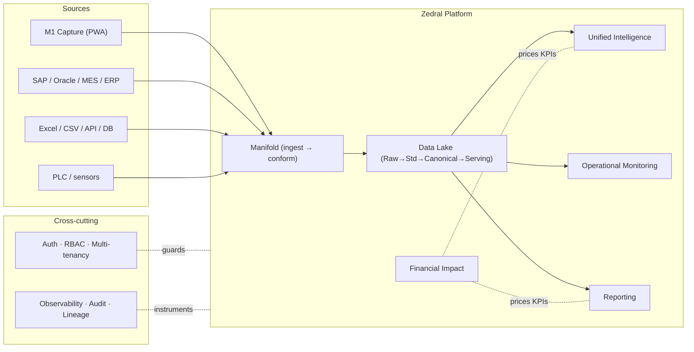
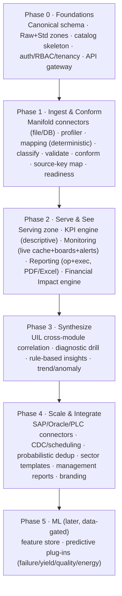

# Zedral — Technical Design Document (Developer Handover)
### 00 · Master Index, System Architecture, Stack & Conventions
**Audience:** engineering team · **Status:** v1 for build · **Date:** 2026-05-30

> This document set is the build-ready specification for the Zedral platform foundation. Each component has its own spec (full developer detail: interfaces, data model, NFRs, acceptance criteria, build phasing). This index gives the system context, the **binding architectural decisions**, the **recommended technology stack**, shared conventions, and the cross-component **build roadmap**. Read this first.

---

## 1. Document set & reading order

| # | Spec | Build priority |
|---|------|----------------|
| 00 | **This index** — architecture, stack, conventions, roadmap | Read first |
| 01 | **Data Lake** — zones, storage, processing, serving, governance | Phase 0–1 |
| 02 | **Canonical Data Model** — entities, schema, keys, reference data | Phase 0 |
| 03 | **Manifold** — connectors, import/export, mapping, dedup/MDM, conformance, readiness | Phase 1 |
| 04 | **Unified Intelligence** — KPI engine, correlation, financial-impact, insights | Phase 2–3 |
| 05 | **Operational Monitoring** — live cache, streaming consumers, surfaces, alerts | Phase 2 |
| 06 | **Reporting** — definition model, engine, renderers, scheduler, distribution | Phase 2 |
| 07 | **Financial Impact** — cost-rate model, formulas, computation service | Phase 2 |
| 08 | **Platform & Security** — multi-tenancy, auth/RBAC, gateway, deploy, observability | Phase 0 (cross-cutting) |
| 09 | **Glossary** — canonical terms | Reference |

Companion material **included in this folder** for full context:

- **`Reference_Plans/`** — the planning **deep-plans** (the *why* behind each spec), the **consolidated review & decisions** doc, and a **`Diagrams/`** gallery (all 20 architecture diagrams as PNG + mermaid source). Start at `Reference_Plans/README.md`.
- **M1 Data Capture Layer** blueprint (`../M1_Technical_Blueprint/`) — build-ready spec for the first-party shop-floor source, referenced throughout.

**Spec → deep-plan map:** 01/02 ← DataLake+Canonical · 03 ← Manifold · 04/05 ← UIL+Monitoring · 06 ← Reporting · 07/08 + decisions ← Consolidated Review.

---

## 2. System context

**Golden rule for the team:** consumers (UIL, Monitoring, Reporting, modules) read **only** the canonical Serving zone — never a source or another component's database. Modules write derived intelligence back through the canonical write-back API. The canonical model is the contract that decouples everyone.

---

## 3. Binding architectural decisions (D1–D11)

These were ratified during planning review (`04_Consolidated_Review...`). **Treat them as constraints, not suggestions.**

| # | Decision | Build constraint |
|---|----------|------------------|
| **D1** | **Hybrid-ready deployment**, split per client | Every service containerized; support cloud + on-prem edge. No cloud-only assumptions. |
| **D2** | **Near-real-time (minutes)** default latency, tunable per tenant | Monitoring/KPIs target minutes; capture path never blocks. Latency is per-tenant config. |
| **D3** | **Deterministic entity resolution first** | Build rule/key-based matching now; probabilistic (Splink/Zingg) is a later, isolated module. |
| **D4** | **Excel/CSV + generic DB connectors first**, then SAP/API | Connector roadmap order; file + JDBC connectors are the v1 baseline. |
| **D5** | **Conservative auto-map + review queue** | Auto-accept only high-confidence mappings; everything else is human-reviewed. |
| **D6** | **"Standard" v1 KPI tier** | Status, production-vs-target, downtime-by-reason, basic OEE where data allows. |
| **D7** | **Cost-rates client-owned, implementation-seeded**, "rate as of" provenance | Rates are versioned reference data with effective dates. |
| **D8** | **Logical tenant isolation default**, physical on request | Tenant key on every record; isolation enforced at the data-access layer. |
| **D9** | **Rule-based insights v1, ML later** | Insight engine is rule/template driven; reserve ML plug points, don't build them yet. |
| **D10** | **Reuse Zinance import UX patterns, rebuild server-side** | Port the wizard/smart-map/validation UX; the engine is new and server-side. |
| **D11** | **Validate canonical model against a 2nd (non-steel) sector** | Keep the model sector-neutral; exercise the extension namespace early. |

---

## 4. Recommended technology stack

Concrete recommendation with rationale; the team may substitute equivalents, but interfaces and NFRs are fixed.

| Concern | Recommended | Rationale / alternative |
|---|---|---|
| Raw/landing + exports | **S3-compatible object store** (AWS S3 / MinIO on-prem) | Cheap, immutable; MinIO gives hybrid parity (D1) |
| Canonical core, masters, config (OLTP) | **PostgreSQL 15+** | Matches M1 schema; integrity; JSONB for extension fields |
| Time-series (PLC/sensor) | **TimescaleDB** (Postgres extension) | One ecosystem, hypertables/downsampling; ClickHouse if volume extreme |
| Analytical marts / KPI store | **ClickHouse** (or Postgres columnar to start) | Fast roll-ups for UIL/Reporting |
| Event/stream bus | **Apache Kafka** (Redpanda for edge/on-prem) | M1 events, PLC streams, write-backs; Redpanda lighter for edge (D1) |
| Stream processing | **Flink** or **Kafka Streams** | Live conformance + incremental aggregates (D2) |
| Live cache (monitoring) | **Redis** | Sub-second current-state reads |
| Metadata catalog / lineage | **Postgres-backed catalog service** (+ OpenLineage) | v1 build; evaluate DataHub/OpenMetadata later |
| Orchestration / scheduling | **Apache Airflow** (Dagster/Prefect alt) | Batch ingest, scheduled sync, report scheduling |
| Entity resolution | **Deterministic (SQL/Python)**; Splink/Zingg later | Per D3 |
| API layer | **REST + OpenAPI**, gateway; GraphQL optional | Stable contracts |
| Auth / SSO / RBAC | **OIDC via Keycloak** | Matches M1 OIDC; on-prem capable (D1) |
| Backend services | **Python 3.11 + FastAPI** (data/ML); JVM/.NET acceptable for enterprise connectors | Python for data/ML; team skill + SAP may favor JVM/.NET |
| Frontend | **React + TypeScript** (PWA) | Matches M1 + Zinance; reuse Zinance import UX (D10) |
| Report rendering | **HTML templates → Playwright/WeasyPrint** (PDF); **openpyxl** (Excel) | Pixel control; locked PDF + Excel/CSV delivery |
| Containerization / deploy | **Docker + Kubernetes** (cloud); Compose/k3s (edge) | Hybrid (D1) |
| Observability | **OpenTelemetry + Prometheus + Grafana**; Loki/ELK logs | Per-service + per-tenant |
| ML platform (later) | **Feast** (feature store) + **MLflow** (registry) | Reserve for D9 predictive phase |

---

## 5. Shared conventions (apply to every component)

- **Canonical naming:** `UPPER_SNAKE_CASE` with unit embedded (e.g. `COIL_WIDTH_MM`) — inherited from M1; one canonical field = one column.
- **Identifiers:** surrogate canonical IDs (`*_id`), with native/source keys preserved + `source_ref` for lineage.
- **Time:** store UTC (`TIMESTAMPTZ`); carry site timezone for display; bucket to shift/day for aggregates.
- **Units:** store native value + canonical base value (`to_base_factor`); weight in MT plant-wide.
- **Multi-tenancy:** `tenant_id` on every record; all queries tenant-scoped at the data-access layer (D8).
- **APIs:** REST, versioned (`/v1/...`), OpenAPI-documented, OIDC-secured, idempotent writes, cursor pagination, RFC-7807 error bodies.
- **Eventing:** canonical domain events on Kafka (e.g. `coil.captured`, `shift.submitted`, `downtime.logged`, `mapping.confirmed`); at-least-once + idempotent consumers.
- **Lineage:** every canonical record carries `lineage_ref` → batch + source row + mapping version.
- **Audit:** every write + export logged (who/what/when), reusing the M1 audit pattern.
- **Status legend in specs:** `MUST` / `SHOULD` / `MAY` (RFC-2119).

---

## 6. Cross-component build roadmap (epic map)

Each component spec (§01–08) restates which phase(s) its build epics fall into.

---

## 7. Global non-functional baseline

Every component inherits these unless its spec tightens them:

- **Multi-tenant**, logical isolation default (D8); no cross-tenant data path exists.
- **Hybrid deployable** (D1): cloud default, on-prem edge for capture/PLC; 12-factor, containerized, externalized config.
- **Latency:** near-real-time (minutes) default (D2), per-tenant tunable; ingestion never blocks capture.
- **Availability:** v1 target 99.5% for serving/monitoring; graceful degradation when a source/module is absent.
- **Scalability:** horizontal scale on stateless services; partition data by tenant + time.
- **Security:** OIDC auth, RBAC, encryption in transit (TLS) + at rest, full audit, least privilege.
- **Data integrity:** idempotent + replayable pipelines; end-to-end lineage; no destructive transforms on Raw.
- **Observability:** OpenTelemetry traces, Prometheus metrics, structured logs — tagged by tenant + component.

---

## 8. Open items & assumptions (carry into build)

- **D11 second-sector validation** client/dataset to be identified — the top generality risk.
- Canonical **reason-code / loss taxonomy + state model** to be confirmed against real client data before lock.
- Reporting **cadences/distribution lists** and **retention** per tenant — defaults proposed in spec 06.
- **SAP write-back** (actuals round-trip) is a later phase (per M1-06).
- Modules **M2–M7** functional specs are separate upcoming deliverables; their canonical data contracts are defined in spec 02 §(module matrix).

---

*Next: component specs 01–08, then the Glossary (09). The compiled Word/PDF package combines all of these into one Software Design Document.*
