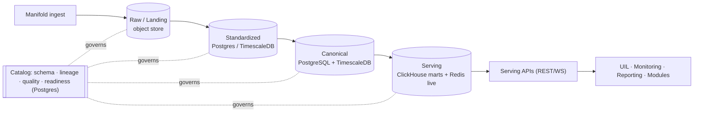

# 01 · Data Lake — Developer Specification

**Component owner:** Platform/Data · **Phase:** 0–1 · **Depends on:** 08 Platform/Security, 02 Canonical Model · **Consumed by:** all

---

## 1. Purpose & scope

The Data Lake is the storage + processing + serving substrate of Zedral. It receives data (via Manifold), stores it immutably, standardizes and conforms it to the Canonical Model, and serves it to every consumer through stable APIs.

**In scope:** zone storage (Raw→Standardized→Canonical→Serving), the metadata/lineage catalog, batch + stream processing orchestration, the serving APIs, retention/governance.
**Out of scope:** field mapping / dedup / conformance *logic* (that is Manifold, spec 03 — the lake provides the zones it operates on); KPI computation (UIL, spec 04); source capture (M1).

## 2. Responsibilities

1. Land every inbound payload immutably (Raw) with provenance.
2. Hold Standardized, Canonical, and Serving representations per the zone contracts.
3. Run batch + streaming pipelines (idempotent, replayable).
4. Maintain the metadata catalog: schema, lineage, quality scores, classification, readiness.
5. Expose canonical read, KPI/aggregate, live-state, write-back, and export APIs.
6. Enforce tenant isolation, retention, and encryption.

## 3. Architecture

**Zone contracts:** Raw = immutable, as-received, checksummed. Standardized = typed/validated/deduped, source schema intact. Canonical = 100% conformed to spec 02 (keys, UoM, tz, codes). Serving = query-fast marts + live cache. No consumer reads upstream of Serving.

## 4. Interfaces & API contracts

All REST, `/v1`, OIDC-secured, tenant-scoped, RFC-7807 errors, cursor pagination.

| Endpoint | Method | Purpose |
|---|---|---|
| `/v1/canonical/{entity}` | GET | Read canonical entities/events; filters: `site,area,line,asset,from,to,cursor` |
| `/v1/kpi/{kpiId}` | GET | Pre-aggregated KPI by `scope` (asset…enterprise) + `grain` (shift/day/month) |
| `/v1/live/state` | GET / WS | Current machine state + live counts (Redis); WS for push |
| `/v1/canonical/derived` | POST | **Module write-back** of derived intelligence (e.g. downtime classification, risk score) |
| `/v1/export` | POST | Request CSV/XLSX export of a canonical scope (async job → file URL) |
| `/v1/catalog/lineage/{recordRef}` | GET | Lineage trace back to raw source |
| `/v1/catalog/readiness/{module}` | GET | Per-module readiness (delegates to Manifold, spec 03) |

**Internal contracts:** ingestion publishes to Kafka topics (`raw.landed`, `canonical.upserted`, `*.event`); pipelines consume idempotently keyed by `(tenant_id, source_ref, natural_key)`.

## 5. Data model (storage)

- **Raw:** object store path `s3://{tenant}/raw/{source}/{yyyy}/{mm}/{dd}/{batch}.{ext}` + a `raw_object` catalog row `{object_id, tenant_id, source_id, batch_id, checksum, ingest_ts, byte_count}`.
- **Standardized:** typed tables mirroring source schema + `std_meta{dedup_key, quality_flags}`; time-series in TimescaleDB hypertables.
- **Canonical:** per spec 02 (PostgreSQL) + canonical time-series (TimescaleDB).
- **Serving marts:** ClickHouse tables per KPI/grain/scope; Redis keys `live:{tenant}:{asset}:state`.
- **Catalog (Postgres):** `dataset`, `field`, `mapping_version`, `lineage_edge`, `quality_score`, `classification`, `readiness_score`.

## 6. Key flows

Batch: `land(Raw) → profile → [Manifold map/validate/dedup/conform] → upsert Canonical → refresh marts`. Stream: `event → append Raw log + Std TS → conform → Canonical event + Redis live + incremental mart`. **Replay:** re-run Raw→Canonical when logic changes, without re-touching sources.

## 7. Technology

Object store (S3/MinIO), PostgreSQL 15+ (canonical/catalog), TimescaleDB (time-series), ClickHouse (marts), Redis (live), Kafka (bus), Flink/Kafka-Streams (stream), Airflow (batch/orchestration). See index §4.

## 8. Non-functional requirements

- **Throughput:** sustain PLC/sensor stream at target tag-rate per tenant (design for ≥10k events/s/tenant headroom); batch historical loads of millions of rows.
- **Latency:** canonical event visible in Serving within the tenant's latency target (default minutes, D2).
- **Retention:** tiered (hot full-res → warm downsampled → cold archived Raw), per-tenant configurable.
- **Durability:** Raw is WORM-style immutable; backups + point-in-time recovery on Postgres.
- **Isolation:** tenant_id enforced in every query path (D8).

## 9. Dependencies & integration points

Manifold (writes Std→Canonical), Platform/Security (auth, tenancy), Canonical Model (schema), UIL/Monitoring/Reporting (read Serving), Modules (write-back).

## 10. Configuration

Per-tenant: storage endpoints, retention policy, isolation mode (logical/physical, D8), latency target (D2), enabled zones. Externalized (12-factor); secrets via vault.

## 11. Acceptance criteria

- **MUST** store every ingested payload immutably in Raw with checksum, source, ingest timestamp, tenant.
- **MUST** make pipelines idempotent and replayable from Raw with no double-counting.
- **MUST** serve consumers only from the Serving zone; no consumer can reach Raw/Std/source.
- **MUST** assign canonical surrogate keys and preserve the source-key map at conformance.
- **MUST** record end-to-end lineage for every canonical record.
- **MUST** enforce tenant isolation on every API and query.
- **SHOULD** expose readiness + quality scores via catalog APIs.

## 12. Build phasing

**Phase 0:** Raw + Standardized zones, catalog skeleton (schema/lineage/quality hooks), object store + Postgres/Timescale. **Phase 1:** Canonical zone + conformance integration with Manifold + source-key map + Serving canonical/KPI APIs. **Phase 2:** ClickHouse marts + Redis live + write-back + export APIs.

## 13. Risks & edge cases

Late-arriving / out-of-order events (use event-time + watermarks); schema drift at source (catalog detects, Manifold re-maps); replay storms (throttle + idempotency); huge PLC volume (downsample + retention tiers); partial-batch failures (quarantine, never abort batch).
