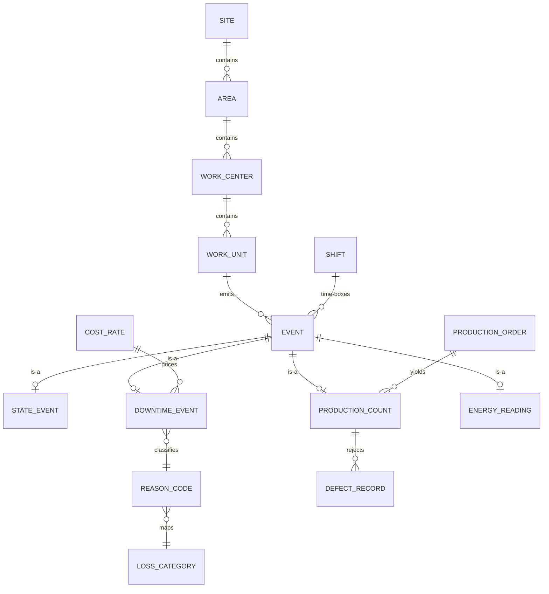

# 02 · Canonical Data Model — Developer Specification

**Component owner:** Data/Domain · **Phase:** 0 · **Depends on:** 08 Platform · **Consumed by:** all

---

## 1. Purpose & scope

The single shared schema every module speaks. Standards-anchored (ISA-95 hierarchy, ISO 22400 KPIs, Six Big Losses). **In scope:** entity definitions, keys/identity, the universal Event Spine, reference data, units/time rules, versioning/extensibility, the module data-contract matrix. **Out of scope:** how data gets mapped into it (Manifold, 03).

## 2. Modeling rules (MUST)

- One canonical field = one column, `UPPER_SNAKE_CASE`, unit embedded (`COIL_WIDTH_MM`).
- Surrogate `*_id` PK + preserved `(source_system, native_key)` + `source_ref`.
- Every time-stamped fact is an **Event** specialization (the spine) — unifies real-time + historical.
- Reference data (reason/defect/state/UoM/cost-rate) is shared, FK-enforced, no free-text codes.
- Client-specific fields live in a namespaced **extension** area (JSONB), never altering the core (supports D11 generality).

## 3. Entity catalog

### 3.1 Master / reference

`enterprise · site · area · work_center · work_unit` (ISA-95 hierarchy via `node_id, parent_id, level`) · `asset` (the machine; maps Machine_ID/Asset_Code/Equipment_Number → Machine Identifier; `ideal_cycle_time`) · `material` (`type` raw/WIP/finished) · `bom_line` · `shift / shift_pattern / calendar` (drives Planned Production Time) · `personnel / crew` · `uom` (`to_base_factor`) · `reason_code` (→ `loss_category`, `oee_component`) · `loss_category` (Six Big Losses) · `defect_code` · `state_model` (`is_planned`, `counts_as`) · `cost_rate` (scope, value, currency, **effective_from/to** — D7) · `tenant / source / connector` (with `priority`).

### 3.2 Event Spine (transactional core)

`event { event_id PK, event_type, asset_ref, order_ref, shift_ref, start_ts, end_ts, duration_s, value, uom_ref, reason_ref, source_ref, lineage_ref, tenant_id }`

Specializations: `state_event(state_ref, is_planned)` · `downtime_event(reason_ref, loss_category_ref, oee_component)` · `production_count(good_qty, scrap_qty, rework_qty, total_qty)` · `quality_inspection / defect_record(defect_ref, qty, disposition)` · `energy_reading(utility_type, consumption, meter_ref)` · `sensor_reading(tag, value, quality_flag)` *(TimescaleDB)* · `maintenance_work_order / pm_schedule / failure_event` · `yield_record(input_qty, output_qty, yield_pct)`.

## 4. ERD



## 5. Reference DDL conventions (PostgreSQL)

```sql
-- hierarchy node (ISA-95) — one table, self-referential
CREATE TABLE canon.equipment_node (
  node_id      BIGINT PRIMARY KEY,
  tenant_id    UUID NOT NULL,
  parent_id    BIGINT REFERENCES canon.equipment_node(node_id),
  level        TEXT NOT NULL CHECK (level IN ('ENTERPRISE','SITE','AREA','WORK_CENTER','WORK_UNIT')),
  name         TEXT NOT NULL,
  native_code  TEXT,
  source_ref   TEXT,
  ext          JSONB DEFAULT '{}'::jsonb       -- client extension namespace
);
-- event spine (partition by tenant_id, range on start_ts)
CREATE TABLE canon.event (
  event_id     BIGINT PRIMARY KEY,
  tenant_id    UUID NOT NULL,
  event_type   TEXT NOT NULL,
  asset_ref    BIGINT REFERENCES canon.equipment_node(node_id),
  order_ref    BIGINT,
  shift_ref    BIGINT,
  start_ts     TIMESTAMPTZ NOT NULL,
  end_ts       TIMESTAMPTZ,
  duration_s   NUMERIC,
  value        NUMERIC,
  uom_ref      TEXT,
  reason_ref   TEXT,
  source_ref   TEXT,
  lineage_ref  TEXT
) PARTITION BY RANGE (start_ts);
```

The full M1 schema (`M1_schema.sql`, 40 tables) is the **reference implementation of the capture side**; canonical tables generalize it (e.g. M1 `coil`/`shift_log`/`prod_*` → canonical `asset`/`event`/`production_count`).

## 6. Module data-contract matrix (drives Manifold classification + readiness)

● Required, ○ Additional. (Abbrev — full matrix in planning doc `01` §15.)

| Entity group | M1 | M2 Maint | M3 Ops | M4 OEE | M5 Yield | M6 Qual | M7 Energy |
|---|:--:|:--:|:--:|:--:|:--:|:--:|:--:|
| Asset hierarchy | ● | ● | ● | ● | ● | ● | ● |
| StateEvent | ● | ○ | ○ | ● | | | ○ |
| Downtime + Reason | | ● | ○ | ● | | | |
| ProductionCount | ● | | ○ | ● | ● | ● | ○ |
| Quality/Defect | | | | ○ | ○ | ● | |
| Energy/Meter | | | | | | | ● |
| SensorReading | ○ | ● | | ○ | ○ | ○ | ○ |
| Maintenance WO/PM | | ● | ○ | | | | |
| CostRate | ○ | ○ | ○ | ○ | ○ | ○ | ○ |

## 7. Identity, units, time, versioning

- **Identity:** canonical surrogate keys; `source_key_map(canonical_id, source_system, native_key)`; resolution rules in Manifold (03 §dedup).
- **Units:** native value + `to_base_factor`; canonical base per dimension.
- **Time:** UTC storage; site tz for display; shift calendars define Planned Production Time.
- **Versioning:** additive schema changes; `schema_version`; Serving APIs versioned independently; extension fields in `ext` JSONB.

## 8. Non-functional requirements

- Event table partitioned by tenant + time; indexed on `(asset_ref, start_ts)`, `event_type`.
- Reference data cached in Serving; changes are effective-dated (esp. `cost_rate`, D7).
- Schema migrations via versioned migration tool (e.g. Flyway/Alembic); backward compatible.

## 9. Acceptance criteria

- **MUST** represent every operational fact as an Event or specialization.
- **MUST** enforce FK to reference masters (no free-text coded values).
- **MUST** preserve source keys + lineage on every canonical row.
- **MUST** support client extension fields without core schema change.
- **MUST** encode reason codes against Six Big Losses + OEE component.
- **SHOULD** pass the M1 capture data through conformance with zero loss (validation test).

## 10. Build phasing

**Phase 0:** core entities (hierarchy, event spine, shift/calendar), reference data (UoM, state, reason/loss, defect, cost-rate), migrations, seed taxonomies. Then exercised by Manifold conformance in Phase 1.

## 11. Risks

Over-fitting to steel (mitigate via D11 second-sector test + `ext`); taxonomy churn (effective-date reference data); event-table growth (partition + retention via Data Lake).
