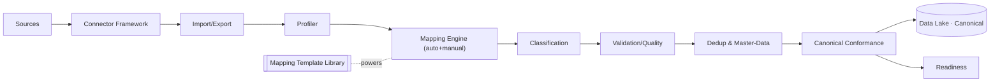
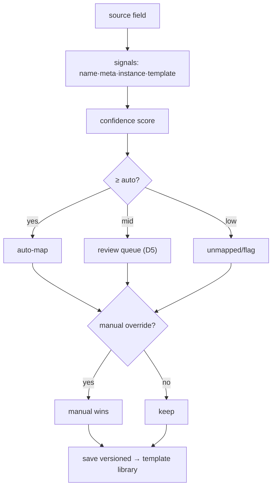

# 03 · Manifold (Data Integration & Mapping) — Developer Specification

**Component owner:** Data Integration · **Phase:** 1 (scale in 4) · **Depends on:** 01 Data Lake, 02 Canonical, 08 Platform · **Consumed by:** Data Lake (writes Canonical), readiness consumers

---

## 1. Purpose & scope

The engine that turns any source into the Canonical Model. **In scope:** connector framework, import/export, profiling, field-mapping engine, classification, validation/quality, dedup + master-data resolution, canonical conformance, readiness. **Out of scope:** zone storage (01), KPI logic (04).

## 2. Architecture

## 3. Sub-components & contracts

### 3.1 Connector framework (SDK)
Each connector implements: `discover()` → schema/tags/columns + metadata · `sample(n)` → rows for profiling · `read(mode)` where mode ∈ `full | incremental(CDC) | stream` · `write(scope, format)` for export · `auth()` · `health()`. Connectors declare `capabilities{cdc, stream, schema_discovery}`. **D4 order:** file (CSV/XLSX) + generic DB (JDBC) first → then SAP/Oracle/MES → PLC/streaming (Phase 4). Adding a connector = implement the interface; **no core change**.

### 3.2 Import/Export
Lifecycle state machine: `PENDING → PROFILED → MAPPED → VALIDATED → PREVIEW(dry-run/impact) → LOADED | PARTIAL | FAILED`. Per-row tolerant errors → `{success, failed, skipped, errors[], batch_id}` (reuse Zinance pattern, D10). Export: field-projection, CSV/XLSX, scheduled/on-demand. **UX reused from Zinance, rebuilt server-side (D10).**

### 3.3 Profiler
Computes per field: type, regex/pattern, range, null %, cardinality, sample, unit hints → feeds mapping + quality.

### 3.4 Mapping engine
Signals → weighted confidence: **name** (token + synonym/abbrev dictionary, edit distance), **metadata** (type/unit/length), **instance** (profile vs canonical field profile), **template/historical** (sector templates). Thresholds (**D5 conservative**): `≥ auto_accept` → auto-map; `mid` → review queue; `low` → unmapped/flag. **Manual override always wins.** Confirmed mappings are versioned and learned into the **template library**.

### 3.5 Classification
Per module data contract (spec 02 §6): **Required / Additional / Not-Required**. Unknown columns → namespaced **extension** fields (reconciled across imports).

### 3.6 Validation & quality
Rule layers: structural, format (date/number/unit normalization), mandatory (Required gate), range/sanity (e.g. `output_thk < input_thk`), dependency/integrity (FK to masters), duplicate. Quality scored on validity/completeness/consistency/timeliness/uniqueness → readiness.

### 3.7 Dedup & master-data (D3: deterministic first)
`blocking → match(deterministic keys; probabilistic later) → cluster → survivorship(source priority·recency·completeness·manual) → golden record + source_key_map`. Detects duplicate fields, sources, records. Probabilistic matcher (Splink/Zingg) is an isolated Phase-4 add.

### 3.8 Conformance
Apply mapping → UoM convert → tz normalize → code-taxonomy map → assign surrogate key + lineage → upsert Canonical.

### 3.9 Readiness
Per tenant×module: `R` (Required coverage, hard gate) · `A` (Additional) · `Q` (quality) · `H` (history). `Readiness% = 100·(0.5R + 0.2A + 0.2·Q/100 + 0.1H)` with `R=100%` gate. Status: Ready ≥85, Partial 60–84, Blocked <60.

## 4. Interfaces (REST)

| Endpoint | Purpose |
|---|---|
| `POST /v1/connectors` / `GET /v1/connectors/{id}/discover` | register / introspect source |
| `POST /v1/imports` (+ `/{batch}/preview` `/commit`) | run import lifecycle |
| `GET/PUT /v1/mappings/{dataset}` | view/confirm/override mappings (versioned) |
| `GET /v1/classification/{tenant}/{module}` | Required/Additional/Not-Required status |
| `POST /v1/dedup/run` · `GET /v1/golden/{entity}` | resolution + golden records |
| `GET /v1/readiness/{tenant}/{module}` | readiness score + missing/recommended |
| `POST /v1/exports` | export job |

Emits events: `mapping.confirmed`, `import.completed`, `golden.merged`, `readiness.changed`.

## 5. Technology

Python 3.11 + FastAPI (services), Postgres (mappings/templates/golden), Airflow (batch/scheduled sync), Kafka (events), JDBC drivers (DB connectors), SheetJS/openpyxl (files); Splink/Zingg later. React/TS mapping UI (reuse Zinance).

## 6. Non-functional requirements

- Bulk import of millions of rows without UI block (async + progress).
- Mapping auto-suggest < 2s for a typical source schema.
- Idempotent commits keyed by `(tenant, source, natural_key)`.
- All mapping/override/survivorship decisions audit-logged + versioned.

## 7. Acceptance criteria

- **MUST** add a new source type via connector SDK with no core change.
- **MUST** default to conservative auto-accept + review queue (D5); manual override always persists and wins.
- **MUST** never abort a batch on a bad row; quarantine with row-level reason.
- **MUST** deduplicate to a golden record + maintain `source_key_map` (deterministic v1).
- **MUST** output 100% canonical-conformant data with lineage.
- **MUST** compute per-module readiness with the Required hard gate.
- **SHOULD** improve a sector template on each confirmed mapping.

## 8. Build phasing

**Phase 1:** file + DB connectors, profiler, mapping (name+meta+instance), classification, validation, conformance, source-key map, deterministic dedup, readiness, mapping UI. **Phase 4:** SAP/Oracle/PLC connectors, CDC/scheduling, probabilistic matcher, sector template library.

## 9. Risks & edge cases

Silent mis-map (mitigated by D5 + lineage + review); huge schemas (incremental profiling); conflicting sources (survivorship + source priority); evolving source schemas (catalog drift detection → re-map); SAP complexity (Phase-4, allow JVM/.NET connector).
