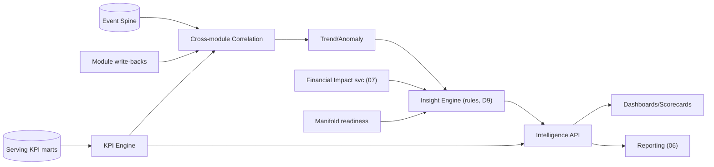

# 04 · Unified Intelligence Layer — Developer Specification

**Component owner:** Analytics/Intelligence · **Phase:** 2–3 · **Depends on:** 01 Serving, 02 Canonical, 07 Financial Impact · **Consumed by:** UI, Reporting

---

## 1. Purpose & scope

The synthesis brain: turns canonical data into KPIs, cross-module insight, financial impact, trends, and executive views. **In scope:** KPI engine, cross-module correlation, trend/anomaly detection, insight generation, ML plug points. **Out of scope:** live "now" state (05 Monitoring), report rendering (06), $ formulas (07 — UIL calls it), KPI source data (01/02).

## 2. Architecture



## 3. Sub-components

- **KPI engine:** evaluates a central **KPI registry** (each KPI = id, formula, inputs, unit, grain) over canonical events; rolls up the ISA-95 hierarchy (asset→…→enterprise) and time grains (shift/day/month). ISO 22400 definitions: `OEE = Availability × Performance × Quality`. v1 = **Standard tier (D6)**.
- **Cross-module correlation:** joins one event to its multi-module lenses (downtime → yield/quality/energy/$); correlates KPIs to state/grade/shift/crew.
- **Trend/anomaly:** moving baselines per KPI/asset; drift/spike flags; ranked by financial impact.
- **Insight engine (D9 = rules v1):** templated insights (`"{line} lost {qty} to {reason} = {₹}, {x}% vs {n}-day norm"`); lifecycle detect→rank($)→explain(lineage)→route(role)→track. ML/LLM narratives reserved (Phase 5).
- **ML readiness:** feature store (Feast) over the Event Spine; reserved plug points for forecast/predict; **not built in v1 (D9)**.

## 4. KPI registry (definition-as-data)

```yaml
- id: OEE
  formula: availability * performance * quality
  grain: [shift, day, month]
  scope: [asset, work_center, area, site, enterprise]
- id: AVAILABILITY
  formula: operating_time / planned_production_time   # planned_production_time from shift calendar
- id: YIELD_PCT
  formula: good_qty / input_qty
- id: ENERGY_PER_UNIT
  formula: energy_kwh / production_mt
```
Both UIL and Reporting bind to this registry by `id` → **numbers always agree** (consistency guarantee).

## 5. Interfaces (REST)

| Endpoint | Purpose |
|---|---|
| `GET /v1/intelligence/kpi/{id}?scope&grain&from&to` | KPI value(s) + trend + $ twin |
| `GET /v1/intelligence/insights?tenant&scope&since` | ranked insight feed |
| `GET /v1/intelligence/correlate?event_id` | cross-module lenses for an event |
| `GET /v1/intelligence/scorecard/{scope}` | exec scorecard payload |
| `POST /v1/intelligence/alerts/rules` | threshold/anomaly alert rules (shared w/ 05) |

## 6. Technology

Python + FastAPI; ClickHouse marts; Redis cache; rule engine (lightweight, config-driven); Feast + MLflow (later). Computation orchestrated by Airflow (batch marts) + stream incremental (05).

## 7. Non-functional requirements

- KPI/scorecard reads sub-second from marts (pre-aggregated).
- Module-aware **graceful degradation**: render the deepest intelligence the tenant's data supports (reads readiness); never show broken widgets when a module/data is absent.
- Every KPI/insight traceable to canonical events (lineage).
- Deterministic, reproducible KPI math (versioned registry).

## 8. Acceptance criteria

- **MUST** compute KPIs only from the shared registry (no ad-hoc recomputation).
- **MUST** attach the financial-impact ($) twin wherever a cost-rate exists (07).
- **MUST** degrade gracefully by module readiness (D6 Standard baseline for M1-only).
- **MUST** produce rule-based insights with lineage + role routing (D9).
- **SHOULD** expose ML plug points without implementing models in v1.

## 9. Build phasing

**Phase 2:** KPI registry + engine (descriptive, Standard tier) + scorecards + financial twins. **Phase 3:** correlation + diagnostic drill + rule insights + trend/anomaly. **Phase 5:** feature store + predictive models (data-gated).

## 10. Risks

KPI definition drift (single registry + version); mart refresh lag vs latency target (incremental + D2 config); premature ML expectations (D9 keeps promise descriptive/diagnostic).
