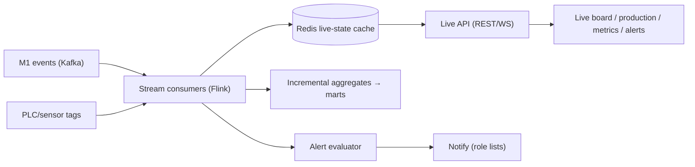

# 05 · Operational Monitoring Layer — Developer Specification

**Component owner:** Realtime/Platform · **Phase:** 2 · **Depends on:** 01 (streaming), 02 Canonical, 08 Platform · **Consumed by:** UI

---

## 1. Purpose & scope

Live shop-floor/production/state visibility. **In scope:** streaming consumers, live-state cache, monitoring surfaces (boards, production tracking, metrics), alert framework. **Out of scope:** historical synthesis (04 UIL), report generation (06). Depth scales with installed modules.

## 2. Architecture

## 3. Sub-components

- **Stream consumers:** conform live events (delegating to canonical rules), update current-state per asset.
- **Live-state cache (Redis):** `live:{tenant}:{asset}` → `{state, since, running_count, target, open_stoppage}`; last-write-wins by event-time.
- **Surfaces:** live shop-floor board (state per asset, color chips), production tracking (vs target), live metrics, alert panel. Capability tiers by installed module (M1 status → +M4 live OEE → +M3 shift/handover → +M5/6/7 yield/quality/energy + $).
- **Alert framework:** rule types `state-change | threshold | missed-capture | anomaly`; financial-tagged; deduped; role-routed (reuse M1 RBAC); escalation. (Rules shared with UIL, spec 04 §5.)

## 4. Interfaces

| Endpoint | Purpose |
|---|---|
| `GET /v1/live/state?scope` | current state snapshot |
| `WS /v1/live/stream?scope` | push state/metric/alert updates |
| `GET /v1/live/production?scope` | live produced-vs-target |
| `POST /v1/alerts/rules` · `GET /v1/alerts/active` | manage + read alerts |

## 5. Technology

Kafka + Flink (stream), Redis (live cache), FastAPI + WebSocket (API), React/TS (boards). Latency target = tenant config (**D2 minutes default**, sub-second optional).

## 6. Non-functional requirements

- Live state reflects new events within the tenant latency target (D2); **capture path must never block** on monitoring.
- WebSocket fan-out scales per tenant; back-pressure safe.
- Truthful "now" even with only M1 deployed (graceful tiers).
- Alert evaluation idempotent; no alert storms (dedupe + cooldown).

## 7. Acceptance criteria

- **MUST** show per-asset live state from M1 events with only M1 deployed.
- **MUST** scale monitoring depth automatically with installed modules + readiness.
- **MUST** raise missed-capture alerts (e.g. M1 pickling hourly slot) and threshold/state alerts, financial-tagged, role-routed.
- **MUST** meet the per-tenant latency target without blocking ingestion.
- **SHOULD** support both minutes and sub-second targets via config.

## 8. Build phasing

**Phase 2:** stream consumers + Redis live state + live board/production/metrics + alert framework (state/threshold/missed-capture). **Phase 3+:** anomaly alerts (shared with UIL), deeper module tiers.

## 9. Risks

Out-of-order/late events (event-time + watermark); cache/source divergence (periodic reconcile from canonical); high PLC volume (sampling + Flink scaling); alert fatigue (dedupe, severity, cooldown).
