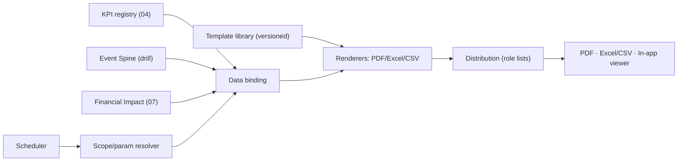

# 06 · Reporting Layer — Developer Specification

**Component owner:** Reporting/Platform · **Phase:** 2 · **Depends on:** 04 KPI registry, 03 export framework, 07 Financial Impact · **Consumed by:** clients (PDF/Excel), UI viewer

---

## 1. Purpose & scope

Formatted, distributable documents from canonical KPIs — scheduled + on-demand. **In scope:** report-definition model, engine, renderers (PDF/Excel/CSV), scheduler, distribution, in-app viewer. **Boundary (adopted):** distinct scheduled/static layer reading the **same KPI registry** as UIL (numbers always agree); may snapshot a UIL view. **v1 scope (locked):** Operational/shift + Executive/financial-impact reports; templated catalog; **scheduled PDF + Excel/CSV** delivery (+ in-app viewer); branding in v1; management reports fast-follow.

## 2. Architecture



## 3. Report-definition model (declarative)

```yaml
report:
  id: shift_production
  template: templates/shift_production.html
  audience_roles: [SUPERVISOR, PLANT_HEAD]
  parameters: [tenant, site, line, date, shift]
  bindings:                       # reference KPI registry by id → consistency guarantee
    - kpi: PRODUCTION_VS_TARGET
    - kpi: DOWNTIME_BY_REASON
    - kpi: YIELD_PCT
  financial_twin: true            # attach $ via Financial Impact (07), "rate as of"
  formats: [pdf, xlsx]
  schedule: end_of_shift
  distribution: role_list
```
Adding/altering a report = **config**, not code. Templates versioned + sector-reusable.

## 4. v1 catalog

**Operational/shift:** Shift Production · Downtime & Loss (Six Big Losses + $) · Yield & Quality · Production Log/Traceability (COIL_NO, Excel/CSV).
**Executive/financial:** Executive Scorecard (snapshot of UIL exec view) · Financial Impact Report (loss ranking, rate-as-of) · Performance Trend.
*(Management roll-ups = fast-follow.)*

## 5. Interfaces

| Endpoint | Purpose |
|---|---|
| `GET /v1/reports` / `GET /v1/reports/{id}` | catalog |
| `POST /v1/reports/{id}/generate` | on-demand (params, formats) → job → file URL |
| `GET/PUT /v1/reports/{id}/schedule` | cadence + distribution list |
| `GET /v1/reports/runs` | run history (audit) |

## 6. Technology

HTML templates → **Playwright/WeasyPrint** (PDF), **openpyxl** (Excel), CSV writer. Scheduler = Airflow. Reuses **Manifold export framework** (03) for file gen + delivery. Distribution via email/notification service. Renders are async jobs.

## 7. Non-functional requirements

- A figure in a generated report **equals** the live dashboard figure (shared registry) — verifiable in tests.
- Tenant-scoped data only (D8); per-tenant branding/white-label on PDFs.
- Scheduled generation reliable + retried; every run + distribution audit-logged.
- $ figures show **"rate as of"** (D7).

## 8. Acceptance criteria

- **MUST** bind report values to the KPI registry by id (no independent KPI math).
- **MUST** deliver scheduled PDF + Excel/CSV, plus in-app viewing.
- **MUST** scope by tenant/site/line/date/shift params from one template.
- **MUST** embed financial twins with rate provenance (D7).
- **MUST** audit every generation + distribution.
- **SHOULD** apply per-tenant branding (v1).

## 9. Build phasing

**Phase 2:** definition model + bindings, PDF/Excel/CSV renderers (extend Manifold export), 4 operational + 3 executive templates, scheduler + role distribution + audit, branding. **Phase 4:** management reports, self-serve builder, external-system push.

## 10. Configuration & open items

Per-tenant: branding assets, default cadences (proposed: shift report per shift, downtime/yield daily, exec/financial weekly+monthly), distribution lists by role, retention (default = data-lake tiers). Confirm cadences/recipients with client.

## 11. Risks

Number divergence (eliminated by shared registry binding — test it); heavy PDF rendering (async + queue); schedule misfires (Airflow retries + alerting); CSV-injection on export (sanitize leading `= + - @`, a Zinance gap to fix).
