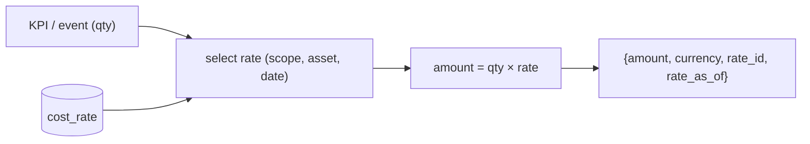

# 07 · Financial Impact Layer — Developer Specification

**Component owner:** Analytics · **Phase:** 2 (cross-cutting) · **Depends on:** 02 Canonical (CostRate), 04 KPI engine · **Consumed by:** UIL (04), Reporting (06), Monitoring (05) alerts

---

## 1. Purpose & scope

Translates operational outcomes into money, in real time, alongside every applicable KPI. **In scope:** cost-rate reference model, impact formulas, a stateless computation service, provenance. **Out of scope:** the KPIs themselves (04) and the cost-rate *values* (client-owned data, D7).

## 2. Cost-rate model (reference data, effective-dated — D7)

```sql
CREATE TABLE canon.cost_rate (
  rate_id      BIGINT PRIMARY KEY,
  tenant_id    UUID NOT NULL,
  scope        TEXT NOT NULL,        -- DOWNTIME | SCRAP | REWORK | ENERGY | LABOR | OPPORTUNITY
  asset_ref    BIGINT,               -- NULL = applies tenant/site-wide
  value        NUMERIC NOT NULL,
  currency     TEXT NOT NULL,
  uom_ref      TEXT,                 -- e.g. per HOUR, per MT, per kWh
  effective_from DATE NOT NULL,
  effective_to   DATE,               -- NULL = current
  source       TEXT                  -- seeded_by_impl | client_entered
);
```
**D7:** client-owned, implementation-seeded; the rate's `effective_from` is the **"rate as of"** shown on every figure.

## 3. Impact formulas

| KPI / event | Formula |
|---|---|
| Downtime cost | `downtime_hours × rate(DOWNTIME)` (+ `lost_units × margin` for OPPORTUNITY) |
| Yield loss | `scrap_mt × rate(SCRAP)` |
| Quality loss | `rework_mt × rate(REWORK)` (or scrap if non-recoverable) |
| Energy waste | `excess_kwh × rate(ENERGY)` |
| Maintenance | `repair_events × rate(LABOR/maintenance)` |

Rate selection: most-specific `asset_ref` + effective on the event date.

## 4. Service interface

Stateless `compute(impactType, quantity, context{tenant, asset, date})` → `{amount, currency, rate_id, rate_as_of}`. Exposed in-process to UIL/Reporting and via `GET /v1/financial/impact?event_id` / `POST /v1/financial/impact:batch`.



## 5. Technology

Python service (library + thin API); reads `cost_rate` from Postgres (cached); pure functions, fully unit-testable. Multi-currency aware.

## 6. Non-functional requirements

- Deterministic + reproducible; same inputs → same output.
- Always returns the **rate provenance** (`rate_id`, `rate_as_of`).
- Sub-millisecond per computation (cacheable rates).
- Missing-rate handling: return `null amount` + reason, never a wrong number.

## 7. Acceptance criteria

- **MUST** price every supported KPI/event where a valid rate exists.
- **MUST** select the effective-dated, most-specific rate and return its provenance (D7).
- **MUST** degrade safely (no rate → no $, flagged) — never fabricate.
- **MUST** be consumable by UIL, Reporting, and Monitoring alerts uniformly.
- **SHOULD** support multi-currency + per-asset overrides.

## 8. Build phasing

**Phase 2:** cost-rate schema + seeding tooling + computation service + integration into UIL/Reporting/alerts.

## 9. Risks

Stale/wrong rates mislead executives (mitigate: effective-dating, "rate as of" everywhere, client ownership + review cadence per D7); currency/timezone edge cases; double-counting (single computation service, no per-consumer math).
