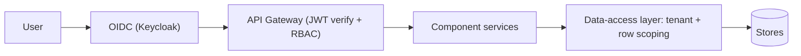

# 08 · Platform & Security (Cross-cutting) — Developer Specification

**Component owner:** Platform · **Phase:** 0 (foundational) · **Consumed by:** every component

---

## 1. Purpose & scope

The cross-cutting foundation every service builds on: multi-tenancy, authentication/authorization, API gateway, deployment, observability, audit. **In scope:** these platform concerns + their contracts. **Out of scope:** component business logic.

## 2. Multi-tenancy (D8)

- **Logical isolation default**, physical on request. `tenant_id` (UUID) on **every** record + every event + every object-store prefix.
- Tenant scoping enforced at a **data-access layer** (row-level security in Postgres + mandatory tenant filter in repositories) — not left to callers.
- Per-tenant configuration object: deployment mode (D1), latency target (D2), retention, enabled modules, isolation level, branding, cost-rate ownership.
- No cross-tenant query path exists; cross-tenant access attempts are denied + audited.

## 3. Authentication & RBAC

- **OIDC** (Keycloak) — matches M1 SSO; supports on-prem (D1). Services validate JWT; short-lived tokens.
- **Roles** (extend M1): `OPERATOR · SUPERVISOR · PLANT_HEAD · ADMIN` + platform `IMPLEMENTATION` (connectors/mappings/templates) and `CLIENT_ADMIN` (uploads/exports/config).
- **Authorization model:** `(role, resource, action)` + **row-level line/site scoping** (reuse M1 `line_access`). Permissions checked at the gateway + service.

## 4. API gateway & conventions

REST `/v1`, OpenAPI per service, OIDC-secured, rate-limited, RFC-7807 errors, idempotency keys on writes, cursor pagination, correlation-id propagation. Internal service-to-service via mTLS + service identity.

## 5. Deployment (D1 hybrid)

- All services **containerized** (Docker), **12-factor**, externalized config + secrets (Vault).
- **Cloud:** Kubernetes. **On-prem/edge:** k3s or Compose for capture + PLC + a local cache, syncing to core.
- Per-client topology chosen from config; **no cloud-only assumptions** anywhere.
- CI/CD with environment promotion; DB migrations versioned (Flyway/Alembic).

## 6. Observability

OpenTelemetry traces, Prometheus metrics, structured logs (Loki/ELK) — all tagged `tenant_id` + `component` + `correlation_id`. Golden signals per service; pipeline + readiness dashboards (Grafana). Alerting on platform health.

## 7. Audit & lineage

Every write, mapping/override, export, and distribution is audit-logged (`who, what, when, before/after`) — generalizing the M1 audit pattern. Data lineage end-to-end (canonical record → batch → source row → mapping version).

## 8. Non-functional baseline (inherited by all)

Multi-tenant, hybrid-deployable, near-real-time (minutes) default latency, 99.5% serving availability v1, horizontal scale, TLS + at-rest encryption, least privilege, idempotent/replayable data flows, full observability.

## 9. Acceptance criteria

- **MUST** stamp + enforce `tenant_id` on every record and API call; no cross-tenant path.
- **MUST** authenticate via OIDC and authorize by role + row scope on every request.
- **MUST** run every service containerized and deployable cloud **or** on-prem (D1).
- **MUST** emit traces/metrics/logs tagged by tenant + component.
- **MUST** audit every write/export/mapping/distribution.
- **SHOULD** support physical tenant isolation on request (D8).

## 10. Build phasing

**Phase 0:** OIDC + gateway + RBAC + tenant data-access layer + config service + observability baseline + CI/CD + migrations. Everything else builds on this.

## 11. Risks

Tenant-isolation leaks (enforce centrally + test); on-prem drift from cloud (one container set, config-driven); secret sprawl (Vault); auth complexity on edge (cache tokens, offline-tolerant like M1).
