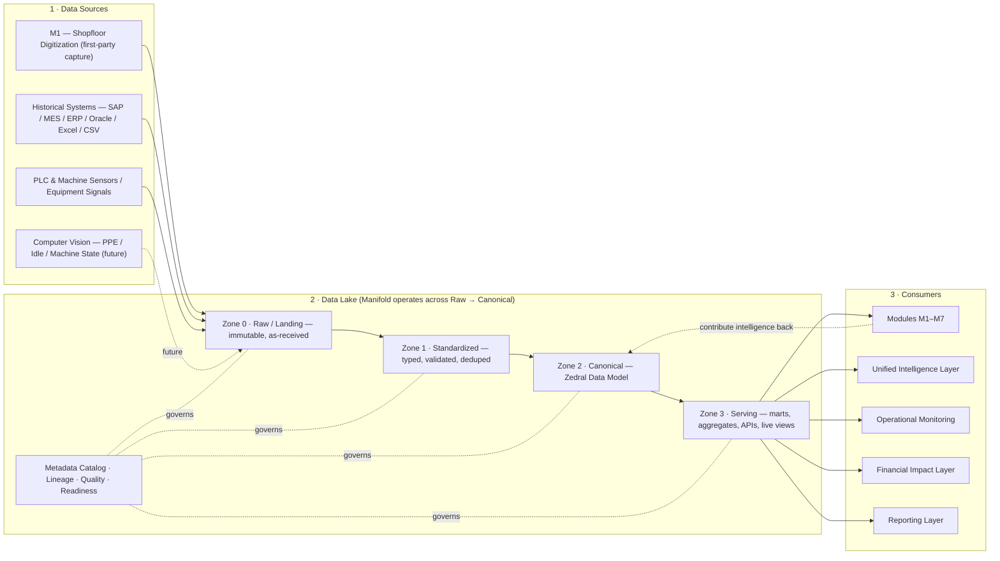
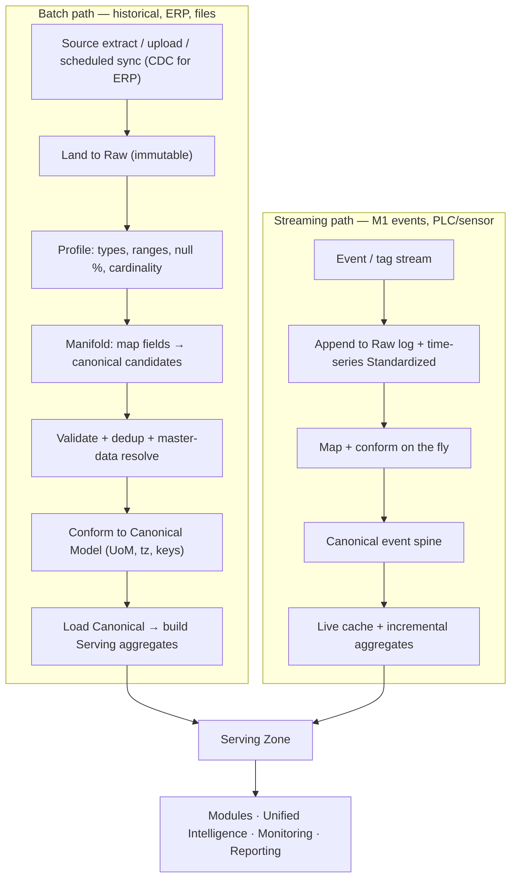
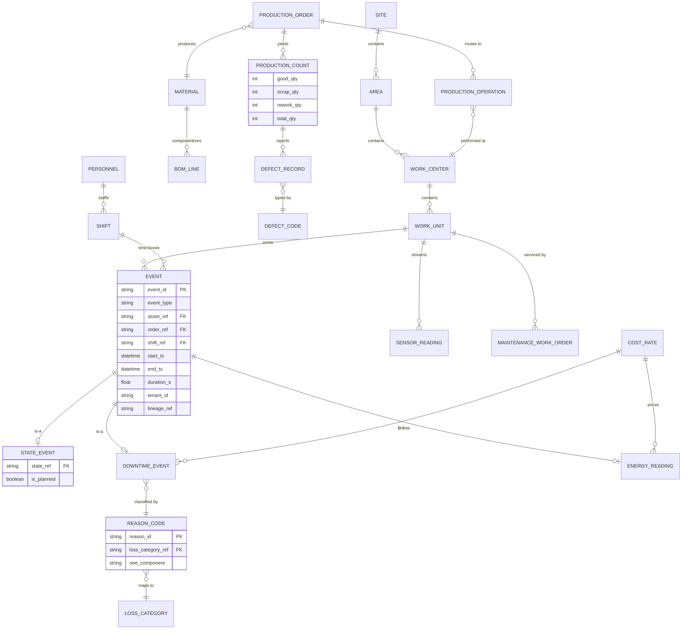
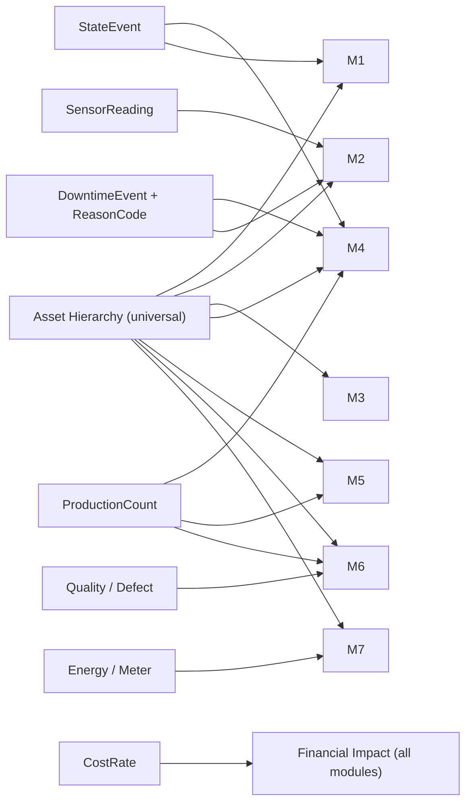
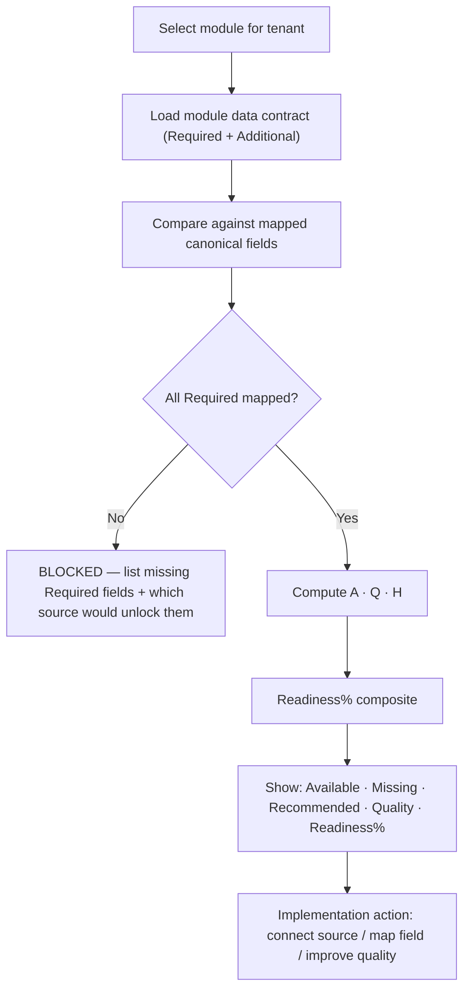

# Zedral — Data Lake Layer & Canonical Data Model
### Deep Plan · v1 · Foundation Layer

> **Scope of this document.** This is the deep plan for the two foundational pieces of Zedral: the **Data Lake layer** and the **Canonical Data Model**. Everything else in the platform (Manifold's deep spec, Unified Intelligence, Operational Monitoring, Modules M1–M7, Financial Impact, Reporting) consumes what is defined here. The **Manifold** engine is referenced where it touches the lake, but its full internal design is a *separate* planning section (recommended next).
>
> **Operating principle carried from the product spec:** the Data Lake is the *core wedge* — not a feature. Modules are *intelligence contributors*. The more sources connected, the sharper the intelligence. The Canonical Data Model is the keystone: until it is defined, no module can do reliable cross-module analytics.

---

## 0. How to read this document

| Part | Section | What it answers |
|------|---------|-----------------|
| **A. Data Lake Layer** | 1–8 | How data physically lands, is stored, processed, governed, and served |
| **B. Canonical Data Model** | 9–14 | The single shared language every module speaks |
| **C. Activation & Readiness** | 15–16 | Which module needs which data, and how we score "ready to deploy" |
| **D. Build sequence** | 17 | Phasing and the open decisions we still need to make together |

Diagrams are embedded inline and also saved as standalone `.mermaid` files alongside this document for individual viewing.

---

# PART A — THE DATA LAKE LAYER

## 1. Role & design principles

The Data Lake is the **system of record and system of intelligence** for Zedral. It has five jobs, in order: **receive → store → standardize → process → serve**.

Design principles we commit to:

1. **Store raw, immutably, first.** Every byte from every source is landed *as received* before any transformation. This gives us replayability (re-process history when logic improves), auditability, and a safety net. Nothing is destructive.
2. **Schema-on-read at the edge, schema-on-write at the core.** Sources are heterogeneous and messy, so we accept anything at landing. But by the time data reaches the **Canonical zone**, it is strictly conformed to the Zedral Data Model — that is where "schema-on-write" discipline kicks in.
3. **One canonical truth, many native copies preserved.** We never throw away the source representation. Canonical records carry pointers back to their raw lineage.
4. **Connector-agnostic.** Adding a new source (a new ERP, a new PLC protocol) must never require redesigning the lake — only a new Manifold connector + mapping.
5. **Multi-tenant by construction.** One platform serves many clients and many sites. Isolation, per-tenant configuration, and per-tenant readiness are first-class, not retrofitted.
6. **Real-time and historical share one model.** A live machine-state event and a 2-year-old downtime record are the *same canonical shape*. This is what lets monitoring, analytics, and (later) ML all read one model.
7. **Financial-impact-ready.** Cost-rate reference data is a first-class part of the model so any KPI can be priced in real time.

---

## 2. Reference architecture (the big picture)



**Reading it:** sources land into Raw. Manifold drives the Raw→Standardized→Canonical transformation. Everything downstream reads from the Serving zone — never directly from a source. Modules don't just *consume*; they write derived intelligence (e.g., a downtime classification, a predicted failure score) back into the Canonical zone so other modules and Unified Intelligence can reuse it.

---

## 3. The zone (tier) model

Zedral uses a four-zone "medallion" progression. Each zone has a clear contract.


| Zone | Aka | Contract (what's guaranteed) | Operations applied | Format |
|------|-----|------------------------------|--------------------|--------|
| **0 · Raw / Landing** | Bronze | Exact copy of source, never mutated, fully traceable | Land, checksum, tag with source + ingest timestamp + tenant | Object store (files), append log (streams) |
| **1 · Standardized** | Silver | Typed, parsed, validated, de-duplicated, source schema intact | Type casting, schema parse, null/range validation, record dedup, master-data resolution | Columnar tables, time-series store |
| **2 · Canonical** | Gold | Conforms 100% to Zedral Data Model; cross-source resolved | Field mapping → canonical fields, UoM conversion, timezone normalization, reason-code mapping, surrogate-key assignment | Canonical relational + time-series |
| **3 · Serving** | Platinum | Query-fast, aggregated, module-shaped | Pre-aggregations (per shift/day/asset), KPI rollups, materialized views, API projections, live cache | Marts, OLAP cubes, real-time cache, APIs |

**Why four zones and not two:** the Standardized zone is where we earn trust (validation + dedup) *before* we commit to the canonical mapping. The Serving zone is where we earn speed — modules and dashboards should never run heavy joins against the canonical core in real time.

---

## 4. Storage strategy

Different data shapes need different stores. The lake is **polyglot** but presents one logical model.

| Data shape | Example | Store type | Why |
|------------|---------|-----------|-----|
| Bulk files / historical dumps | SAP extract, CSV/Excel upload | **Object store** (Raw zone) | Cheap, immutable, replayable |
| Structured business records | Production orders, materials, BOM | **Relational / warehouse** | Joins, integrity, canonical core |
| High-frequency machine signals | PLC tags, sensor readings | **Time-series store** | Write throughput, downsampling, retention tiers |
| Pre-computed KPIs / rollups | OEE per shift, energy per unit | **Serving marts / OLAP** | Sub-second dashboards |
| Live "now" state | Current machine state, live counts | **In-memory / streaming cache** | Operational Monitoring latency |
| Schema, mappings, lineage, scores | Field maps, readiness % | **Metadata catalog** | The brain that makes the lake self-describing |

**Retention tiering** (especially for PLC/sensor data, which dominates volume): hot (recent, full-resolution) → warm (downsampled) → cold (archived raw). Retention is per-tenant configurable.

**Multi-tenancy:** logical isolation per tenant with a tenant key on every record + physical separation where a client contract requires it. Per-tenant encryption keys. No cross-tenant query path exists by design.

---

## 5. Processing & data flow (batch + streaming)

Two ingestion paths feed the same canonical model.



- **Batch** handles historical loads, ERP sync (ideally **change-data-capture** so we pull deltas, not full tables), and client file uploads. Scheduled synchronization is a Manifold capability exposed to client admins.
- **Streaming** handles M1 operational events and PLC/sensor tags. These need low-latency conformance so Operational Monitoring can show live state.
- **Orchestration:** a pipeline scheduler runs batch jobs, watches stream health, and — critically — supports **replay**: when mapping or business logic improves, we re-run Raw → Canonical without re-touching the source.
- **Idempotency:** every pipeline step is idempotent and keyed, so re-processing never double-counts production.

---

## 6. Governance, lineage, quality & security

The Metadata Catalog (the lake's "brain") tracks, for every field and record:

- **Lineage** — which source, which mapping, which transform produced this canonical value (end-to-end traceable back to a raw byte).
- **Data quality dimensions** — validity, completeness, consistency, timeliness/freshness, uniqueness. Each gets a measurable score (feeds §16).
- **Classification** — Required / Additional / Not-Required, *per module* (from Manifold).
- **Security** — tenant isolation, role-based access (implementation team vs client admin vs client viewer), encryption at rest and in transit, full audit log of who imported/mapped/exported what.
- **Master-data governance** — the rules that resolve "the same machine" arriving from SAP and from a PLC into one canonical asset, including **source-prioritization** (which system wins on conflict).

---

## 7. Module-based data unlocking (at the lake level)

A defining behavior: the lake + Manifold continuously answer, *for each module*, **"what data is available, what's missing, what's recommended?"** This is what makes onboarding fast and scaling cheap — it is the commercial wedge.

Mechanically: each module declares a **data contract** (the canonical entities/fields it Requires and those that are Additional). The catalog compares that contract against what's actually present and mapped for the tenant, and emits availability + a readiness score (§16). Adding a source can *unlock* a module without any code change.

---

## 8. Serving layer & APIs (how consumers read)

Consumers **never** touch sources or the raw zone. They read the Serving zone through stable contracts:

- **Canonical query API** — read canonical entities/events with filters (tenant, site, asset, time).
- **KPI / aggregate API** — pre-computed rollups (OEE, yield %, energy-per-unit) per asset/shift/day.
- **Live state API / stream** — current machine state and live counts for Operational Monitoring.
- **Export API** — client reporting + external systems (closes the Import/Export loop).
- **Write-back API** — modules contribute derived intelligence back into Canonical (e.g., M2 failure-risk score, M4 downtime classification).

Stable contracts mean a module never breaks when the lake's internals change — the canonical model is the insulation layer.

---

# PART B — THE CANONICAL DATA MODEL

## 9. Principles & standards alignment

The Canonical Data Model is the **language every module speaks**. We anchor it to established manufacturing standards so it is credible, interoperable, and future-proof:

- **ISA-95** for the equipment/asset hierarchy: **Enterprise → Site → Area → Work Center → Work Unit** (extensible down to Equipment Module / Control Module; PLC/control-level sits below the Work Unit). [Source below]
- **ISO 22400** for KPI definitions so OEE and friends mean the same thing across every factory: **OEE = Availability × Performance × Quality**, where Availability = Operating Time ÷ Planned Production Time, Performance = (Ideal Cycle Time × Total Count) ÷ Operating Time, Quality = Good Count ÷ Total Count. [Source below]
- **OEE Six Big Losses** as the backbone of the downtime/loss taxonomy: Equipment Failure & Setup/Adjustment (→ Availability), Idling/Minor Stops & Reduced Speed (→ Performance), Startup Defects & Process Defects/Reduced Yield (→ Quality). [Source below]

Modeling rules:

1. **Surrogate canonical keys** (Zedral IDs) on every entity; **natural/source keys preserved** as attributes; **source reference** retained for lineage.
2. **One event spine.** Every time-stamped occurrence (state change, downtime, count, inspection, reading) is a specialization of a single canonical **Event** shape. This is the most important modeling decision — it is what unifies real-time and historical and lets one query serve many modules.
3. **Reference data is shared.** Reason codes, defect codes, units of measure, state definitions, and cost rates live once and are referenced everywhere.
4. **Extensible without forking.** Client-specific fields live in a namespaced extension area; they never alter the canonical core, so upgrades never break a client.

---

## 10. Canonical entity catalog

Grouped into **Master/Reference** (slow-changing context) and **Transactional/Event** (the operational stream).

### 10.1 Master & reference entities

| Entity | Purpose | Key canonical fields | Standard / note |
|--------|---------|----------------------|-----------------|
| **Enterprise / Site / Area / WorkCenter / WorkUnit** | Asset & location hierarchy | `node_id`, `parent_id`, `level`, `name`, `tenant_id`, native code | ISA-95 hierarchy |
| **Asset / Equipment** | The physical machine (a Work Unit or below) | `asset_id`, `work_center_ref`, `asset_type`, `criticality`, `ideal_cycle_time`, `nameplate` | maps Machine_ID / Asset_Code / Equipment_Number → **Machine Identifier** |
| **Material / Product** | What is consumed/produced | `material_id`, `sku`, `type` (raw/WIP/finished), `uom_ref` | |
| **BOM (Bill of Materials)** | Component structure | `parent_material_ref`, `component_material_ref`, `qty`, `uom_ref` | |
| **Shift / ShiftPattern / Calendar** | Time context for everything | `shift_id`, `pattern`, `start`, `end`, `site_ref`, `planned_production_time` | drives Availability denominator |
| **Personnel / Operator / Crew** | Workforce | `person_id`, `role`, `crew_ref`, `skill` | M3A/M1 |
| **UnitOfMeasure** | Canonical UoM + conversions | `uom_id`, `dimension`, `to_base_factor` | enables cross-client comparability |
| **ReasonCode** | Downtime/loss reasons | `reason_id`, `description`, `loss_category_ref`, `oee_component` | mapped to Six Big Losses |
| **LossCategory** | Six Big Losses taxonomy | `category_id`, `name`, `oee_component` (Availability/Performance/Quality) | ISO 22400 / TPM |
| **DefectCode** | Quality defect taxonomy | `defect_id`, `description`, `severity` | M6 |
| **StateModel** | Allowed machine states | `state_id`, `name`, `is_planned`, `counts_as` | ISO 22400 state model |
| **CostRate** | Financial-impact reference | `rate_id`, `scope` (downtime/scrap/energy/labor), `value`, `currency`, `uom_ref` | powers Financial Impact Layer |
| **Tenant / Source / Connector** | Multi-tenancy + provenance | `tenant_id`, `source_id`, `connector_type`, `priority` | governance + source prioritization |

### 10.2 The Event Spine (transactional core)

Every operational fact is an **Event** (or a specialization of one). Common shape:

| Field | Meaning |
|-------|---------|
| `event_id` (PK) | canonical surrogate key |
| `event_type` | state / downtime / count / inspection / reading / maintenance |
| `asset_ref` (FK) | which Work Unit / Asset |
| `order_ref` (FK) | production order, if applicable |
| `shift_ref` (FK) | time-boxing shift |
| `start_ts` / `end_ts` | UTC; `duration_s` derived |
| `reason_ref` (FK) | reason code, if applicable |
| `value` / `uom_ref` | numeric payload + unit (counts, kWh, etc.) |
| `source_ref` / `lineage_ref` | provenance back to raw |
| `tenant_id` | isolation |

Specializations:

| Specialized event | Adds | Feeds modules |
|-------------------|------|---------------|
| **StateEvent** | `state_ref` (running/idle/down/setup/off), `is_planned` | M1, M4, Monitoring |
| **DowntimeEvent** | `reason_ref` + `loss_category_ref` + OEE component | M4, M2, Financial Impact |
| **ProductionCount** | `good_qty`, `scrap_qty`, `rework_qty`, `total_qty` | M1, M4, M5, M6 |
| **QualityInspection / DefectRecord** | `defect_ref`, `qty`, `disposition` | M6, M5 |
| **EnergyReading / MeterReading** | `utility_type`, `consumption`, `meter_ref` | M7, Financial Impact |
| **SensorReading / TagReading** | `tag`, `value`, `quality_flag` (time-series, high volume) | M2 (predictive), M4 |
| **MaintenanceWorkOrder / PMSchedule / FailureEvent** | `wo_type`, `pm_interval`, `failure_mode` | M2 |
| **YieldRecord** (often derived) | `input_qty`, `output_qty`, `yield_pct` | M5 |

---

## 11. Canonical ERD



---

## 12. Identity, keys & cross-source resolution

The hardest real-world problem: the *same thing* arrives from multiple systems under different identifiers.

- **Canonical surrogate key** assigned at the Canonical zone; stable forever.
- **Source-key map**: every canonical entity keeps the set of `(source_system, native_key)` pairs that resolve to it.
- **Master-data resolution**: deterministic rules first (matching native codes, hierarchy path), fuzzy/similarity second, manual override always wins (consistent with Manifold's mapping philosophy).
- **Source prioritization**: when two systems disagree on an attribute, a per-tenant priority decides the winner (e.g., "ERP wins on material master, PLC wins on machine state").

This is the boundary where the Data Lake hands off to **Manifold** for the deep mapping logic — flagged as the next planning section.

---

## 13. Reference data: units, time, state & reasons

- **Units of measure:** store the native value *and* a canonical-base value (`to_base_factor`), so a client reporting in one unit and another in a different unit are still comparable.
- **Time & timezone:** persist all timestamps in **UTC**; carry site timezone for local display; bucket into hour / shift / day for aggregates. Shift calendars define **Planned Production Time** — the denominator ISO 22400 Availability depends on.
- **State model:** a controlled vocabulary of machine states with `is_planned` and `counts_as` (which OEE component the state affects). This is what lets one StateEvent stream drive OEE consistently.
- **Reason & loss taxonomy:** 6–12 reason codes per tenant (research-backed sweet spot), each mapped to a Six-Big-Losses category and an OEE component, so a breakdown and a changeover are never conflated.

---

## 14. Versioning & extensibility

- **Schema versioning** on the canonical model; changes are **additive** by default.
- **Client extension namespace:** custom fields live under an extension area keyed to the tenant; they enrich analytics without polluting the canonical core.
- **Backward compatibility contract:** the Serving APIs version independently, so a module pinned to v1 keeps working while the core evolves — this is what allows "continuous module expansion without redesign."

---

# PART C — ACTIVATION & READINESS

## 15. Module → canonical-entity requirement matrix

This matrix is the machine-readable contract behind module-based data unlocking. ● = Required, ○ = Additional (recommended), blank = not used.

| Canonical entity / group | M1 | M2 Maint | M3 Ops | M4 OEE | M5 Yield | M6 Quality | M7 Energy |
|---|:--:|:--:|:--:|:--:|:--:|:--:|:--:|
| Asset hierarchy (Site→WorkUnit) | ● | ● | ● | ● | ● | ● | ● |
| Shift / Calendar | ● | ○ | ● | ● | ○ | ○ | ○ |
| Personnel / Crew | ● | ○ | ● | | | ○ | |
| Production Order / Operation | ○ | | ● | ● | ● | ● | ○ |
| Material / BOM | | | ● | ○ | ● | ● | |
| StateEvent (machine state) | ● | ○ | ○ | ● | | | ○ |
| DowntimeEvent + ReasonCode | | ● | ○ | ● | | | |
| ProductionCount (good/scrap/rework) | ● | | ○ | ● | ● | ● | ○ |
| QualityInspection / DefectRecord | | | | ○ | ○ | ● | |
| EnergyReading / Meter | | | | | | | ● |
| SensorReading (time-series) | ○ | ● (predictive) | | ○ | ○ | ○ | ○ |
| Maintenance WO / PM / Failure | | ● | ○ | | | | |
| CostRate (financial impact) | ○ | ○ | ○ | ○ | ○ | ○ | ○ |



**Read this as the onboarding engine:** connect a source, Manifold maps its fields to these entities, and the platform instantly shows which modules just became deployable.

---

## 16. Data readiness assessment model

For every tenant × module, the platform computes a **Readiness %** from four measurable inputs:

1. **Required coverage** `R` = mapped Required fields ÷ total Required fields. *Gate:* a module is not "Ready" unless `R = 100%`.
2. **Additional coverage** `A` = mapped Additional fields ÷ total Additional fields (depth of intelligence).
3. **Data Quality Score** `Q` = weighted mean of validity, completeness, consistency, timeliness, uniqueness (0–100).
4. **Volume/History sufficiency** `H` = is there enough history/frequency for the module's analytics (and, later, ML training)?

A transparent composite (weights tunable per module):

```
Readiness% = 100 × [ wR·R + wA·A + wQ·(Q/100) + wH·H ]      with R as a hard gate
Default weights:  wR = 0.50, wA = 0.20, wQ = 0.20, wH = 0.10
Status:  Ready ≥ 85 (and R=100) · Partial 60–84 · Blocked < 60 or R<100
```



This is the screen that turns a multi-week scoping exercise into a same-day assessment.

---

# PART D — BUILD SEQUENCE

## 17. Phasing & open decisions

**Suggested build order (foundation-up):**

1. Canonical Model core — Event spine + Asset hierarchy + Shift/Calendar + reference data (UoM, State, Reason/Loss, DefectCode, CostRate).
2. Raw + Standardized zones + Metadata Catalog skeleton (lineage + quality scoring hooks).
3. Canonical zone conformance + surrogate keys + source-key map.
4. Serving zone + Canonical/KPI/Live APIs.
5. Module data contracts + Readiness model (lights up M4/M5/M6/M7 which are already built on dashboards).
6. Hand-off to **Manifold deep plan** (connectors, auto-mapping, classification UI, dedup) — the next section.

**Open decisions we should make together (these change the build):**

- Cloud / on-prem / hybrid per client? (PLC + ERP environments often force hybrid.)
- Real-time latency target for Operational Monitoring (sub-second vs seconds)?
- Which historical source is the *first* integration target (SAP? Excel/CSV?) — sets connector priority.
- Default tenant isolation level (logical vs physical) for the first clients.
- Confirm the v1 reason-code / loss taxonomy and state model with a real client's data.

---

### Sources (standards grounding)
- ISA-95 equipment hierarchy — [ISA](https://www.isa.org/standards-and-publications/isa-standards/isa-95-standard), [OPC Foundation ISA-95 model](https://reference.opcfoundation.org/ISA-95/v100/docs/7.4.1), [Rhize ISA-95 equipment](https://docs.rhize.com/isa-95/resources/equipment/)
- ISO 22400 manufacturing KPIs / OEE — [ISO 22400-2:2014](https://www.iso.org/standard/54497.html), [ISO 22400 overview](https://connect981.com/blog-posts/iso-22400-overview-manufacturing-kpis-basics)
- OEE Six Big Losses — [Six Big Losses explained](https://ifactoryapp.com/blog/six-big-losses-manufacturing), [OEE & loss-tree fundamentals](https://connectedmanufacturing.com/knowledge-topics/oee-and-loss-tree-fundamentals)
