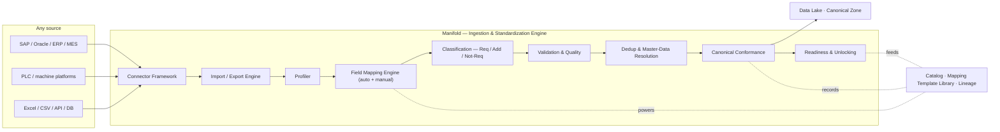
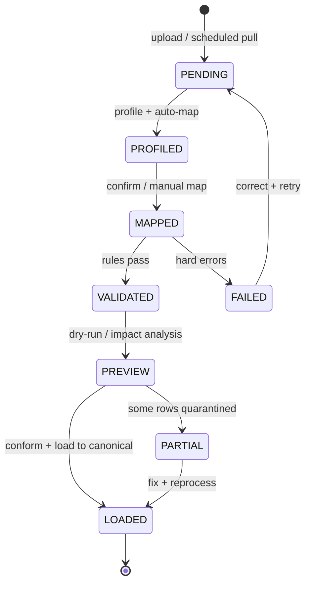
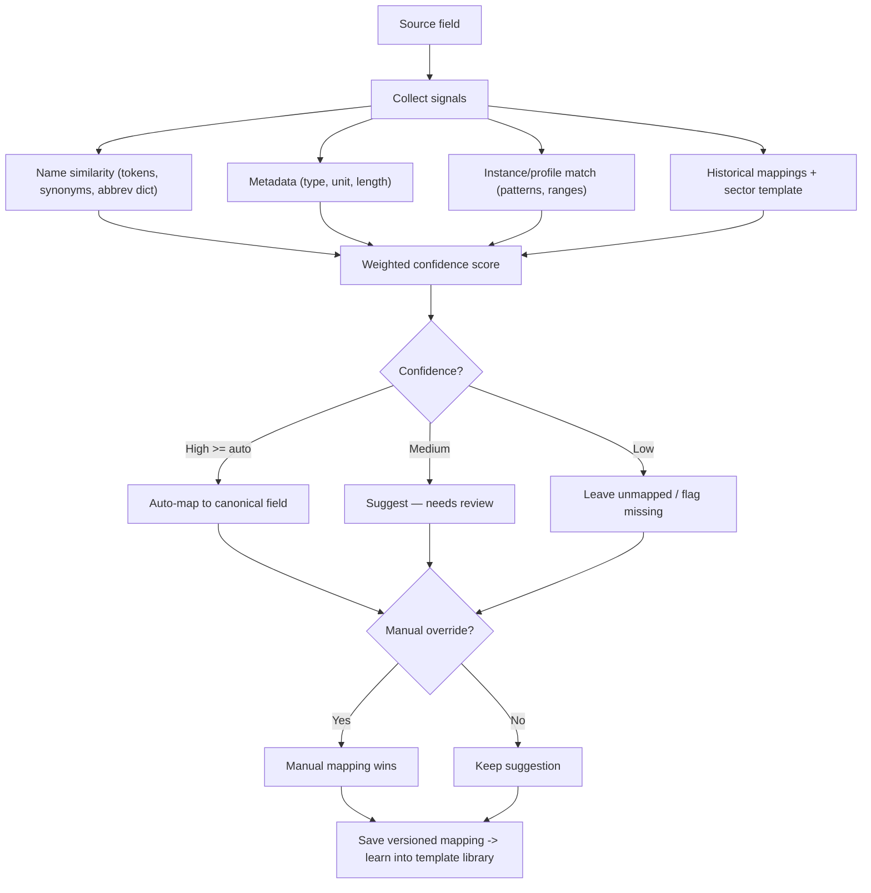
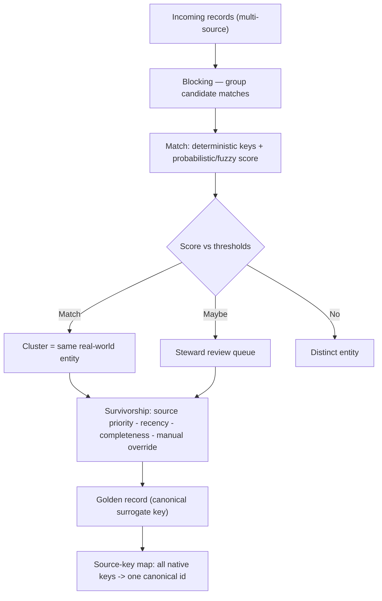

# Zedral — Manifold (Data Integration & Mapping Layer)
### Deep Plan · v1 · Foundation Layer (sits inside the Data Lake)

> **What Manifold is.** Manifold is the universal **ingestion, transformation, and schema-management engine** of the Data Lake. It is the machine that turns data from *any* source — M1 shop-floor capture, SAP/Oracle/MES, PLCs, Excel/CSV, APIs, databases — into the **Zedral Canonical Data Model** defined in `01_DataLake_and_Canonical_Model_DeepPlan.md`. It is a foundational Data Lake **capability, not an independent module**.
>
> **Why it's the competitive wedge.** The easier it is to onboard a new client's data and make it usable by every module, the faster Zedral scales across factories, ERPs, and sectors. Manifold is where that ease is won or lost.
>
> **Prior art available.** The user has an existing, working **Import/Export module in Zinance (FAMS)** — a fixed-asset product (client-side React + SheetJS + localStorage). It is *not* Manifold, but it proves several patterns Manifold should adopt. Reuse mapping is in **§13**.

---

## 0. How Manifold relates to the Data Lake

Manifold is the engine that drives the **Raw → Standardized → Canonical** transition from the Data Lake plan. The lake provides the zones, storage, catalog, and serving; Manifold provides the *intelligence* that moves data between them.

| Data Lake zone (doc 01) | What Manifold does there |
|---|---|
| Zone 0 · Raw | Connectors land source data immutably; capture provenance |
| Zone 1 · Standardized | Profile, type, validate, deduplicate, master-data resolve |
| Zone 2 · Canonical | Field-map, convert UoM/timezone, map code taxonomies, assign surrogate keys |
| Catalog | Write lineage, mappings, classification, quality + readiness scores |

---

## 1. Responsibilities & principles

Manifold owns nine responsibilities: **(1)** connect to any source; **(2)** import/export in bulk and on schedule; **(3)** profile incoming data; **(4)** map source fields to canonical fields; **(5)** classify fields by module need; **(6)** validate and score quality; **(7)** deduplicate and resolve master data; **(8)** conform to the canonical model; **(9)** assess per-module readiness and unlock modules.

Principles:

1. **Connector-agnostic.** A new source type is a new connector + mapping — never a platform redesign.
2. **Manual override always wins.** Automation proposes; humans dispose. Every auto-decision is overridable, and the override is remembered.
3. **Learn once, reuse everywhere.** Every confirmed mapping enriches a **sector template library**, so the next client in the same sector onboards far faster.
4. **Tolerant ingestion, strict conformance.** Accept messy input row-by-row (never abort a whole batch on one bad row); but nothing reaches the Canonical zone until it conforms.
5. **Everything is traceable.** Every canonical value carries lineage back to a raw row, an import batch, and the mapping that produced it.
6. **Server-side, multi-tenant, scale-first.** Manifold is a platform engine (large historical loads, streaming, many tenants) — not a browser feature.

---

## 2. Manifold reference architecture

---

## 3. Connector framework (connector-agnostic)

Every source is reached through a **connector** that implements one contract, so the rest of Manifold never knows or cares where data came from.

| Source class | Examples | Typical mode |
|---|---|---|
| Enterprise systems | SAP, Oracle, ERP, MES, custom enterprise software | CDC + scheduled batch |
| Machine/edge | PLCs, machine-data platforms, sensor gateways | Streaming / polling |
| Files | Excel, CSV | Manual upload + watched folder |
| Programmatic | REST/SOAP APIs, databases (JDBC/ODBC) | Pull on schedule / push |
| First-party | **M1 shop-floor capture** | Event stream + read replica |

**Connector contract (the SDK):** `discover()` (list tables/tags/columns + metadata) · `sample()` (rows for profiling) · `read(full | incremental/CDC | stream)` · `write/export` · `auth` · `health/heartbeat`. Adding a connector means implementing this contract — no core change. Connectors declare capabilities (full load, CDC, streaming, schema discovery) so Manifold adapts the pipeline automatically.

---

## 4. Import / Export engine

The import flow generalizes the **proven Zinance wizard** (§13) into a connector-aware, server-side pipeline with a **pre-commit dry-run**:

**Upload/Connect → Preview → Map → Validate → Dry-run/Impact → Summary → Result.**

Capabilities: CSV/Excel/API/DB/bulk import · **historical** load (with continuity + impact preview before commit) · **scheduled synchronization** · per-row tolerant errors (a bad row is quarantined, the batch continues) · full batch provenance. **Export**: field-projection picker, CSV/XLSX, scheduled or on-demand, for client reporting and external systems. Two audiences: **implementation teams** (first onboarding, complex mappings) and **client administrators** (ongoing uploads, exports).

---

## 5. Data profiling

Before mapping, Manifold profiles each source field: data **type**, **value patterns/regex**, **ranges**, **null %**, **cardinality/uniqueness**, **sample values**, and **unit hints**. Profiling feeds two things: the **auto-mapper** (instance-based signal) and the **quality score** (validity/completeness baseline).

---

## 6. Intelligent Field Mapping Engine

The core problem: every client names things differently. `Machine_ID`, `Asset_Code`, `Equipment_Number` must all resolve to the canonical **Machine Identifier**. Manifold combines multiple matcher signals (established schema-matching practice — name, instance, and learning-based) into one confidence score:

| Signal | What it uses |
|---|---|
| **Name / linguistic** | Token similarity, synonym + abbreviation dictionary (domain-specific: "Thk"→thickness, "Wt"→weight), edit distance |
| **Metadata** | Data type, unit suffix, length, constraints |
| **Instance / profile** | Value patterns and ranges vs the canonical field's expected profile |
| **Historical / template** | Mappings confirmed on prior clients, especially **sector templates** |
| **Learning (future)** | Embedding-based property matching for semantic similarity |

Mappings are **versioned, reusable artifacts**. Confirming a client's mapping contributes to the sector template — the mechanism behind "sector-reusable, low customization."

---

## 7. Data Classification Framework

Every mapped field is classified **per module**: **Required** (module cannot function without it) · **Additional** (improves analytics/insight/financial visibility — strongly recommended) · **Not-Required** (currently unused → store, archive, or ignore per client config). Unknown source columns that map to no canonical field become **namespaced extension fields** (the improved version of Zinance's `custom_*` — reconciled across imports, never polluting the canonical core). Classification is driven by each module's **data contract** (doc 01 §15 matrix).

---

## 8. Validation & Data Quality

A layered rule set (generalizing the concrete rules proven in Zinance §7 and M1-07):

- **Structural:** file/type checks, empty-file guard, encoding.
- **Format:** date normalization (DD/MM/YYYY, DD-MM-YYYY, YYYY-MM-DD, Excel dates…), numeric coercion, unit parsing.
- **Mandatory:** all Required fields mapped + present (the proceed gate).
- **Range / sanity:** domain caps (e.g. Zinance's "useful-life > 50 ⇒ days", "rate > 100 ⇒ null"); for Zedral, range guards like output_thk < input_thk from M1.
- **Dependency & integrity:** cross-field rules, FK to masters (no free-text codes), allow-lists.
- **Duplicate:** see §9.

Bad rows are **quarantined with a row-level reason**, not fatal to the batch (`{success, failed, skipped, errors[]}`). Quality is scored on the five dimensions from doc 01 §6 (validity, completeness, consistency, timeliness, uniqueness) and fed to readiness.

---

## 9. Deduplication & Master-Data Resolution

This is the capability Zinance **lacks entirely** (its known limitation: re-importing a file creates duplicates) — and a core Manifold differentiator. Manifold detects **duplicate fields, duplicate sources, and duplicate records**, then resolves to a **single source of truth**.

Method: **deterministic** matching on natural keys first, **probabilistic/fuzzy** scoring (Fellegi-Sunter-style) where identifiers are inconsistent, optional **ML** later; **blocking** for scale. **Survivorship rules** build the **golden record** by source priority + recency + completeness, with manual override. The result is the **source-key map** (doc 01 §12): every `(source_system, native_key)` → one canonical ID. This is how "the same machine from SAP and from a PLC" becomes one canonical Asset.

---

## 10. Canonical conformance

The final transform into Zone 2: apply the confirmed mapping → **convert units** to canonical base (store native + canonical) → **normalize timestamps** to UTC + site timezone → **map code taxonomies** (client reason/defect/state codes → canonical ReasonCode/LossCategory/StateModel) → **assign surrogate keys** + attach lineage. Output is 100% canonical-model-conformant data plus a full provenance trail.

---

## 11. Module-based data unlocking & readiness

Manifold computes, per tenant × module, **what's available, missing, and recommended**, and the **Readiness %** (doc 01 §16 model: Required-coverage gate + Additional coverage + Quality + History sufficiency). Connecting a source can **unlock** modules with no code change.

---

## 12. Sector-reusable mapping templates (the scaling wedge)

Manifold ships **pre-built mapping templates per sector**. The **Hero Steels M1 blueprint** (COIL_NO spine, grade/customer/defect/stoppage masters, 115 canonical fields, OPN/ELECT/MECH/UTILITY/POWER stoppage taxonomy) seeds the **cold-rolling-steel template**. The next steel client's `Coil No / Coil Source No` auto-maps to `COIL_NO`, their stoppage codes pre-map to the canonical loss taxonomy, and their modules light up on day one. Templates are versioned and improve with every deployment.

---

## 13. Prior art & reuse — Zinance (FAMS) Import/Export

**Verdict: useful as a pattern/UX reference for Manifold's import path and mapping UX — not as Manifold's architecture or engine.** It is a single-app, client-side feature; Manifold is a multi-source, multi-tenant, server-side platform engine.

**Reuse (proven patterns to carry forward):**

| Zinance pattern | Where it informs Manifold |
|---|---|
| 4-step wizard **Upload → Preview → Map → Summary** (+ 6-step historical with **Impact Analysis**) | §4 import flow + the **dry-run/impact preview before commit** |
| **Smart auto-mapping** by header pattern + manual overrides + **SmartDecisionAlerts** | §6 mapping engine (name signal + override precedence + advisories) |
| **Per-row try/catch**, batch continues, `{success, failed, skipped, errors[]}` | §8 tolerant validation + quarantine |
| **Batch provenance**: `importMetadata{batchId, fileName, rowNumber, importedBy, importMethod, originalData}` + **ImportLog** history view | §10 lineage + §14 governance |
| **Field-picker export** (XLSX/CSV, required fields locked) | §4 export engine |
| Domain **sanity heuristics** (useful-life days→years, rate>100→null, method allow-list) | §8 range/sanity rules |
| Auto **custom field** creation for unknown columns | §7 extension-field handling (improved with reconciliation) |

**Do NOT carry over (architecture mismatch / anti-patterns):** browser-only `localStorage` persistence and ~5–10 MB / ~100-rows-sec ceiling; client-side-only parsing (no backend); **file upload as the only source** (Manifold needs connectors for SAP/Oracle/PLC/API/DB); **no deduplication/entity resolution** (Manifold's §9 is exactly this gap); no canonical cross-source model (maps to one app's `Asset` schema); no transactional rollback; hard-coded `importedBy`/fiscal year; no CSV-injection hardening; 100-batch log cap; first-sheet-only Excel.

**Net:** mine Zinance for the **import wizard, smart-map UX, validation heuristics, and provenance logging**; build the **connector framework, dedup/master-data, canonical conformance, and readiness** fresh — those are the platform-grade parts Zinance never needed.

---

## 14. Governance, lineage & provenance

Every import is a tracked **batch** (`PENDING → … → LOADED/PARTIAL/FAILED`) with who/what/when. Every canonical record links to its batch, source row, and mapping version (lineage). Mappings, overrides, and survivorship decisions are audit-logged. RBAC separates **implementation teams** (connectors, complex mappings, templates) from **client admins** (uploads, exports, simple remaps) — extending the M1 role model (Operator/Supervisor/Plant Head/Admin).

---

## 15. Build sequence & open decisions

**Suggested order:** (1) Connector contract + file + database connectors; (2) Profiler; (3) Mapping engine (name + metadata + instance) + manual UI + versioned mappings; (4) Classification + validation/quality; (5) Canonical conformance + source-key map; (6) Dedup/master-data resolution; (7) Readiness + unlocking; (8) Sector template library (seed with Hero Steels); (9) SAP/Oracle/PLC connectors + scheduling/CDC.

**Open decisions (need your call):**

- Buy vs build for entity resolution/MDM (use an existing matching engine vs build probabilistic matcher)?
- First connector targets beyond files — SAP first, or generic DB/API first?
- Auto-map confidence thresholds (how aggressive should auto-accept be vs always-review)?
- Where mapping happens for ongoing syncs — client-admin self-serve vs implementation-team-only?
- How much of the Zinance import UI to literally reuse vs rebuild server-side.

---

### Sources (technique grounding)
- Schema matching — [Rahm & Bernstein survey](https://www.microsoft.com/en-us/research/wp-content/uploads/2016/02/tr-2001-17.pdf), [LEAPME: learning-based property matching with embeddings](https://arxiv.org/pdf/2010.01951), [schema matching overview](https://en.wikipedia.org/wiki/Schema_matching)
- Entity resolution & MDM — [MDM: golden records, matching & survivorship](https://justinlilly.com/master-data-management-golden-records-matching-and-survivorship), [survivorship & the golden record](https://greenwolftechlabs.com/survivorship-in-mdm-creating-the-golden-record/)
- Prior art — Zinance (FAMS) Import/Export Module documentation (user-provided)
