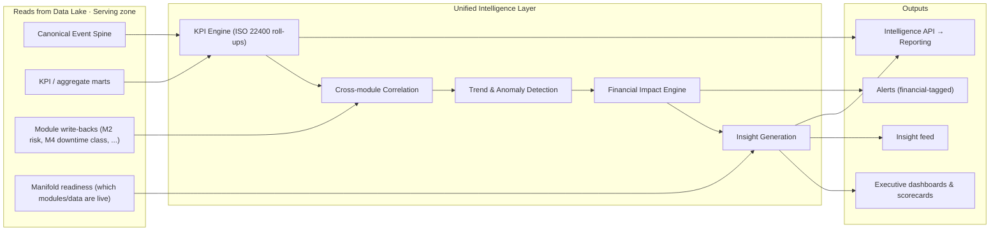
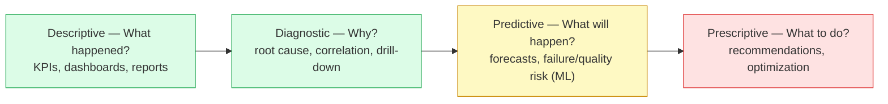
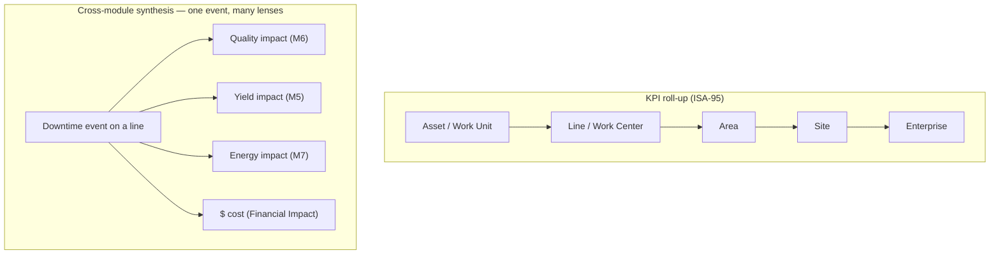
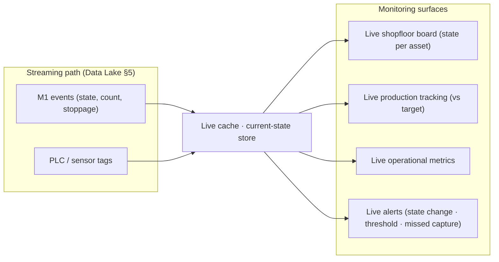
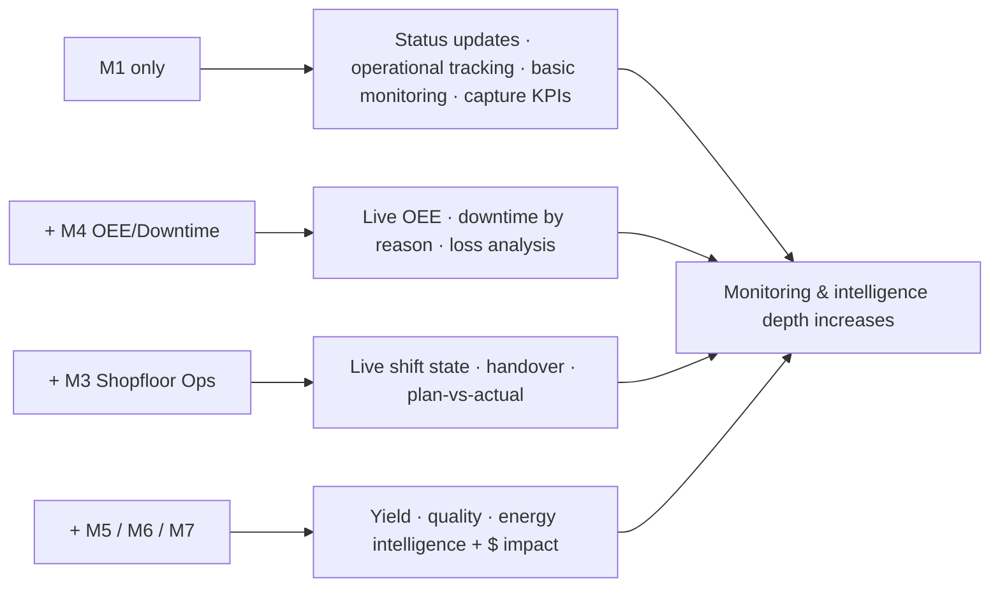

# Zedral — Unified Intelligence + Operational Monitoring
### Deep Plan · v1 · Synthesis Layer (reads the Canonical Model)

> **What this layer is.** Two surfaces that sit on top of the Data Lake's **Serving zone** and turn canonical data into decisions:
> - **Unified Intelligence Layer (UIL)** — the synthesis brain. Combines every module + every source into cross-functional insight, KPI tracking, trend detection, **financial impact**, and executive visibility. *Synthesized, over time, answering "why?" and "what next?"*
> - **Operational Monitoring Layer** — the live nervous system. Real-time shopfloor/production/state visibility. *Now, low-latency, answering "what's happening?"*
>
> Both read the **canonical Event Spine + KPI marts** defined in `01_DataLake_and_Canonical_Model_DeepPlan.md`, are populated through **Manifold** (`02`), and get sharper as more modules contribute. UIL is the **major strategic focus for the next ~12 months**.

---

## 0. The core distinction (and why both exist)

| | **Operational Monitoring** | **Unified Intelligence** |
|---|---|---|
| Question | "What's happening right now?" | "Why did it happen / what should we do?" |
| Time horizon | Live (seconds) | Synthesized across time |
| Reads from | Streaming path → **live cache** | Canonical Event Spine + **KPI marts** + module write-backs |
| Output | Live boards, state, live alerts | Insights, KPI scorecards, financial impact, exec views |
| Depth scales with | Installed modules + live data | Installed modules + accumulated history |

They share one canonical model but use different stores (live cache vs analytical marts) and serve different latencies.

---

# PART A — UNIFIED INTELLIGENCE LAYER

## 1. Role & principles

UIL is **one synthesis layer over all modules**, not a dashboard per module. Principles:

1. **Synthesize, don't silo.** The value is the *cross-module* picture: a single downtime event seen simultaneously as availability loss, yield loss, energy waste, and a dollar figure.
2. **Always-on baseline, progressive depth.** A **basic version exists in all tiers** (even M1-only). Each added module deepens accuracy, context, and predictive power — gracefully, never breaking.
3. **Financial impact is attached, not bolted on.** Wherever a KPI can be priced, the dollar value is shown alongside it — on dashboards, insights, and alerts.
4. **Explainable & traceable.** Every KPI and insight traces back through lineage to canonical events (doc 01 §6). No black-box numbers.
5. **ML-ready by construction.** The canonical model + accumulated history is the substrate; UIL is architected so ML forecasting/anomaly/prescriptive plug in without redesign.

## 2. UIL reference architecture

## 3. The intelligence ladder (capability maturity)

UIL is designed along the **Gartner analytic ascendancy** — and human effort falls as you climb:

| Rung | Question | Zedral timing | Powered by |
|------|----------|---------------|------------|
| **Descriptive** | What happened? | Now — all tiers | KPI engine over canonical events |
| **Diagnostic** | Why? | Now → deepens with modules | Cross-module correlation + drill-down |
| **Predictive** | What will happen? | Post ~6 months (≈ late 2026+) | ML on accumulated history (per module) |
| **Prescriptive** | What should we do? | 2–3 yr horizon | Optimization + recommendation engine |

UIL ships at Descriptive+Diagnostic for v1; the architecture reserves the plug points for Predictive/Prescriptive.

## 4. KPI framework

A central **KPI registry** defines each KPI once (formula, inputs, unit, grain) — **ISO 22400-aligned** so numbers mean the same thing everywhere. KPIs roll up the **ISA-95 hierarchy** and across time grains (shift / day / month).

Core v1 KPIs (from canonical entities): **OEE = Availability × Performance × Quality** and its three components; **Yield %** (good ÷ input); **Quality/First-Pass rate** (good ÷ total); **Downtime** by reason & loss category; **Energy per unit** (kWh ÷ MT); **Throughput vs target**. Each KPI carries a **financial-impact twin** (§6).

## 5. Cross-module / cross-functional synthesis

This is the "**Unified**" in Unified Intelligence — the same canonical event read through every module's lens at once. Examples the layer should produce:

- A **downtime event** → availability loss (M4) **and** the yield/quality of coils affected (M5/M6) **and** the energy burned while idle (M7) **and** the **total $ cost** — one synthesized story, not four dashboards.
- A **quality drop** correlated to a specific **machine state**, **grade**, **shift**, or **operator/crew** (using the canonical State/Order/Shift/Personnel links from M1).
- **Plan vs actual** (M3 planning) reconciled against captured production (M1) with the financial gap quantified.

Synthesis is possible *only because* every module speaks the canonical model — the payoff of docs 01–02.

## 6. Financial impact engine

Translates operational outcomes to money in real time, using canonical **CostRate** reference data (doc 01 §10):

| KPI / event | Financial impact formula |
|---|---|
| Downtime | downtime hours × downtime cost-rate (+ lost-production opportunity) |
| Yield loss | scrap/reject MT × material cost-rate |
| Quality loss | defect/rework MT × (rework cost or scrap cost) |
| Energy waste | excess kWh × energy tariff |
| Maintenance | failure/repair events × maintenance cost-rate |

The dollar figure is surfaced **everywhere** — dashboards, insights, alerts — making the Financial Impact Layer visible through UIL rather than as a separate report.

## 7. Trend detection & insight engine

- **Trends & anomalies:** moving baselines per KPI/asset; flag drift, spikes, regime changes; rank by financial impact.
- **Insight generation:** v1 is **rule/template-based** ("Line 4HI lost 2.1 MT to MECH stoppages this shift, costing ₹X — 38% above its 7-day norm"). Later, **ML/LLM-generated** narrative insights.
- **Insight lifecycle:** detect → rank (by $) → explain (link to events/lineage) → route (to role) → track (did it get resolved?). This lifecycle is also the on-ramp to **prescriptive** ("what to do") later.

## 8. Module-aware progressive intelligence

UIL reads **Manifold readiness** (doc 02 §11) to know which modules and data are live for a tenant, and renders the deepest intelligence the data supports — degrading gracefully when data is missing rather than showing broken widgets. (See Part B diagram for the capability ladder; the same gating applies to UIL depth.)

## 9. AI/ML readiness (the 12-month focus)

The canonical model + accumulating history is the **feature substrate**. Reserved plug points: OEE/throughput **forecasting**; **downtime & failure prediction** (M2, once enough history); **yield & quality prediction** (M5/M6); **energy forecasting** (M7); anomaly detection across all. A **feature store** over the canonical Event Spine keeps training and serving consistent. ML gating is the **data-accumulation milestone** noted in the operating model — UIL doesn't block on it, it grows into it.

---

# PART B — OPERATIONAL MONITORING LAYER

## 10. Role & principles

Live visibility of the shopfloor — **status, production, metrics, and machine state in real time**. Depth depends on installed modules and live data. Principles: lowest-latency path (off the **streaming** ingestion of doc 01 §5), never blocks capture, and shows "now" truthfully even when only M1 is live.

## 11. Monitoring architecture

The **live cache** holds current canonical state (last StateEvent per asset, running counts vs target, open stoppages) for sub-second reads, separate from the analytical marts UIL uses.

## 12. Capability tiers by installed module

Monitoring (and UIL) depth scales exactly with what's deployed — directly from the operating model:

| Installed | Live monitoring you get |
|---|---|
| **M1 only** | Per-asset status, coil/production tracking, basic operational metrics, missed-capture alerts |
| **+ M4** | Live OEE & component split, downtime by reason/loss category |
| **+ M3** | Live shift state, handover status, plan-vs-actual |
| **+ M5/M6/M7** | Live yield, quality, and energy — each with financial impact |

## 13. Alerting & thresholds

A unified alert framework over the live stream: **state-change** (machine down, charge O₂-gate failed), **threshold breach** (line speed out of grade band, OEE below target), **missed-capture** (e.g., M1 pickling **hourly chart slot missed → amber**), and **anomaly** (statistical). Alerts are **financial-tagged** (what is this costing per hour?), de-duplicated, and **routed by role** (Operator/Supervisor/Plant Head — extending M1's RBAC) with escalation.

---

# PART C — RELATIONSHIPS & SEQUENCE

## 14. How this layer connects to the rest

- **Reads** the canonical Serving zone (docs 01–02); **never** touches sources directly.
- **Consumes module write-backs** — modules push derived intelligence (M2 risk score, M4 downtime classification) back into canonical; UIL synthesizes them.
- **Surfaces the Financial Impact Layer** (cross-cutting) inside every view.
- **Feeds the Reporting Layer** — UIL is the interactive/live brain; Reporting is the scheduled/static, regulator- and management-facing output drawn from the same KPIs.

## 15. Build sequence & open decisions

**Order:** (1) KPI registry + KPI engine over canonical (descriptive); (2) roll-up hierarchy + exec scorecards; (3) Financial Impact engine + cost-rate config; (4) live cache + monitoring boards; (5) alert framework; (6) cross-module correlation + diagnostic drill-down; (7) rule-based insight engine; (8) feature store + first ML plug-ins (predictive).

**Open decisions (need your call):**

- **Real-time latency target** for monitoring (sub-second vs few-seconds) — sets the live-cache/streaming tech.
- **v1 "basic tier" KPI set** — exactly which KPIs ship for an M1-only client.
- **Insight engine** — how long to stay rule/template-based before investing in ML/LLM narratives.
- **Alert routing & roles** — reuse M1 roles as-is, or a richer on-call model?
- **Exec dashboard configurability** — fixed executive scorecard vs per-client configurable.
- **Financial cost-rate ownership** — who maintains rates (client finance vs implementation), and currency/period handling.

---

### Sources
- Analytics maturity (descriptive → diagnostic → predictive → prescriptive) — [Gartner analytic ascendancy model](https://learningdiscourses.com/subdiscourse/analytics-maturity-gartner-analytic-ascendancy-model/), [analytics maturity overview](https://dataforest.ai/blog/analytics-maturity-model)
- KPI definitions (OEE = A×P×Q) — ISO 22400 (grounded in `01_DataLake_and_Canonical_Model_DeepPlan.md`)
