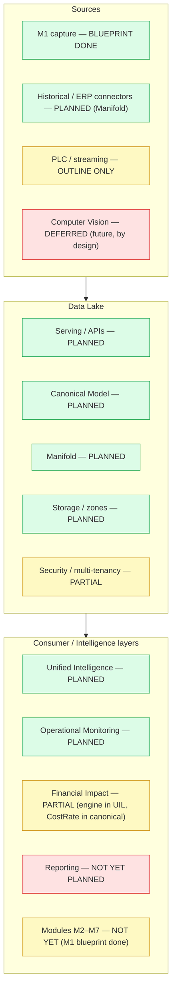
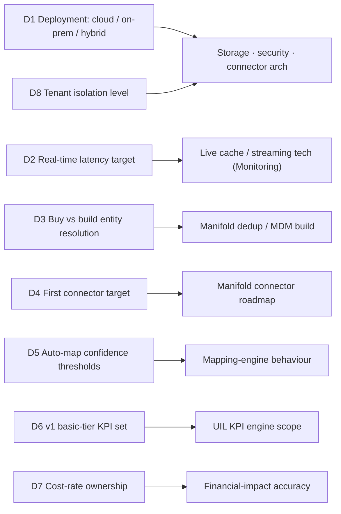

# Zedral — Consolidated Review & Traceability
### Audit of the foundation plans against the operating-model intent · v1

> **Purpose.** This document reviews the three foundation deep-plans — `01` Data Lake + Canonical Model, `02` Manifold, `03` Unified Intelligence + Operational Monitoring — against the **Zedral operating model** you defined, plus the **M1 (Hero Steels)** blueprint. It answers one question: *is what we planned actually according to use?* It is deliberately critical: it names strengths, watch-items, gaps, risks, and the decisions you still need to make.
>
> **How to read it.** §1 verdict → §2 coverage map → §3 traceability matrix → §4 alignment (strengths + watch-items) → §5 gaps/deferred → §6 risk register → §7 the consolidated decision list (the actionable part) → §8 what to lock before build → §9 sign-off checklist.

---

## 1. Executive verdict

**The foundation is strong and well-aligned with the operating model.** The plans honour the core philosophy — Data Lake as the wedge, modules as contributors, canonical model as the shared language, financial impact attached everywhere, intelligence that deepens with modules. The three layers fit together cleanly (sources → Manifold → canonical → synthesis) and are grounded in real standards (ISA-95, ISO 22400, Six Big Losses) rather than generic data-lake boilerplate.

**Three things genuinely need your attention before deep build:**

1. **Generality beyond steel.** The canonical model is standards-anchored (good), but it has been *validated against exactly one client in one sector* (Hero Steels, cold-rolling steel). The operating model promises reuse across clients and *industries*. This is the single biggest "according-to-use" question — see §4 and Risk R1.
2. **A handful of architecture-shaping decisions are still open** (deployment model, real-time latency, buy-vs-build entity resolution). These don't block planning but *do* shape the build — §7.
3. **Two intended layers aren't deep-planned yet** (Reporting; Financial Impact as its own consolidated spec) and **modules M2–M7** are still high-level — all expected, but listed so nothing is silently dropped — §5.

Net: proceed, but lock the §7 decisions and plan to validate the canonical model against a second sector.

---

## 2. Plan coverage map

**Legend:** green = deep-planned · amber = partially covered, needs a dedicated pass · red = not yet planned (some intentionally deferred per the roadmap).

---

## 3. Traceability matrix (operating model → plans)

Status: ✅ planned (deep) · 🟡 partial · 🟠 deferred (intentional, per roadmap) · 🔴 gap (needs a pass)

### 3.1 Core philosophy & Data Lake

| Operating-model intent | Addressed in | Status | Note |
|---|---|---|---|
| Data Lake is the core wedge, not modules | 01 §1–2 | ✅ | Stated as a first principle |
| Modules are intelligence contributors (consume + write back) | 01 §2, §8; 03 §14 | ✅ | Write-back API defined |
| Receive → store → standardize → process → serve | 01 §1, §3–8 | ✅ | Four-zone model |
| More sources = sharper intelligence | 01 §7; 02 §11; 03 §8 | ✅ | Readiness + progressive intelligence |
| 4 sources: M1, Historical, PLC, CV | 01 §2; 02 §3 | ✅ / 🟠 | M1+Historical deep; PLC outline; CV deferred by design |
| Outputs: visibility, dashboards, monitoring, analytics, insights, reporting, AI/ML, prescriptive | 01 §8; 03 | ✅ / 🔴 | All except **Reporting** (deep) covered |

### 3.2 Manifold

| Operating-model intent | Addressed in | Status | Note |
|---|---|---|---|
| Universal ingestion/transformation/schema engine | 02 §1–2 | ✅ | |
| Connector-agnostic (SAP/Oracle/MES/PLC/Excel/CSV/API/DB) | 02 §3 | ✅ | Connector SDK contract |
| Import/Export engine (CSV/Excel/API/DB/bulk/historical/scheduled/export) | 02 §4 | ✅ | Reuses Zinance wizard pattern |
| Intelligent field mapping (auto + manual, override wins) | 02 §6 | ✅ | Multi-signal confidence |
| Classification Required/Additional/Not-Required | 02 §7 | ✅ | Driven by module contracts |
| Module-based data unlocking | 02 §11; 01 §15 | ✅ | |
| Deduplication + master-data + source prioritization | 02 §9 | ✅ | The Zinance gap, now covered |
| Canonical data model | 01 §9–14 | ✅ | |
| Data readiness assessment (available/missing/quality/completeness/%) | 01 §16; 02 §11 | ✅ | Scoring formula given |
| Sector-reusable, minimal customization | 02 §12 | 🟡 | Designed (templates) but unproven beyond steel — see R1 |

### 3.3 Unified Intelligence & Operational Monitoring

| Operating-model intent | Addressed in | Status | Note |
|---|---|---|---|
| Cross-functional / cross-module insight | 03 §5 | ✅ | The "unified" payoff |
| KPI tracking | 03 §4 | ✅ | ISO 22400 registry + roll-ups |
| Trend detection | 03 §7 | ✅ | |
| Financial impact analysis | 03 §6; 01 CostRate | 🟡 | Engine defined; needs its own consolidated spec + rate governance |
| Executive visibility | 03 §2, §4 | ✅ | Scorecards + drill |
| Basic in all tiers, deepens with modules | 03 §3, §8, §12 | ✅ | Progressive intelligence |
| ML/AI enhances later (12-mo focus) | 03 §9 | ✅ | Plug points reserved, not over-promised |
| Live shopfloor/production/state monitoring | 03 §10–11 | ✅ | Off streaming path |
| Monitoring depth depends on installed modules | 03 §12 | ✅ | Tier table |

### 3.4 Modules, Financial Impact, Reporting, Future

| Operating-model intent | Addressed in | Status | Note |
|---|---|---|---|
| M1 Shopfloor Digitization | M1 blueprint (Hero Steels) | ✅ | Build-ready; validates canonical model |
| M2 Maintenance … M7 Energy | Referenced; data contracts in 01 §15 | 🟠 | Individual deep plans = upcoming sections |
| Financial Impact Layer (cross-cutting) | 01 (CostRate), 03 §6 | 🟡 | Distributed; recommend one consolidating spec |
| Reporting Layer | 01 §8, 03 §14 (referenced) | 🔴 | Needs a dedicated deep plan |
| Future module strategy (add-on without redesign) | 01 §14 | ✅ | Versioned APIs + extension namespace |
| IoT / advanced sensors (1.5 yr+) | 02 §3 (connector-ready) | 🟠 | Deferred by design |
| Computer Vision (future) | 01 §2 (placeholder) | 🟠 | Deferred by design |
| Prescriptive AI (2–3 yr) | 03 §3 ladder | 🟠 | Plug point reserved |

---

## 4. Alignment assessment — strengths & watch-items

**Strengths (fits the intended use well):**

- **The wedge is real.** Canonical Event Spine + readiness + progressive intelligence directly deliver the "onboard fast, intelligence deepens with data" thesis.
- **Synthesis is structurally possible**, not aspirational — because every module is forced through the canonical model.
- **Financial impact is native** (CostRate in the model, engine in UIL), matching "attach $ to every KPI."
- **Honest ML posture** — reserved, gated on data, not promised early.
- **Standards-anchored** — ISA-95/ISO 22400 give interoperability and buyer credibility.

**Watch-items (where it may not yet fit *actual* use):**

- **W1 · Steel-centric validation.** Everything concrete traces to one cold-rolling-steel client. The model *should* generalize (it's standards-based + has an extension namespace), but that's a hypothesis until a second sector is mapped. **This is the top thing to de-risk.**
- **W2 · Discrete vs continuous process.** The "coil/spine" mental model is discrete-flavoured. Continuous-process plants (no discrete unit) lean harder on the time-series + Event Spine — confirm the model holds there before claiming cross-industry.
- **W3 · Auto-mapping trust.** Aggressive auto-mapping that silently mis-maps a field corrupts every downstream number. The conservative thresholds + mandatory review for low confidence (02 §6) must be enforced, not optional.
- **W4 · Financial accuracy depends on rate hygiene.** Executive $ figures are only as right as the cost-rates; without clear ownership they can mislead.
- **W5 · Module-numbering collision.** Hero Steels blueprint M2–M7 ≠ platform M2–M7 — a real comms/doc hazard; keep the disambiguation explicit everywhere.

---

## 5. Gaps & not-yet-planned (so nothing is dropped)

| Item | Type | When it's needed |
|---|---|---|
| **Reporting Layer** deep plan | 🔴 Gap | Soon — it's a standard deliverable to all clients |
| **Financial Impact Layer** consolidated spec | 🟡 Partial | Soon — unify the distributed pieces + rate governance |
| **Modules M2–M7** individual deep plans | 🟠 Next | The upcoming planning sections |
| **Security & multi-tenancy** deep spec (isolation, platform RBAC, encryption, audit) | 🟡 Partial | Before build — touched in 01 §4/§6, not deep |
| **PLC / streaming** technical spec (protocols, edge, latency) | 🟡 Partial | With Operational Monitoring build |
| **Non-functionals** (scale targets, SLAs, DR/backup, retention specifics) | 🔴 Gap | Before build |
| **SAP write-back** integration (actuals round-trip) | 🟠 Deferred | Per M1-06, later phase |
| IoT (1.5 yr), CV (future), Prescriptive (2–3 yr) | 🟠 Deferred | By design — architecture is ready |

---

## 6. Risk register

| ID | Risk | Impact | Likelihood | Mitigation |
|---|---|---|---|---|
| **R1** | Canonical model too steel-specific to reuse across sectors | High | Medium | Validate against a 2nd sector/client; treat steel as first template; exercise extension namespace early |
| **R2** | Entity-resolution/MDM is hard and sinks build time | High | Medium | Decide buy-vs-build early (§7 D3); start deterministic, add probabilistic later |
| **R3** | Auto-mapping mis-maps fields silently → wrong intelligence | High | Medium | Conservative auto-accept threshold; mandatory review queue; lineage to catch it; manual override |
| **R4** | Real-time monitoring under-/over-engineered (latency undefined) | Medium | High | Set latency target (§7 D2) before choosing streaming/live-cache tech |
| **R5** | Deployment reality (on-prem SAP/PLC) clashes with cloud design | High | Medium | Decide deployment model (§7 D1); design connector + security for hybrid |
| **R6** | Financial figures wrong due to stale/unowned cost-rates | Medium | Medium | Assign rate ownership + review cadence (§7 D7); show "rate as of" provenance |
| **R7** | ML expectations set too early (data not accumulated) | Medium | Medium | Keep the descriptive/diagnostic baseline as the promise; ML as "grows into" |
| **R8** | Module-numbering confusion (blueprint vs platform) | Low | High | Explicit disambiguation in every doc/comms |

---

## 7. Consolidated open-decisions list (the actionable part)

All open decisions from docs 01–03, de-duplicated, with a recommendation. **These shape the build — your call needed.**

| # | Decision | Why it matters | Options | Recommendation |
|---|---|---|---|---|
| **D1** | Deployment model | PLC + SAP often force on-prem/hybrid; reshapes everything | Cloud / On-prem / Hybrid | **Hybrid-ready** design; default cloud, support on-prem edge for capture/PLC |
| **D2** | Real-time latency target for monitoring | Picks streaming/live-cache tech | Sub-second / few-seconds / near-real-time | **Few-seconds** for v1 (cheaper, sufficient for shopfloor boards) |
| **D3** | Entity resolution / MDM — buy vs build | Hard problem; timeline risk | Build / Buy / Hybrid | **Build deterministic first**, evaluate buy for probabilistic later |
| **D4** | First connector target beyond files | Sequences Manifold roadmap | SAP / generic DB / API / Excel-CSV | **Excel/CSV + generic DB first** (fast wins), then SAP |
| **D5** | Auto-map confidence thresholds | Trust vs effort; mis-map risk (R3) | Aggressive / Balanced / Conservative | **Conservative auto-accept + review queue** |
| **D6** | v1 "basic tier" KPI set (M1-only) | Defines the always-on baseline | Minimal / Standard / Rich | **Standard**: status, production-vs-target, downtime, basic OEE where data allows |
| **D7** | Cost-rate ownership & governance | Financial accuracy (R6) | Client finance / Implementation / Hybrid | **Client-owned, implementation-seeded**, with "rate as of" provenance |
| **D8** | Tenant isolation level | Security + sales for first clients | Logical / Physical / Per-contract | **Logical default, physical on request** |
| **D9** | Insight engine — rule-based vs ML timing | Effort allocation | Rules now / ML soon | **Rules for v1**, ML after data accumulates |
| **D10** | Zinance import UI reuse depth | Build speed for Manifold import | Reuse / Rebuild | **Reuse UX patterns, rebuild server-side** |
| **D11** | 2nd-sector validation client | De-risks generality (R1) | Pick now / later | **Identify one now** to test the canonical model |

### 7.1 Decisions locked (2026-05-30)

All eleven open decisions are now resolved.

| # | Decision | Locked choice |
|---|---|---|
| **D1** | Deployment | **Hybrid-ready**; cloud/on-prem split decided **per client** (cloud default + on-prem edge where required) |
| **D2** | Live latency | **Near-real-time (minutes)** default; **tunable per client** |
| **D3** | Entity resolution | **Build deterministic first**; add probabilistic / evaluate buy later |
| **D4** | First connector | **Excel/CSV + generic DB** first, then SAP / API |
| **D5** | Auto-map | **Conservative auto-accept + human review queue** (guards against silent mis-maps) |
| **D6** | v1 KPI tier | **Standard**: status, production-vs-target, downtime by reason, basic OEE where data allows |
| **D7** | Cost-rate ownership | **Client-owned, implementation-seeded**, with "rate as of" provenance |
| **D8** | Tenant isolation | **Logical default, physical on request** |
| **D9** | Insight engine | **Rule-based for v1, ML/LLM later** once data accumulates |
| **D10** | Zinance reuse | **Reuse UX patterns, rebuild server-side** |
| **D11** | Generality validation | **Identify a non-steel client now** to prove cross-sector reuse |

**Design implications:** (1) deployment mode + latency are **per-tenant configuration**, not fixed targets; (2) Manifold mapping defaults to **conservative + review**, so onboarding speed must come from **sector templates**, not blind auto-accept; (3) the canonical model gets a **second-sector validation** as a near-term priority (de-risks R1/W1); (4) the v1 product promise is **descriptive/diagnostic at "Standard" KPI depth**, with ML explicitly later.

---

## 8. What to lock before deep build

1. **Decisions D1, D2, D3** (deployment, latency, ER approach) — they shape architecture.
2. **A second-sector validation target** (R1/W1) — the most important generality test.
3. **The v1 canonical reference data** — reason-code/loss taxonomy + state model, confirmed against real client data (already an open item from 01/M1).
4. **Scope the two missing layers** — Reporting + a consolidated Financial Impact spec.

---

## 9. Sign-off checklist

- [ ] Verdict (§1) accepted, or concerns noted
- [ ] Coverage map (§2) matches your understanding of what's done
- [ ] Traceability (§3) — no intent missing
- [ ] Watch-items (§4) — agree on W1 (steel-centric) priority
- [ ] Gaps (§5) — agree on sequencing of Reporting / Financial Impact / M2–M7
- [ ] Risks (§6) — accept mitigations or adjust
- [ ] Decisions (§7) — D1–D11 answered (at least D1–D3 + D11)
- [ ] "Lock before build" (§8) — owned and scheduled

---

*Sources: this review audits docs `01`–`03` and the M1 (Hero Steels) blueprint against the Zedral operating model. Standards grounding (ISA-95, ISO 22400, Six Big Losses, Gartner analytics maturity) is cited in the underlying documents.*
