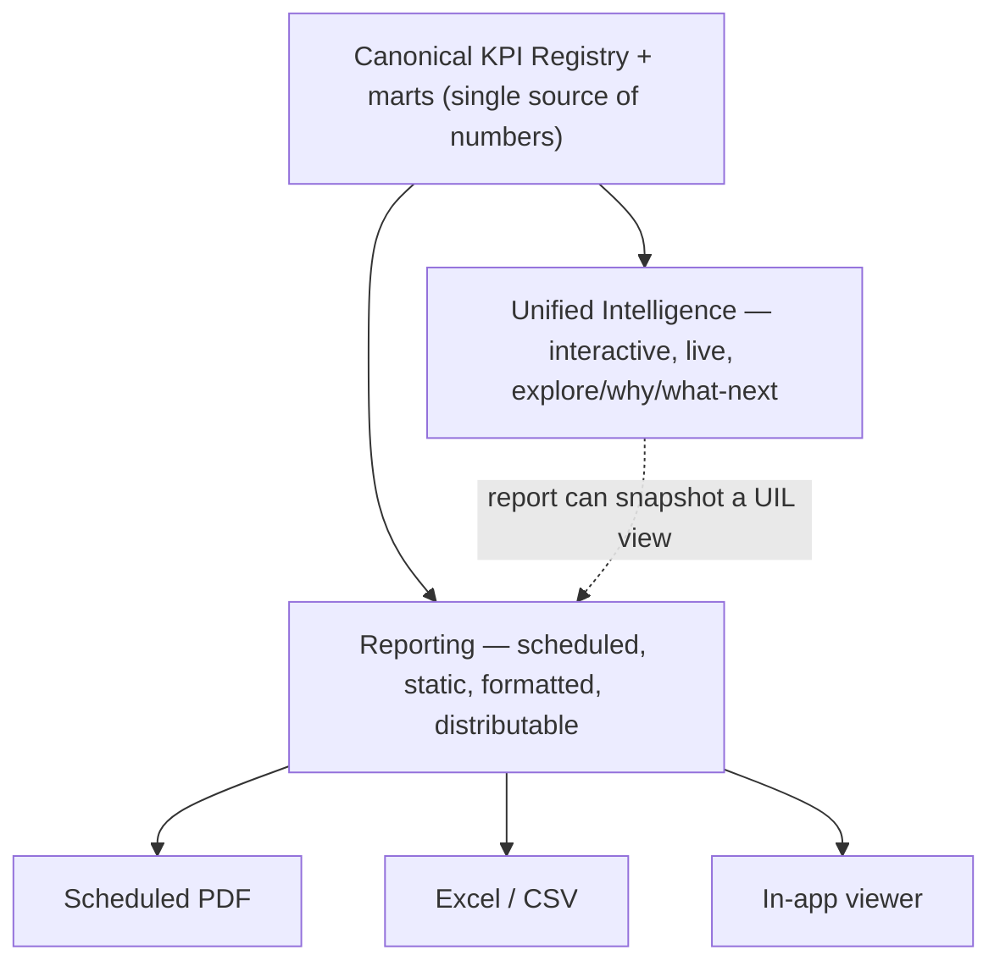
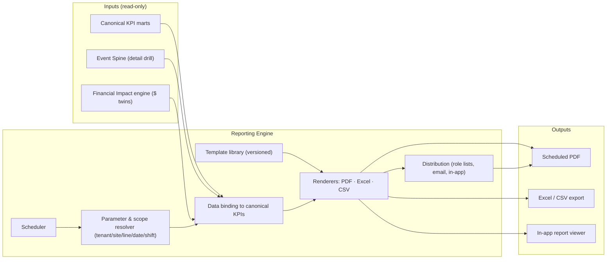
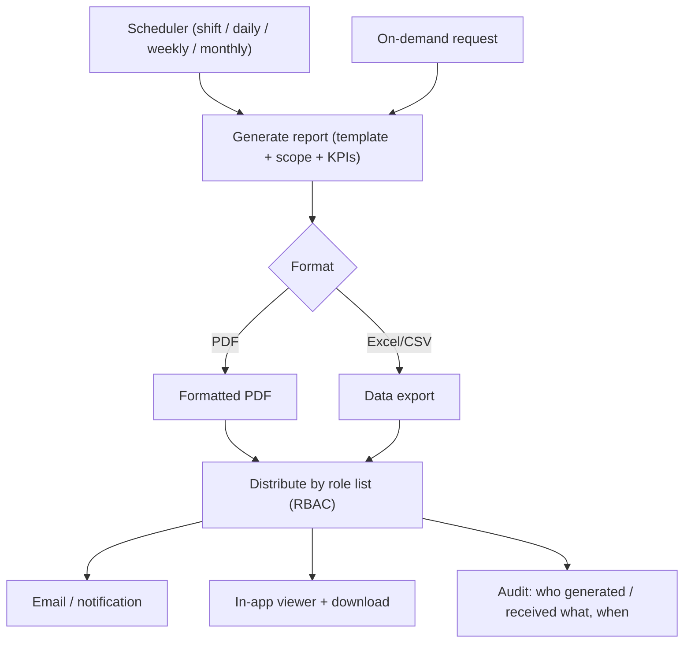

# Zedral — Reporting Layer
### Deep Plan · v1 · Cross-cutting delivery layer (reads shared canonical KPIs)

> **What this layer is.** Reporting is the **standard capability delivered to every client** that turns the canonical KPIs into **formatted, distributable documents** — scheduled and on-demand. It aggregates across modules and produces operational, management, executive, and financial-impact outputs.
>
> **Your v1 choices (locked into this plan):**
> - **Report types:** **Operational & shift** + **Executive + financial-impact** (management = natural fast-follow; compliance/quality-certs = later).
> - **Delivery:** **Scheduled PDF (auto/email)** + **Excel/CSV export** as primary; in-app viewing as the baseline.
> - **Build model:** **Templated catalog first** (self-serve builder is a later phase).
> - **Reporting ↔ UIL boundary:** you left this to me — **§2 is my proposal for your sign-off.**

---

## 0. Where Reporting sits

Reporting reads the **same canonical KPI registry + marts** that Unified Intelligence uses (`03_UnifiedIntelligence...` §4) and reuses **Manifold's export framework** (`02_Manifold...` §4) for file generation and distribution. It writes nothing back — it is a pure consumer/formatter. Financial figures use the **cost-rate governance** locked in the review (D7: client-owned, implementation-seeded, "rate as of" provenance).

---

## 1. Role & principles

1. **One set of numbers.** A figure in a PDF must equal the figure on the dashboard — both come from the **same canonical KPI definitions**. Reporting never recomputes KPIs its own way.
2. **Scheduled & static by design.** Reporting serves people who won't log in to explore (execs, external recipients) and recurring rhythms (shift, week, month). UIL serves interactive exploration. (See §2.)
3. **Financial impact embedded.** Every operational report carries its **$ twin**, with the cost-rate's "as of" date shown.
4. **Templated, configurable, reusable.** A report = template + parameters + data binding. Adding/adjusting a report is **configuration, not code**, and templates are reusable across clients in a sector (mirrors Manifold's template strategy).
5. **Multi-tenant & role-scoped.** Reports respect tenant isolation (D8 logical default) and RBAC distribution (reuse M1's Operator/Supervisor/Plant-Head/Admin roles); every generation/distribution is audit-logged.

---

## 2. Reporting ↔ Unified Intelligence boundary — **proposal for sign-off**

**Recommendation: keep Reporting a distinct scheduled/static layer that reads the same canonical KPI registry as UIL** — *not* a re-implementation, and *not* merely "export whatever UIL shows." **(Adopted 2026-05-30 — confirmed boundary.)**

Why this boundary:

- **Single source of truth** — both read one KPI registry, so numbers always agree.
- **Different jobs** — UIL = explore (analysts/managers); Reporting = distribute formatted snapshots on a schedule (execs, supervisors, external).
- **Best of both** — a report *can* be a **snapshot/projection of a UIL view** (e.g., the executive report is a point-in-time render of the exec scorecard), so we get reuse without divergence.

*If you'd prefer the lighter "Reporting = pure export of UIL views" model, the only change is dropping the independent report-template engine (§5) and rendering UIL views to file instead — smaller build, less formatting control. My recommendation is the distinct layer.*

---

## 3. Reference architecture

The **renderers and distribution reuse Manifold's export framework** (doc 02 §4) — we extend it with templated PDF rendering and scheduling rather than building a separate export stack.

---

## 4. v1 report catalog (templated)

Two prioritized families. Each report is a template bound to canonical KPIs, scoped by parameters, scheduled, and distributed.

### 4.1 Operational & shift reports (supervisors, line owners)

| Report | Contents (from canonical / M1) | Default cadence |
|---|---|---|
| **Shift Production Report** | Produced vs target, by line/asset/grade; from `shift_log` + `prod_*` | End of each shift |
| **Downtime & Loss Report** | Stoppages by reason + loss category (Six Big Losses), duration, $ cost | Daily / shift |
| **Yield & Quality Report** | Good/scrap/rework, yield %, defect breakdown; from ProductionCount + DefectRecord | Daily |
| **Production Log / Traceability** | Coil-level trail along the COIL_NO spine; Excel/CSV export | On demand |

### 4.2 Executive + financial-impact reports (leadership)

| Report | Contents | Default cadence |
|---|---|---|
| **Executive Summary Scorecard** | OEE, yield, quality, energy roll-ups by site/enterprise + trends (snapshot of the UIL exec scorecard) | Weekly / monthly |
| **Financial Impact Report** | $ of downtime, yield loss, quality loss, energy waste; biggest-loss ranking; "rate as of" | Weekly / monthly |
| **Performance Trend Report** | KPI trends vs prior period, top movers, exceptions | Monthly |

*Management reports (cross-line roll-ups between supervisor and exec) slot in as the natural fast-follow once these two families are proven.*

---

## 5. Report definition model

A report is **declarative**: `template (layout) + parameters (tenant, site, line, date range, shift, role) + data bindings (canonical KPI ids) + format(s) + schedule + distribution list`. Consequences:

- **Adding a report = config**, not code — drop in a template + bindings.
- **Templates are versioned** and **sector-reusable** (the steel template seeds the next steel client).
- **Parameters drive scope** so one template serves every line/site/tenant.
- **Bindings reference the KPI registry by id**, guaranteeing the consistency promise (§1, §9).

---

## 6. Delivery & distribution (your locked choices)

- **Primary:** **Scheduled PDF** (auto-generated + emailed/notified on a cadence) and **Excel/CSV export** (data out for the client's own analysis).
- **Baseline:** **in-app report viewer** (view + download any report).
- **Scheduling:** per-report cadence (shift/daily/weekly/monthly) + on-demand; distribution lists keyed to **roles** (reuse M1 RBAC).
- **Deferred:** push to external systems (SAP/BI) — the connector path exists in Manifold (doc 02), enable later.
- **Audit:** every generation + distribution logged (reuse the M1 `export_job` / Zinance `ImportLog` provenance pattern).

---

## 7. Financial impact in reports

Per the locked decision **D7**, cost-rates are **client-owned, implementation-seeded**, and every $ figure shows its **"rate as of"** date. Operational reports carry the **$ twin** of each KPI (downtime cost, yield/quality loss, energy waste), and the dedicated **Financial Impact Report** rolls these up and ranks the biggest losses — making the Financial Impact Layer tangible on paper, not just on screen.

---

## 8. Multi-tenancy, branding & security

- **Isolation:** reports read only the tenant's data (D8 logical default; physical on request).
- **Branding:** optional **client logo / white-label** on PDFs (per-tenant theming) — light lift, high perceived value.
- **Access:** role-scoped catalogs + distribution (a line supervisor gets their line; the plant head gets the plant).
- **Audit & retention:** generation/distribution logged; retention configurable per tenant.

---

## 9. The consistency guarantee (why this design matters)

Because Reporting and UIL **both bind to the same canonical KPI registry**, a number printed in a scheduled PDF is *by construction* the same number shown live in the dashboard. No "the report says X but the dashboard says Y" — the single most common failure mode of bolt-on reporting, designed out from the start.

---

## 10. Build sequence & open decisions

**Order:** (1) report-definition model + KPI bindings; (2) PDF + Excel/CSV renderers (extend Manifold export); (3) the 4 operational/shift templates; (4) the 3 executive/financial templates; (5) scheduler + role-based distribution + audit; (6) branding/white-label; (7) management-report family; (8) later: self-serve builder + external push.

**Decisions (resolved 2026-05-30):**

- **§2 boundary — ADOPTED:** distinct scheduled/static layer reading the shared canonical KPI registry.
- **Management reports — fast-follow** after the v1 operational + executive families.
- **Branding/white-label — in v1** (client logo on PDFs).

**Still open (sensible defaults assumed unless you change them):**

- **Default cadences & distribution lists** — proposed: shift report per shift, downtime/yield daily, exec/financial weekly + monthly; distribution by role. Confirm recipients when convenient.
- **Report retention** per tenant — default: align with the data-lake retention tiers.

---

*Reads the canonical KPI registry (`03`), reuses Manifold export (`02`), and honors cost-rate governance (D7) and isolation (D8) from the review (`04`). No new external standards introduced.*
