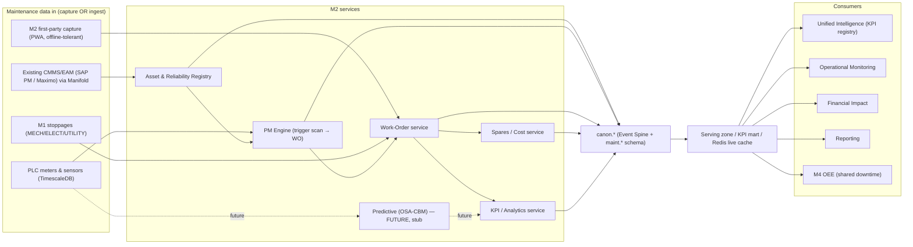
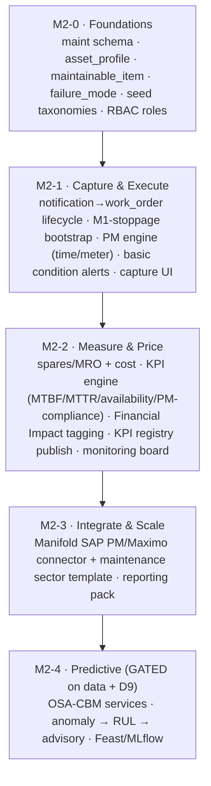

# Zedral · M2 Maintenance Intelligence — Developer Handover
### 00 · Master Index, Architecture, Stack & Conventions
**Audience:** engineering team · **Status:** v1 for build (preventive scope; predictive interfaces only) · **Date:** 2026-06-01

> This is the build-ready specification set for **M2 · Maintenance Intelligence**, the first Zedral *module* (the foundation layers — Data Lake, Canonical Model, Manifold, Unified Intelligence, Monitoring, Reporting, Financial Impact, Platform/Security — are specified in `../../Dev_Handover/`). Read this index first: it gives module scope, the architecture, which **platform decisions (D1–D11)** bind M2, the **stack** M2 inherits, M2-specific conventions, and the **build roadmap**. The *why* behind every spec is the planning deep-plan one level up: `../M2_Maintenance_Intelligence_DeepPlan.md`.

---

## 1. Document set & reading order

| # | Spec | Build priority |
|---|------|----------------|
| 00 | **This index** — architecture, stack, conventions, roadmap | Read first |
| 01 | **Data Model & Schema** — new canonical entities, DDL dictionary (`M2_schema.sql`) | Phase M2-0 |
| 02 | **Asset Registry & Failure Taxonomy** — ISO 14224 hierarchy, criticality, FMECA | Phase M2-0 |
| 03 | **Preventive Maintenance Engine** — triggers, scheduling, WO generation | Phase M2-1 |
| 04 | **Work-Order Lifecycle & Events** — notification→order state machine, capture, M1 bootstrap | Phase M2-1 |
| 05 | **Spares / MRO & Maintenance Cost** — catalogue, BOM, consumption, costing | Phase M2-2 |
| 06 | **KPIs, Analytics & Financial Impact** — formulas + SQL, registry, M2↔M4 reconciliation | Phase M2-2 |
| 07 | **APIs, Events & Integration** — REST/OpenAPI, domain events, SAP PM connector mapping | Phase M2-1→2 |
| 08 | **Predictive (PdM) — Future-Scope Interfaces** — OSA-CBM hooks, ML-readiness gate (no v1 build) | Phase M2-4 (gated) |
| 09 | **Security, RBAC, NFRs & Acceptance** — roles, multi-tenancy, test plan, acceptance | Cross-cutting |
| 10 | **Glossary** — maintenance & reliability terms | Reference |
| — | **`M2_schema.sql`** | Runnable PostgreSQL DDL (paired with 01) |

**Companion material:** the planning deep-plan (`../M2_Maintenance_Intelligence_DeepPlan.md`) + 8 flowcharts (`../M2_diagram_*.mermaid`). Platform specs referenced throughout live in `../../Dev_Handover/` (01 Data Lake, 02 Canonical Model, 03 Manifold, 04 UIL, 05 Monitoring, 06 Reporting, 07 Financial Impact, 08 Platform/Security, 09 Glossary).

---

## 2. Module scope & non-goals

**In scope (v1, preventive):** asset reliability registry & failure taxonomy; maintenance work-order lifecycle (corrective + preventive); preventive-maintenance engine (time / meter / basic condition triggers); spares/MRO & maintenance cost; the maintenance KPI family priced by Financial Impact; live asset-health surfacing; ingestion from an existing CMMS/EAM via Manifold **or** first-party capture **or** bootstrap from M1 stoppages.

**Future scope (interfaces only, build gated — D9):** predictive maintenance (condition→prognostics→RUL→advisory, the OSA-CBM pipeline) and the ML models behind it. v1 ships the *data hooks and interface stubs* (spec 08) so this is a later switch-on, not a re-model.

**Non-goals (EAM, not this module):** asset depreciation, capital replacement planning, disposal accounting, full procurement/PO workflows. The schema keeps hooks (`asset_profile.acquisition_value`) for a later EAM module.

---

## 3. System context

**Golden rule (inherited):** M2 reads canonical data through the Serving zone and writes its facts back through the canonical write-back API + `maint.*` schema. It never reads another module's database and never writes `canon` core tables it does not own. A breakdown is **one** `canon.event` downtime row — M2 classifies it, M4 aggregates it.

---

## 4. Binding decisions that constrain M2 (subset of D1–D11)

| # | Decision | M2 build constraint |
|---|----------|---------------------|
| **D1** | Hybrid-ready, per-client | PM trigger-scan + capture **must** run on-prem edge (plants are often disconnected); containerized services, no cloud-only calls. |
| **D2** | Near-real-time (minutes), tunable | PM due-scan and condition-rule evaluation cadence default = minutes, per-tenant config; capture never blocks. |
| **D7** | Cost-rates client-owned, effective-dated, "rate as of" | Labour/part/downtime costing resolves the `canon.cost_rate` **effective at the event date**, never "today's" rate. |
| **D8** | Logical tenant isolation default | `tenant_id` on every `maint.*` row; all queries tenant-scoped at the data-access layer. |
| **D9** | Rule-based now, ML later | PM/condition logic is rule/threshold driven in v1; predictive ML is reserved (spec 08), not built. |
| **D11** | Sector-neutral, exercise extension namespace | Asset/failure model is generic; Hero Steels is a *seed template*, not the schema. Client specifics live in `ext` JSONB. |

Full D1–D11 text: `../../Dev_Handover/00_INDEX_and_Architecture.md` §3.

---

## 5. Technology stack (inherited + M2-relevant)

M2 adds **no new platform technology**; it uses the stack ratified in the platform handover. The components M2 leans on most:

| Concern | Tech | M2 use |
|---|---|---|
| Canonical OLTP | **PostgreSQL 15+** (`maint` schema) | all M2 master + transactional tables (`M2_schema.sql`) |
| Time-series | **TimescaleDB** | `maint.meter_reading` (and future sensor features) |
| KPI mart | **ClickHouse** / Postgres columnar | `kpi_asset_daily` rollups for UIL/Reporting |
| Event bus | **Kafka / Redpanda** | publish/consume maintenance domain events (spec 07) |
| Scheduler | **Apache Airflow** | the periodic **PM due-scan** + meter-threshold + KPI rollup jobs |
| Live cache | **Redis** | asset-health board, due/overdue PM counts (Monitoring) |
| API | **REST + OpenAPI**, gateway, OIDC | spec 07 endpoints |
| Auth/RBAC | **Keycloak (OIDC)** | M2 roles extend M1 (spec 09) |
| Backend | **Python 3.11 + FastAPI** | M2 services |
| Frontend | **React + TS (PWA)** | capture + planner UI; reuse M1 capture patterns |
| ML (later) | **Feast + MLflow** | reserved for PdM (spec 08), not built in v1 |

---

## 6. M2 build roadmap (epics)

Maps onto the platform roadmap: M2-0→2 ride Phase 2–3 (serve/synthesize); M2-3 rides Phase 4 (SAP/connectors); M2-4 rides Phase 5 (ML, data-gated).

---

## 7. Non-functional baseline (delta over platform §7)

M2 inherits the platform NFR baseline (multi-tenant, hybrid, minutes-latency, 99.5% serving, OIDC, audit, OTel). Module-specific targets (detailed in spec 09): PM due-scan completes within its cadence for ≥100k active triggers/tenant; first-party capture is **offline-tolerant** (queue locally, sync on reconnect) like M1; KPI rollups reconcile with M4 to the downtime-hour.

---

## 8. Open items (carry into build)

- Confirm the v1 **failure-mode taxonomy**: reuse M1 stoppage codes (MECH/ELECT/UTILITY) vs a fuller ISO 14224 set (spec 02 §6 — open decision).
- **Meter source**: PLC-automatic vs manual entry for usage-based PM (spec 03).
- **CMMS connector priority**: SAP PM first (Hero Steels runs SAP) — confirm (spec 07).
- **Predictive data gate**: the history threshold that flips an asset to "predictive-ready" (spec 08).
- **D11**: whether M2 is the module used to validate the canonical model on a non-steel client.

*Next: specs 01–10. The compiled Word/PDF package combines all of these into one M2 Developer Handover document.*
