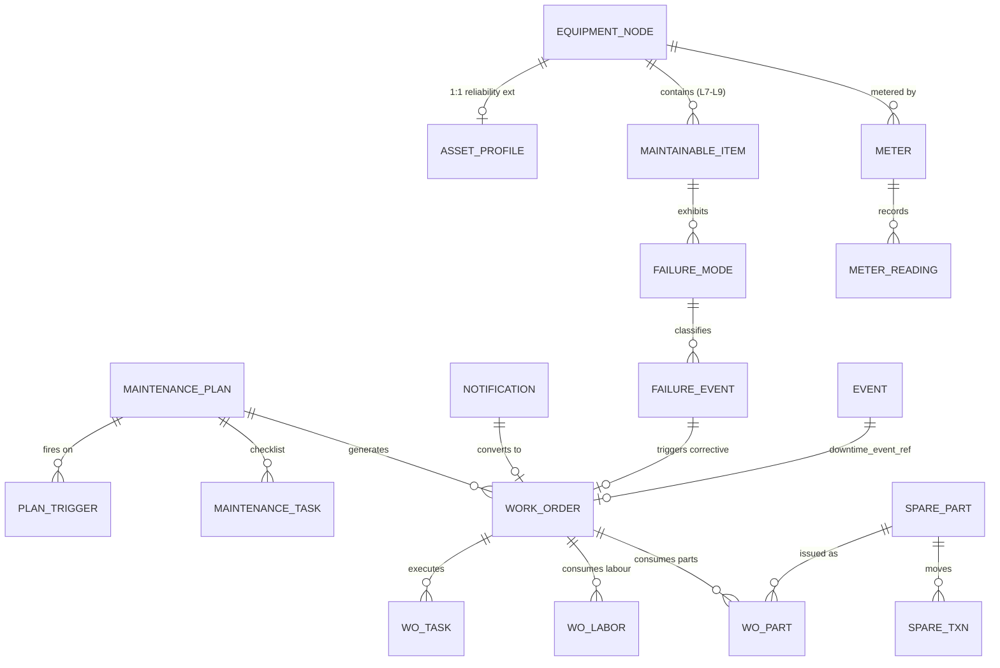

# 01 · M2 Data Model & Schema — Developer Specification

**Component owner:** Data/Domain · **Phase:** M2-0 · **Depends on:** platform 02 Canonical Model, 08 Platform · **Consumed by:** all M2 specs · **Runnable DDL:** `M2_schema.sql`

---

## 1. Purpose & scope

Defines the data M2 owns and how it extends the canonical model. **In scope:** the new `maint.*` entities, their fields, keys, relationships, and how they map onto the canonical **Event Spine**. **Out of scope:** how external maintenance data is mapped in (Manifold — spec 07 connector section); KPI computation (spec 06).

## 2. Modeling rules (MUST)

- Follow canonical DDL conventions (platform spec 02 §5): **lower_snake_case**, surrogate `*_id` (BIGINT), `tenant_id UUID` on every row, `TIMESTAMPTZ` UTC, JSONB `ext` for client-specific fields, FK to `canon.*` — **never** free-text codes where a master exists.
- M2 tables live in the **`maint`** schema. M2 **MUST NOT** alter `canon` core tables; it references them and writes Event-Spine specializations through the canonical write-back API.
- Three entities already exist on the canonical Event Spine (platform 02 §3.2) — M2 **populates**, not redefines, them: `maintenance_work_order`, `pm_schedule`, `failure_event`. The detailed operational tables live in `maint.*` and link back via `downtime_event_ref → canon.event(event_id)`.
- Every failure record uses the ISO 14224 quartet (mode / mechanism / cause / effect); every reading carries units.

## 3. Entity catalog (new in `maint`)

| Group | Tables | Purpose |
|---|---|---|
| **Asset reliability** | `asset_profile`, `maintainable_item` | criticality + nameplate on a canon asset; ISO 14224 L7–L9 subtree |
| **Failure taxonomy** | `failure_mode` | FMECA-scored failure modes (the reliability language) |
| **Usage** | `meter`, `meter_reading` | usage counters for meter-based PM (TimescaleDB) |
| **PM model** | `maintenance_plan`, `plan_trigger`, `maintenance_task`, `task_part` | plans, their triggers, checklists, expected parts |
| **Execution** | `notification`, `work_order`, `wo_task`, `wo_labor` | problem reports → jobs → executed tasks + labour |
| **Failures** | `failure_event` | the failure occurrence (mirrors canon `failure_event`) |
| **Spares/MRO** | `spare_part`, `spare_bom`, `wo_part`, `spare_txn` | catalogue, asset BOM, consumption, stock ledger |
| **Condition/PdM** | `condition_alert`, `asset_health` | basic CBM alerts (v1) + future RUL/health slot (no v1 producer) |
| **Analytics** | `kpi_asset_daily` | materialized KPI rollup grain |

Field-level detail is in `M2_schema.sql` (column comments included). Key generated columns: `failure_mode.rpn` = severity×occurrence×detectability; `failure_event.downtime_h` = (up_ts − down_ts) in hours.

## 4. ERD (core)

## 5. Mapping to the canonical Event Spine

| `maint` record | Canonical write-back | Notes |
|---|---|---|
| `work_order` (corrective/PM) | `canon.event` (`event_type='maintenance'`) + `maintenance_work_order` specialization | the operational detail stays in `maint.work_order` |
| `failure_event` | `canon.event` (`event_type='failure'`) + links the **same** `downtime_event_ref` | one downtime row, shared with M4 |
| `plan_trigger` next-due | `pm_schedule` specialization | exposes "due/overdue" to Monitoring |
| `meter_reading` | stays in `maint` (TimescaleDB); summarized to serving | feeds meter-based triggers |

## 6. Data contract (the M2 row — drives Manifold readiness)

● Required · ○ Additional (full matrix: platform 02 §6 / planning 01 §15).

| Canonical group | M2 | Unlocks |
|---|:--:|---|
| Asset hierarchy (+ item/part) | ● | the registry |
| Downtime + ReasonCode | ● | failure/breakdown analytics |
| Maintenance WO / PM / Failure | ● | the module itself |
| Failure mode / criticality | ● | reliability analytics |
| Meter / MeterReading | ○→● | required only for meter-based PM |
| SensorReading | ○→● | required to unlock predictive (spec 08) |
| Shift, Personnel, Spares, CostRate | ○ | non-disruptive scheduling, labour, cost, financial impact |

## 7. Identity, units, time, versioning

- **Identity:** surrogate `*_id`; ingested CMMS rows keep `source_ref` + resolve via Manifold `source_key_map`.
- **Units:** embedded in column name / `uom` column; runtime in hours, tonnage in MT (plant convention).
- **Time:** all `*_ts` are `TIMESTAMPTZ` UTC; bucket to shift/day for `kpi_asset_daily`.
- **Versioning:** additive only; new fields via `ext` JSONB or additive migration (Flyway/Alembic). Serving APIs versioned independently.

## 8. NFRs

- `meter_reading` partitioned/hypertabled by `reading_ts`; indexed `(meter_id, reading_ts DESC)`.
- `work_order` indexed on `(tenant_id, status)` and a partial index on open `due_ts` for the PM scan.
- All `maint.*` queries tenant-scoped; no cross-tenant path.

## 9. Acceptance criteria

- **MUST** create all `maint.*` objects from `M2_schema.sql` against an existing `canon` schema with zero errors.
- **MUST** represent every failure with mode/mechanism/cause/effect and link to a single canonical downtime event.
- **MUST** keep client-specific attributes in `ext` (no core schema change per client) — exercised by a non-steel sample (D11).
- **SHOULD** round-trip a sample SAP PM export (equipment, notification, order) into `maint.*` without loss.

## 10. Build phasing

**M2-0:** schema + seed taxonomies (criticality bands, failure-mode starter set, strategy enums) + migrations. Validated by loading the Hero Steels seed template (spec 02 §7) and a generic non-steel sample.

## 11. Risks

Over-fitting to steel (mitigate: `ext` + D11 sample); event-table growth from high-frequency meters (retention/partition via Data Lake); dual source of truth if CMMS ingest and first-party capture both write the same asset (mitigate: Manifold dedup/source-key map — spec 07).
