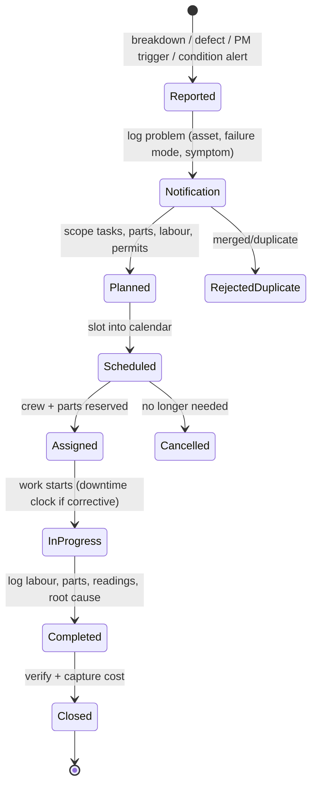

# 04 · Work-Order Lifecycle & Maintenance Events — Developer Specification

**Component owner:** M2 Backend · **Phase:** M2-1 · **Depends on:** 01 Data Model, 02 Registry, 03 PM Engine · **Consumed by:** 05, 06, 07, Monitoring

---

## 1. Purpose & scope

The execution core: the **notification → work-order** lifecycle that all maintenance work flows through, plus how failures and M1 stoppages enter it. **In scope:** state machine, status transitions, corrective vs preventive paths, downtime capture, labour/parts capture, M1 bootstrap, offline capture, events. **Out of scope:** spares stock mechanics (05), KPI math (06).

## 2. Key concepts (MUST)

- Adopt the **notification → order** split (SAP PM / Maximo pattern): a `notification` is *a report that something needs attention*; a `work_order` is *the authorised, planned, costed job*. This keeps demand signal (and its KPIs) separate from execution.
- A breakdown is recorded **once** as a `canon.event` downtime row; the `work_order` and `failure_event` both reference it via `downtime_event_ref`. M4 aggregates that same row. **Never double-count.**

## 3. State machine



`work_order.status` enum: `REPORTED, PLANNED, SCHEDULED, ASSIGNED, IN_PROGRESS, COMPLETED, CLOSED, CANCELLED, REJECTED_DUPLICATE`. Transitions are validated server-side; each transition is audit-logged (who/when) and emits an event.

## 4. Two entry paths

| Path | Trigger | What's created | Downtime? |
|---|---|---|---|
| **Corrective / breakdown** | failure occurs (operator/sensor/M1 stoppage) | `notification` → `work_order` (`CORRECTIVE`) + `failure_event` + `canon.event` downtime row; `actual_start..actual_end` ⇒ repair time (MTTR) | yes — Availability loss |
| **Preventive** | `plan_trigger` fires (spec 03) | `work_order` (`PREVENTIVE`) with checklist pre-attached | ideally none (idle-time) |

## 5. M1 stoppage bootstrap (the cheapest on-ramp)

Where M1 is live, breakdown signal already exists. Subscribe to M1 `downtime.logged` events; for stoppages with category `MECH/ELECT/UTILITY` and duration ≥ threshold:

```text
on downtime.logged(category in {MECH,ELECT,UTILITY}, duration>=T):
   upsert failure_event(asset, down_ts, up_ts, source=M1_STOPPAGE,
                        downtime_event_ref = that canon.event id)
   optionally open work_order(CORRECTIVE, wo_source=M1_STOPPAGE)
```

This lights up MTBF/MTTR analytics **before** any CMMS is connected. Mapping of M1 codes → failure categories is configurable (spec 02 §6).

## 6. Capture (first-party, no CMMS)

When the client has no CMMS, M2 provides capture UIs reusing M1 patterns: **offline-tolerant PWA** (queue locally, sync on reconnect), large touch targets for shop-floor use, two-state DRAFT→SUBMITTED then supervisor APPROVE→CLOSE, post-close edits via audited change request. Sub-forms: labour, parts, readings, root cause.

## 7. Cost capture at close

On `Completed→Closed`: resolve `wo_labor.cost` (hours × `canon.cost_rate` **effective at the work date** — D7), `wo_part.cost` (qty × unit_cost), and `downtime_cost` (downtime_h × downtime rate). Roll up to `work_order.labor_cost/part_cost/downtime_cost` (cached; authoritative lines retained). Detail in spec 05/06.

## 8. Events (spec 07)

Publishes: `maintenance.notification.created`, `maintenance.workorder.created|assigned|started|completed|closed`, `maintenance.failure.logged`. Consumes: `downtime.logged` (M1/M4), `maintenance.condition.alert` (03), `sensor.reading` (meters).

## 9. NFRs

- Capture path **offline-tolerant** and never blocks (D1); sync is idempotent (client-generated dedupe key).
- All transitions audited; status changes emit at-least-once events with idempotent consumers.

## 10. Acceptance criteria

- **MUST** enforce valid status transitions and audit each.
- **MUST** record a corrective WO's repair window and link the single shared `downtime_event_ref`.
- **MUST** bootstrap `failure_event` from qualifying M1 stoppages without operating a CMMS.
- **MUST** capture labour, parts, and root cause before `Closed`.
- **SHOULD** support offline capture with conflict-free sync.

## 11. Risks

Double-counting downtime (mitigate: single `downtime_event_ref`, enforced); notification spam (dedupe/merge to `REJECTED_DUPLICATE`); offline sync conflicts (client dedupe keys + last-writer rules); incomplete root-cause capture (require failure_mode on close for breakdowns).
