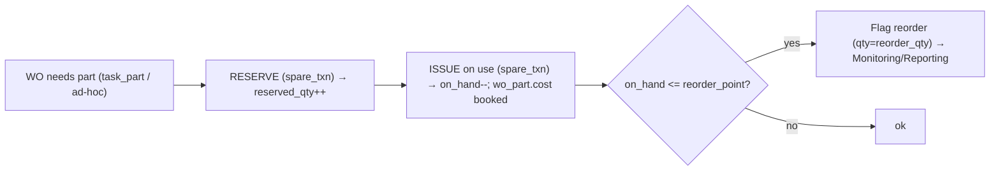

# 05 · Spares / MRO & Maintenance Cost — Developer Specification

**Component owner:** M2 Backend · **Phase:** M2-2 · **Depends on:** 04 Work Orders, platform 07 Financial Impact · **Consumed by:** 06 KPIs, Reporting

---

## 1. Purpose & scope

A proportionate spares/MRO model and the maintenance cost engine. Enough to drive availability and cost analytics — **not** a full procurement suite. **In scope:** spare catalogue, equipment BOM, reservation/consumption against WOs, stock ledger, reorder, criticality stocking, cost model + Financial Impact integration. **Out of scope (EAM):** purchase orders, supplier management, depreciation.

## 2. Key concepts (MUST)

- Spares (`spare_part`) are keyed to **maintainable items** via `spare_bom` (which spares serve which item/asset) — answers "what does this asset need" and "stockout risk for a critical asset".
- Stock is moved only through `spare_txn` (RECEIVE/ISSUE/RESERVE/UNRESERVE/ADJUST/RETURN); `on_hand_qty`/`reserved_qty` are derived caches kept consistent with the ledger.
- Cost is **never** estimated where a rate exists: resolve the `canon.cost_rate` **effective at the event date** (D7), not today's rate.

## 3. Spares lifecycle

## 4. Criticality-based stocking (RCM)

Stock depth follows asset/failure criticality (spec 02): a spare serving an `A_CRITICAL` single-point-of-failure asset is stocked even if rarely used; `D_LOW` items can be order-on-demand. Surface a **stockout-risk** view: critical assets whose required spares are below reorder point.

## 5. Maintenance cost model

`maintenance_cost(WO) = labour + parts + downtime`

| Component | Source | Rate |
|---|---|---|
| Labour | Σ `wo_labor.hours` | × labour `cost_rate` (effective-dated, by skill if available) |
| Parts | Σ `wo_part.qty × unit_cost` | spare unit cost (or PO cost when present) |
| Downtime (corrective only) | `failure_event.downtime_h` | × downtime `cost_rate` from Financial Impact Layer |

Roll-ups (materialized to serving / `kpi_asset_daily`): **cost-per-asset**, **cost-per-failure-mode**, **planned vs unplanned cost**, **MRO consumption value**. These are the numbers that justify a reliability programme and feed the executive financial report.

## 6. Financial Impact integration

M2 does not own rates — it consumes the platform **Financial Impact Layer** (platform spec 07): cost-rate registry with `effective_from/to` and "rate as of" provenance (D7). M2 passes the **event date** so pricing is historically correct. Downtime cost uses the same rate basis M4 uses for Availability-loss pricing, so maintenance cost and OEE-loss cost agree.

## 7. Interfaces (spec 07)

`/v1/maint/spares` (CRUD), `/v1/maint/spares/{id}/txns`, `/v1/maint/work-orders/{id}/parts`, `/v1/maint/spares/reorder` (list below reorder point). Emits `maintenance.spare.issued`, `maintenance.spare.reorder`.

## 8. NFRs

Stock mutations transactional (ledger + cache in one tx); concurrent issues serialized per `spare_id`; cost resolution deterministic and reproducible (store the resolved `rate_ref` + value on the line).

## 9. Acceptance criteria

- **MUST** keep `on_hand_qty`/`reserved_qty` consistent with the `spare_txn` ledger at all times.
- **MUST** book `wo_part.cost` and `wo_labor.cost` using the rate effective at the work date (D7).
- **MUST** flag reorder when on-hand ≤ reorder point and expose stockout risk for critical assets.
- **SHOULD** roll up cost-per-asset and cost-per-failure-mode to the serving layer.

## 10. Build phasing

**M2-2:** catalogue + BOM + txn ledger + WO consumption + cost rollups + Financial Impact wiring. Reorder/stockout views fast-follow. Procurement is out of scope (future EAM).

## 11. Risks

Stock/ledger drift (single-transaction writes + periodic reconciliation); missing unit costs (fall back to last-known / flag); rate ambiguity (always store resolved rate on the line for auditability).
