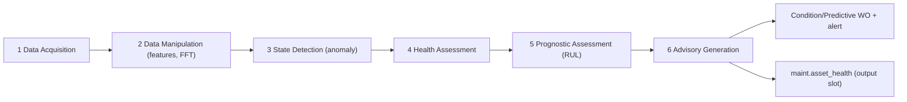

# 08 · Predictive (PdM) — Future-Scope Interfaces — Developer Specification

**Component owner:** M2 + ML Platform (later) · **Phase:** M2-4 (GATED — do not build in v1) · **Depends on:** 01 Data Model, 04 Work Orders, 06 KPIs · **Status:** interfaces & data hooks only

---

## 1. Purpose & scope

Predictive maintenance is **future scope** (platform D9: rule-based now, ML later; operating-model post-≈Nov 2026, gated on accumulated data). This spec defines the **forward-compatible interfaces and data hooks v1 must honour** so PdM is a later *switch-on*, not a re-model. **It does NOT specify models to build now.** Build emphasis in v1 = preventive (specs 02–07).

## 2. What v1 MUST do (so PdM is unblocked later)

- **Capture `sensor_reading` on the canonical time-series spine** from day one where any sensor/meter exists (even sparse data has future value). Vibration, temperature, current, pressure, flow, acoustic.
- **Label `failure_event`** with confirmed `failure_mode` (mechanism/cause) — these are the **training labels**. Enforced on breakdown close (spec 04).
- **Keep operating context joinable** to readings (load, product, shift) via the Event Spine.
- **Expose the ML-readiness (History) gate** in the readiness model (platform 01 §16) so the UI honestly reports which assets have enough history to train — no v1 predictive *promises*, only predictive *readiness*.
- **Leave the output slot ready:** `maint.asset_health` (health grade, anomaly_score, rul_hours, model_ref, advisory) exists with **no producer** in v1.

## 3. Target architecture — ISO 13374 / MIMOSA OSA-CBM (six blocks)

When built, PdM implements the standard open pipeline as services:

Each block is a service contract (stub interfaces defined now, implementations later). Feature store = **Feast**; model registry/lifecycle = **MLflow** (reserved per platform stack §4).

## 4. Interface stubs (defined now, return "not available" in v1)

| Interface | v1 behaviour | Future behaviour |
|---|---|---|
| `GET /v1/maint/assets/{id}/health` | 200 with `status:"not_available", readiness:{history_pct}` | health grade + anomaly score |
| `GET /v1/maint/assets/{id}/rul` | `not_available` + readiness | RUL hours + confidence |
| `POST /v1/maint/condition/evaluate` | basic threshold rule (spec 03) | model-based state detection |
| event `maintenance.health.assessed` | not emitted | emitted by OSA-CBM service |
| `maint.asset_health` table | empty (no producer) | populated by prognostics service |

## 5. ML approach (when gated open)

Phased by data availability: **(1) anomaly detection** (unsupervised — needs no failure labels; earliest win); **(2) RUL regression / survival models** (need run-to-failure histories); **(3) failure-mode classification** (need labelled `failure_event`). Ladder follows the platform's descriptive→diagnostic→**predictive**→prescriptive progression; v1 sits at descriptive+diagnostic.

## 6. The data gate (open decision)

Define the threshold that flips an asset to "predictive-ready", e.g. ≥N months of sensor history **and** ≥K labelled failures of a mode. Until then the readiness API reports `history_pct < gate`. This decision is captured for the user (open items, spec 00 §8).

## 7. Techniques supported (when built)

vibration (FFT/envelope), thermography (trending), oil/tribology (particle/contaminant), motor-current signature (MCSA), ultrasound/acoustic — each maps a `sensor_reading` stream to a diagnostic; the **P-F curve** lead time (P→F interval) is what the advisory monetizes (failure avoided, spec 06 §6).

## 8. Explicit "do NOT build in v1"

No ML training pipelines, no Feast/MLflow deployment, no prognostics service, no `asset_health` producer, no predictive promises in UI. **Only** the data capture, labelling, readiness gate, and stub interfaces above.

## 9. Acceptance criteria (v1)

- **MUST** persist `sensor_reading` and labelled `failure_event` so a future model can train on history.
- **MUST** expose `health`/`rul` stub endpoints returning readiness, not fabricated values.
- **MUST** keep `maint.asset_health` and `maintenance.health.assessed` defined but unproduced.
- **SHOULD** report per-asset history/readiness % toward the predictive gate.

## 10. Build phasing

**M2-4 (gated):** only after data accumulation + a go decision. Anomaly detection first, then RUL, then classification. Until then this spec is a contract, not a workstream.

## 11. Risks

Premature ML (mitigate: hard data gate); unlabelled failures (enforce failure_mode on close); sensor data gaps (capture whatever exists; readiness reflects reality); over-promising predictive to clients (UI shows readiness, never fake RUL).
