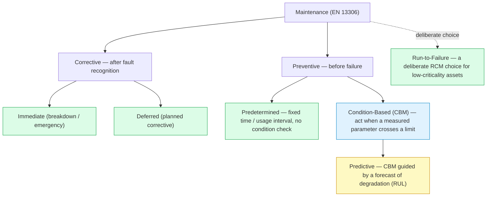
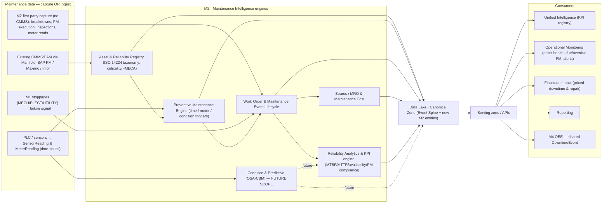
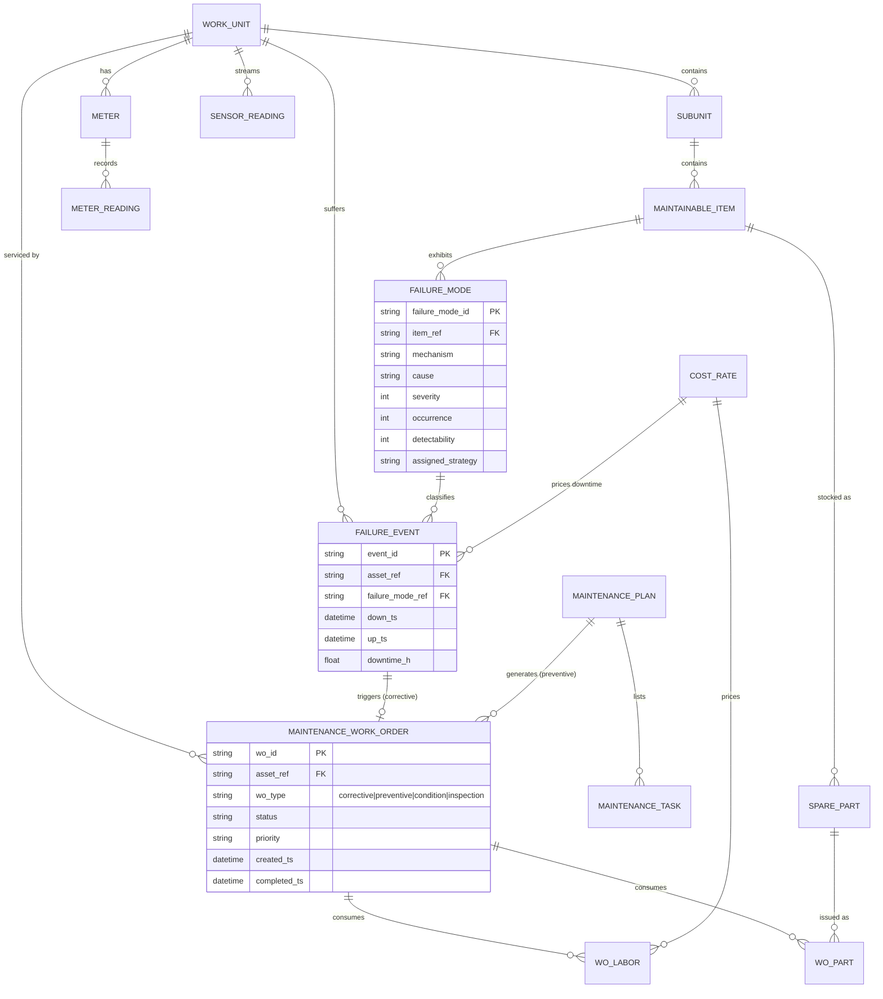
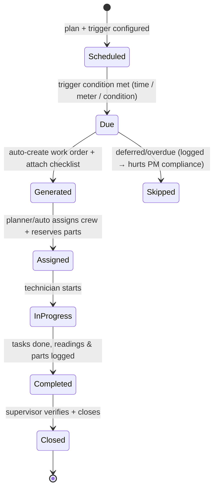
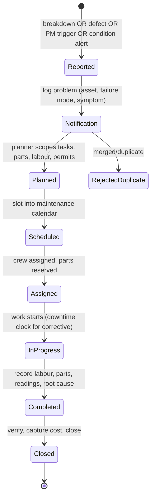
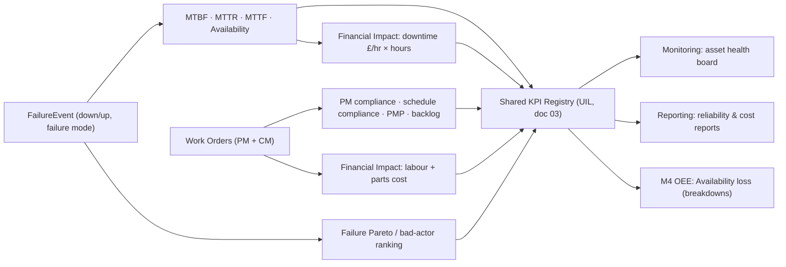
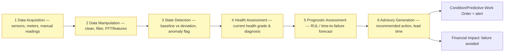
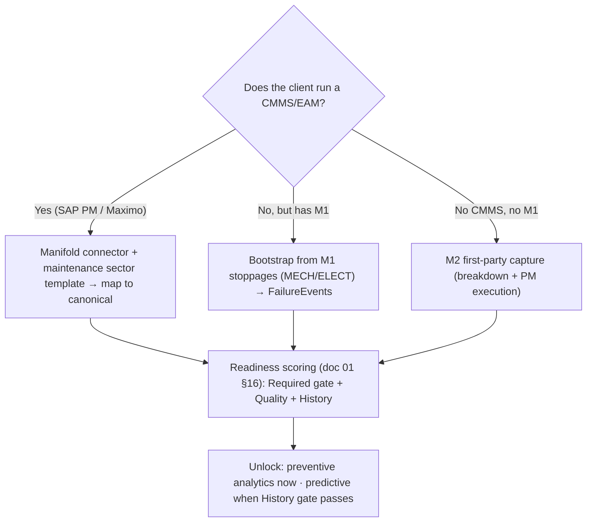

# Zedral — M2 · Maintenance Intelligence
### Deep Plan · v1 · Module Layer (Preventive now → Predictive future scope)

> **What M2 is.** M2 is Zedral's **Maintenance Intelligence** module. It turns the asset, downtime, and sensor data already standing in the **Canonical Data Model** (`01_DataLake_and_Canonical_Model_DeepPlan.md`) into a working **preventive-maintenance system** *and* a **reliability-analytics brain** — asset register, failure taxonomy, PM scheduling, work-order lifecycle, spares, and the maintenance KPI family (MTBF, MTTR, availability, PM compliance), every metric priced by the **Financial Impact Layer**. It is built so the **predictive / condition-based path (PdM)** can be switched on later (≈ post-Nov 2026) **without re-modelling any data**.
>
> **Why it's high-value.** Unplanned breakdown is the single largest *controllable* loss on most shop floors — it is the Availability leg of OEE (ISO 22400) and it cascades into yield, quality, and energy waste. M2 is where Zedral attaches a number to "the line went down," tells you *why* it keeps going down, and (later) tells you *before* it goes down.
>
> **What M2 is NOT.** It is **not a rip-and-replace CMMS/EAM**. Where a client already runs SAP PM / IBM Maximo / Infor EAM, M2 **ingests** that maintenance data through Manifold and adds the intelligence. Where a client has **no** CMMS, M2 provides **first-party capture** (reusing M1's shop-floor capture patterns) so the data exists at all. Full asset *financials* — depreciation, capital replacement, disposal — are EAM concerns left out of v1 scope (noted in §7).
>
> **Standards anchors.** Maintenance-type vocabulary from **EN 13306**; reliability & failure data taxonomy from **ISO 14224**; asset-management framing from **ISO 55000**; condition-monitoring / prognostics architecture from **ISO 13374 / MIMOSA OSA-CBM**; strategy-selection logic from **RCM / FMECA (SAE JA1011/JA1012)**; KPIs reconciled to the platform's existing **ISO 22400** OEE definitions. Links in §15.

---

## 0. How M2 relates to the rest of the platform

M2 is an **intelligence contributor**, not an island. It reads canonical data through the Serving zone and writes its derived facts back so every other layer can reuse them.

| Platform piece (doc) | What M2 consumes from it | What M2 gives back |
|---|---|---|
| **Data Lake · Canonical Model** (01) | Asset hierarchy, DowntimeEvent + ReasonCode, SensorReading, Shift, CostRate | New canonical entities (MaintenancePlan, MaintenanceTask, FailureMode, SparePart, MeterReading) + MaintenanceWorkOrder / FailureEvent records on the **Event Spine** |
| **Manifold** (02) | CMMS/EAM connector (SAP PM, Maximo), field-mapping, dedup, sector templates, readiness/unlock | M2 data contract; a seeded **maintenance sector template** |
| **M1 · Shopfloor Digitization** (M1 blueprint) | Breakdown **stoppages** (MECH/ELECT/UTILITY) captured at source; capture UX & RBAC patterns | Stoppages enriched into **FailureEvents** with failure mode + repair record |
| **M4 · OEE & Downtime** | Shares the `DowntimeEvent` stream | Breakdown classification + repair times feed M4's **Availability** loss (boundary in §12) |
| **Unified Intelligence Layer** (03) | KPI registry, cross-module synthesis | MTBF/MTTR/availability/PM-compliance into the shared KPI registry |
| **Operational Monitoring** (03) | Live state/cache off the streaming path | Live **asset health**, due/overdue PM, open breakdowns, condition alerts |
| **Financial Impact Layer** (07 spec) | CostRate reference (downtime/labour/parts) | Priced downtime, repair cost, cost-per-asset, avoided-failure value |
| **Reporting Layer** (05) | Same canonical KPI numbers | Maintenance operational + reliability + cost reports |

**The golden rule (inherited):** consumers never write M2's tables and M2 never writes another module's — everything moves through the canonical model and versioned Serving APIs.

---

## 1. Responsibilities & principles

M2 owns eight responsibilities: **(1)** maintain a reliability-grade **asset register & failure taxonomy**; **(2)** **capture or ingest** maintenance work (breakdowns, PMs, inspections); **(3)** run the **Preventive Maintenance engine** (triggers → work orders); **(4)** manage the **work-order lifecycle**; **(5)** track **spares & maintenance cost**; **(6)** compute the **maintenance KPI family** and price it; **(7)** surface **live asset health & alerts**; **(8)** stand **predictive-ready** (CBM → prognostics) without a data re-model.

Principles:

1. **Intelligence-first, capture-as-needed.** The value is the analytics. Capture (first-party) and ingestion (from an existing CMMS) are two doors to the *same* canonical maintenance data — mirroring how the Data Lake treats M1 first-party data and historical ERP as equal citizens.
2. **Standards-anchored vocabulary.** Maintenance *types* follow EN 13306; *failure data* follows ISO 14224. We do not invent a private taxonomy — credibility and cross-client comparability depend on this.
3. **Every failure has a cost.** No downtime, repair, or PM is recorded without the hooks needed to price it. Financial impact is a column, not an afterthought.
4. **Sector-neutral core, sector-specific skin.** The asset/failure/PM model is generic (any rotating, static, electrical, or utility asset); a **sector template** instantiates it concretely (Hero Steels in §10) and reuses across clients via Manifold.
5. **Reconcile, never re-define.** Maintenance and OEE must never tell two stories about the same stoppage. M2 and M4 read the **same** `DowntimeEvent` records and the platform's ISO 22400 time definitions, so breakdown-downtime hours are identical on both sides. (The two *availability* figures are deliberately different metrics — M2's **inherent availability** `MTBF/(MTBF+MTTR)` is reliability-based; M4's **OEE availability** is time-based `Operating Time ÷ Planned Production Time` — but because they derive from one downtime truth they can never contradict.)
6. **Predictive by design, not by rebuild.** The v1 data model (SensorReading spine + labelled FailureEvents + meter history) *is* the training substrate for PdM. We future-proof the schema now and gate the ML build on accumulated data (per the operating-model roadmap).
7. **Criticality drives effort.** Following RCM, the *strategy* assigned to an asset/failure-mode (run-to-failure / time-based / condition-based) is a deliberate, criticality- and economics-based decision — not a blanket policy.

---

## 2. Maintenance strategy taxonomy (the conceptual frame · EN 13306)

Everything M2 does is one of a small, standard set of maintenance strategies. EN 13306 organises them as a tree; this tree *is* M2's scope map — what's in v1 vs. future.

| Strategy | EN 13306 sense | M2 phase | What M2 does |
|---|---|---|---|
| **Corrective — immediate** | Breakdown repair after a fault | **v1** | Log breakdown → FailureEvent + corrective work order; capture repair time/parts; feed MTBF/MTTR |
| **Corrective — deferred** | Planned fix of a known, tolerable defect | **v1** | Defect/notification backlog → scheduled corrective WO |
| **Predetermined (time/usage)** | Scheduled at fixed calendar or meter interval | **v1** | PM engine generates WOs on calendar/meter triggers |
| **Condition-based (CBM)** | Triggered when a measured parameter (vibration, temp, meter) crosses a threshold | **v1 (basic) → deepens** | Threshold rules on SensorReading/MeterReading raise a condition WO/alert |
| **Predictive (PdM)** | CBM **plus a forecast** of remaining useful life | **Future scope (§9)** | Prognostics (RUL), anomaly/degradation models, advisory generation |
| **Run-to-failure** | Deliberate no-PM for low-criticality items | **v1 (as a policy flag)** | Asset strategy = RTF; excluded from PM scheduling by design |

v1 delivers the green + light-blue branches (corrective, predetermined, basic condition triggers). The yellow branch (true predictive/prognostics) is architected now and built later (§9).

---

## 3. M2 reference architecture

**Reading it:** data arrives by capture or ingestion (or is bootstrapped from M1 stoppages); six engines turn it into canonical maintenance facts; everything is written back to the canonical Event Spine and served to the intelligence/monitoring/financial/reporting layers and to M4. Engine **E6 (predictive)** is wired into the architecture but dark until the data and the ML build land.

---

## 4. Asset & failure taxonomy — the reliability backbone (ISO 14224 × ISA-95)

Reliable maintenance analytics are impossible without a disciplined asset hierarchy and a controlled failure vocabulary. M2 extends the platform's ISA-95 hierarchy *downward* to the **maintainable item / part** level that ISO 14224 requires, and overlays ISO 14224's failure model.

**Hierarchy.** ISA-95 (doc 01) stops at Work Unit; ISO 14224 needs to go lower for reliability data. The mapping:

| ISO 14224 indenture | ISA-95 equivalent (doc 01) | Example (generic) | Example (Hero Steels) |
|---|---|---|---|
| L1–L5 industry → plant/unit | Enterprise → Site → Area → Work Center | Plant / Cold-rolling area | CR Complex / Mill bay |
| L6 **Equipment unit** | **Work Unit / Asset** | Pump, motor, gearbox, furnace | 4-Hi Tandem Mill, Bell Annealing furnace |
| L7 **Subunit** | *(new in M2)* sub-assembly | Lube system, drive, hydraulic unit | Mill hydraulic AGC, furnace burner system |
| L8 **Component / maintainable item** | *(new in M2)* | Bearing, seal, valve, contactor | Work-roll bearing, recoiler motor |
| L9 **Part** | *(new in M2)* | Spare part SKU | Specific bearing part no. |

**Failure model (ISO 14224 "reliability language").** Every failure is described by four linked concepts so analytics can slice consistently:

| Concept | ISO 14224 meaning | Example |
|---|---|---|
| **Failure mode** | the *effect by which the failure is observed* | "fails to start", "overheating", "external leak" |
| **Failure mechanism** | the physical/chemical process behind it | fatigue, corrosion, wear, electrical breakdown |
| **Failure cause** | the root circumstance (design/install/use/maint) | mis-alignment, lubrication starvation, overload |
| **Failure effect / impact** | consequence on function & plant | line stop, derate, safety, none |

**Criticality (RCM/FMECA).** Each asset carries a **criticality** rating; each significant failure mode carries an FMECA record (severity × occurrence × detectability → risk priority) and a **assigned strategy** (run-to-failure / time-based / condition-based / predictive). Criticality drives PM intensity, work-order priority, and spares stocking — exactly as RCM prescribes.

---

## 5. Preventive Maintenance engine (triggers → work orders)

The PM engine is what makes M2 *preventive*. A **MaintenancePlan** binds an asset (or asset class) to one or more **triggers** and a **MaintenanceTask** list (the checklist/SOP, required parts, est. labour, safety permits). When a trigger fires, the engine **auto-generates and assigns a work order** with the checklist attached.

| Trigger type | Fires when… | Source data | Example |
|---|---|---|---|
| **Time / calendar** | a fixed interval elapses (every 30 days, quarterly) | Plan + clock | Monthly gearbox inspection |
| **Time — floating** | interval measured from *last completion*, not a fixed date | Plan + WO history | Lube route 14 days after last done |
| **Meter / usage** | a meter crosses a threshold (running hours, cycles, tonnage, km) | **MeterReading** (PLC or manual) | Bearing regrease every 2,000 run-hours |
| **Condition (CBM)** | a measured parameter breaches a limit | **SensorReading / MeterReading** | Vibration > 7 mm/s → inspection WO |
| **Event-based** | a defined event occurs | Event Spine | After every N breakdowns, full overhaul |
| **Inspection / route** | scheduled rounds & lubrication routes | Plan | Daily operator care round (links to M1) |

**Compliance window.** Each generated PM has a due date and a tolerance window; completion inside the window counts toward **PM compliance** (§8). Floating-interval plans re-anchor on completion so the schedule never "drifts." Calendar vs. meter behaviour follows standard CMMS practice: calendar = predictable cadence regardless of use; meter = tracks actual wear, better for variable-duty assets.

---

## 6. Work-order & maintenance-event lifecycle

M2 follows the **notification → order** split proven by SAP PM and Maximo: a *report that something needs attention* (notification / request / breakdown) is distinct from the *authorised, planned, costed job* (work order). This keeps the demand signal (and its KPIs) separate from the execution record.

Two entry paths converge on the same lifecycle:

- **Corrective / breakdown** — a `FailureEvent` opens with a downtime clock; the WO records repair time (→ MTTR), parts, labour, and the confirmed **failure mode/mechanism/cause**. The breakdown's downtime is the *same* `DowntimeEvent` M4 sees (§12) — recorded once, classified by M2.
- **Preventive** — a `MaintenancePlan` trigger (from §5) opens the WO with its checklist pre-attached; ideally executed inside planned/idle time so it does **not** create OEE Availability loss.

**Bootstrapping from M1.** At Hero Steels, M1 already captures machine stoppages with categories **MECH / ELECT / UTILITY**. M2 treats those as the demand signal: a `MECH` stoppage of meaningful duration becomes a candidate `FailureEvent`, so MTBF/MTTR analytics light up **before** any CMMS is connected. This is the cheapest possible on-ramp to maintenance intelligence.

---

## 7. Spares / MRO & maintenance cost

Repairs consume **parts and labour**, and the parts must exist when the WO runs. M2 carries a proportionate spares model — enough to drive availability and cost analytics, not a full procurement suite.

- **Spare-part catalogue** keyed to maintainable items (the L8/L9 levels in §4) — part no., description, unit cost, on-hand qty, reorder point, lead time, criticality.
- **Equipment BOM** links a spare to the items it serves, so "which spares does this asset need" and "what's the stockout risk for a critical asset" are answerable.
- **Reservation & consumption** against a work order (`WO_PART`) — issuing a part decrements stock and books its cost to the WO and the asset.
- **Criticality-based stocking** — RCM principle: stock depth follows asset/failure criticality (a spare for a single-point-of-failure critical asset is stocked even if rarely used).

**Maintenance cost** = labour (hours × `CostRate`) + parts (issued × unit cost) + (for corrective) **downtime cost** (downtime hours × downtime `CostRate` from the Financial Impact Layer). This rolls up to **cost-per-asset**, **cost-per-failure-mode**, and **planned-vs-unplanned cost** — the numbers that justify a reliability programme.

> **Out of v1 scope (EAM, not CMMS):** asset depreciation, capital replacement planning, disposal accounting, and full procurement/PO workflows. The asset register keeps the hooks (acquisition date, value) so these can be added later, but Maintenance Intelligence v1 stops at maintenance cost.

---

## 8. Maintenance KPIs & reliability analytics

This is M2's contribution to the **shared KPI registry** (doc 03). Every formula below is the industry-standard definition; the OEE-linked ones reuse the platform's **ISO 22400** definitions so M2 and M4 never disagree.

| KPI | Formula | Meaning / target |
|---|---|---|
| **MTBF** (mean time between failures) | operating time ÷ number of failures | reliability of repairable assets — higher is better |
| **MTTR** (mean time to repair) | total repair time ÷ number of repairs | maintainability — lower is better |
| **MTTF** (mean time to failure) | operating time ÷ failures (non-repairable items) | for replace-not-repair parts |
| **MTBM** (mean time between maintenance) | operating time ÷ all maintenance actions (PM + CM) | total maintenance demand |
| **Maintenance Availability** | MTBF ÷ (MTBF + MTTR) | inherent availability from reliability/repair |
| **PM Compliance** | completed PMs ÷ scheduled PMs × 100 | world-class ≥ 90% |
| **Schedule Compliance** | on-time WOs ÷ total scheduled WOs × 100 | planning discipline |
| **Planned Maintenance %** (PMP) | planned maint. hours ÷ total maint. hours × 100 | proactive vs reactive balance |
| **Planned : Unplanned ratio** | planned WOs ÷ unplanned WOs | maturity indicator |
| **Backlog** | open ready-to-schedule WO hours ÷ weekly capacity | weeks of work waiting |
| **Failure Pareto / bad actors** | failures (or downtime, or cost) grouped by asset & failure mode | where to focus RCM |

**The maintenance ↔ OEE bridge.** A breakdown's downtime is an Availability loss in ISO 22400 (`Availability = Operating Time ÷ Planned Production Time`). M2 owns *why it failed and how long to fix* (failure mode, MTTR, **inherent** availability `MTBF/(MTBF+MTTR)`); M4 owns *the time-based OEE rollup*. The two availability figures are intentionally different metrics, but both are computed from the **same** `DowntimeEvent` records — so the breakdown-downtime hours always reconcile and the modules never contradict. The clean split is in §12.

**Financial impact (per Principle 3).** Every KPI is priced where a `CostRate` exists: downtime cost, repair cost, cost avoided by a caught condition. This is what turns "MTBF improved 12%" into "£X/year of avoided downtime" on the executive report.

---

## 9. Condition-Based & Predictive Maintenance — FUTURE SCOPE (architected now)

Predictive is the yellow branch of §2 and the operating-model's post-6-month horizon (≈ from Nov 2026), **gated on accumulated data**. We design the pipeline now so v1's data model is already the training substrate; we build the models when there is enough labelled failure history.

**The pipeline = ISO 13374 / MIMOSA OSA-CBM six functional blocks.** This is the open, standard architecture for condition-based maintenance and the skeleton M2's E6 engine will implement:

**The P-F curve is why this pays.** A failure becomes *detectable* (point **P**) well before it becomes a *functional failure* (point **F**). The **P-F interval** is the lead time PdM buys you to plan an intervention inside idle time instead of suffering a breakdown. Prognostics estimate **Remaining Useful Life (RUL)** along that curve.

**Techniques M2 will support (data-type → method):**

| Condition data | Technique | Detects |
|---|---|---|
| Vibration (acceleration/velocity) | spectral / FFT, envelope | imbalance, misalignment, looseness, bearing defects |
| Temperature / thermal image | trending, thermography | friction, electrical hot-spots, lubrication loss |
| Oil / lubricant | tribology, particle count | wear debris, contamination |
| Motor current / power | MCSA | electrical faults, load anomalies |
| Ultrasound / acoustic | trending | early bearing wear, leaks, arcing |

**ML approaches (built post-gate):** unsupervised **anomaly detection** (no failure labels needed — earliest win), **RUL regression / survival models** (need run-to-failure histories), **failure-mode classification** (need labelled FailureEvents). The operating model's **descriptive → diagnostic → predictive → prescriptive** ladder applies: M2 v1 is descriptive+diagnostic (what failed, why, what it cost); predictive is this section; prescriptive ("auto-schedule the optimal intervention") is the 2–3-year horizon.

**What v1 must get right so this is a switch-on, not a rebuild:** (a) **SensorReading / MeterReading** captured on the time-series Event Spine from day one (even sparse data has value); (b) **FailureEvents labelled** with confirmed failure mode/mechanism — these are the training labels; (c) **operating context** (load, product, shift) joinable to readings; (d) an **ML-readiness gate** in the readiness model (§11) that reports when an asset has enough history to train. No predictive *promises* are made in v1 — only predictive *readiness*.

---

## 10. Sector-neutral model + Hero Steels instantiation

Per the design decision, the model is **generic** and an instantiation makes it **concrete**. The same five entities (asset → subunit → item, failure mode, plan, meter) describe any plant; a sector template fills them in.

**Generic asset archetypes** (apply to any sector): rotating equipment (motors, pumps, fans, gearboxes, compressors), static equipment (vessels, furnaces, heat exchangers), electrical (drives, switchgear, transformers), material-handling (cranes, conveyors), hydraulics/pneumatics, utilities (compressed air, water, steam).

**Hero Steels Cold-Rolling instantiation** (anchors the model to the real M1 plant; reuses the M1 process spine):

| M1 process / area | Representative assets | Typical failure modes | Example PM trigger |
|---|---|---|---|
| Pickling line | tanks, pumps, rolls, fume system | corrosion, pump seal leak, roll wear | meter: throughput tonnage |
| Cold-rolling mills (2-Hi/4-Hi/6-Hi) | work/back-up rolls, mill motors, hydraulic AGC, coolant | bearing wear, hydraulic leak, roll spalling | meter: run-hours + condition: vibration |
| Bell / continuous annealing | furnace burners, fans, convectors, O₂ control | burner fouling, fan bearing, sensor drift | time: monthly + condition: temp profile |
| Skin-pass / rewinding | rolls, tension reels, drives | drive fault, tension instability | time + meter: coils processed |
| CRS / CTL (slitter, cut-to-length) | knives, shear, recoiler, gauges | blade wear, shear misalignment | meter: cuts/coils |
| Cross-plant utilities | EOT cranes, compressors, hydraulics, MCCs | brake wear, air leak, contactor failure | time + condition |

**Reusing the M1 stoppage taxonomy.** M1's `MECH / ELECT / UTILITY / POWER` stoppage codes pre-map to M2 failure categories, and the **cold-rolling-steel sector template** (already seeded in Manifold, doc 02 §12) carries this mapping — so the next steel client's maintenance module lights up with no re-modelling. **D11 note:** because the core is sector-neutral, validating M2 on a **non-steel** client is the cleanest way to retire the "only-tested-on-Hero-Steels" risk (R1/W1 in doc 04) — maintenance assets (pumps, motors, gearboxes) are the most cross-sector-common assets that exist.

---

## 11. Data contract & readiness (the M2 row)

M2's machine-readable data contract (the basis for Manifold's module-unlocking, doc 01 §15). ● Required · ○ Additional.

| Canonical entity / group | M2 need | Notes |
|---|:--:|---|
| Asset hierarchy (Site→WorkUnit, extended to item/part) | ● | the reliability backbone (§4) |
| DowntimeEvent + ReasonCode | ● | breakdown signal → FailureEvent; shared with M4 |
| Maintenance WO / PM / Failure | ● | core M2 transactional spine |
| FailureMode / criticality (FMECA) | ● | controlled failure vocabulary (ISO 14224) |
| Meter / MeterReading | ○→● for meter-based PM | required only if usage-based plans are used |
| SensorReading (time-series) | ○ → ● (predictive) | optional for v1; required to unlock PdM |
| Shift / Calendar | ○ | planned vs idle time for non-disruptive PM |
| Personnel / Crew | ○ | labour cost & assignment |
| Spare part / BOM | ○ | unlocks spares & full cost analytics |
| CostRate | ○ | unlocks financial impact (strongly recommended) |

**New canonical entities M2 introduces** (additive, per doc 01 §14 versioning rule): `MaintenancePlan`, `MaintenanceTask`, `FailureMode`, `SparePart`, `Meter` + `MeterReading`. `MaintenanceWorkOrder`, `FailureEvent`, and `PMSchedule` already exist as Event-Spine specializations (doc 01 §10.2) — M2 populates them.

**Three on-ramps to readiness** (capture-or-ingest, §1):

The readiness model is the platform's existing one (doc 01 §16): Required-coverage is a hard gate; an extra **ML-readiness (History) sub-gate** reports per-asset whether there is enough labelled failure + sensor history to train predictive models — so the UI can honestly show "predictive available for these 12 assets" rather than promising it everywhere.

---

## 12. Integration & boundaries

| Boundary | M2 owns | The other side owns | Shared artifact |
|---|---|---|---|
| **M2 ↔ M4 (OEE)** | failure mode, repair time (MTTR), maintenance availability, PM compliance | OEE rollup, Availability/Performance/Quality, Six Big Losses tree | the single `DowntimeEvent` stream (recorded once) |
| **M2 ↔ M1** | enriching stoppages into FailureEvents; PM execution capture | first-party stoppage/defect capture at source; capture UX & RBAC | `DowntimeEvent`, capture patterns |
| **M2 ↔ Manifold** | the M2 data contract + maintenance sector template | CMMS/EAM connectors, field-mapping, dedup, readiness | sector template library |
| **M2 ↔ UIL** | maintenance KPIs + failure analytics | cross-module synthesis (maintenance↔quality↔yield), exec rollups | shared KPI registry |
| **M2 ↔ Monitoring** | asset-health logic, due/overdue PM, condition alerts | live cache, alert delivery | streaming path |
| **M2 ↔ Financial Impact** | what to price (downtime, repair, avoided failure) | the cost-rate engine & "rate-as-of" provenance (D7) | `CostRate` |

The **M2↔M4 line is the one to get right**: breakdowns are both a maintenance event *and* an OEE Availability loss. Rule: **the event is recorded once as a canonical `DowntimeEvent`; M2 classifies it (failure mode, repair) and M4 aggregates it (OEE).** No double-counting, no parallel truth.

---

## 13. RBAC & operations (brief)

Roles extend M1's model (Operator / Supervisor / Plant-Head / Admin) with maintenance-specific personas: **Technician** (execute WOs, log readings/parts), **Maintenance Planner** (plans, schedules, backlog), **Reliability Engineer** (FMECA, criticality, condition rules, predictive models), **Maintenance Manager** (KPIs, cost, read-only analytics), **Admin** (masters, integration, workflow config). First-party capture is **offline-tolerant** like M1 (queue on the floor, sync on reconnect) and fully **audit-logged** (who created/closed/cost-booked a WO). Row-level scoping by site/area as in M1.

---

## 14. Build sequence & open decisions

**Suggested build order (preventive-first, predictive-ready):**

1. **Asset & reliability registry** — extend hierarchy to item/part; criticality; failure taxonomy (ISO 14224).
2. **Failure/breakdown capture + work-order lifecycle** — notification→order; bootstrap from M1 stoppages (fastest first value).
3. **Preventive Maintenance engine** — time + floating + meter triggers → auto-WO + checklist; compliance window.
4. **Maintenance KPI engine** — MTBF/MTTR/availability/PM-compliance into the shared registry; the M2↔M4 reconciliation.
5. **Spares/MRO + maintenance cost** → Financial Impact (priced downtime & repair).
6. **Basic condition triggers** — threshold rules on Sensor/Meter readings (the CBM on-ramp).
7. **Manifold CMMS/EAM connector + maintenance sector template** (SAP PM first — Hero Steels runs SAP).
8. **Predictive (E6) — FUTURE, gated:** OSA-CBM pipeline, anomaly detection first, then RUL/classification when the History gate passes.

**Open decisions (need your call):**

- **Capture-vs-ingest default per client** — lead with M2 first-party capture, or assume ingestion from an existing CMMS? (Affects first-build emphasis.)
- **CMMS connector priority** — SAP PM first (matches Hero Steels), or a generic CMMS import first?
- **FMECA depth in v1** — full FMECA per critical asset, or a lightweight criticality rating now and FMECA later?
- **Meter source** — meter readings from PLC automatically, or manual operator entry (or both) for usage-based PM?
- **Reason-code reuse** — adopt M1's MECH/ELECT/UTILITY stoppage codes as the v1 failure-category taxonomy, or define a fuller ISO 14224 failure-mode set now?
- **Spares scope** — track stock & cost only, or include reorder/procurement workflow?
- **Predictive build gate** — what data threshold (months of history / failures per asset) flips an asset to "predictive-ready"?
- **Second-sector validation (ties to D11)** — use M2 as the module to validate the canonical model on a non-steel client?

---

### Sources (standards & product grounding)

- Maintenance terminology & types — **EN 13306** (corrective vs preventive → predetermined / condition-based / predictive): [EN 13306 maintenance types overview](https://www.aneo.fi/en/maintenance/what-are-maintenance-types), [EN 13306:2017 type tree](https://www.researchgate.net/figure/Maintenance-types-EN-13306-Maintenance-Terminology-2017_fig2_331448824)
- Reliability & maintenance data taxonomy — **ISO 14224** (equipment taxonomy levels 1–9; failure mode/mechanism/cause/impact): [ISO 14224:2016](https://www.iso.org/standard/64076.html), [ISO 14224 guide](https://hpreliability.com/understanding-iso-14224-guide-sustainable-defect-elimination/), [ISO 14224 vs other standards](https://www.nrx.com/iso-14224-vs-other-standards/)
- Condition monitoring & prognostics architecture — **ISO 13374 / MIMOSA OSA-CBM** six functional blocks: [ISO 13374 explained](https://vibromera.eu/glossary/iso-13374/), [MIMOSA OSA-CBM](https://www.mimosa.org/mimosa-osa-cbm/)
- Predictive techniques — **P-F curve / RUL / vibration-thermography-oil-ultrasound**: [P-F curve](https://oxmaint.com/blog/post/pf-curve), [PdM techniques](https://worktrek.com/blog/predictive-maintenance-types/), [PdM algorithms & RUL](https://www.neuralconcept.com/post/predictive-maintenance-algorithms-for-better-efficiency)
- Strategy selection — **RCM / FMECA** criticality-driven task assignment: [RCM + FMECA in manufacturing](https://oxmaint.com/industries/manufacturing-plant/reliability-centered-maintenance-rcm-manufacturing-guide), [RCM (IBM)](https://www.ibm.com/think/topics/reliability-centered-maintenance)
- CMMS/EAM practice & object model — **SAP PM** (functional location / equipment / task list / maintenance plan / notification → work order), CMMS vs EAM, PM triggers: [SAP PM definition](https://www.techtarget.com/searchsap/definition/SAP-Plant-Maintenance-PM), [SAP functional location](https://help.sap.com/doc/saphelp_nw70/7.0.12/ja-JP/01/d5438b4ab311d189740000e8322d00/content.htm?no_cache=true), [CMMS functions & strategies](https://www.symestic.com/en-us/what-is/cmms), [calendar vs meter PM](https://www.clickmaint.com/blog/calendar-based-vs.-meter-based-preventive-maintenance-work-orders)
- KPIs — **MTBF / MTTR / availability / PM compliance / PMP** formulas: [maintenance KPIs (Accruent)](https://www.accruent.com/resources/knowledge-hub/maintenance-kpis), [MTBF & MTTR formulas](https://www.makula.io/products/cmms/buying-guide/maintenance-kpis), [PM KPIs](https://eworkorders.com/preventive-maintenance/preventive-maintenance-kpis/)
- Platform-internal — `01_DataLake_and_Canonical_Model_DeepPlan.md` (canonical model, Event Spine, §15 contract, §16 readiness), `02_Manifold_DeepPlan.md` (connectors, sector templates), `03_UnifiedIntelligence_and_OperationalMonitoring_DeepPlan.md` (KPI registry, monitoring), `04_Consolidated_Review_and_Traceability.md` (D7, D11, R1/W1), `05_Reporting_Layer_DeepPlan.md`, M1 Technical Blueprint (stoppage taxonomy, capture patterns)
